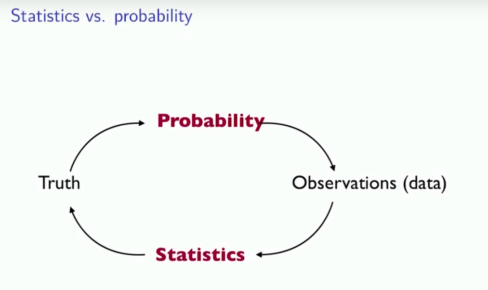
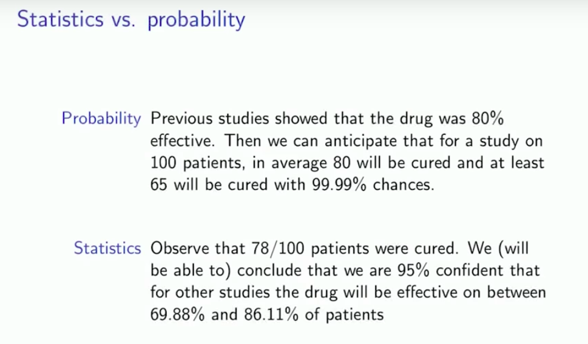

# Introduction of Statistics

## Randomness

- [What is Randomness](https://terms.naver.com/entry.nhn?docId=4346438&cid=40942&categoryId=31433)
  - 이해될 수 있는 정형화된 양식이나 패턴이 없고 예측이 불가능한 성질
  - 우연성(chance)과 관련되어서 정의되었지만 우연성과는 다름
    - 이는 직관적으로 설명 불가능
    - 하지만 **확률**이나 **경향성**으로 설명 가능
  - 알고리즘 분야에서는 무작위성을 일부러 넣어서 보다 나은 결과를 내는 경우도 존재
- 통계학을 사용하는 이유
  - 데이터의 임의성(Randomness)
    - 우리가 이해할 수 없음
    - 임의의 사건
  - 관련 질문들
    - Notion of average
      - fair premium ...
    - Quantifying chance
      - Most of the floods (99%) ...
    - Significance (or by chance?), variability, ...
  - Randomness -> Understandable one

## Probability

- Randomness 를 이해하기 위한 학문(Study)
  - Probability studies randomness (hence the prerequisite)
  - 몇몇의 물리적 프로세스는 완전히 알려저 있음
    - dice, cards, roulette, fair coins, ...

## Statistics and modeling

- 보다 복잡한 프로세스는 어떤가?
  - **데이터로부터 파라미터를 추정할 수 있어야 함**
    - 이것이 통계학
    - e.g p를 추정
  - Sometimes real randomness
    - random student
    - biased coin
    - measurement error
  - Sometimes deterministic but too complex phenomenon
    - statistical modeling
      - **complicated process = Simple process + random noise(전혀 이해할 수 없는 것)**
      - e.g 시계얼 데이터
  - **(good) Modeling consists in choosing (plausible) simple process(model) and noise distribution**
    - 좋은 모델을 만들기 위해서는 엄청난 domain 지식이 필요함
- Randomness -> average

## Statistics vs Probability

- Probability
- Statistics
  - **Replacing expectations with averages**

---

- Estimator
  - something that depends on random variables
  - find estimator for mu
  - 1/n sigma x(i)
- Estimate
  - value
  - mu
    - 1/15 (61 + ... + 72)
    - 67.5
  - std
