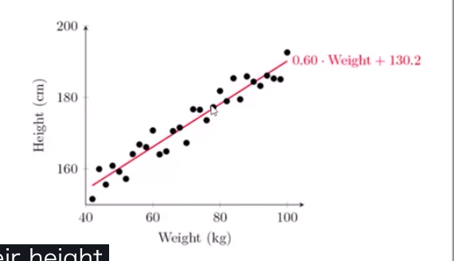

# 회귀 분석(Linear Regression)

- 관찰 데이터셋에 맞는 직선을 찾음
- **찾은 직선을 관찰되지 않은 값의 예측에 사용**
- 참고
  - **시간** 은 전혀 상관없는 지표임
  - **그냥 데이터셋에 맞는 직선일 뿐**

## 원리

- 최소 제승법
  - 각각의 점과 선 사이의 거리의 제곱이 최소가 되는 직선을 찾음
  - 즉, 그 직선은 `y=mx+b`
  - 기울기 m은 x변수와 y변수의 표준편차와 관련 있음
  - 차이(error)의 제곱의 합을 최소로하는 직선
  - 관찰 데이터의 가능성을 최대화 함(최대 가능성 추론(maximum likelihood estimation)

## 다른 가능성

- Gradient Descent는 최소 제승법의 대안으로서의 방법
- 3D데이터 다룰 수 있음
- 하지만 보통은 최소 제승법이 괜찮은 방법

## r-squared와 함께 에러를 측정(얼마나 나의 회귀 모델이 잘 맞아 떨어지는가?)

- 구한 직선이 데이터와 얼마나 잘 맞아 떨어지는가?
- R-squared라는 지표를 사용
- the fraction of the total variation in Y that is captured by the model

## r-squared의 계산

1.0 - (점과 직선의 거리(error)의 합) / 평균으로 부터의 squared variation의 합

- 0과 1사이의 값을 갖음
- 0이 나쁨, 1이 좋음

# Polynomial regression

- 데이터 사이의 모든 관게를 직선(선형적)으로만 나타낼 수는 없음
- 선형 공식: `y = mx + b`
  - first order, first degree ploynomial
- Second order ploynomial
  - `y = ax^2 + bx + c`
- Third order
  - `y = ax^3 + bx^2 + cx + d`
- 높은 ordoer는 더 복잡한 곡선을 생성

## overfitting을 조심하라

- 실제로 필요한 degree보다 더 높은 것을 사용하지 말라
- **데이터를 먼저 시각화해서, 곡선이 얼마나 복잡한지를 보라**
- fit을 시각화 하라
  - 나의 커브가 극단값을 맞추려 하는가?
- **높은 r-squared 값은 단순히 곡선이 훈련 데이터를 잘 맞춘다는 것을 의미**
  - 예측의 정확도는 충분히 낮을 수 있음

# Multivariant regression

- 어떠한 데이터가 많은 다른 변수에 의존
  - e.g 차의 가격 = 엔진 크기 + 마일리지 + ...
- 최소 지승법 사용
  - 각각의 요소의 계수
    - `가격 = a + b1 * 마일리지  + b2 * 나이 + b3 * 문`
    - 각각의 계수는 그 변수의 중요도를 내포(데이터가 모두 정규화 되어있을 때만)
    - 상관 없는 변수는 제거
  - r-squared로 유효성 측정가능
  - **각각의 변수들은 서로 독립하다는 전제가 필요**

# Multi-level model

- 특정 effects는 다양한 계층에서 일어남
- 각각의 변수가 서로 계층을 갖고 의존하는 경우
  - 건강
    - 세포의 건강
    - 장기
    - 내 몸전체
  - 부
    - 내 일
    - 부모님이 한 일
    - 조부모님이 한 일

## 다층 모델링

- 각각의 계층에서 어떠한 변수가 결과에 영향을 미치는지 확인해야 함
  - e.g SAT점수 예측
    - 개개인 아이들의 유전자
    - 가정 환경
    - 범죄율
    - 학교 선생님의 질
    - 학교 구역의 자금의 양
    - 그 주의 교육 정책
    - **범죄율은 가정 환경에도 영향을 줌**
- 실제로 사용하는 것은 어려움
