# 시계열 분석(time-series analysis)

시계열 자료를 분석하고 여러 변수들간의 인과관계를 분석하는 방법론

## 모형(모델)

- 한 시점의 변수가 그 이전 변수들의 영향, 과거 오차의 영향을 받는다고 가정
  - 그것이 꺠지면 랜덤워크
- 이동평균법, naive methods, simple exponential smoothing, Box-Jenkins methods, auto regression(자기 회귀), 스펙트럼 분석, 조건부이분산성(ARCH), GARCH
- 구성
  - 추세(trend)
  - 순환(cycle)
  - 계절변동(seasonal variation)
  - 불규칙변동(irregular fluctuation)
  - 분석을 시작하기 전에, 자료의 계절성과 주기성, 순환성을 파악하기 위해서 분산분석(ANOVA)와 다중비교(multiple comparision)를 통해 계절효과가 있는지 확인해야 함

### 시계열의 형태(components of time series)

- 추세(trend variation)
  - 장기간에 걸쳐 지속적으로 증가 또는 감소하거나 또는 일정한 상태(stationary)를 유지하려는 성향을 의미
- 순환(cyclical variation)
  - 일정한 기간을 주기로 순환적으로 나타남
  - 시간의 경과에 따라 상하로 반복되는 변동으로 추세선을 따라 변화하는 것이 순환변동임
  - 경기변동곡선은 불황과 경기회북, 호황과 경기후퇴로 인하여 수년 주기로 나타나고 있는데, 순환변동을 나타내는 좋은 예임
  - 경기종합지수와 같은 전반적인 경기변동을 쉽게 파악하기 위해서는, 추세를 제거해야함. 왜냐하면 경기는 보통 계속 상승하므로..
    - 동행종합지수의 증가속도가 추세치의 증가 속도보 더 빠르면 동행지수 순환 변동치는 상승함
    - 100이상이면 경기가 좋은것, 100이하면 경기가 나쁜 것
- 계절 변동(seasonal variation)
  - 대개 1년을 주기로 계절적 영향과 사회적 관습에 따라서 일정한 주기로 발생하는 변동요인
  - 순환 변동보다 순환주기가 짧다
  - e.g
    - 설날 / 추석
    - 실업률은 졸업식이 있는 2월에 높음
  - 극복
    - **전년 동월 대비 지표와 비교**
    - **계절 조정지표 이용**

## 시계열

한개의 열로 수렴이 되므로, 일변량 자료

## 추세분석

- 추세
  - 어떤 현상이 일정한 방향으로 나아가려는 경향
  - 일정한 방향은 증가 또는 하락 으로 나뉨
  - 장기간에 걸쳐 지속적으로 증가 또는 감소하거나 또는 일정한 상태(stationary)를 유지하려는 성향을 의미
- 추세 분석
  - **과거의 추세치가 앞으로도 계속된다는 가정** 하에 시계열 자료를 분석해 그 변화의 미래를 예측하는 분석 방법

### 추세 종류

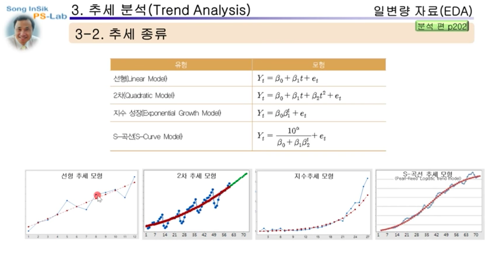

- 피팅: 어떠한 데이터에 대해서 어떠한 모형이 잘 맞는지 확인하는 것
- 모형을 찾으면 과거의 데이터를 바탕으로 파라미터를 추정
- 미래 값을 예측
  - 예측이 잘 되었는지를 파악하는 척도
  - MSD(Mean Squared Deviation)
    - `실제 값 - 예측 값` 의 제곱의 평균
  - MAD(Mean Absolute Deviation)
    - `실제 값 - 예측 값` 의 평균
  - MAPE
    - 정확도를 백분율로 표현
- 간단한 선형 모형같은 경우는, 최소 지승법을 사용해서 직선을 구할 수 있음

## 분해

여러 부분이 결합되어 이루어진 것을 그 낱낱으로 나눔.

시계열에 **계절 성분**이 있을 때 예측 값을 구하려는 경우, 또는 단순히 성분 요소의 특성을 조사하려는 경우에 이 절차를 사용

계절성분은, 일정한 주기마다 진폭이 증가하거나 감소하는 것을 말함

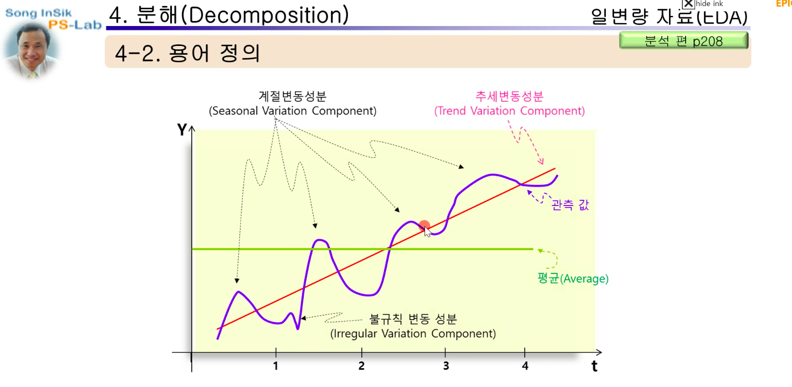

- 분해의 방식
  - 승법 모델(Multiplicative Model)
    - 진폭이 점점 증가
  - 가법 모델(Additive Model)
    - 진폭이 대체로 일정함

### 승법 모델

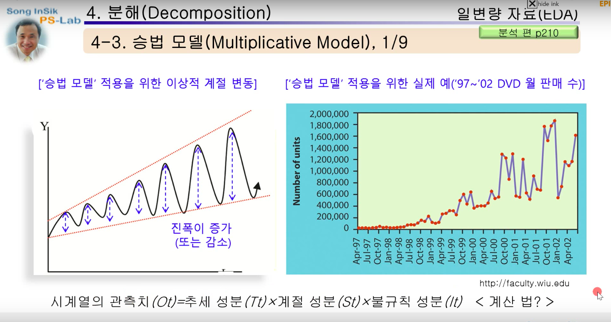

- 계절 성분(진폭)이 점점 증가
- 시계열의 관측 값(Ot) = 추세 성분(Tt) * 순환 성분(Ct) * 계절 성분(St) * 불규칙 성분(It)

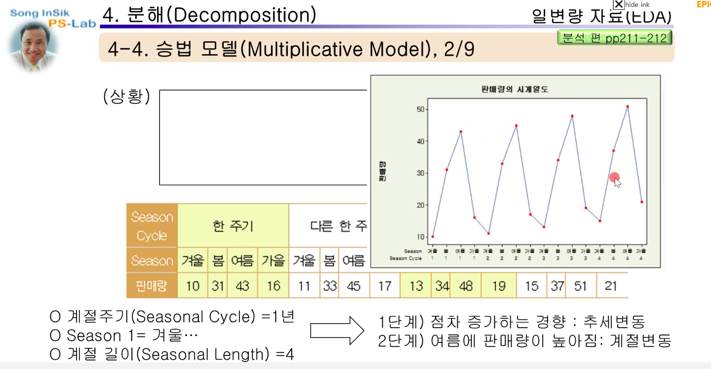

#### 분해 단계 1: 최소 제곱밥을 이용한 추세선 적합(직선 식 구함)

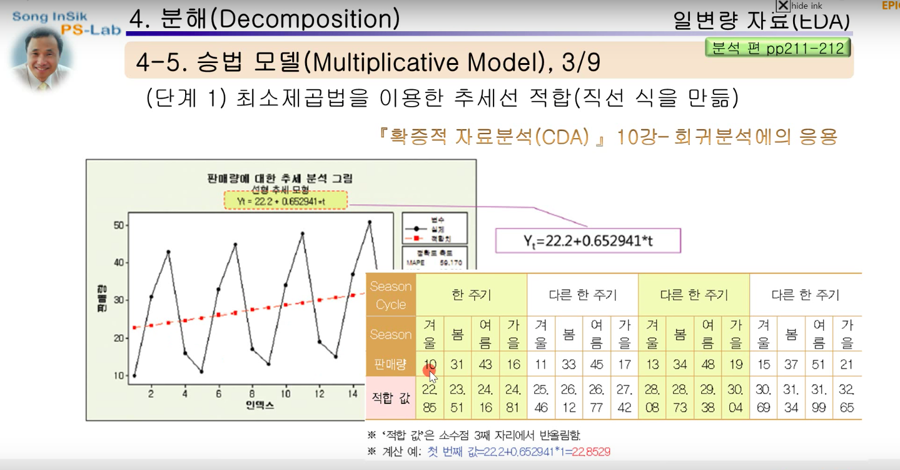

- 적합 값(fitted value)
  - 모델에서 나온 값

#### 분해 단계 2: 계절 성분 얻기, 추세 제거

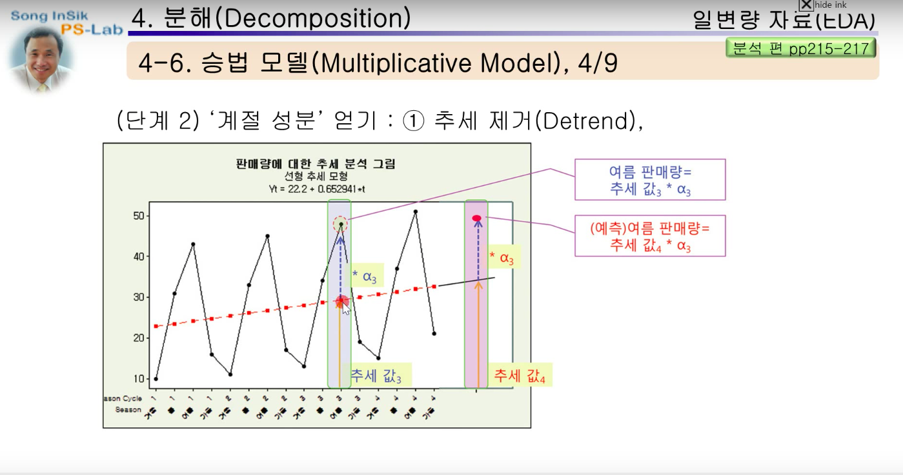

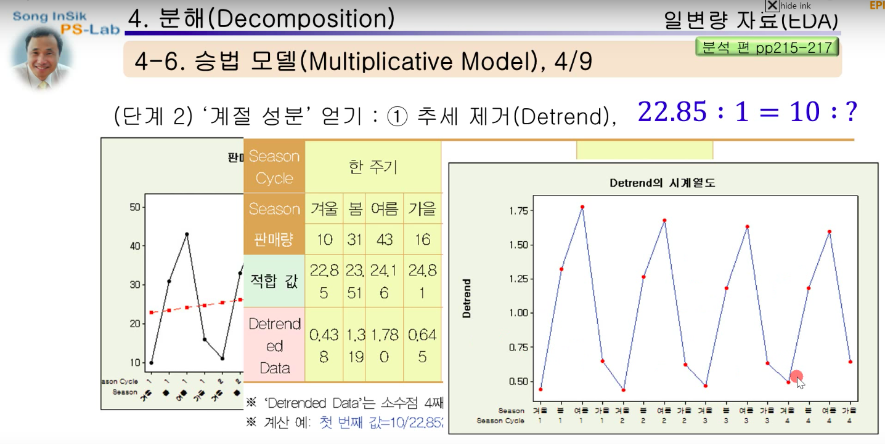

- 추세 제거(Detrend)
  - 적합 값을 상대적으로 1로 두었을 때, detrended data값을 구함

#### 분해 단계 3: 계절 성분 얻기, 평활화

*Q) 이 부분에서 이동평균을 이용하는데 어떤식으로 계산되는지, 왜 밸런싱이 필요한 것인지 궁금함*

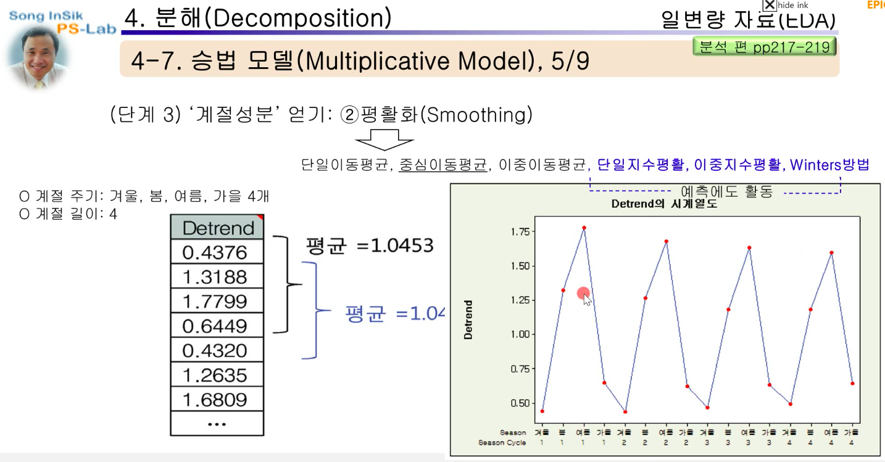

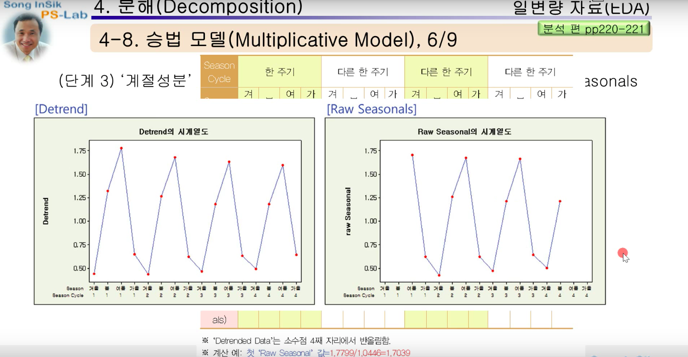

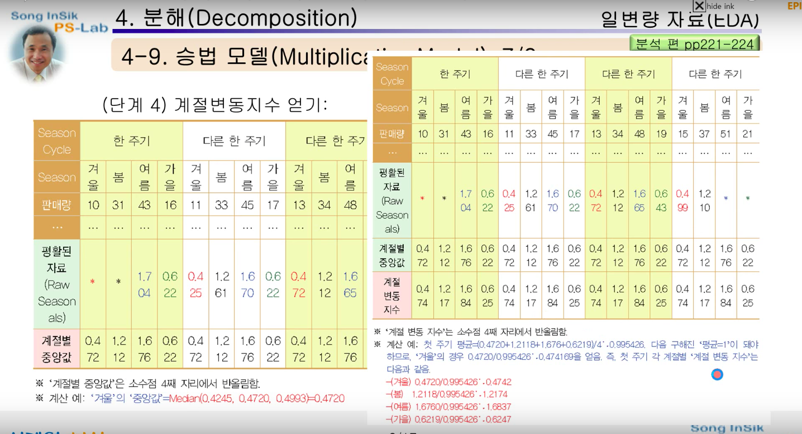

여기서 구한 계절 변동 지수(알파)는 나중에

> 시계열의 관측 값(Ot) = 추세 성분(Tt) * 계절 성분(St) * 불규칙 성분(It)

위의 모델을 구하기 위해서 사용됨

#### 분해 단계 4: 필요 시 Deseasoned Data 얻기

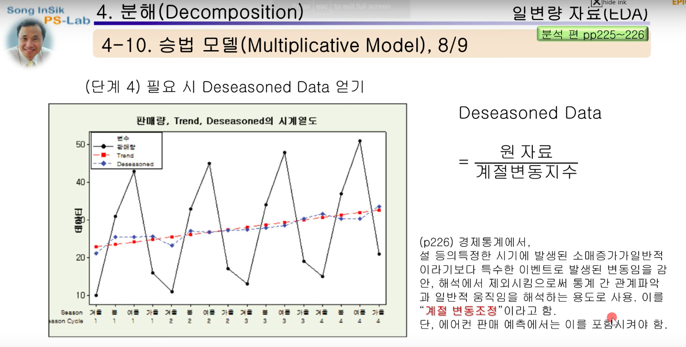

- 계절 변동이 필요 없는 경우는, 원래 데이터 값을 알파값으로 나눔

#### 분해단계 5: 모델 확정과 예측

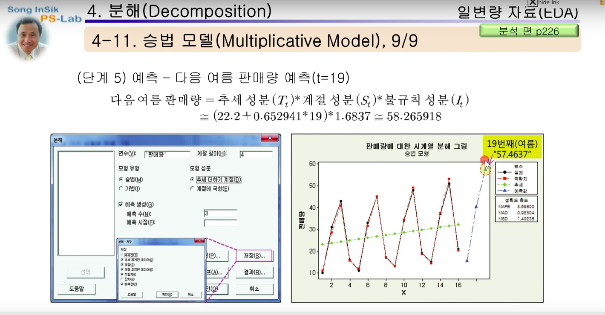

- 앞서 구한 파라미터를 조합해서 모델을 작성

### 가법 모델(Additive Model)

- 일정한 진폭을 보여줌
- 시계열의 관측 값(Ot) = 추세 성분(Tt) + 순환 성분(Ct) + 계절 성분(St) + 불규칙 성분(It)

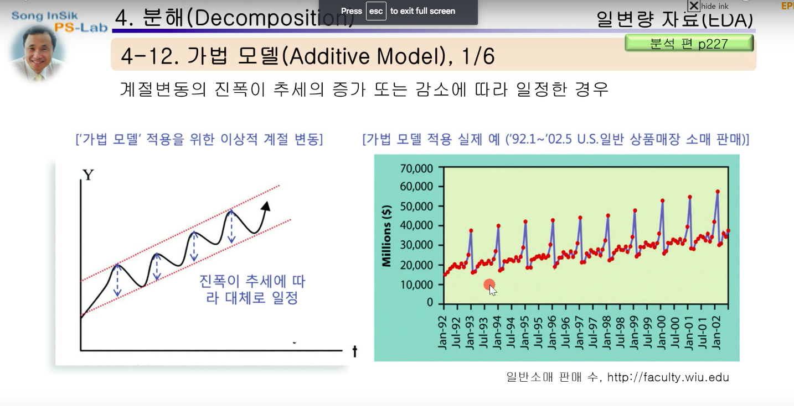

#### 분해 단계 1, 2: 추세 방정식(회귀방정식)을 통한 적합값과, Detrended Data

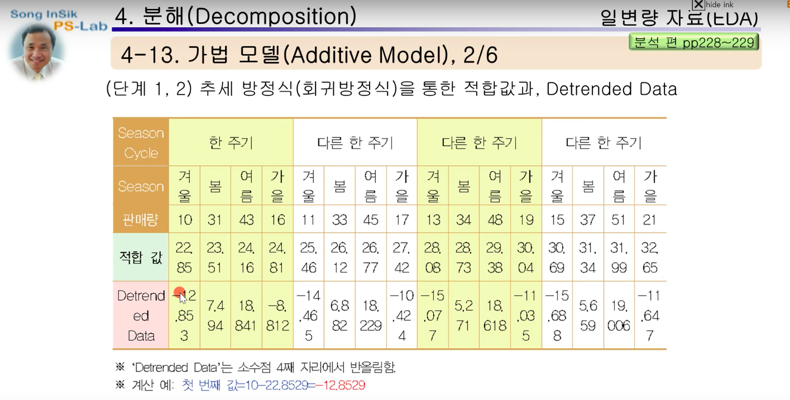

- 승법 모델에서는 실제 데이터에서 트랜드의 적합값을 나눴으나, 가법 모델에서는 실제 데이터에서 적합값을 빼줌(detrended data)

#### 분해 단계 3: Raw Seasonal을 얻음: 중심 이동평균을 구해서 계산됨

## 시계열분석의 기법

### 이동평균법(moving average)

#### 1. 단순이동평균

- 최근 몇개 관측값의 단순평균값을 다음 기간의 예측값으로 추정하는 방법
  - `M(t) = (Z(t) + Z(t-1) + ... + Z(t-n+1)) / n`
  - M(t)는 다음시점(t+1)의 예측값F(t+1)로 사용됨
- 계절변동(St)과 불규칙변동(Rt)를 제거하여 추세변동(Tt)와 순환변동(Ct)만 가진 시계열 자료로 변환하는 평활법(smoothing method)임
- 과거 관측값의 개수로 그 종류가 구분됨
  - `n = 3`이면 3기간 단순이동평균(M3)임
- n의 결정
  - **이동평균법을 이용할 떄 가장 중요한 문제는, 이동평균을 계산하기 위해 사용하는 과거 자료의 적정개수를 정하는것**
  - **일반적으로 시계열자료에 뚜렷한 추세가 나타나 있거나 불규칙 변동이 심하지 않은 경우에는 작은 n의 개수를 사용하고, 그렇지 않은 경우에는 n의 개수를 크게 함**
  - 예측오차를 비교하여 가장 정확한 예측값(예측 오차가 적은값)을 제공하도록 n의 개수를 결정하기도 함.
    - MAD(Mean Absolute Deviation)
      - `MAD = (t기 관측값 - t기 예측값)합 / T`
    - MSE(Mean Squared Error)
      - `MSE = (t기 관측값 - t기 예측값)^2합 / T`
- 단점
  - 처음 일부의 기간에 대한 예측값을 구할 수 없음
    - 구간에 포함되지 않은 이전의 자료는 무시됨
  - n이 짝수인 경우 이동평균에 대응하는 시기에 문제가 발생
    - 인접한 두 이동평균의 평균을 계산해서 중심이동평균을 구함
  - 관측값들에 대해서 동일한 가중치를 적용하여 최근 자료와 오래된 자료의 중요성을 동일시하고 있다는 점

#### 2. 가중이동평균

- 관측값에 따라 가중치를 다르게 한 이동평균법
- `M(t) = w(1)Z(t) + w(2)Z(t-1) + ... + w(n)Z(t-n+1)`

#### 3. 지수평활법(exponential smoothing method)

- 과거의 모든 자료를 사용하여 평균을 구하면서 최근의 자료에 더 높은 가중치를 부여하는 방법
- 단기간에 발생하는 파동이나 충격을 완화하는 평활법
  - `F(t) = aZ(t-1) + (1-a)F(t-1)`
    - F(t)는 t기간의 예측값
    - F(t-1)은 t-1기간의 예측값
    - Z(t-1)은 t-1기간의 실제값
    - a는 지수평활계수(`0<a<1`)
      - 지수 평활계수는 가중치 역할을 하는것으로, 불규칙변동이 큰 자료에서는 작은 값의 a를 사용. 불규칙 변동이 작은 자료에서는 큰 값의 a를 적용
      - 보통은 0.05 ~ 0.3 사이의 값을 사용
- 예측오차가 작은 a값을 선택하는 것이 좋음
- 가중치는 과거로 갈 수록 지수적으로 감소
- 최근 과거값에 가장 큰 가중치를 부여하므로 일종의 가중이동평균법이라고 할 수 있음
- 장점
  - 불규칙변동의 영향을 약화시킴
- 단점
  - 장기추세나 계절변동이 포함된 시계열의 예측에는 적합하지 않음

### 계절변동을 포함한 시계열의 예측

- 추세선의 예측은 자료의 변동을 하나의 직선으로 간단히 나타내기 때문에 장기추세의 예측에는 장점을 가지지만, 계절변동이나 순환변동을 포함하는 시계열 자료에는 적합하지 않음
- 계절지수는 100을 기준으로 특정 계절과 다른 계절의 변동을 비교하여 차이를 판단하는 척도임
  - 예를들어 1/4분기 계절지수가 120이면 1/4분기 매출액이 분기별 평균 매출액의 120%가 됨을 의미함
- 계절지수는 평균 계절지수가 1이 되도록 조정하여 얻어짐
- 각 분기 평균의 합이 4가 되도록 조정되어야 하기 때문에 계절지수는 평균에 조정요인을 곱하여 계산함
- `계절성수치(St) = 4/(S(1)+S(2)+S(3)+S(4))`
- 계절지수를 이용한 시계열예측
  - 이동평균을 이용하여 계절지수를 생성함
  - 계절성을 제거한 자료를 이용하여 추세선을 추정함
  - 미래에 대한 추세 예측값을 구함
  - 추세 예측값에 계절지수를 곱하여 최종 예측값을 구함
