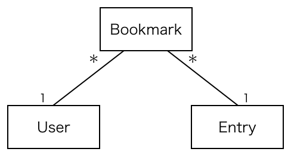
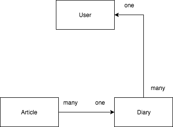
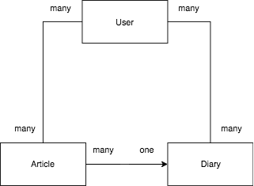

# ER모델에 관하여

ER모델은 Entity Relation모델이라고 해서, 소프트웨어 공학에서는 관계형 데이터베이스를 설계하는데 주로 이용되는 모델이다.

예를 들어 사람이 엔트리를 북마크 하면 북마크가 생성되는데 이를 ER모델로 표현하면 다음과 같다.

- 하나의 엔트리(url)에는 복수의 북마크가 속한다(일대다)
- 하나의 유저에는 복수의 북마크가 속한다(일대다)

그런데 ER모델은 모호한 경우가 많다. 예를들어서 북마크는 행위이지 등장인물(entity)가 아니지 않나 라는 생각이 들기도 한다.

또한 비디오가게에서 고객이 비디오를 빌리는 행위는 사실 빌려서 남은 증명서를 생각하면 그 자체가 등장인물이 되기도 한다. ER모델에 있어서 등장인물에 대한 구체적이고 명확한 기준은 없을까?

## ER모델과 FD(Functional Dependency)의 관계

- ER모델로 초기 데이터베이스 모델 구축
- FD를 각 관계(테이블)마다 따져보면서 정말 맞게 분리된 것인지 확인

## 헷갈리는 부분

북마크는 등장인물이라기 보다는 행위에 가깝지 않은가?

- 유저가 북마크를 행함
- 그래서 북마크가 탄생(등장인물)

## 예시) 다이어리 어플리케이션: 유저와 다이어리와 아티클의 관계

단순하게 생각하면 다음과 같은 그림을 떠올리게 된다.

1. 유저는 많은 다이어리를 소유할 수 있다.
2. 다이어리는 많은 아티클을 소유할 수 있다.
3. 아티클의 작성자는 다이어리의 작성자와 동등하므로, 아티클의 `diary_id`와 다이어리의 `user_id`의 관계에서 찾을 수 있다.

이는 평범하게 누군가가 만든 다이어리의 아티클을 나열할 때에는 아티클의 수가 1개든 100개든, 이미 다이어리를 파악하고 있으므로, SQL 쿼리 한 번으로 구할 수 있다.

하지만, 랭킹, 실시간 타임라인과 같이, 각각의 아티클에 대한 다이어리가 획일적이지 않을 수 있는 상태에서의 **임의의** 아티클들의 작성자를 파악할 때에는 아티클의 수 만큼 다이어리를 파악하는 쿼리를 생성해야 한다. 더욱이 다이어리의 수 만큼 유저를 파악하는 쿼리를 발행해야 하므로, 구해야 하는 아티클의 수가 많을 경우에는 이 부분이 성능의 병목이 될 수 있다.

이를 고려한 다음과 같은 ER모델의 수정이 가능하다:

1. 유저는 많은 다이어리를 소유 할 수 있다.
2. 다이어리는 많은 유저를 소유할 수 있다. 즉 하나의 다이어리는 여러명의 소유자를 갖을 수 있다.
3. 다이어리는 많은 아티클을 갖을 수 있다.
4. 아티클은 하나의 다이어리에 속한다.
5. 유저는 **많은 아티클을 쓸 수 있다.**
6. 아티클은 다양한 유저에 의해서 쓰일 수 있다.

위의 ER모델의 특징은, **소유** 와 **작성** 이라는 행위의 분리이다. 즉, 반드시 소유하지 않아도 작성할 수 있다는 얘기가 된다. 예를들어 하테나 블로그의 소유자는 하테나 법인이지만, 하테나의 엔지니어는 누구나 하테나 블로그에 글을 올릴 수 있는 것과 같은 이치이다. 물론, 하테나의 소속이어야 한다는 전제가 붙으므로, 여기에서 owner, collaborator, contributor, member 등과 같은 계급의 개념으로 확장 가능하다.
