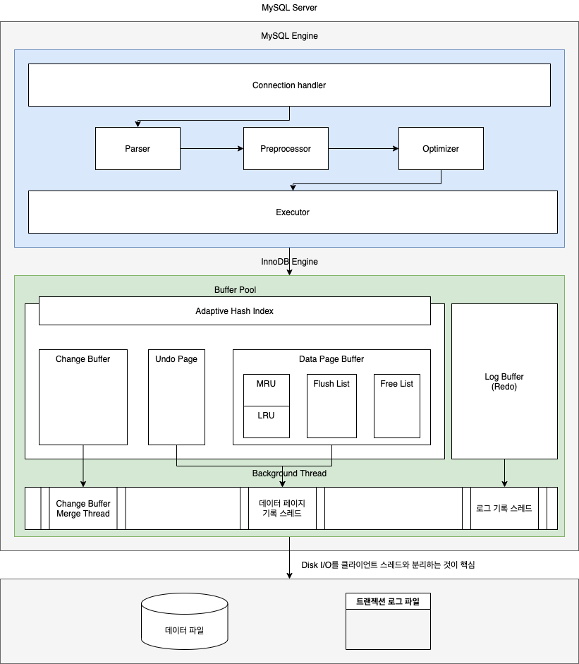
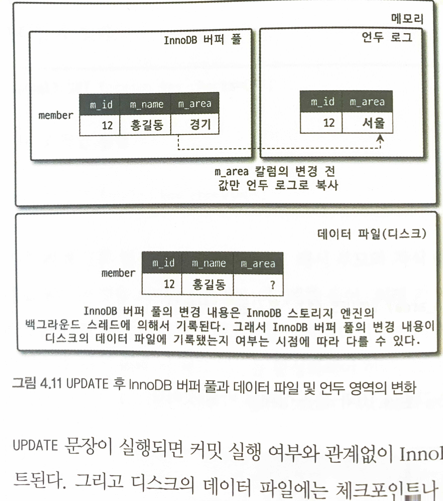

# Real MySQL 8.0

- 의문
- Ch1. 소개
- Ch2. 설치와 설정
  - MySQL 서버 업그레이드
  - 서버 설정
- Ch4. 아키텍처
  - 4.1 MySQL 엔진 아키텍처
    - 4.1.1 MySQL의 전체 구조
    - 4.1.2 MySQL의 스레딩 구조
    - 4.1.3 메모리 할당 및 사용 구조
    - 4.1.4 플러그인 스토리지 엔진 모델
    - 4.1.5 컴포넌트
    - 4.1.6 쿼리 실행 구조
    - 4.1.7 복제(Replication)
    - 4.1.8 쿼리 캐시
    - 4.1.9 스레드풀
    - 4.1.10 트랜잭션 지원 메타데이터
  - 4.2 InnoDB 스토리지 엔진 아키텍처
    - 인덱스 관련
      - 프라이머리 키에 의한 클러스터링
      - 외래 키 지원
    - Isolation
      - MVCC(Multi Version Concurrency Control)
      - 잠금 없는 일관된 읽기
    - 모니터링
      - 자동 데드락 감지
      - 자동화된 장애 복구
    - 성능
      - InnoDB 버퍼 풀
        - 버퍼 풀의 구조
      - Double Write Buffer
      - 언두 로그(ACID에서 A,I와 연관있음)
      - 체인지 버퍼
      - 리두 로그 및 로그 버퍼(ACID에서 D와 연관 있음)
      - 어댑티브 해시 인덱스
  - 4.4 MySQL 로그 파일
    - 에러 로그 파일
    - 제너럴 쿼리 로그 파일
    - 슬로우 쿼리 로그

## 의문

- 데이터 딕셔너리란(시스템 카탈로그)?
  - MySQL의 Information Schema, DB속의 데이터의 메타 데이터
  - 특징
    - 읽기전용
  - 구성
    - TABLES
      - 테이블에 대한 정보
    - TRIGGERS
      - 트리거에 대한 정보
    - USER_PRIVILEGES
      - 유저 권한
    - ...
- MVCC에서 REPEATABLE_READ의 구현?
  - 언두로그는 언제까지 유지해야 할까?
  - 가장 오래된 트랜젝션이 언두로그에서 제거해야하나?
    - reference count처럼 참고하고 있는 언두 로그를 몇개의 트랜잭션이 참조하고 있는지 기록?

## Ch1. 소개

- DB고르는 기준
  - 안정성
  - 성능 / 기능
  - 커뮤니티나 인지도
- MySQL 특징
  - 오픈 코어 모델
    - 엔터프라이즈 에디션
      - 특정 부가 기능들만 엔터프라이즈 버전에 포함됨
    - 커뮤니티 에디션

## Ch2. 설치와 설정

### MySQL 서버 업그레이드

- In-Place Upgrade
  - 개요
    - MySQL 서버의 데이터 파일을 그대로 두고 업그레이드를 하는 방법
  - 장점
    - 시간이 별로 안걸림
  - 단점
    - 여러 가지 제약사항이 존재
      - 마이너 버전 간 업그레이드는 건너뛰어서 업그레이드 가능
      - 메이저 버전 간 업그레이드는 데이터 파일의 패치가 필요
        - e.g) MySQL 5.1 -> MySQL 5.5 -> MySQL 5.6 -> MySQL 5.7 -> MySQL 8.0
      - 메이저 버전 업그레이드가 특정 마이너 버전에서만 가능한 경우도 존재
        - GA(서버의 안정성이 확인된 버전) 버전은 지나서 15 ~ 20번 이상의 마이너 버전을 선택
- Logical Upgrade
  - 개요
    - mysqldump 도구 등을 이용해 MySQL 서버의 데이터를 SQL 문장이나 텍스트 파일로 덤프한 후, 새로 업그레이드 된 버전의 MySQL 서버에서 덤프된 데이터를 적재하는 방법
  - 장점
    - 버전간 제약 사항이 거의 없음
  - 단점
    - 시간이 매우 오래걸림

### 서버 설정

my.cnf의 예시

```
/* 각 프로그램 */
[mysqld]
socket = /usr/local/mysql/tmp/mysql.sock
port = 3306

/* 각 프로그램 */
[mysqldump]
default-character-set = utf8mb4
socket = /usr/local/mysql/tmp/mysql.sock
port = 3305
```

- `my.cnf`
  - 개요
    - 설정 파일
    - 어느 디렉터리에서 읽는지는 `mysql --help`로 확인
    - 시스템 변수로 저장
  - 예시
- 시스템 변수
  - `SHOW GLOBAL VARIABLES;`
  - Var Scope
    - 시스템 변수의 적용 범위
      - Global
        - 전역
        - e.g)
          - innodb_buffer_pool_size
          - key_buffer_size
            - MyISAM
      - Session
        - 서버와 클라이언트 간의 하나의 커넥션
        - e.g)
          - autocommit
      - Both
        - my.cnf에 명시해 초기화가 가능한 변수이고, MySQL 서버가 기억만 해두고, 클라이언트와의 커넥션이 생성되는 순간에 해당 커넥션의 기본값으로 사용
        - 이미 존재하는 세션의 경우, 글로벌 시스템 변수의 값을 바꿔도, 세션 변숫값은 변경되지 않고 유지
        - e.g)
          - transaction_isolation
  - Static Var vs Dynamic Var
    - Static Var
      - 서버가 재시작될때만 변경될 수 있는 변수
    - Dynamic Var
      - 시스템 변수를 `SET`을 이용해서 변수 값을 바꿀 수 있음
      - `SET PERSIST max_connections=5000;`
        - dynamic하게 변수의 값을 바꾸고, 파일에도 적용 가능(별도의 파일이 생기고, 그걸 재부팅할때 읽어서 적용)
        - 세션 변수에는 적용되지 않음
      - `RESET PERSIST IF EXISTS max_connections;`
        - PERSIST로 설정한 변수 삭제

## Ch4. 아키텍처

- MySQL서버
  - MySQL 엔진
  - 스토리지 엔진
    - 핸들러 API만 만족하면 누구든지 구현해서 추가해서 사용 가능
    - e.g) InnoDB, MyISAM

MySQL 서버의 아키텍처 다이어그램



InnoDB Architecture(AWS)


### 4.1 MySQL 엔진 아키텍처

MySQL 아키텍처


#### 4.1.1 MySQL의 전체 구조

- MySQL 엔진
  - 개요
    - MySQL서버의 클라이언트의 커넥션을 핸들링
    - 클라이언트로부터 받은 쿼리를 파싱 / 프리 프로세싱 / 옵티마이징 / 스토리지 엔진 API를 이용해서 실행
    - 스토리지 엔진으로부터 받은 레코드를 가공 또는 연산하는 작업 수행
      - e.g) 조인, 필터링, 집합처리
  - 구성
    - 커넥션 핸들러
    - SQL파서, 전처리기, 옵티마이저
  - 특징
    - 체크 조건을 처리(머지 인덱스가 설정되어 있지 않은 경우)
      - `SELECT * FROM employees WEHRE emp_no BETWEEN 10001 AND 10100 AND gender='F';`
        - 여기에서 `gender='F'`를 스토리지 엔진으로 부터 받아와서 필터링
          - 만약, merge_index가 존재하는 상황이라면 어떻게 되는가?
            - 이 경우에는, 작업 범위 결정 조건으로 되어서 스토리지 엔진에서 처리됨
- 스토리지 엔진
  - 개요
    - 데이터를 스토리지에 저장하거나, 읽어오는 역할
      - INSERT, UPDATE, DELETE, SELECT등의 작업이 발생하면 InnoDB엔진이 그러한 처리를 담당
      - 정말 이것만 함
  - 특징
    - MySQL 엔진은 하나지만, 스토리지 엔진은 여러개를 동시에 사용 가능
      - `CREATE TABLE test_table (fd1 INT, fd2 INT) ENGINE=INNODB;`
    - 각 스토리지 엔진은 성능 향상을 위해, 키 캐시, InnoDB 버퍼풀 과 같은 기능을 내장함
    - 작업 범위 결정 조건을 처리
      - `SELECT * FROM employees WEHRE emp_no BETWEEN 10001 AND 10100 AND gender='F';`
        - 여기에서 `emp_no BETWEEN 10001 AND 10100`를 애초에 데이터를 가져올때부터 필터링
- 핸들러 API
  - 개요
    - MySQL 엔진의 쿼리 실행기에서 데이터를 쓰거나 읽을 때, 각 스토리지 엔진에 쓰기 또는 읽기를 요청하고, 그러한 요청을 핸들러 요청이라고 함
    - 스토리지 엔진은 핸들러 API를 통해 MySQL엔진과 데이터를 주고받음
  - `SHOW GLOBAL STATUS LIKE 'Handler%';`
    - 핸들러 API를 통해 얼마나 많은 데이터 작업이 있었는지 확인

#### 4.1.2 MySQL의 스레딩 구조


- 개요
  - MySQL은 스레드기반으로 동작(커뮤니티 에디션)
    - 커넥션별로 포그라운드 스레드가 하나씩 생성되고 할당
    - c.f) 엔터프라이즈 에디션과 Percona MySQL 서버에서는 스레드 풀 모델을 사용
      - *하나의 스레드가 여러 개의 커넥션 요청 전담?*
- 구분
  - 포그라운드 스레드(클라이언트 스레드)
    - 개요 및 동작 순서
      - 최소한 MySQL 서버에 접속된 클라이언트의 수 만큼 존재
        - 주로 사용자가 요청하는 쿼리 문장을 처리
        - 사용자가 작업을 마치고 커넥션을 종료하면 스레드 캐시로 돌아감
          - 스레드 캐시에 일정 개수 이상의 대기 중인 스레드가 있으면 스레드 캐시에 넣지 않고 스레드 종료하여 일정개수의 스레드만 유지하도록 함
          - `thread_cache_size` 시스템 변수로 설정
    - 역할
      - 데이터를 MySQL의 데이터 버퍼나 캐시로부터 가져옴
        - 버퍼나? 캐시? 언제는 버퍼고 언제는 캐시인가?
          - 버퍼는 주로, write할때 bulk로 하기 위해서 임시로 저장해두는 공간(mysql에서 innodb buffer pool은 read할때 캐싱용도로 사용)
        - *Buffer pool, query cache?*
      - 버퍼나 캐시에 없는 경우 직접 디스크의 데이터나 인덱스 파일로부터 데이터를 읽어와서 처리
        - MyISAM 테이블
          - 디스크 쓰기 작업까지 포그라운드 스레드가 처리
        - InnoDB 테이블
          - 데이터 버퍼나 캐시까지만 포그라운드 스레드가 처리하고, 나머지 버퍼로부터 디스크까지 기록하는 작업은 백그라운드 스레드가 처리
  - 백그라운드 스레드
    - 개요
      - *결국 백그라운드 스레드는, 스토리지 엔진이 관리하는 스레드라고 보면 되는가?*
    - 역할 및 처리하는 작업
      - 인서트 버퍼를 병합하는 스레드
      - **로그를 디스크로 기록하는 스레드**
      - **InnoDB 버퍼 풀의 데이터를 디스크에 기록하는 스레드**
        - 쓰기는 아주 많은 작업을 백그라운드로 처리하기 때문에, 일반적인 내장 디스크를 사용하는 경우는 2~4정도로 두고, *DAS*, *SAN*과 같은 스토리지의 경우에는 디스크를 최적으로 사용할 수 있을 만큼 충분히 설정하는것이 좋음
        - 일반적인 상용 DBMS에서는 대부분 쓰기 작업을 버퍼링해서 일괄 처리하는 기능을 탑재하고, InnoDB도 해당 방식 채용
          - 디스크에 INSERT, UPDATE, DELETE 쿼리가 완전적용이 될때까지 기다리지 않아도 됨
      - 데이터를 버퍼로 읽어오는 스레드
      - 잠금이나 데드락을 모니터링하는 스레드

#### 4.1.3 메모리 할당 및 사용 구조

- 개요
  - 글로벌 메모리 영역, 로컬 메모리 영역으로 구분
  - MySQL 서버 내에 존재하는 많은 스레드가 공유해서 사용하는 공간인가의 여부로 구분됨(글로벌, 로컬)
- 메모리의 구분
  - 글로벌 메모리 영역
    - 개요
      - MySQL 서버가 시작되면서 운영체제로부터 할당됨
        - 운영체제 별로 메모리 할당 방식은 다르나, 그냥 할당 받는다고 생각해도 됨
      - 스레드 수와 무관하게 하나의 메모리 공간만 할당(다수가 존재해도, 스레드 수와는 무관)
    - 종류
      - *테이블 캐시*
      - InnoDB 버퍼 풀
      - InnoDB 어댑티브 해시 인덱스
      - InnoDB 리두 로그 버퍼
  - 로컬(세션) 메모리 영역
    - 개요
      - MySQL 서버상에 존재하는 클라이언트 스레드가 쿼리를 처리하는 데 사용하는 메모리 영역
        - 클라이언트 메모리 영역
        - 공유되지 않음
      - 소트 버퍼와 같은 메모리 영역도 잘 설정해줘야 함
        - 최악의 경우, MySQL서버가 메모리 부족으로 멈출 수 있음
      - 각 쿼리의 용도별로 필요할 때만 공간이 할당
        - 소트 버퍼, 조인 버퍼
      - 커넥션이 열려 있는 동안 계속 할당된 상태로 남는 공간
        - 커넥션 버퍼나 결과 버퍼
      - 쿼리를 실행하는 순간에만 할당하다가 다시 해제하는 공간
        - 소트 버퍼, 조인 버퍼
    - 종류
      - 정렬 버퍼
      - 조인 버퍼
      - *바이너리 로그 캐시*
      - 네트워크 버퍼

#### 4.1.4 플러그인 스토리지 엔진 모델

- 플러그인해서 사용할 수 있는 것들
  - 스토리지 엔진
  - 전문 검색 엔진을 위한 검색어 파서
  - 사용자의 인증을 위한 Native Authentication
  - ...
- 스토리지 엔진
  - 개요
    - **데이터 읽기/쓰기 작업만 스토리지 엔진에 의해서 처리됨**
    - 실질적인 GROUP BY, ORDER BY 등 복잡한 처리는 스토리지 엔진 영역이 아니라, MySQL 엔진의 처리영역인 쿼리 실행기에서 처리됨
      - *그럼 JOIN한 데이터를 가져오는 것은 어느 레이어에서하는것인지?*
        - 데이터를 disk에서 메모리에 다 가져온 뒤에, MySQL 엔진에서 인메모리로 JOIN처리하는 것인지?
          - 그런데 그러면, 메모리의 크기가 테이블의 크기보다 작은 경우 어떻게 되는가?
  - 지원되는 스토리지 엔진 확인
    - `SHOW ENGINES;`
  - 지원되는 플러그인 확인
    - `SHOW PLUGINS;`

#### 4.1.5 컴포넌트

- 개요
  - 기존의 플러그인 아키텍처를 대체하기 위한 아키텍처
- 기존 플러그인의 한계
  - 플러그인은 오직 MySQL 서버와 인터페이스할 수 있고, 플러그인끼리는 통신할 수 없음
  - 플러그인은 MySQL 서버의 변수나 함수를 직접 호출하기 때문에 안전하지 않음(캡슐화 안함)
  - 플러그인은 상호 의존 관계를 설정할 수 없어서 초기화가 어려움

#### 4.1.6 쿼리 실행 구조


- 순서
  - 1 SQL 요청
  - 2 쿼리 파서
    - 쿼리 문장을 토큰으로 분리해 트리 형태의 구조로 만들어내는 작업
      - 기본 문법 오류는 이 과정에서 발견되고 사용자에게 오류 메시지를 전달
  - 3 전처리기
    - 파서 트리를 기반으로 문장에 구조적인 문제 확인
      - 테이블 이름, 칼럼 이름, 내장함수와 같은 객체를 매핑해 해당 객체의 존재 여부와 객체의 접근 권한 확인
  - 4 옵티마이저
    - 쿼리 문장을 저렴한 비용으로 가장 빠르게 처리할지를 결정
  - 5 실행 엔진
    - 만들어진 계획대로 각 핸들러에게 요청해서 받은 결과를 또 다른 핸들러 요청의 입력으로 연결하는 역할
    - 동작 예시
      - 옵티마이저가 GROUP BY를 처리하기 위해 임시 테이블을 사용하기로 결정
      - 실행 엔진이 핸들러에게 임시 테이블을 만들라고 요청
      - 실행 엔진이 WHERE 절에 일치하는 레코드를 읽어오라고 핸들러에게 요청
      - 읽어온 레코드 들을 1번에서 준비한 임시 테이블로 저장하라고 다시 핸들러에게 요청
      - 데이터가 준비된 임시 테이블에서 필요한 방식으로 데이터를 읽어 오라고 다시 요청
      - 최종적으로 실행 엔진은 결과를 사용자나 다른 모듈로 넘김
  - 6 핸들러(= 스토리지 엔진)
    - 실행 엔진의 요청에 따라 데이터를 디스크로 저장하고 디스크로부터 읽어오는 역할 담당

#### 4.1.7 복제(Replication)

#### 4.1.8 쿼리 캐시

- 개요
  - SQL의 실행 결과를 메모리에 캐시하고 동일 SQL 쿼리가 실행되면 테이블을 읽지 않고 즉시 결과를 반환
- 특징
  - 테이블의 데이터가 변경되면 캐시에 저장된 결과 중에서 변경된 테이블과 관련된 것들은 모두 삭제해야 했음
    - 성능저하
    - 버그의 원인
  - **MySQL 8.0에서 완전 제거**

#### 4.1.9 스레드풀

- 개요
  - 내부적으로 사용자의 요청을 처리하는 스레드 개수를 줄여서 동시 처리되는 요청이 많다 하더라도 MySQL서버의 CPU가 제한된 개수의 스레드 처리에만 집중할 수 있게 해서 서버의 자원 소모를 줄이는 것이 목적
    - processor affinity를 높임
    - 불필요한 컨텍스트 스위치 없앰
- 특징
  - 특정 프랜잭션이나 쿼리를 우선적으로 처리할 수 있는 기능도 제공
    - 트랜잭션이 가지고 있던 잠금이 빨리 해제

#### 4.1.10 트랜잭션 지원 메타데이터

- 메타데이터(= 데이터 딕셔너리)
  - 개요
    - 데이터베이스 서버에서 테이블의 구조 정보와 *스토어드 프로그램* 등의 정보
  - MySQL 5.7
    - 메타데이터는 파일 기반 관리
      - 테이블의 구조
        - FRM 파일에 저장
      - 스토어드 프로그램
        - 파일 기반 관리
      - 메타데이터 생성 및 변경 작업이 트랜잭션 지원을 하지 않음
        - 테이블의 생성 또는 변경 도중에 비정상적으로 종료되면 일관되지 않은 상태로 남는 문제가 존재(DB, 테이블 꺠짐 존재)
  - MySQL 8.0
    - 메타데이터 테이블 기반 관리
      - InnoDB 스토리지 엔진 사용
      - But MyIASM, CSV등과 같은 스토리지 엔진의 메타 정보는 여전히 저장할 공간이 필요 SDI파일 사용

### 4.2 InnoDB 스토리지 엔진 아키텍처

- 인덱스 관련
  - 프라이머리 키에 의한 클러스터링
  - 외래 키 지원
- Isolation
  - MVCC(Multi Version Concurrency Control)
  - 잠금 없는 일관된 읽기
- 모니터링
  - 자동 데드락 감지
  - 자동화된 장애 복구
- 성능
  - InnoDB 버퍼 풀
  - Double Write Buffer
  - 언두 로그
  - 체인지 버퍼
  - 어댑티브 해시 인덱스

MySQL InnoDB 스토리지 엔진 아키텍처 다이어그램


#### 4.2.1 프라이머리 키에 의한 클러스터링

- 개요
  - InnoDB
    - InnoDB의 모든 테이블은 기본적으로 프라이머리 키를 기준으로 클러스터링 되어 저장됨
      - *물리적인 주소가 프라이머리키와 관계가 있다는 것인가?*
    - 프라이머리 키 값의 순서대로 디스크에 저장됨
    - *모든 세컨데리 인덱스는 레코드의 주소 대신 프라이머리 키의 값을 논리적인 주소로 사용*
    - c.f) 세컨데리 인덱스
      - 프라이머리 키가 아닌 인덱스
      - 레코드의 주소가 아닌, Primary key값을 가지며, PK가 아닌 인덱스로 검색시, 실제 레코드까지는 2번의 검색이필요
      - 레코드의 위치가 변경되어도 나머지 모든 인덱스의 내용을 변경할 필요가 없음
      - PK값이 긴 경우에는, 전체 인덱스의 사이즈가 매우 커질 수 있음
      - Unique가 아닌 보조 인덱스는 insert buffer를 통해서 즉시 index page에 추가되지 않음
        - 실시간으로 인덱스의 변경을 적용하지 않아도 되기 때문에 인덱스 변경이 빠름
        - 시스템이 한가해지면, insert buffer merge thread가 병합 작업 수행
  - MyISAM
    - 클러스터링 키를 지원하지 않음
      - 프라이머리 키는 유니크 제약을 가진 세컨더리 인덱스
      - 모든 인덱스는 물리적인 레코드의 주소값을 가짐(ROWID)

#### 4.2.2 외래 키 지원

- 개요
  - InnoDB 스토리지 엔진 레벨에서 지원하는 기능
    - MyISAM, MEMORY 테이블에서는 사용할 수 없음
  - 외래키는 서버 운영의 불편함 때문에 서비스용 데이터 베이스에는 생성하지 않는 경우도 자주 있음
- 특징
  - 부모 자식 테이블 모두 해당 칼럼에 인덱스 생성이 필요
    - **변경시에는, 반드시 부모 테이블이나 자식 테이블에 데이터가 있는지 체크하는 작업이 필요(잠금 전파)**
    - 데드락 위험 존재
  - `foreign_key_checks` 시스템 변수를 OFF로 설정하면 외래 키 관계에 대한 체크 작업을 일시적으로 멈출 수 있음
    - 일관성을 ON이 되었을 때를 위해서 맞춰줘야 함
    - GLOBAL과 SESSION 모두로 설정 가능한 변수
      - `SET SESSION foreign_key_checks=OFF;`

#### 4.2.3 MVCC(Multi Version Concurrency Control)

언두로그를 이용한 MVCC의 동작




- MVCC
  - 개요
    - 잠금을 사용하지 않는 일관된 읽기를 제공
    - InnoDB에서는 언두로그를 이용해서 구현
    - 언두 로그의 예전 버전 데이터는 무한히 많아질 수 있음
      - 트랜잭션이 길어지면 길어질 수록
  - 예시
    - UPDATE가 commit되지 않은 경우, 어떤 값을 보여줄까
      - READ_UNCOMMITED
        - InnoDB 버퍼 풀이나, *데이터 파일로부터 변경되지 않은 데이터를 읽어서 반환*
          - 데이터 파일에 있는 데이터는 COMMIT된 친구가 아닌가?
      - READ_COMMITED, REPEATABLE_READ, SERIALIZABLE
        - 아직 커밋되지 않은경우, 언두 영역의 데이터를 반환
  - INSERT의 COMMIT시
    - 지금의 상태를 영구적인 데이터로 만듬
    - 커밋이 된다고 언두 영역의 백업 데이터가 항상 바로 삭제되는 것은 아님
      - 언두 영역을 필요로 하는 트랜잭션이 더는 없을 때 삭제됨
  - INSERT의 ROLLBACK시
    - 언두 영역에 있는 백업 데이터를 InnoDB 버퍼 풀로 다시 복구하고, 언두 영역의 내용을 삭제

#### 4.2.4 잠금 없는 일관된 읽기

- 개요
  - InnoDB엔진은 MVCC 기술을 이용해서 잠금을 걸지 않고 읽기 작업을 수행
    - 구현은 언두로그
  - **격리 수준이 SERIALIZABLE이 아닌, READ_UNCOMMITED, READ_COMMITED, REPEATABLE_READ 수준인 경우, INSERT와 연결이 되지 않은 순수한 읽기 작업은 다른 트랜잭션의 변경 작업과 관계없이 항상 잠금을 대기하지 않고 바로 실행**
- 주의
  - 오랜 시간 동안 활성 상태인 트랜잭션으로 인해, MySQL 서버가 느려지거나 문제가 발생할 때가 가끔 있음
    - 일관된 읽기를 위해 언두 로그를 삭제하지 못하고 계속 유지해야 하기 때문
    - 트랜잭션은 시작됐다면 가능한 빨리 롤백이나 커밋을 통해 트랜잭션을 완료하는 것이 좋음

#### 4.2.5 자동 데드락 감지

- 개요
  - InnoDB 스토리지 엔진은 내부적으로 잠금 교착 상태에 빠지지 않았는지 체크하기 위해 잠금 대기 목록을 그래프(Wait-for List) 형태로 관리
  - 데드락 감지 스레드를 갖고 있음
    - 주기적으로 잠금 대기 그래프를 검사해 교착 상태에 빠진 트랜잭션을 찾아서 그중 하나를 강제 종료
    - 강제 종료되는 트랜잭션의 기준은 언두 로그 양(언두 로그양이 적으면 대상이 됨)
      - 강제 롤백으로 인한 MySQL 서버의 부하를 덜 유발
    - MySQL 엔진에서 관리되는 테이블 잠금은 볼 수 없어서 데드락 감지가 불확실
      - `innodb_table_locks` 시스템 변수를 활성화하면 테이블 레벨의 잠금까지 감지 가능
        - 활성화 추천
- 특징
  - 일반적으로 큰 부하는 아니지만, 동시 처리 스레드가 매우 많아지거나, 각 트랜잭션이 가진 잠금 개수가 많아지면 데드락 감지 스레드가 느려짐
    - 잠금 목록이 저장된 리스트에 새로운 잠금을 걸고 데드락 스레드를 찾음
      - 전체 스레드 블로킹
      - 동시 처리 스레드가 많으면 많은 CPU 자원 소모
  - `innodb_deadlock_detect`를 OFF로 하면 데드락 감지 스레드는 더는 동작하지 않음
    - `innodb_lock_wait_timeout` 시스템 변수를 활성화 하면, 데드락 상황에서 일정 시간이 지마녀 자동으로 요청이 실패하고 에러 메시지 반환
      - 기본값은 50초인데, 데드락 탐지를 OFF로 설정하면, 훨씬 낮은 값으로 변경해서 사용하는 것을 권장
    - PK, 세컨데리 인덱스 기반으로 매우 높은 동시성 처리를 요구하는 서비스는 `innodb_deadlock_detect`를 비활성화하는게 효율적
      - *왜지?*

#### 4.2.6 자동화된 장애 복구

- 개요
  - InnoDB에는 손실이나 쟁애로부터 데이터를 보호하기 위한 여러가지 메커니즘이 탑재되어 있음
  - MySQL 서버가 시작될 떄, 완료되지 못한 트랜잭션이나 디스크에 일부만 기록된(Partial write) 데이터 페이지 등에 대한 일련의 복구 작업이 자동으로 진행
    - 복구될 수 없는 수준이면, 자동 복구를 멈추고, MySQL 서버는 종료
    - 이럴 때는 설정파일에 `innodb_force_recovery` 시스템 변수를 설정해서 MySQL 서버를 시작해야 함
      - 1부터 6까지 순서대로 설정해서 복구시켜봄

#### 4.2.7 InnoDB 버퍼 풀

Adaptive hash index 예시


- 개요
  - InnoDB 엔진의 핵심
  - **캐시 & 버퍼**
    - 캐시
      - 디스크의 데이터 파일이나 인덱스 정보를 메모리에 캐시해 두는 공간
    - 버퍼
      - 쓰기 작업을 지연시켜, 일괄작업으로 처리할 수 있게 해주는 버퍼 역할도 함
  - `innodb_buffer_pool_size` 시스템 변수로 동적으로 설정 가능
- 최적화
  - **운영체제와 각 클라이언트 스레드가 사용할 메모리 공간도 충분히 고려해서 메모리를 설정해야 함**
    - 적은 공간을 할당하고 점차 늘려나가는 방법
  - 케이스 스터디
    - 메모리 공간이 8GB 미만
      - 50% 정도만 InnoDB 버퍼 풀로 설정하고 나머지는 MySQL 서버, 운영체제, 그리고 다른 프로그램이 사용할 수 있는 공간으로 확보
    - 전체 메모리 공간이 50GB 이상
      - 15 ~ 30 GB를 운영체제와 다른 응용 프로그램을 위해 남겨두고 나머지를 InnoDB 버퍼 풀로 할당
- 주의
  - MySQL서버가 한가한 시점에 버퍼풀 사이즈 변경 진행해야 함
    - 특히 사이즈 줄이는 경우
  - 버퍼 풀의 크기를 줄이는 작업은 시스템의 영향도가 매우 크므로, 하지 않도록 하자
  - 버퍼풀의 단위는 128MB 청크
  - 버퍼풀 인스턴스를 나눠서 관리
    - **버퍼풀 전체를 관리하는 잠금으로 인해 내부 잠금 경합을 많이 유발해서 버퍼 풀을 여러개로 쪼개어 관리할 수 있도록 함**
    - 버퍼 풀 인스턴스당 5GB(default 8개)
- 버퍼 풀의 구조
  - 개요
    - 버퍼 풀이라는 거대한 메모리 공간을 페이지 크기(`innodb_page_size`)의 조각으로 쪼개어 InnoDB 스토리지 엔진이 데이터를 필요로 할 때, 해당 데이터 페이지를 읽어서 각 조각에 저장
      - 디스크 I/O의 최소화
    - 자료구조
      - LRU + MRU 리스트
        - Old 서브리스트 영역 = LRU
          - 사용되지 않는 페이지
          - 결국은 버퍼 풀에서 제거
        - New 서브리스트 영역 = MRU
          - 자주 사용되는 페이지
      - Flush 리스트
        - 더티 페이지(디스크로 동기화 되지 않은 데이터를 가진 데이터 페이지)의 변경 시점 기준의 페이지 목록을 관리
        - 변경이 가해진 데이터 페이지는 플러시 리스트에 관리되고, 특정 시점이 되면 디스크로 기록되어야 함
          - 데이터가 변경되면 InnoDB는 변경 내용을 리두 로그에 기록하고, 버퍼 풀의 데이터 페이지에도 변경 내용을 반영
          - *더티 페이지는 LRU, MRU 리스트에는 존재하지 않고 Flush리스트에만 존재하는건가?*
            - *그럼 참조는 어떻게 해?*
      - Free 리스트
        - 사용자 데이터로 채워지지 않은 비어있는 페이지들의 목록
  - InnoDB 스토리지 엔진에서 데이터를 찾는 과정
    - 1 필요한 레코드가 저장된 데이터 페이지가 버퍼 풀에 있는지 검사
      - 애초에 필요한 레코드와 레코드를 포함하는 페이지를 어떻게 연결시킬 수 있는것인지?
        - 레코드의 file내의 offset을 탐색(인덱스 or full table scan)
        - 레코드의 file내의 offset을 알고 있으면, 해당 offset을 기반으로 페이지를 알 수 있음
          - e.g) 1페이지에 10개의 개수가 들어가면 offset이 24인경우, 3페이지에 해당
      - A. InnoDB 어댑티브 해시 인덱스를 이용해 페이지 검색
      - B. 해당 테이블의 인덱스(B-Tree)를 이용해 버퍼 풀에서 페이지를 검색
        - 세컨데리 인덱스 - 프라이머리 키 - 가상 메모리 주소 - 페이지
      - C. 버퍼 풀에 이미 데이터 페이지가 있었다면 해당페이지의 포인터를 MRU 방향으로 승급
    - 2 디스크에서 필요한 데이터 페이지를 버퍼 풀에 적재하고, 적재된 페이지에 대한 포인터를 LRU 헤더 부분에 추가
    - 3 버퍼 풀의 LRU 헤더 부분에 적재된 데이터 페이지가 실제로 읽히면 MRU 헤더 부분으로 이동
    - 4 버퍼 풀에 상주하는 데이터는 오랫동안 사용되지 않으면, 데이터 페이지에 부여된 나이가 aging되고, 결국에는 제거됨
      - 사용되면 나이가 초기화 되고, MRU의 헤더 부분으로 옮겨짐
    - 5 필요한 데이터가 자주 접근됐다면 해당 페이지의 인덱스 키를 어댑티브 해시 인덱스에 추가
      - *페이지의 인덱스키? 몇번째 페이지인지에 관한 것인지?*
- *버퍼 풀과 리두 로그(이 부분 이해가 잘 안됨)*
  - *리두로그가 잘 이해가안됨*
  - c.f) 리두로그 vs 언두로그
    - 리두로그
      - MySQL의 장애를 복구하기 위한 로그(commit까지 보장해주려고)
    - 언두로그
      - transaction rollback과 MVCC를 수행하기 위한 로그
  - 개요
    - 버퍼 풀의 역할(RW 둘다)
      - **쓰기 버퍼링**
      - **데이터 캐시**
    - 리두 로그
      - 개요
        - 트랜잭션 내용을 기록하고 있다가, MySQL 장애발생시 리두 로그에 기록된 트랜잭션 내용을 바탕으로 MySQL을 장애가 발생하기 이전 시점으로 복구 함
      - 특성
        - 1개 이상의 고정 크기 파일을 연결해서 순환 고리처럼 사용(로테이션)
        - 트랜잭션 마다 기록하면 Disk I/O가 너무 많아지므로, 리두 로그의 캐시 역할을 하는 로그 버퍼가 존재
          - 그럼 로그 버퍼가 예기치 못한 셧다운으로 날라가면?
          - 그건 노답
  - 버퍼 풀은 클린 페이지 + 더티 페이지
    - 더티 페이지(메모리)
      - `INSERT`, `UPDATE`, `DELETE` 명령으로 변경된 데이터를 페이지
      - **체크포인트**(언젠가 디스크와 동기화 되어야 함)
        - **InnoDB는 주기적으로 체크포인트 이벤트를 발생시켜 리두 로그와 버퍼 풀의 더티 페이지를 디스크로 동기화**
        - 버퍼 풀의 더티 페이지는 특정 리두 로그 엔트리와 관계를 가짐
        - 체크 포인트가 발생하면, 체크포인트 LSN보다 작은 리두 로그 엔트리와 관련된 더티페이지는 모두 디스크로 동기화돼야 함
          - *버퍼 풀과 리두 로그의 관계를 다이어그램으로 그려보자*
- 버퍼 풀 플러시
  - 개요
    - 더티 페이지를 디스크에 동기화 하는 부분(더티 페이지 플러시)
      - *동기화는 커밋이 아닌가?*
      - 디스크 I/O 폭증이 5.7, 8.0에서는 일어나지 않음
        - 플러시 기능의 백그라운드 실행
          - 플러시 리스트 플러시
          - LRU 리스트 플러시
  - 종류
    - 플러시 리스트 플러시
      - 개요
        - 리두 로그 공간의 재활용을 위해, 더티 페이지를 디스크에 동기화 하는 작업
        - 클리너 스레드가 작업을 함
          - 일반적으로, 하나의 클리너 스레드가 하나의 버퍼 풀 인스턴스를 처리하도록 자동으로 맞춰 줌
        - 더티 페이지가 너무 많으면 디스크 I/O 폭증이 발생하기도 함
          - 시스템 변수를 이용해서 더티 페이지 비율을 조절 가능
    - LRU 리스트 플러시
      - 개요
        - LRU 리스트에서 사용 빈도가 낮은 데이터 페이지들을 제거해서 새로운 페이지들을 읽어올 공간을 만들기 위해서 LRU 리스트 플러시 함수가 사용됨
      - 동작
        - LRU 리스트 끝부분부터 시작해서 최대 `innodb_lru_scan_depth` 시스템 변수에 설정된 개수만큼 페이지들을 스캔
        - 더티 페이지는 디스크에 동기화 / 클린페이지는 즉시 프리 리스트로 페이지를 옮김
- 버퍼 풀 상태 백업 및 복구
  - 개요
    - 워밍업
      - 디스크의 데이터가 버퍼 풀에 적재돼 있는 상태
      - 셧다운 했다가 다시 시작하면, 쿼리 성능이 평상시보다 1/10도 안되는 경우가 대부분
        - 워밍업이 되지 않았기 때문
    - MySQL 서버를 재시작해야 하는 경우 버퍼 풀 백업 및 복구
      - `SET GLOBAL innodb_buffer_pool_dump_now=ON;`
      - `SET GLOBAL innodb_buffer_pool_load_now=ON;`
    - 복원에는 시간이 정말 많이 걸릴 수도 있음
      - 각 테이블의 데이터 페이지를 다시 디스크에서 읽어와야 하기 때문
        - 이 페이지는 OS의 페이지 개념과 같은가?
          - 개념상으로는 같은데, OS 페이지는 kernel 공간에서 관리되는 반면, buffer pool의 페이지는 유저 공간에서 관리됨
    - 버퍼 풀의 백업과 복구 자동화
      - `innodb_buffer_pool_dump_at_shutdown`, `innodb_buffer_pool_load_at_startup` 설정을 MySQL 서버의 설정 파일에 넣어두면 됨

#### 4.2.8 Double Write Buffer

- 개요
  - 더티 페이지를 우선 묶어서 한번의 디스크 쓰기로 시스템 테이블스페이스의 DoubleWrite버퍼에 기록
    - 더티 페이지를 디스크에 기록할때, 일부만 기록되는 문제를 막기 위함
    - *이러면 오버헤드가 상당한것 아닌가?*
    - *어차피 디스크 쓰기가 한번은 있어야 하는데, 그걸 두번에 나눠서 하는것이므로 괜찮다?*
  - 실제 데이터 파일에 더티 페이지가 전부 잘 저장되면 필요가 없어짐
    - 더티 페이지를 기록하는 도중에 운영체제 등이 비정상적으로 종료되면, InnoDB 스토리지 엔진은 재시작시, 항상 DoubleWrite 버퍼의 내용과 데이터 파일의 페이지들을 모두 비교해서 다른 내용을 담고 있는 페이지가 있으면 DoubleWrite 버퍼의 내용을 데이터 파일의 페이지로 복사
  - 데이터의 안정성을 위해서 사용

#### 4.2.9 언두 로그(ACID에서 A,I와 연관있음)

- 개요
  - InnoDB의 MVCC의 구현방식
  - 트랜잭션과 격리 수준을 보장하기 위해, DML(INSERT, UPDATE, DELETE)로 변경되기 이전 버전의 데이터를 별도로 백업하는 공간
    - 백업된 데이터를 언두로그라고 함
- 용도
  - **트랜잭션 보장**
    - 트랜잭션 롤백의 경우, 도중 변경된 데이터를 변경 전 데이터로 복구
  - **격리 수준 보장**
    - 특정 커넥션에서 데이터를 변경하는 도중에, 다른 커넥션에서 데이터를 조회하면, 트랜잭션 격리 수준에 맞게 변경 중인 레코드를 읽지 않고 언두로그에 백업해둔 데이터를 읽어서 반환하기도 함
- 주의
  - 트랜잭션이 오랜 시간 동안 실행될 때, 언두 로그의 양은 급격히 증가할 수 있음
  - 언두 로그 레코드가 얼마나 되는지 모니터링하는것이 필요
    - 안정적인 시점 / 급등 시점 구분하여 파악
- 로그 관리 방식
  - MySQL 5.6까지
    - 시스템 테이블 스페이스에 저장
  - MySQL 5.7
    - `innodb_undo_tablespaces`시스템 변수로, 시스템 테이블 스페이스 or 로그 파일에 저장 가능
  - MySQL 8.0
    - 로그 파일에 저장

#### 4.2.10 체인지 버퍼

- 개요
  - 변경해야 할 인덱스 페이지가 버퍼풀이 아니라, 디스크로부터 읽어와서 업데이트해야 한다면 이를 즉시 실행하지 않고 임시 공간에 저장해두고 바로 사용자에게 결과를 반환하는 형태로 성능을 향상시키게 됨
  - 이때 사용하는 임시 메모리 공간을 체인지 버퍼라 함
    - 유니크 인덱스는 즉시 업데이트 해야 함
      - uniqueness를 체크해야 하므로
    - InnoDB는 변경해야 할 인덱스 페이지가 버퍼 풀에 있으면 바로 업데이트를 수행
  - 추후에 버퍼 머지 스레드(백그라운드 스레드)가 병합시킴
  - `innodb_change_buffering` 시스템 변수를 사용해서 값 설정 가능
- 특징
  - 초기값으로 InnoDB 버퍼 풀로 설정된 메모리 공간의 25%까지 사용 가능

#### 4.2.11 리두 로그 및 로그 버퍼(ACID에서 D와 연관 있음)

*다이어그램 추가*

- 리두 로그(= WAL(Write Ahead Log))
  - 개요
    - 하드웨어나 소프트웨어 등 여러 가지 문제점으로 인해 MySQL 서버가 비정상적으로 종료됐을 떄 데이터 파일에 기록되지 못한 데이터를 잃지 않게 해주는 안전장치
    - 데이터 변경 내용을 영속화 하기 전에 리두 로그파일에 먼저 기록
      - *만약 리두 로그를 작성하는 도중에 비정상적으로 프로세스가 종료된다면? 리두로그 작성 자체도 Atomic하게 할 수 있는가?*
    - 쓰기 비용이 DBMS 데이터 파일 쓰기 비용보다 적음
  - 특징
    - `innodb_flush_log_at_trx_commit` 변수로 설정 가능
      - 0
        - 1초에 한 번씩 리두 로그를 OS 버퍼에 기록 & 동기화
          - *정확한 내용 파악 필요 OS버퍼에 기록하는건가?*
          - 비정상 종료시 최대 1초동안은 커밋되었다고 하더라도 해당 트랜잭션에서 변경한 데이터는 사라질 수 있음
      - 1(일반적인 설정)
        - 매번 트랜잭션이 커밋될 때마다 디스크로 동기화까지 수행
          - *여기서 말하는 동기화는 무엇과 무엇의 동기화인가?*
            - 리두 버퍼(로그 버퍼)와 리두 버퍼 파일사이의 동기화
      - 2
        - 매번 트랜잭션이 커밋될 때마다 리두 버퍼와 OS 버퍼에 기록은 되지만, 실질적인 동기화는 1초에 한 번씩 실행됨
        - *트랜잭션이 커밋되면 운영체제의 메모리 버퍼로 기록되는 것이 보장됨*
          - *메모리 버퍼의 역할? 페이지 캐시 말하는건지?*
        - MySQL 서버가 비정상 종료되어도, 운영체제가 정상적으로 작동하면 해당 트랜잭션의 데이터는 사라지지 않음
      - 적절한 값으로 설정해서 성능 튜닝 가능
- 리두 로그 활성화 및 비활성화
  - 리두 로그 비활성화
    - 개요
      - 대용량 데이터를 한번에 적재하는 경우에 데이터 적재 시간을 단축시키기 위함
      - 꼭 다시 활성화 시켜놓자

#### 4.2.12 어댑티브 해시 인덱스

- 개요
  - InnoDB 스토리지 엔진에서 사용자가 자주 요청하는 데이터에 대해 자동으로 생성하는 인덱스
  - 인덱스 키 값(B-Tree 인덱스의 고유번호 + B-Tree 인덱스의 실제 키 값) - 데이터 페이지 주소(버퍼 풀 페이지 주소) 쌍으로 관리됨
- 특징
  - InnoDB 스토리지 엔진에서 하나만 존재
  - 버퍼 풀에 올려진 데이터 페이지에 대해서만 관리됨
    - 버퍼 풀에서 해당 데이터 페이지가 사라지면, 어댑티브 해시 인덱스에서도 해당 페이지 정보가 사라짐
  - *인덱스로 데이터를 검색하는데 왜 잠금이 필요한것인지?*
- 단점
  - 어댑티브 해시 인덱스도 자료구조라 메모리를 차지
  - 테이블 제거시, 어댑티브 해시 인덱스에서 제거해야할 대상이 생김

### 4.4 MySQL 로그 파일

- MySQL에 문제가 생겼을 떄에는 로그 파일들을 자세히 확인하는 습관을 들일 필요가 있음
- 로그 파일 종류
  - 에러 로그 파일
  - 제너럴 쿼리 로그 파일
  - 슬로우 쿼리 로그

#### 4.4.1 에러 로그 파일

- 개요
  - MySQL이 실행되는 도중 ㅔ발생하는 에러나 경고 메시지가 출력되는 로그 파일
  - `my.conf`에서 log_error라는 이름의 파라미터로 정의된 경로에 생성됨
    - 정의되지 않은 경우, 데이터 디렉터리에 `.err`라는 확장자가 붙은 파일로 생성됨
- 메시지 내용
  - MySQL이 시작하는 과정과 관련된 정보성 및 에러 메시지
    - 정상 기동
      - mysqld: ready for connections
  - 마지막으로 종료할 떄 비정상적으로 종료된 경우 나타나는 InnoDB의 트랜잭션 복구 메시지
  - 쿼리 처리 도중에 발생하는 문제에 대한 에러 메시지
    - 알기어려우므로 주기적으로 체크하자
  - 비정상적으로 종료된 커넥션 메시지
  - InnoDB의 모니터링 또는 상태 조회 명령(`SHOW ENGINE INNODB STATUS`)의 결과 메시지
    - 테이블 모니터링, 락 모니터링, InnoDB의 엔진 상태 조회 명령
  - MySQL의 종료 메시지
    - 아무도 모르게 종료되었을 경우, 에러 로그 파일을 보자
      - Received SHUTDOWN from user ...
      - stack trace

#### 4.4.2 제너럴 쿼리 로그 파일

- 개요
  - MySQL 서버에서 실행되는 쿼리로 어떤 것들이 있는지 전체 목록을 뽑아서 검토해 볼 때 사용
  - 파일 형태 or 테이블 형태
  - 실행되기 전에 MySQL이 쿼리 요청을 받으면 바로 기록
  - 파일 경로
    - `general_log_file`이름의 파라미터에 설정되어 있음

#### 4.4.3 슬로우 쿼리 로그

슬로우 쿼리 로그 예시

```
Time                 Id Command    Argument
# Time: 160102 20:29:51
# User@Host: root[root] @ localhost []
# Query_time: 7.000300  Lock_time: 0.000000 Rows_sent: 1  Rows_examined: 0
SET timestamp=1451734191;
SELECT SLEEP(7);
```

- 개요
  - 서비스에 사용되는 쿼리 중에서 어떤 쿼리가 문제인지를 판단하는 데 사용
  - `long_query_time` 시스템 변수에 설정한 시간 이상의 시간이 소요된 쿼리가 모두 기록
    - **정상적으로 실행이 완료되어야 슬로우 쿼리에 기록될 수 있음**
      - **그러므로, 세션 or 트랜잭션 관련된 데이터도 같이 봐야지, 실행중인 슬로우 쿼리도 확인가능**
- 필드 설명
  - Time
    - 쿼리가 종료된 시점
  - User@Host
    - 쿼리를 실행한 사용자의 계정
  - Query_time
    - 쿼리가 실행되는 데 걸린 전체 시간
  - Lock_time
    - MySQL 엔진 레벨에서 관장하는 테이블 잠금에 대한 대기 시간만 표현 + 잠금 체크 시간
    - InnoDB의 경우, 별 도움이 안됨
  - Rows_sent
    - 실제 몇 건의 처리 결과를 클라이언트로 보냈는지
  - Rows_examined
    - 이 쿼리가 처리되기 위해 몇 건의 레코드에 접근했는지
- slow query 파일의 분석
  - `pt-query-digest`스크립트를 사용하여 분석 가능
