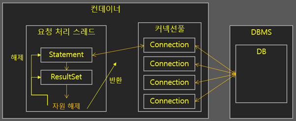

# MySQL Connection

## 의문

## 개요

JDBC connection pool

- 개요
  - 데이터베이스 자체적으로 Connection pooling을 지원하지 않음
    - 오픈소스 진영이었어서, 다양한 driver가 존재 가능하기 때문
  - 따라서 커넥션 풀은 클라이언트(드라이버)가 관리
- 특징
  - 클라이언트 쪽에서 과도하게 많은 커넥션을 생성했을 경우 그것을 설정하는 것이 필요함

### 관련 설정

- `max_connection`
  - 최대 연결 가능한 커넥션 수
- `wait_timeout`
  - sleep 상태인 커넥션을 특정 시간이 지난 이후에 정리해줌
- `thread_cache_size`
