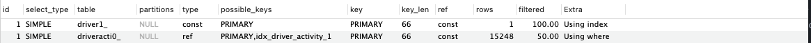

# Execution plan

- 의문
- 개요
  - 쿼리 실행 순서에 관한 고찰
- 10.1 통계 정보
- 10.2 실행 계획 확인
- 10.3 실행 계획 분석
  - 간단 정리
  - id
  - select_type
  - table
  - partitions
  - type
  - possible_keys
  - key
  - key_len
  - ref
  - rows
  - filtered
  - Extra

## 의문

- 드라이빙 테이블, 드리븐 테이블?
  - 드라이빙 테이블
    - 개요
      - 조인시 먼저 액세스 되는 쪽
      - LEFT TABLE이라고 보면 됨
    - 특징
      - iterate하면서 driven table에 주도적으로 조인 시도
      - 일반적으로 드리븐 테이블보다 행이 적으면 유리
  - 드리븐 테이블
    - 개요
      - 조인시 나중에 액세스 되는 쪽
      - RIGHT TABLE
  - 옵티마이저는 조인시, 조인의 대상되는 칼럼에 인덱스가 있는 쪽을 드리븐 테이블로 둠
    - 그래야 빠르게 검색이 가능하므로
- 하나의 단위 쿼리가 실행되는 경우, `index_merege`이외의 접근 방법에서는 단 하나의 인덱스만 사용 가능 하다는 것은?
  - 여러개의 WHERE조건이 있어도, 그중에서 하나의 인덱스만 적용 가능하다는 것인가?
    - 복수개의 인덱스를 적용하고 싶다면 merge_index를 사용하라는 것인가?
      - 그렇다
- *JOIN연산은 반드시 mysql engine레벨에서 실행되는 것인가?*
  - 그런거 같은데..

## 개요

### JOIN 포함 쿼리 실행 순서에 관한 고찰

고찰 대상 쿼리

```sql
SELECT e.emp_no, avg(s.salary) -- F)
FROM employees e
INNER JOIN salaries s -- D)
  ON s.emp_no = e.emp_no -- B)
  AND s.salary > 50000 -- C)
  AND s.from_date <= '1990-01-01' -- C)
  AND s.to_date > '1990-01-01' -- C)
WHERE e.first_name = 'Matt' -- A)
GROUP BY e.hire_date; -- E)
```

- `EXPLAIN ANALYZE`
  - 개요
    - 트리뷰로 쿼리 실행시간 확인 가능
      - 트리 탐색은 postorder 서치순으로 분석해야 함
      - `EXPLAIN`보다 정확한 쿼리 실행 순서를 알 수 있음
    - 쿼리를 직접실행한 뒤 분석하는 것이므로, 먼저 실행계획만 확인해서 튜닝하는게 바람직
  - 필드 설명
    - actual time
      - 일치하는 레코드를 검색하는 데 걸린 시간(밀리초)
      - 첫레코드 가져오는데 걸리는 평균시간 .. 마지막 레코드 가져오는데 걸리는 평균시간
    - rows
      - 일치하는 테이블의 평균 레코드수
    - loops
      - 작업 반복 횟수, 주로 driven table이 driving table의 대상 행 개수와 같음
- 실행 순서(인덱싱 여부 및 테이블 상태에 따라서 달라질 순 있음)
  - A) Index lookup on e using ix_firstname
    - ix_firstname인덱스를 통해 first_name = 'Matt' 조건에 일치하는 레코드 찾기
  - B) Index lookup on s using PRIMARY
    - salaries 테이블의 PRIMARY 키를 통해 emp_no가 A)의 결과의 emp_no와 동일한 레코드 찾기
  - C) Filter
    - 각종 조건에 일치하는 건만 가져옴
  - D) Nested loop inner join
    - A)와 C)의 결과를 조인
  - E) Aggregate using temporary table
    - 임시테이블에 결과를 저장하면서 GROUP BY 집계 실행
  - F) Table scan on \<temporary\>
    - 임시 테이블의 결과를 읽어서 결과 반환
- JOIN이 있는 경우 쿼리 실행 해석
  - 조인 전에, 어떤 행들만 조인하면 되는지, 인덱싱으로 미리 driving table, driven 테이블을 파악
    - 그렇다면, driving table, driven table은 필터링 이후에 정해지는 걸까?
    - 옵티마이저가 알아서 쿼리 플랜을 세우고 정할듯
      - *그런데 여기서 필터링까지 고려하는지는 모름*

## 10.1 통계 정보

## 10.2 실행 계획 확인

## 10.3 실행 계획 분석

### 간단 정리

같은 id일 경우, 출력된 실행 계획에서 위쪽에 출력된 결과일수록 쿼리의 바깥 부분이거나, 먼저 접근한(driving)테이블이고,
아래쪽에 출력된 결과일수록 쿼리의 안쪽 부분 또는 나중에 접근한 테이블에 해당함(driven)

**기본적으로 id가 높은 순으로 먼저 실행되고, 같은 id에서는 위쪽에 출력된 결과가 더 먼저 실행된 경우다**
**table과 key는 실제로 해당 table에 적용된 key를 나타냄**

- id
  - select의 id
- select_type
  - select의 타입
- table
  - 참조한 테이블
- partitions
- type
  - 조인 타입(테이블 접근 방법)
- possible_keys
  - 데이터 조회시 DB에서 사용할 수 있는 인덱스 리스트
- key
  - 실제로 사용할 인덱스
- key_len
  - 실제로 사용할 인덱스 길이
- ref
  - key안의 인덱스와 비교하는 칼럼
- rows
  - 쿼리 실행시 조회하는 행 수 예상값
- filtered
  - 테이블 조건으로 인하여 필터링된 행의 비율
- extra
  - 추가 정보

---

- id
- select_type
- tables
- partitions
- type

실행 계획 해석1


- 먼저, 첫번째 행을 확인하고, ID가 1인 행이 두개있으므로, JOIN임을 파악
  - 첫번째 행의 테이블이 driving table
- 두번째 행을 보면, 테이블이 derived2이므로, id가 2인 세번째 행을 봄
- 세번째 행은 서브쿼리임을 알 수 있고, LATERAL조인에서 매 derived테이블의 행 마다, 임시 테이블이 생성됨을 알 수 있음
- 다시 첫번째로 돌아가면, 첫번째 row가 두번째 row보다 더 먼저 등장하므로, e가 driving테이블이고, derived2가 driven테이블(실제로 LEFT JOIN LATERAL)

실행 계획 해석2

```sql
explain select driveracti0_.driver_id as driver_i1_26_, driveracti0_.seq_id as seq_id2_26_,
driveracti0_.activity_status as activity3_26_, driveracti0_.end_at as end_at4_26_, driveracti0_.ride_id as
ride_id8_26_, driveracti0_.ride_status as ride_sta5_26_, driveracti0_.start_at as start_at6_26_,
driveracti0_.trip_id as trip_id9_26_, driveracti0_.trip_ride_status as trip_rid7_26_,
driveracti0_.vehicle_id as vehicle10_26_
from driver_activity driveracti0_ left outer join driver driver1_ on driveracti0_.driver_id=driver1_.id
where driver1_.id='DTX69446' and driveracti0_.start_at<='2022-11-17 10:35:34.464'
order by driveracti0_.seq_id desc limit 1;
```



- 먼저, ID가 1인 행이 두개 있으므로 JOIN
- 주의
  - 여기에서, outer join되는 테이블인 driver의 `driver.id='DTX69446'`를 명시했기 때문에, 옵티마이저가 INNER JOIN으로 변경해서 실행해버림
    - 진짜 LEFT JOIN을 의도했으면 `driver1_.id='DTX69446'`을 `left outer join ... on`절 다음으로 옮겼어야 함
- 첫번쨰 행의 테이블이 driving table이고, PRIMARY key로 데이터를 가져오는데, 여기서 covering index(`using index`)를 사용
  - 일단 아이디에 해당하는 드라이버만 가져온다
- 두번쨰 행에서 driver_activity중에서 첫번째 행에서 가져온 driver.id로 인덱스를 타서 레코드를 가져옴 그리고 그 외의 필터링을 mysql engine에서 행함(`using where`)
- 두 대상을 조인함

### **id**

- 개요
  - 단위 SELECT 쿼리별로 부여되는 식별자
    - SELECT를 포함하는 서브쿼리의 경우 다른 식별자 값을 갖음
    - JOIN의 경우, JOIN되는 테이블마다 레코드가 출력되지만, 동일한 id값이 부여 됨
- 특징
  - id값이 테이블의 접근 순서를 의미하지 않음
    - `EXPLAIN FORMAT=TREE` 명령으로 확인하면 인덴트가 많이 된 곳이 더 먼저 실행된 것(쿼리 실행 순서 파악 명확히 가능)

### **select_type**

- 개요
  - SELECT 쿼리가 어떤 타입의 쿼리인지 표시
- 종류
  - SIMPLE
    - UNION, 서브쿼리를 사용하지 않는 단순한 SELECT 쿼리인 경우
      - 일반적으로 제일 바깥쪽에 있는 단위 쿼리가 SIMPLE이 됨
  - PRIMARY
    - UNION이나 서브쿼리를 가지는 SELECT 쿼리의 실행 계획에서 가장 바깥쪽에 있는 단위 쿼리
  - UNION 계열
    - UNION
      - UNION으로 결합하는 단위 SELECT 쿼리 가운데 두번째 이후 단위 SELECT 쿼리
        - 첫번째는 쿼리 결과들을 모아서 저장하는 임시 테이블(DERIVED)가 select_type으로 표시 됨
    - DEPENDENT UNION
      - UNION 쿼리인데, 내부의 쿼리가 외부의 값을 참조해서 처리될 때
    - UNION RESULT
      - UNION 결과를 담아두는 테이블
        - 단위 쿼리가 아니라서 id가 부여되지 않음
      - `UNION ALL`을 사용하면, 임시 테이블을 버퍼링하지 않아서, UNION RESULT라인이 필요치 않게 됨

### **table**

- 개요
  - 테이블의 이름
- 특징
  - 테이블을 사용하지 않는 경우 `NULL`
  - <>로 둘러싸인 이름
    - 임시테이블
    - 뒤에 숫자는 단위 SELECT 쿼리의 id값
      - e.g) <drived N>, <union M,N>

### **partitions**

### **type**

eq_ref의 예시

```sql
EXPLAIN
SELECT * FROM dept_emp de, employees e
WHERE e.emp_no=de.emp_no AND de.dept_no='d005';

-- dept_emp 테이블을 먼저 읽어서 필터링 후
-- employees 테이블을 검색
```

index_merge의 예시

```sql
EXPLAIN
SELECT * FROM employees
WHERE emp_no BETWEEN 10001 AND 11000
  OR first_name='Smith';

-- 1, index_merge, [PRIMARY, ix_firstname], Using union(PRIMARY, firstname); Using where
-- emp_no인덱스(PRIMARY)를 사용하고, first_name인덱스를 사용(둘이 별개의 인덱스)한 뒤에 병합
```

- 개요
  - 테이블의 접근 방법
    - MySQL 매뉴얼에는 '조인 타입'이라고 함
- 종류
  - 인덱스 사용
    - 단일 인덱스 사용
      - 동등 비교 연산자(`=`)
        - const(UNIQUE INDEX SCAN)
          - 프라이머리 키 or 유니크 키 칼럼을 이용하는 `WHERE`조건절 + 반드시 1건을 반환
          - 옵티마이저가 쿼리를 상수로 대체
        - eq_ref
          - 조인에서 처음 읽은 테이블의 칼럼값을, 그 다음 읽어야 할 테이블의 프라이머리 키나 유니크 키 칼럼의 검색조건에 사용
            - 조인에서 두번째 이후에 읽는 테이블에서 반드시 1건만 존재한다는 보장이 있어야 사용할 수 있는 접근 방법
              - 유니크 인덱스는 NOT NULL이어야 함
              - 다중 칼럼 인덱스면, 인덱스의 모든 칼럼이 비교 조건에 사용되어야 함
        - ref
          - 인덱스의 종류와 관계없이 동등 조건으로 검색
            - 조인의 순서와 관계 없음, 프라이머리 키 유니크 키 제약 없음
            - 레코드가 반드시 1건이라는 보장은 없음
      - fulltext
        - MySQL 서버의 전문 검색 인덱스를 사용해 레코드를 읽는 접근 방식
        - 일반적으로 `const`, `eq_ref`, `ref` 다음의 우선순위
      - ref_or_null
        - ref 접근방법과 같은데, NULL 비교가 추가됨
        - 나쁘지 않은 접근 방법
      - unique_subquery
        - `WHERE`조건절에서 사용될 수 있는 `IN(subquery)` 형태의 쿼리를 위한 접근 방법
          - 서브쿼리에서 중복되지 않는 유니크한 값만 반환할 때 이 접근 방법사용
      - index_subquery
        - `WHERE`조건절에서 사용될 수 있는 `IN(subquery)` 형태의 쿼리를 위한 접근 방법
          - 서브쿼리에서 중복되는 값을 반환할 수도 있음
          - 대신, 서브쿼리의 결과의 중복된 값을 인덱스를 이용해서 제거할 수 있을 때 사용되는 방법
      - range
        - 인덱스 레인지 스캔 형태의 접근 방법(`<`, `>`, `IS NULL`, `BETWEEN`, `IN`, `LIKE`)
        - 우선순위는 상당히 낮지만, 이 접근방법도 상당히 빠르며, 최적의 성능을 보장
          - c.f) 일반적으로 인덱스 레인지 스캔 = `const`, `ref`, `range`세 가지 접근 방식을 모두 묶어서 이야기 하는 것
    - 다중 인덱스 사용
      - index_merge
        - **2개 이상의 인덱스(한 인덱스에서 두개이상의 칼럼이 지정된것이 아님)** 를 이용해 각각의 검색 결과를 만들어낸 후, 그 결과를 병합해서 처리하는 방식
          - 여러 인덱스를 읽어야 하므로, range 접근 방법보다 효율성이 떨어짐
          - 전문 검색 인덱스를 사용하는 쿼리에서는 index_merge가 적용되지 않음
          - index_merge 접근 방법으로 처리된 결과는 항상 2개 이상의 집합이 되기 때문에 그 두 집합의 교집합이나 합집합, 또는 중복 제거와 같은 부가적인 작업이 더 필요함
      - index
        - 인덱스 풀 스캔
          - vs 테이블 풀 스캔
            - 비교하는 레코드 건수는 같음
            - 인덱스가 일반적으로 데이터 파일 전체보다 크기가 작으므로, 풀 테이블 스캔보다 빠르게 처리
            - 쿼리 내용에 따라서, 정렬된 인덱스 장점 활용 가능
        - 발동 조건(1+2 or 1+3)
          - range, const, ref와 같은 접근 방법으로 인덱스 사용 불가한 경우
          - 인덱스에 포함된 칼럼만으로 처리할 수 있는 쿼리의 경우
            - 데이터 파일 읽지 않아도 되는 경우
          - 인덱스를 이용해 정렬이나 그루핑 작업이 가능한 경우
            - 별도의 정렬 작업을 피할 수 있는 겨우
            - e.g) 1+3
              - `SELECT * FROM departments ORDER BY dept_name DESC LIMIT 10;`
                - 테이블 인덱스를 처음부터 끝까지 읽는 index접근 방식이지만, LIMIT 조건이 있기 때문에 상당히 효율적(인덱스 역순 10개가져오면 됨)
  - 인덱스 미사용
    - ALL
      - 풀 테이블 스캔
        - 테이블을 처음부터 끝까지 전부 읽어서 불필요한 레코드 제거(체크 조건이 존재할 때)
        - Read Ahead
          - InnoDB는 디스크 I/O를 최소화 하기 위해서, 한꺼번에 많은 페이지를 읽어들이는 기능 제공
          - 인접한 페이지가 연속해서 몇 번 읽히면, 백그라운드 읽기 스레드가 최대 64개의 페이지씩 한꺼번에 디스크로부터 읽어들임
            - 하나씩 읽어 들이는 작업보다 훨씬 빠름

### possible_keys

- 개요
  - 옵티마이저가 최적의 실행 계획을 만들기 위해 후보로 선정했던 접근 방법에서 사용되는 인덱스의 목록
  - 해당 인덱스를 사용했다고 판단하면 안됨
    - 그다지 쿼리 튜닝에 도움은 되지 않음

### key

- 개요
  - 최종 선택된 실행계획에서 사용하는 인덱스

### key_len

- 개요
  - 쿼리를 처리하기 위해 다중 칼럼으로 구성된 인덱스에서 몇 개의 칼럼까지 사용했는가
    - 인덱스의 각 레코드에서 몇 바이트까지 사용했는지
- 예시
  - `SELECT * FROM dept_emp WHERE dept_no='d005';`
    - key_len = 16
      - dept_no가 utf8mb4이므로, 4바이트 x 4글자 = 16바이트
  - `SELECT * FROM dept_emp WHERE dept_no='d005' AND emp_no=10001;`
    - key_len = 20
      - 16바이트 + 4바이트(INTEGER)
  - `SELECT * FROM titles WHERE to_date <= '1985-10-10';`
    - key_len = 4
      - 3바이트 DATE칼럼 + 1바이트(NULL인지 체크)

### ref

- 개요
  - 접근 방법이 ref일 때, 참조 조건으로 어떤 값이 제공되었는지 보여줌
    - 크게 신경쓰지는 않아도 됨
- 종류
  - const
    - 상숫값
  - 테이블명.칼럼명
    - 다른 테이블의 칼럼값
  - func
    - 콜레이션 변환이나, 값 자체의 연산을 거쳐서 참조한 경우
- 예시
  - `SELECT * FROM employees e, dept_emp de WHERE e.emp_no=(de.emp_no-1);`
    - ref = func

### rows

- 개요
  - 인덱스를 사용할 떄, 쿼리 처리를 위해 얼마나 많은 레코드를 읽고 어야 하는지 예측했던 레코드 건수
    - 옵티마이저의 실행 계획의 효율성 판단을 위한 지표

### filtered

*아직 정확한 의미 잘모르겠음*

JOIN시에, 옵티마이저는 행의 수가 더 적은 테이블을 선행(driving) 테이블로 함(해당 테이블의 행을 iterate하면서 후행(driven) 테이블과 값을 비교해서 JOIN)

driving table이 실행계획에서 더 위에 있음

- 개요
  - 인덱스를 사용하지 못하는 조건에서 일치하는 레코드 건수의 비율
    - **필터링 되고 남은 레코드의 비율**

### Extra

- 개요
  - 쿼리의 실행 계획에서 성능에 관련된 중요한 내용이 표시됨
    - 내부 처리 알고리즘에 대한 깊이 있는 내용을 보여줌
    - 특히, `Using temporary`, `Using where`, `Using filesort`이 셋은 모두 storage engine layer가 아닌, mysql engine layer에서 동작하는 것들
- 종류(자주 보는건 볼드)
  - **Using temporary**
    - 임시 테이블을 사용한 경우
      - 메모리 생성 or 디스크 생성
    - 주의
      - 실행계획의 Extra칼럼에 Using temporary가 표시되지는 않지만, 실제 내부적으로는 임시 테이블을 사용할 때도 많음
        - 예시
          - `FROM`절에 사용된 서브쿼리(Derived table)
          - `COUNT(DISTINCT column1)`를 포함하는 쿼리중, 인덱스를 사용할 수 없는 경우
          - `UNION`, `UNION DISTINCT`가 사용된 쿼리
          - 인덱스를 사용하지 못하는 정렬 작업
  - **Using where**
    - MySQL엔진 레이어에서 별도의 가공을 해서 필터링 작업을 처리한 경우
      - 머지 인덱스가 잘 되어있으면, 필터링이 아닌, 작업범위 결정조건으로 스토리지 엔진에서 처리가 됨
  - **Using filesort**
    - `ORDER BY` 처리가 인덱스를 사용하지 못하는 경우
    - 조회된 레코드를 정렬용 메모리 버퍼에 복사해, 퀵 소트 또는 힙 소트 알고리즘을 이용해 정렬을 수행
    - 쿼리 튜닝을 하거나, 인덱스 생성이 좋음
  - **Using index**
    - 커버링 인덱스를 사용하는 경우
      - 데이터 파일을 전혀 읽지 않고, 인덱스만 읽어서 쿼리를 모두 처리가능할 경우
        - 프라이머리 키는 자동적으로 커버링 인덱스에 포함됨(모든 InnoDB의 세컨데리 인덱스는 리프노드의 값으로 프라이머리 인덱스의 값을 갖으므로)
    - 레코드 건수에 따라다르지만, 수십배에서 수백배정도의 성능 이득 얻을 수 있음
  - **Using index condition**
    - 인덱스 컨디션 푸시 다운 최적화를 사용하는 경우
      - 스토리지 엔진에서 인덱스만을 탐색하여 기본 테이블에서 행을 찾아 WHERE 조건의 일부 평가
  - const row not found
  - deleting all rows
  - distinct
    - join시 중복된 값은 무시하고 건너뜀
  - *firstmatch*
  - *Full scan on NULL key*
  - Impossible HAVING
    - HAVING절의 조건을 만족하는 레코드가 없을 때
  - Impossible WHERE
    - WHERE 조건이 항상 FALSE가 될 수 밖에 없는 경우
  - *LooseScan*
  - No matching min/max row
    - MIN(), MAX()와 같은 집합 함수가 있는 쿼리의 조건절에 일치하는 레코드가 한 건도 없을 때
  - No matching row in const table
  - *No matching rows after partition pruning*
  - No tables used
    - FROM절이 없는 쿼리 문장 or FROM DUAL형태의 쿼리 실행 계획
  - Not exists
    - 아우터 조인을 이용해 안티-조인을 수행하는 쿼리
    - c.f) 안티조인
      - A테이블에는 존재하지만, B테이블에는 없는 값을 조회해야 하는경우, `NOT IN`, `NOT EXISTS`연산자를 사용하는 형태의 조인
      - 똑같은 처리를 LEFT OUTER JOIN을 이용해서 구현 가능
  - Plan isn't ready yet
    - `EXPLAIN FOR CONNECTION`명령을 실행했을 때, 해당 커넥션에서 아직 쿼리의 실행 계획을 수립하지 못한 상태인 경우
      - c.f) `EXPLAIN FOR CONNECTION 8`
        - 8번 커넥션의 실행계획을 확인
  - *Range checked for each record*
    - *index map*
  - *Recursive*
  - Rematerialize
    - LATERAL JOIN시에, 래터럴로 조인되는 테이블은 선행 테이블의 레코드별로 서브쿼리를 실행해서 그 결과를 임시 테이블에 저장
      - 이 과정이 Rematerializing
  - Select tables optimized away
    - `MIN()` or `MAX()`만 SELECT절에 사용되거나, `GROUP BY`로 `MIN()`, `MAX()`를 조회하는 쿼리가 인덱스를 오름차순 또는 내림차순으로 1건만 읽는 형태의 최적화가 적용는 경우
  - *Start temporary, End temporary*
    - *Duplicate Weed-out 최적화 전략이 사용되는 경우*
    - e.g)
      - `SELECT * FROM employees e WHERE e.emp_no IN (SELECT s.emp_no FROM salaries s WHERE s.salary > 150000);`
  - Unique row not found
    - 두 개의 테이블이 각각 유니크(프라이머리 키 포함) 칼럼으로 아우터 조인을 수행하는 쿼리에서, 아우터 테이블에 일치하는 레코드가 존재하지 않을 경우
  - Using index for group-by
    - `GROUP BY`시에, 인덱스를 사용하고, 루스 인덱스 스캔을 사용하는 경우
      - `MIN()`, `MAX()`
    - Loose index scan의 조건
      - WHERE 조건절이 없는 경우(O)
        - `GROUP BY`절의 칼럼과 `SELECT`로 가져오는 칼럼이 "루스 인덱스 스캔"을 사용할 수 있는 조건만 갖추면 됨
      - WHERE 조건절이 있지만 검색을 위해 인덱스를 사용하지 못하는 경우(X)
        - `GROUP BY`를 위해 인덱스를 읽은 후, `WHERE`조건의 비교를 위해 데이터 레코드를 읽어야 함
          - 결국 타이트 인덱스 스캔 과정을 통해 `GROUP BY`가 처리 됨
      - WHERE 절의 조건이 있고, 검색을 위해 인덱스를 사용하는 경우
        - **하나의 단위 쿼리가 실행되는 경우, `index_merege`이외의 접근 방법에서는 단 하나의 인덱스만 사용 가능**
          - `WHERE`절의 조건과 `GROUP BY` 처리가 공통 인덱스를 사용할 수 있을 때만 루스 인덱스 스캔 사용가능
          - 다를 경우에는, 일반적으로 옵티마이저가 `WHERE` 조건절이 사용할 수 있는 인덱스를 사용하도록 실행 계획을 수립하는 경향이 있음
  - Using index for skip scan
    - 옵티마이저가 인덱스 스킵 스캔 최적화를 사용하는 경우
    - 쿼리 최적화에서 중요한 기능이므로, 내부적인 처리 방식을 잘 이해하면 좋음
  - Using join buffer(Block Nested Loop, Batched Key Access, hash join)
    - 조인시, 드리븐 테이블에 인덱스가 존재하지 않는경우, Block nested join 혹은 hash join을 사용하고, 이때에 join buffer를 사용하게 되는데 이러한 경우
      - `join_buffer_size`라는 시스템 변수에 최대 할당 가능한 조인 버퍼 크기 설정 가능
        - 일반적으로 1MB로 충분
  - Using MRR(Multi Range Read)
    - MRR
      - MySQL엔진은 여러 개의 키 값을 한 번에 스토리지 엔진으로 전달하고, 스토리지 엔진은 넘겨받은 키 값들을 정렬해서 최소한의 페이지 접근만으로 필요한 레코드를 읽을 수 있게 최적화
        - 원래는 MySQL엔진이 넘겨주는 키 값을 기준으로 레코드를 한 건 한 건 읽어서 반환하는 방식으로 밖에 작동하지 못하는 한계가 있었음
  - Using sort_union(...), Using union(...), Using intersect(...)
    - Using intersect(...)
      - 각각의 인덱스를 사용할 수 있는 조건이 AND로 연결된 경우
    - Using union(...)
      - 각 인덱스를 사용할 수 있는 조건이 OR로 연결된 경우
    - Using sort_union(...)
      - Using union과 같은 작업을 수행하지만, Using union으로 처리될 수 없는 경우
        - e.g) OR로 연결된 상대적으로 대량의 range 조건들
      - Using sort_union은 프라이머리 키만 먼저 읽어서 정렬하고 병합한 이후, 비로소 레코드를 읽어서 반환할 수 있음
  - Zero limit
    - 데이터 값이 아닌, 쿼리 결괏값의 메타데이터만 필요한 경우
      - 쿼리 결과가 몇개의 칼럼을 가지고, 각 칼럼의 타입은 무엇인지 등의 정보만 필요한 경우
    - 예시
      - `EXPLAIN SELECT * FROM employees LIMIT 0;`
