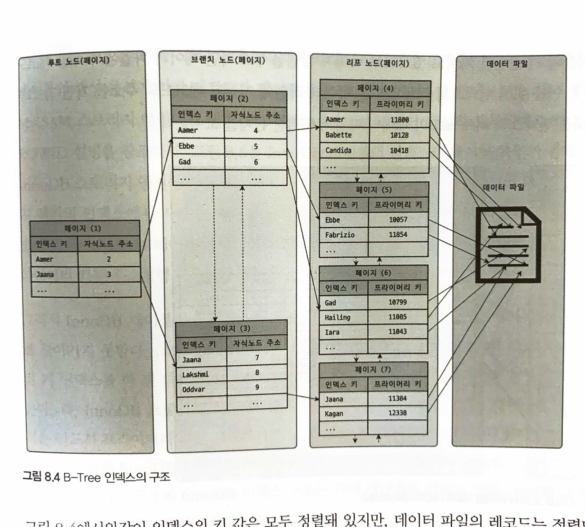
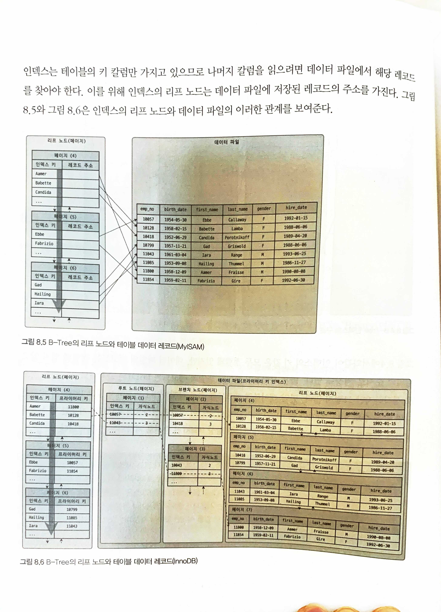
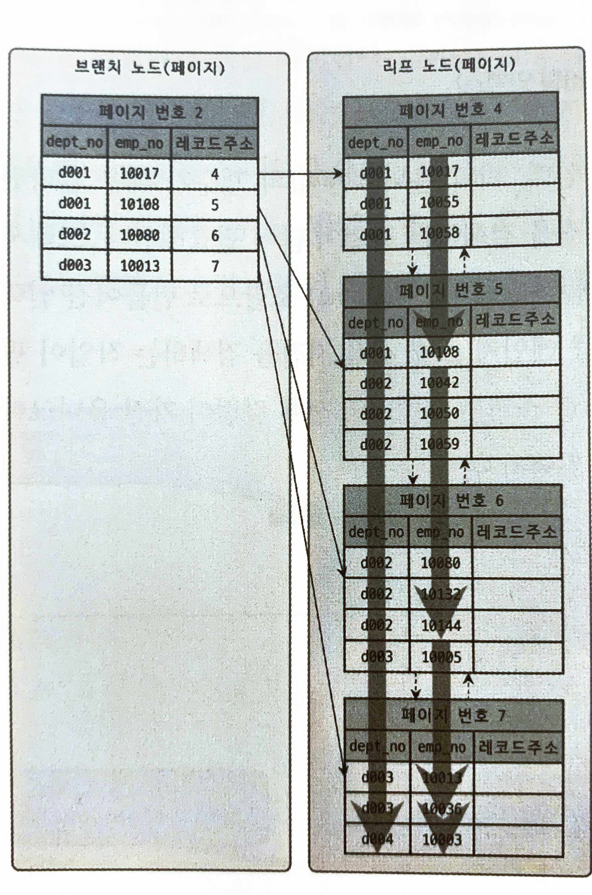

# Index

## 의문

- *애초에 데이터파일은 어떤식으로 serialize되는걸까? 칼럼이 추가되거나 제거되면?*
- WHERE절에서 인덱스를 타는 칼럼과 타지 않는 칼럼을 필터링하면, 옵티마이저가 알아서 인덱스를 먼저 타주고 나머지를 풀스캔하는 식으로 동작하는가?
  - 옵티마이저가 알아서, 인덱스를 먼저 타주고 나머지 칼럼에 대해서는 풀스캔하는 식이다

## 8.2 인덱스란?

- 장점
  - 데이터 탐색이 빨라짐
- 단점
  - INSERT, UPDATE, DELETE가 느려짐
  - 인덱스도 결국 데이터임
- 구분
  - 알고리즘
    - B-Tree
      - 일반적으로 사용되는 알고리즘
      - 칼럼의 값을 변형하지 않고, 원래의 값을 이용해 인덱싱
    - Hash
      - 칼럼의 값으로 해시값을 계산해서 인덱싱
      - 검색이 매우 빠름
      - prefix, range 서칭불가
      - 메모리 기반 데이터베이스에서 많이 사용

## 8.3 B-Tree 인덱스

B-Tree 인덱스 구조

MyISAM과 InnoDB 인덱스 구조

- 개요
  - Balanced-Tree
- 특징
  - 인덱스의 키 값은 모두 정렬, 데이터 파일의 레코드는 정렬돼 있지 않고 임의의 순서대로 저장되어 있음
  - 대부분의 인덱스에 사용(일반적)
  - 노드 하나에 페이지 하나 할당
  - 데이터 파일에서는 일반적으로는 데이터가 정렬되어 있지는 않음
    - InnoDB에서는 클러스터 인덱스인 프라이머리 키 순서로 정렬되어 저장됨
  - 인덱스도 버퍼 풀로 관리되는 대상
    - InnoDB
- 구조
  - 트리 구조
    - 루트 노드
    - 브랜치 노드
    - 리프 노드
      - 프라이머리 인덱스
        - 데이터 파일에서 해당 데이터가 존재하는 위치
      - 세컨데리 인덱스
        - 프라이머리 키 값
- 참고) InnoDB 스토리지 엔진과 데이터 저장 단위(페이지)
  - 개요
    - 페이지가 디스크의 모든 읽기 / 쓰기 작업의 최소 작업 단위 / 버퍼풀에서 버퍼링하는 기본 단위 / 인덱스의 노드도 페이지 단위
      - 그냥 일반적인 디스크 I/O는 페이지 단위로

### 스토리지 엔진 별 인덱스 특징

- InnoDB
  - (세컨데리 인덱스의 경우) 인덱스의 리프 페이지에 저장되어 있는, 프라이머리 키 값을 이용해 프라이머리 키 인덱스를 한 번 더 검색
  - 프라이머리 키 인덱스의 리프 페이지에 저장 돼 있는 레코드 읽기
    - *클러스터링 인덱스의 장점?*
- MyISAM
  - 리프 페이지에 실제 데이터가 저장 되어 있는 INSERT순번이나, 데이터 파일 내의 위치(Offset)을 저장

### B-Tree 인덱스 추가 및 삭제

- 인덱스 키 추가
  - 동작 순서
    - 저장될 키 값을 이용해 B-Tree상의 적절한 위치 검색
    - 레코드의 키 값과 대상 레코드의 주소 정보를 B-Tree의 리프노드에 저장
      - 리프 노드가 꽉 차서 더는 저장할 수 없으면, 리프 노드가 분리되고, 상위 브랜치 노드까지 처리해야 함
        - **쓰기 작업에 비용이 많이 듬**
  - 대략적 작업 비용
    - 인덱스 개수 x 1.5
      - 주로 disk I/O
  - 스토리지 엔진 별 특징
    - InnoDB
      - 체인지 버퍼 사용(한꺼번에 처리함)
      - 하지만, 유니크한 속성을 가진 인덱스의 경우, 중복 체크가 필요해서 즉시 추가하거나 삭제
        - *체인지 버퍼와 인덱스자체를 가져와서 중복성을 확인 가능한거 아닌가?*
    - MyISAM, MEMORY
      - 즉시 추가
- 인덱스 키 삭제
  - 동작 순서
    - 해당 키 값이 저장된 B-Tree의 리프 노드를 찾음
    - 삭제 마크
      - 마킹된 공간은 계속 방치하거나 재활용 함
      - disk I/O
  - 스토리지 엔진 별 특징
    - InnoDB
      - 체인지 버퍼 사용
    - MyISAM, MEMORY
      - 즉시 삭제
- 인덱스 키 변경
  - 동작 순서
    - 키 값을 삭제
    - 새로운 키 값을 추가
- 인덱스 키 검색
  - 특징
    - **100%일치 또는 값의 앞부분만 일치하는 경우에 사용 가능**
    - **함수나 연산을 수행한 결과로 정렬하거나 검색하는 작업은 B-Tree의 장점을 사용할 수 없음**
      - 이미 B-Tree에 존재하는 키값이 아니므로

### B-Tree 인덱스 사용에 영향을 미치는 요소

- **인덱스 키 값의 크기**
  - B-Tree의 자식 노드 개수
    - 인덱스의 페이지 크기, 키 값의 크기에 의해 결정
      - 페이지크기
        - `innodb_page_size` 기본 16KB
        - `innodb_page_size(16KB) = n(키의 개수) x (인덱스 키의 크기(key_size) + 자식노드 주소 크기(6 ~ 12바이트))`
          - 인덱스 키의 크기가 16바이트 => 하나의 페이지(노드)에 들어가는 자식 노드의 개수는 585개
          - 인덱스 키의 크기가 32바이트 => 하나의 페이지(노드)에 들어가는 자식 노드의 개수는 372개
        - 인덱스 키의 크기가 커지면, 그만큼 한 페이지에 들어가는 키의 개수가 줄어듬
          - 같은 개수의 row를 fetch하더라도 디스크 I/O가 증가해서 성능 저하
- **B-Tree 깊이**
  - e.g) 깊이가 3인경우
    - 인덱스 키 값의 크기가 16바이트인 경우
      - 585 * 585 * 585 = 2억
    - 인덱스 키 값의 크기가 32바이트인 경우
      - 372 * 372 * 372 = 5천만
    - 인덱스 키 값의 크기가 커지면 커질수록 하나의 인덱스 페이지가 담을 수 있는 인덱스 키 값이 적어짐 => 같은 레코드 건수여도 깊이가 깊어짐 => 디스크 I/O가 증가
      - 일반적으로 깊이가 5단계 이상으로 깊어지는 경우는 흔치 않음
- **선택도(기수성)**
  - 모든 인덱스 키 값 가운데 유니크한 값의 수
    - 인덱스 키의 기수가 크면 클 수록 인덱스의 효율이 올라감
- **읽어야 하는 레코드의 건수**
  - 인덱스를 거치고 테이블의 레코드를 읽는 것은 바로 테이블의 레코드를 읽는것보다 높은 비용이 드는 작업
    - **옵티마이저는 일반적으로는 인덱스 거쳐서 읽는게 4~5배 비용이 더 많이 든다고 예측**
    - 전체 테이블을 읽어서 데이터를 가져오고 버리는 경우
      - 인덱스를 통해 읽어야 할 레코드의 건수가 전체 테이블의 20~25%를 넘어서는 경우
  - 예시
    - 테이블에 레코드가 100만건이 저장되어 있는데, 그 중에서 50만건을 일거야 하는 쿼리가 있다고 가정
      - 전체 테이블을 모두 읽어서 필요 없는 50만건을 버리는것
      - 인덱스를 통해 필요한 50만 건만 읽어 오는 것

### B-Tree 인덱스를 통한 데이터 읽기

- **인덱스 레인지 스캔**
  - 개요
    - 인덱스를 통해 레코드를 한 건 이상 읽는 경우
  - 동작
    - 1] 인덱스 탐색
      - 인덱스 조건을 만족하는 값이 저장된 위치를 찾는다(인덱스 노드상에서)
    - 2] 인덱스 스캔
      - 1에서 탐색된 위치부터 필요한 만큼 인덱스를 차례대로 쭉 읽음
    - 3] 2에서 읽어들인 인덱스 키와 레코드 주소를 이용해, 레코드가 저장된 페이지를 가져오고, 최종 레코드를 읽어옴
      - 이 단계가 필요 없는것을 커버링 인덱스라 함
        - **커버링 인덱스가 뭘까?**
          - 인덱스로만 쿼리의 모든 동작을 커버링할 수 있는 경우
            - `인덱스는 (birth_date, gender)`로 되어있음
            - `SELECT gender, birth_date FROM employees WHERE gener = 'M' AND birth_date >= '1965-02-01';`
- **인덱스 풀 스캔**
  - 개요
    - 인덱스의 처음부터 끝까지 모두 읽는 방식, 쿼리의 조건절에 사용된 칼럼이 인덱스의 첫 번째 칼럼이 아닌 경우 - 명시된 칼럼만으로 조건을 처리할 수 있는 경우에 사용
      - 일반적으로 인덱스의 크기는 테이블의 크기보다 작으므로, 테이블 풀 스캔보다 인덱스 풀 스캔이 효율적
        - 적은 디스크 I/O
    - 사실, 인덱스를 효율적으로 사용하지 못하는 케이스임
  - 동작
  - 예시
    - `(A, B, C)`가 다중 칼럼 인덱스이고, `B, C`만 사용해서 필터링 하는 경우
      - 여기서 가져오는 필드도 무조건 B, C만 있어야 하는가?
        - 그렇다
- **루스 인덱스 스캔**
  - 개요
    - `GROUP BY`혹은 집합 함수 가운데 `MIN()`, `MAX()`함수에 대해 최적화 하는 경우에 사용
  - 동작
    - 인덱스 레인지 스캔과 비슷하게 동작하지만, 중간에 필요치 않은 인덱스 키 값은 무시
  - 예시
    - `SELECT dept_no, MIN(emp_no) FROM dept_emp WHERE dep_no BETWEEN 'd002' AND 'd004' GROUP BY dept_no;`
- **인덱스 스킵 스캔**
  - 개요
    - 인덱스의 핵심은 값이 정렬되어 있다는 것 -> 인덱스를 구성하는 칼럼의 순서가 매우 중요
    - MySQL 8.0 버전부터 도입
      - 루스 인덱스 스캔을 WHERE 절에도 사용가능하게 된 것
      - 대신, 인덱스의 선행 칼럼의 기수가 작아야 효과적
        - 그래야, 스캔 시작 지점을 검색하는 작업이 많이 필요해지기 때문
  - 동작
    - 루스 인덱스 스캔을 WHERE 절에도 사용가능하게 된 것

### 다중 칼럼(multi-column) 인덱스

다중 칼럼 인덱스 예시 그림

- 개요
  - 2개 이상의 칼럼을 포함하는 인덱스
    - 앞 칼럼의 인덱스가 같은 값 중에서 뒤 칼럼이 오름차순으로 정렬되는 방식
      - 따라서 해당 인덱스의 칼럼 순서가 중요함

### B-Tree 인덱스의 정렬 및 스캔 방향

- 인덱스의 정렬
  - 인덱스를 생성하는 시점에 인덱스를 구성하는 각 칼럼의 정렬을 오름차순, 내림차순으로 설정 가능
    - MySQL 8.0부터 칼럼 단위 정렬 순서를 혼합해서 인덱스 생성 가능
- 인덱스 스캔 방향
  - 옵티마이저가 쿼리에 따라서, 알아서 정순으로 스캔하던지 역순으로 스캔하던지 결정함
    - e.g)
      - `SELECT * FROM employees ORDER BY first_name DESC LIMIT 1;`
        - first_name 칼럼의 인덱스를 역순으로 읽어서 하나 가져옴
      - `ORDER BY`, `MIN()`, `MAX()`
- 참고
  - 내림차순 인덱스가 때로는 더 효율적일 떄가 존재
    - 기본적으로 InnoDB의 경우, 인덱스의 반대방향으로 정렬후 정렬후 fetch가 정방향 fetch보다 더 느림(약 30%)
      - 페이지내의 레코드의 연결이 단방향링크를 갖음

### B-Tree 인덱스의 가용성과 효율성

- 효율성
  - 케이스 스터디
    - `SELECT * FROM dept_emp WHERE dept_no='d002' AND emp_no >= 10114;`
      - `INDEX(dept_no, emp_no)`
        - dept_no가 d002인 인덱스 중에서 emp_no가 10114 이상인 친구들을 전부 가져오면 끝
          - 효율적
      - `INDEX(emp_no, dept_no)`
        - emp_no가 10114 이상인 친구들중에서 dept_no가 d002인지 아닌지를 체크해야 함
          - 비효율적
- 가용성
  - 케이스 스터디
    - `SELECT * FROM employees WHERE first_name LIKE '%mer';`
      - `INDEX(first_name)`
        - 인덱스를 효율적으로 사용하지 못함
        - left에서 right로 B-tree의 키가 정렬되어 있는데, 뒷부분을 기준으로 매칭시켜야 하므로
    - `SELECT * FROM dept_emp WHERE emp_no >= 10144;`
      - `INDEX(dept_no, emp_no)`
        - 인덱스를 효율적으로 사용하지 못함
        - 다중 칼럼 인덱스가 칼럼의 left에서 right로 정렬되어 있는데, 위의 쿼리에서는 index full scan을 하게 됨
- 가용성과 효율성 판단
  - 비효율 적인 쿼리
    - 싱글 칼럼 인덱스
      - NOT-EQUAL로 비교된 경우
        - `<>`, `NOT IN`, `NOT BETWEEN`, `IS NOT NULL`
      - LIKE '%??'
        - 뒷부분 일치 형태로 문자열 패턴이 비교된 경우
      - 인덱스 칼럼이 변형된 후 비교된 경우
        - `WHERE SUBSTRING(column, 1, 1) = 'x'`
        - `WHERE DAYOFMONTH(column) = 1`
      - *NOT-DETERMINISTIC 속성의 스토어드 함수가 비교 조건에 사용된 경우*
      - 데이터 타입이 서로 다른 비교
        - `WHERE char_column = 10`
      - 문자열 데이터 타입의 콜레이션이 다른 경우
        - `WHERE utf8_bin_char_column = euckr_bin_char_column`
        - *콜레이션?*
    - 다중 칼럼 인덱스
      - 칼럼에 대한 조건이 없는 경우
      - 칼럼의 비교 조건이 위의 인덱스 사용 불가 조건 중 하나인 경우
        - `... WHERE column_1 = 1 AND column_2 = 2 AND column_3 IN (10, 20, 30) AND column_4 <> 100`
          - column_3까지는 범위 결정 조건으로 사용(인덱스 레인지 스캔)
          - column_4는 체크 조건으로 사용(인덱스 풀스캔)
