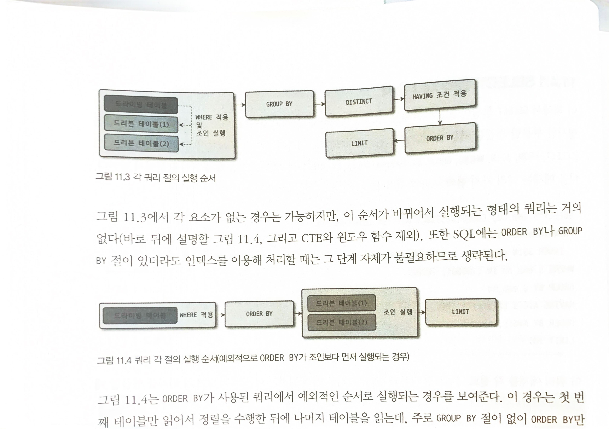

# 쿼리 최적화

- 의문
- 11.1 쿼리 작성과 연관된 시스템 변수
- 11.2 매뉴얼의 SQL 문법 표기를 읽는 방법
- 11.3 MySQL 연산자와 내장 함수
- 11.4 SELECT
- 11.5 INSERT
- 11.6 UPDATE & DELETE
- 11.7 스키마 조작(DDL)
- 11.8 쿼리 성능 테스트

## 의문

- JOIN을 하면, 항상 임시 테이블이 생성되는건가?
  - *애초에 임시 테이블이 뭐지?*

## 11.1 쿼리 작성과 연관된 시스템 변수

## 11.2 매뉴얼의 SQL 문법 표기를 읽는 방법

## 11.3 MySQL 연산자와 내장 함수

## 11.4 SELECT

- 개요
  - 웹 서비스에서 사용되는 비율 높음
  - 어떻게 읽는가에 주의 필요

### SELECT 절의 처리 순서

위: 일반적인 SELECT 쿼리 실행 순서
아래: 예외적으로 ORDER BY가 조인보다 먼저 실행되는 경우

- 일반적인 경우
  - FROM, WHERE -> GROUP BY -> DISTINCT -> HAVING -> ORDER BY -> LIMIT
- 예외적으로 ORDER BY가 조인보다 먼저 실행되는 경우
  - FROM, WHERE -> ORDER BY -> JOIN -> LIMIT
    - `GROUP BY`없이 `ORDER BY`만 사용된 쿼리
- 실행 순서를 벗어나는 쿼리
  - 인라인 뷰 사용 필요
    - e.g) LIMIT먼저 적용하고, ORDER BY실행
    - 대신 임시 테이블이 사용됨

### WHERE 절과 GROUP BY 절, ORDER BY 절의 인덱스 사용

- 인덱스를 사용하기 위한 기본 규칙
  - 1 인덱스된 칼럼의 값 자체를 변환하지 않고 그대로 사용해야 함
    - 복잡한 연산 or 해시값을 만들어서 비교하려면, 미리 계산된 값을 저장하도록 가상 칼럼을 추가하고, 그 칼럼에 인덱스를 생성하거나 함수 기반의 인덱스를 사용해야 함
  - 2 WHERE절의 비교 조건에서 연산자 양쪽의 두 비교 대상 값이 데이터 타입이 일치해야 함
    - 칼럼을 옵티마이저가 주어진 값의 타입으로 변환한뒤에 비교
- WHERE 절의 인덱스 사용
  - 개요
    - **WHERE 조건절의 순서는 실제 인덱스의 사용 여부와 무관**
      - 옵티마이저가 알아서 잘해줌
    - 범위 비교 조건으로 인덱스가 사용된 이후에는, 또 범위 비교 조건으로 사용되지 못하고, 체크조건으로 사용됨
      - e.g) `col1 = ?`, `col2 = ?`, `col3 > ?`, `col4 < ?`
        - col4는 체크 조건이 됨
          - *왜 스킵 인덱스 사용이 안된걸까*

## 11.5 INSERT

## 11.6 UPDATE & DELETE

## 11.7 스키마 조작(DDL)

## 11.8 쿼리 성능 테스트
