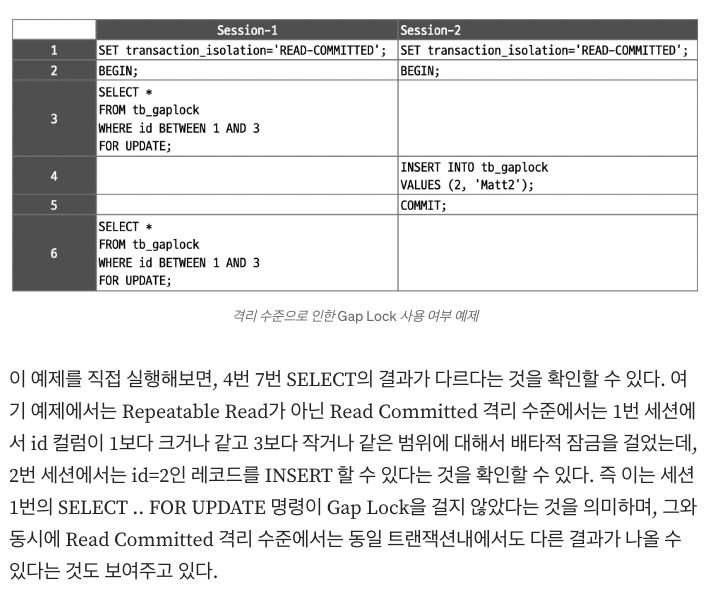
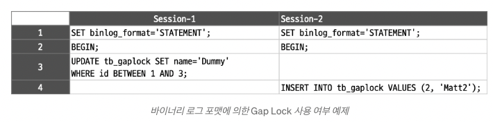
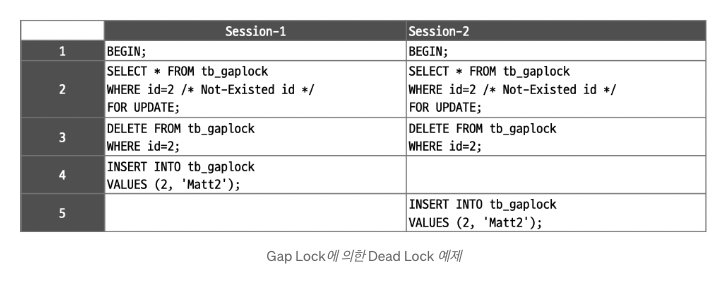

# Transaction and Lock

- 의문
- 용어
- 5.1 트랜잭션
- 5.2 MySQL 엔진의 잠금
- 5.3 InnoDB 스토리지 엔진 잠금
  - InnoDB 락의 종류
    - row-level 락의 범위
    - 락의 유형
  - 인덱스와 잠금
  - 레코드 수준의 잠금 확인 및 해제
- 5.4 MySQL의 격리 수준
  - READ UNCOMMITTED
  - READ COMMITTED
  - REPEATABLE READ
  - SERIALIZABLE

## 의문

- InnoDB의 경우, 모든 쿼리 하나하나가 transaction인가?
  - `autocommit`모드가 들어와 있으면 그렇다
    - session variable
  - `autocommit = 1`
    - SQL문이 에러를 반환하지 않으면 각 SQL문 뒤에 자동으로 커밋함
    - multi-statement 트랜잭션
      - `START TRANSACTION` or `BEGIN`으로 시작하고, `COMMIT`, `ROLLBACK`문으로 끝낼 수 있음
  - `autocommit = 0`
    - 세션은 open transaction을 항상 갖음
      - `COMMIT`, `ROLLBACK`문은 현재 트랜잭션을 끝내고, 새것을 시작하게 함
      - `COMMIT`을 하지 않으면, MySQL은 rollback함
      - `COMMIT`, `ROLLBACK`
        - 모든 락이 해제
- *바이너리 로그 포맷*
  - *STATEMENT, ROW 포맷?*
- InnoDB에서 인덱스 레코드에 락이 걸리는거면, A, B 각각 다른 트랜잭션이 같은 행에 대해서 다른 인덱스로 락을 걸어 접근하려고 하면 락이 걸리지 않는 것인지?
  - 아니다. 락이 걸린다. 즉, clustered index의 record를 기반으로 락을 거는듯.

isolation이 serializable인 경우 아래 동작의 해석

```sql
(A-1) SELECT state FROM account WHERE id = 1;
(B-1) SELECT state FROM account WHERE id = 1;
(B-2) UPDATE account SET state = ‘rich’, money = money * 1000 WHERE id = 1;
(B-3) COMMIT;
(A-2) UPDATE account SET state = ‘rich’, money = money * 1000 WHERE id = 1;
(A-3) COMMIT;
```

- (A-1)번 SELECT 쿼리가 SELECT ... FOR SHARE로 바뀌면서 id = 1 인 row에 S lock이 걸린다
- (B-1)번 SELECT 쿼리 역시 id = 1인 row에 S lock을 건다
- 그 상황에서 transaction A와 B가 각각 2번 UPDATE 쿼리를 실행하려고 하면 row에 X lock을 걸려고 시도할 것이다
  - 여기서의 lock은 implicit lock
    - https://dev.mysql.com/doc/refman/8.0/en/innodb-locks-set.html
- 하지만 이미 해당 row에는 S lock이 걸려있다
- 따라서 deadlock 상황에 빠지고, 두 transaction 모두 timeout으로 실패

## 용어

- 잠금
  - 동시성을 제어하기 위한 기능
  - 한 시점에 하나의 커넥션만 변경할 수 있게 해줌
- 트랜잭션
  - ACID특성을 만족하는 데이터 프로세싱
    - COMMIT을 실행했을 때, 작업 셋 자체가 100% 적용되거나, 아무것도 적용되지 않아야(ROLLBACK) 함을 보장해줌
- 격리 수준
  - 하나의 트랜잭션 내에서 또는 여러 트랜잭션 간의 작업 내용을 어떻게 공유하고 차단할 것인지 결정하는 레벨

## 5.1 트랜잭션

- 개요
  - ACID를 만족하는 정보의 가공
- 특성
  - 트랜잭션 하나를 하나의 쿼리문으로 한번에 실행 시키는 것도 가능하고, interactive하게, `begin`으로 트랜잭션을 시작하고, 클라이언트와 interactive하게 실행 시키는 것도 가능
- 주의
  - 네트워크 작업과 같은 DBMS와 관련없는 I/O작업이나 CPU연산은 트랜잭션에서 배제해야함

## 5.2.0) 락의 구분

- 스토리지 엔진 레벨
- MySQL 엔진 레벨
  - 스토리지 엔진을 제외한 나머지 부분
  - 락 종류
    - 테이블 락
      - 테이블 데이터 동기화
    - 메타데이터 락
      - 테이블 구조 잠금
    - 네임드 락
      - 사용자의 필요에 맞게 사용

## 5.2 MySQL 엔진의 잠금

- 글로벌 락
- 테이블 락
- 네임드 락
- 메타데이터 락

### 글로벌 락

- 개요
  - MySQL에서 제공하는 잠금 가운데 가장 범위가 큼
  - `FLUSH TABLES WITH READ LOCK`
- 범위
  - `SELECT`를 제외한 대부분의 DDL, DML을 막음
- 특징
  - mysqldump와 같은 백업 프로그램이 사용하는 경우가 존재
  - 조심해서 사용해야 함

### 테이블 락

- 개요
  - 개별 테이블 단위로 설정되는 잠금
    - 명시적, 묵시적
- 특징
  - 범위가 커서 대부분 사용할 일은 없음
  - MyISAM, MEMORY 테이블에 데이터를 변경하는 쿼리를 실행하면 발생

### 네임드 락

- 개요
  - 임의의 문자열에 대해 설정하는 잠금
- 활용
  - *잘 모르겠음*

### 메타데이터 락

Online DDL이 Metadata lock을 기다리면서 쿼리를 블록하는 이슈가 존재

- 개요
  - 데이터베이스 객체(테이블, 뷰 등)의 이름이나 구조를 변경하지 못하도록 획득하는 잠금
    - 데이터베이스 오브젝트에 대한 동시 접근과 데이터 일관성을 유지하기 위해서 메타데이터 락을 사용
- 특징
  - S, X락이 존재
  - 테이블 뿐 아니라, 스키마, procedures, functions, triggers, scheduled events, table spaces, `GET_LOCK()`으로 인한 명시적으로 획득한 유저 락까지도 적용됨
  - performance_schema의 `metadata_locks`에서 세션이 갖고 있는 메타데이터 락과 블로킹 정보를 볼 수 있음
- 동작
  - Acquisition
    - 우선순위가 존재하여, 쓰기 락 요청이 더 높아서 읽기 락 요청보다 함께 대기중이라면 먼저 실행이 됨
    - DML문은 락을 획득함
    - DDL의 경우, 데드락을 방지하기 위해서, 락을 명시적으로 알파벳 순서대로 획득
      - `RENAME TABLE tbla TO tbld, tblc TO tbla;`
        - tbla, tblc, tbld 순으로 락 획득(알파벳 순서)
  - Release
    - **트랜잭션의 serializability때문에, mysql 엔진은 다른 세션에서 명시적으로든, 암묵적으로든 끝나지 않은 트랜잭션이 있다면 DDL을 허락하지 않음**
      - 메타데이터 락을 통해서 구현
      - 메타데이터락은 테이블 구조의 변화를 막음
    - e.g)
      - session1: `BEGIN; SELECT * FROM t; SELECT * FROM nt;`
      - session2: `DROP TABLE t; ALTER TABLE t ..., ...; LOCK TABLE t ... WRITE;`
      - session2는 session1의 트랜잭션이 끝날때까지 블로킹

## 5.3 InnoDB 스토리지 엔진 잠금

InnoDB 스토리지 엔진의 잠금


- c.f) lock type, mode
  - lock type
    - 테이블 수준의 잠금이 아니라, 레코드 수준의 잠금을 의미
      - 테이블에 존재하는 레코드 자체의 잠금(x)
  - lock mode
    - 실제 어떤 락이 걸린것인지

### 락의 모드(Lock mode)

- S-lock
  - 개요
    - 읽기는 허락하는 락
    - 같은 S-lock은 동시에 락을 거는것을 허락함
    - index record에 락이 걸림
- X-lock
  - 개요
    - 읽기 / 쓰기 모두 허락하지 않는 락
    - index record에 락이 걸림
- 주의
  - **S-lock이 걸려있든, X-lock이 걸려있든, 단순한 SELECT는 락으로 인한 wait이 없음**
    - MySQL이 구현한 MVCC의 언두로그를 생각하면 어찌보면 당연함(consistent read)
  - **InnoDB의 lock은 최신 버전의 row에만 걸 수 있음**
    - 이전 버전(rollback history)의 row에는 걸지 못함(인덱스에 락을 거므로)
    - 따라서, REPEATABLE READ에서 `select * from ...`에서 보이지 않던 레코드가, `select * from ... for update`나 `select * from ... for share`에서는 보이는 경우가 존재
      - phantom read가 존재

### 락의 유형(Lock type)

- c.f) Multiple Granularity Locking(MGL)
  - 개요
    - 다른 오브젝트를 포함하는 오브젝트에 락을 거는것
      - e.g) DB는 계층구조임(file, page, record)
        - 트리구조로 생각할 수 있음
        - pages는 file의 children, records는 page의 children
  - 특징
    - MySQL에서는 table과 record 사이에 MGL 가능
      - e.g) `SELECT ... FOR SHARE`혹은 `SELECT ... FOR UPDATE` 와 같이 row에 s-lock, x-lock을 걸기전에 table level의 intention lock을 걸어서 실제 table level의 lock을 걸때에(`LOCK TABLE ... WRITE`) 쉽게 참고할 수 있게 한다
- Intention lock
- record lock
- gap lock
- next-key lock
- auto-increment lock
- foreign-key lock

#### Intention lock

- 개요
  - MGL에서 노드를 직접 락하는 것이 아니라, 락이 존재하거나(예를들면, MySQL에서 IS락은 해당 테이블에 record S-lock이 이미 존재하고 있다는 것을 나타냄), 락을 하려고 한다는 것을 나타내는 락
    - 한 트랜젝션이 특정 노드에 S나 X락을 걸면, 모든 조상 노드에게 recursive하게 각각 IS혹은 IX락을 걸게 되는것
      - 존재함을 나타내는 플래그
- 시나리오
  - 한 트랜젝션에서 레코드에 S-lock을 걸려고 시도하면, innoDB에서 암묵적으로 테이블에 IS lock을 걸고, 그 다음에 레코드에 S-lock을 건다
  - 다른 트랜젝션에서 테이블 X-lock을 걸려고 시도하면, 해당 테이블에 모든 레코드를 순회하며 락이 걸려있는지 확인하는 대신, Intention lock의 여부만 확인한다
    - 훨씬 효율적

#### 레코드 락

- 개요
  - 레코드 자체만 잠그는 것
    - **하지만 InnoDB에서 그 구현은 인덱스의 레코드를 잠금**
    - 인덱스가 없어도 클러스터 인덱스를 생성해서 해당 클러스터 인덱스로 레코드 잠금
      - 인덱스로 레코드를 잠금한다는게 구체적으로 어떤 의미인지?
        - 말 그대로 인덱스의 레코드다
        - 복합인덱스의 경우, 인덱스를 일부만 타면, 그 인덱스에 대해서만 락을 검
      - table full scan의 경우에는 어떻게 레코드 락을 하는가?
        - 모든 레코드에 락을 검

#### 갭 락

갭 락의 필요성1: Repeatable read 격리 수준 보장(phantom read방지)



갭 락의 필요성2: Replication 일관성 보장



- 개요
  - **간격 사이에 새 레코드가 INSERT되는 것을 막아주기 위한 락**
    - 쿼리의 결과가 오직 1건의 결과를 보장하지 못하고, (S or X)lock을 거는 경우 경우 넓은 범위의 갭락이 발생
      - `SELECT ... FOR UPDATE(FOR SHARE), UPDATE, DELETE`와 같은 쿼리를 할 경우
- 필요성
  - Repeatable read 격리 수준 보장(phantom read방지)
    - 즉, READ-COMMITTED에서는 phantom read가 발생
  - Replication 일관성 보장(Binary Log Format = Statement or Mixed(SQL문장을 바이너리 로그 파일로 기록))
  - Foreign Key 일관성 보장
- 특징
  - 유니크한 행을 유니크 인덱스로 찾아서 잠금을 걸때는 사용되지 않음
    - 행이 하나라는게 보장되면 사용되지 않음
  - 서로다른 트랜젝션의 갭 락은 충돌되지 않음
  - S-gap lock, X-gap lock 차이가 없음
    - 그냥 단지, 갭 사이에 insertion을 못하게 막을 뿐
  - 넥스트 키 락의 일부로 자주 사용
- 주의
  - InnoDB에서는, `SELECT ... FOR UPDATE`, `SELECT ... FOR SHARE`두 쿼리의 경우 Mysql에서 Rollback history에 lock을 걸 수 없고, 오직 index에만 락을 걸 수 있어서 phantom read발생
  - 쿼리의 결과가 1건의 결과를 보장하지 못하는 경우 넓은 범위의 갭락이 발생할 수 있음
    - 인덱스를 타지 않는 쿼리
      - 테이블 행 전체에 next-key lock(gap lock + record lock)을 걸음
    - 복합 인덱스의 일부만 타는 쿼리(unique하지 않는경우)

#### 넥스트 키 락

갭 락과 넥스트 키 락 예시

```
mysql> select * from test1;
+----+------+
| id | c1   |
+----+------+
|  1 |   10 |
|  2 |   15 |
|  3 |   22 |
|  7 |   11 |
| 10 |   24 |
+----+------+

위의 예시에서, id는 primary key이고, c1은 아무런 인덱스가 걸려있지 않다
여기에서 tx1에서 다음과 같이 실행하면 블로킹이 됨

예시1: gap lock의 범위 속에서는 락이 걸린다

tx1> begin;
tx1> update test1 set c1 = 50 where id = 5; // id 4-6 사이에 gap lock이 걸림

tx2> begin;
tx2> update test1 set c1 = 50 where id = 3; // 4-6 사이에 gap lock이 걸린것이므로 성공
tx2> insert into test1 values (4, 30); // 블로킹

예시2: gap lock의 범위 바깥에서는 락이 걸리지 않는다

하지만 인덱스의 범위를 피해서 아래와 같이 트랜잭션을 실행하면 블로킹이 되지 않음

tx1> begin;
tx1> update test1 set c1 = 50 where id = 5; // id 4-6 사이에 gap lock이 걸림

tx2> begin;
tx2> insert into test1 values (8, 30); // 성공
tx2> insert into test1 values (11, 30); // 성공

예시3: 인덱스가 없는 경우의 next key lock이 모든 행과 gap에 걸린다

tx1> begin;
tx1> select * from test1 where c1 = 11 for update;

tx2> begin;
tx2> insert into test1 values (11, 30); // 블로킹

tx3> begin;
tx3> update test1 set c1 = 70 where id = 1; // 블로킹
```

- 개요
  - 레코드 락 + 갭 락
- 예시
  - 인덱싱이 안되어있는 칼럼으로 필터링할 경우
    - 열람되는 모든 행의 클러스터 인덱스 레코드에 넥스트 키락을 검(full-scan이어서)
  - 인덱싱이 되어있는 칼럼으로 필터링할 경우
    - 인덱스가 설정되지 않은 행에 S,X락을 걸 경우 가장 가까운 인덱스 범위에 gap lock이 걸림
      - 위의 예시 참조

**갭 락으로 인한 데드락 예시(매우 중요)**



- 데드락 해설
  - 3번까지의 SQL 명령은 실행 시점이나 순간에 관계없이, 2개의 트랜잭션간 상호 간섭이나 대기 없이 실행됨
    - tb_gaplock 테이블에 id=2인 레코드가 없으므로, `SELECT ... FOR UPDATE`문장과 `DELETE`문장은 레코드락 없이 갭 락만 획득
    - 갭 락은 항상 S-lock이므로 서로 충돌하지 않음
  - 4,5번의 INSERT 문장은 갭 락과 다른 형태의 잠금인 INSERT Intention Gap Lock을 필요로 함
    - 이 락은 갭 락과 호환되지 않아서, 각각의 세션이 서로의 갭 락을 기다리게 됨
    - 데드락 발생
- 갭 락 사용 최소화 & Concurrency 향상 방법
  - `binlog_format = ROW`
    - 그다지 큰 변화는 아님
  - `transaction_isolation = READ-COMMITTED`
    - 매우 중요한 변화이므로 조심해야 함
    - but, 데드락이 발생하지 않으면, 서로 다른 트랜잭션에서 INSERT한 레코드 들이 섞여서 의도하지 않은 버그를 만들어낼 수도 있음

#### Insert intention gap lock

- 개요
  - INSERT만을 위한 갭 락
    - Duplicate Key에러가 아니면, 여러 INSERT가 동시에 실행 가능하도록 함
    - INSERT시에도 gap lock을 사용하면, 너무 넓은 범위의 잠금 효과를 만들게 될 수 있으므로 같은 INSERT는 가능하도록 설정해둔 락
      - 갭락과는 서로 블로킹한다(호환되지 않음)

#### 자동 증가 락

- 개요
  - `AUTO_INCREMENT`칼럼이 사용된 테이블에 동시에 여러 레코드가 INSERT되는 경우, 각 레코드는 중복되지 않고 저장된 순서대로 증가하는 일련번호값을 갖을 수 있도록 하는 락
    - 테이블 수준의 락
  - `INSERT`시에만 걸림
  - `AUTO_INCREMENT`값을 가져오는 순간만 락이 걸렸다가 즉시 해제

#### c.f) foreign key에 의한 부모, 자식 테이블의 락

- 개요
  - 외래키 제약으로 인해, 자식 테이블(외래키를 갖고 있는 테이블)에서 지정하는 부모의 id가 부모 테이블에 존재함(정합을)을 보장하기 위해 자식 테이블의 **외래키에대한 칼럼변경(INSERT, UPDATE)** 는 부모 테이블의 확인이 필요
    - SELECT를 제외한 DML
- e.g)
  - 자식 테이블이 블로킹 되는 경우
    - `Tx1, Tx2 - BEGIN`
    - `Tx1 - UPDATE parent SET age = age + 1 WHERE id = 1;`
    - `Tx2 - INSERT INTO child (id, age, parent_id) VALUES ("", 20, 1);`
      - 블로킹
  - 부모 테이블이 블로킹 되는 경우(`외래키에 ON DELETE CASCADE가 적용되었을 때`)
    - `Tx1, Tx2 - BEGIN`
    - `Tx1 - UPDATE child SET address='seoul' where parent_id = 1;`
    - `Tx2 - DELETE FROM parent WHERE id = 1;`
      - 블로킹

### 인덱스와 잠금

- 개요
  - **`SELECT ... FOR UPDATE (FOR SHARE) / UPDATE / DELETE`시 인덱스로 스캔되는 모든 레코드 및 갭에 락이 걸림(암묵적 lock)**
    - 따라서, 인덱싱을 잘하는 것이 매우 중요
  - **테이블에 인덱스가 하나도 없는 경우, 테이블을 풀스캔하면서 모든 레코드 및 갭을 잠금**
    - *왜 굳이 이래야만 하는가?*
    - *그냥 마지막에 수정할때만 해당 레코드에 락을걸면 되는거 아닌가*
    - e.g) `SELECT * FROM test1 where c1 < 4 for update`
      - c1에 인덱스가 없을 경우
        - 모든 테이블의 row를 full scan하면서 레코드 및 갭에 x-lock이 걸림
      - c1에 인덱스가 있을 경우
        - 인덱스 스캔 범위에만 row를 scan하면서 레코드 및 갭에 x-lock이 걸림
          - **만약, c1이 primary, unique 조건으로 인해서 1행이라는 것이 확실시되면, 레코드락만 걸림**
      - `SELECT COUNT(*)`도 마찬가지(왜냐하면, 인덱스 스캔자체에서 락을거므로)

### 레코드 수준의 잠금 확인 및 해제

- 확인
  - 개요
    - `SHOW PROCESSLIST`
      - 잠금을 가지고 있는 프로세스는 Info가 NULL로 나옴
      - 잠금 대기중인 프로세스는 State가 `updating`이고 `Info`에 query문이 존재하며 `Time`을 보면 된다
    - (MySQL8.0) `performance_schema.data_locks`, `performance_schema.data_lock_waits, information_schema.innodb_trx` 등을 join해서 파악 가능
- 해제
  - 개요
    - `KILL (스레드 아이디)`

### 데드락

데드락 예시

```sql
-- Client A (1)
mysql> START TRANSACTION;

mysql> SELECT * FROM t WHERE i = 1 LOCK IN SHARE MODE;

-- Client B (2)
mysql> START TRANSACTION;

mysql> DELETE FROM t WHERE i = 1;

-- Client A (3)
mysql> DELETE FROM t WHERE i = 1;
ERROR 1213 (40001): Deadlock found when trying to get lock;
try restarting transaction
```

- 1
  - Client A는 i = 1 인 레코드에 S락을 검
- 2
  - Client B는 i = 1 인 레코드를 삭제하려고 시도하면서, X락을 걸려고 함
  - 하지만 락을 획득할 수 없음, 왜냐하면 A가 S lock을 이미 갖고 있기 때문임
  - 그러므로, lock 요청들의 큐로 해당 X락 요청이 들어가고, 클라이언트 B는 블로킹함
- 3
  - 마지막으로 A가 i = 1 인 레코드를 삭제하려고 시도하면서, X락을 걸려고 함
  - 클라이언트 A가 X락을 획득하려는 과정에서 데드락 발생
    - B의 요청이 이미 큐에서 A가 S lock을 풀기를 기다리는 중
    - A의 S락을 X락으로 업그레이드 할 수 없음, 왜냐하면, B가 같은 행에 X락 요청을 먼저 날렸으므로
  - 결과적으로, InnoDB는 A, B 클라이언트 둘 중 하나에 error를 생성하고, 에러가 생긴쪽의 클라이언트의 락을 해제함
    - 에러: `ERROR 1213 (40001): Deadlock found when trying to get lock;
try restarting transaction`
  - 에러가 나지 않은 다른쪽의 클라이언트가 락을 획득하여 남은 오퍼레이션 진행 가능

*어라, 그럼 spring jpa메서드 save(), saveAndFlush() 둘 중 saveAndFlush()를 사용하게 되면, 데드락의 위험성이 생기겠네?*

## 5.4 MySQL의 격리 수준

- READ UNCOMMITTED
- READ COMMITTED
- REPEATABLE READ
- SERIALIZABLE

### READ UNCOMMITTED

- 개요
  - dirty read가 가능

### READ COMMITTED

- 개요
  - 커밋해야지만 다른 트랜잭션에서 조회 가능
  - undo log를 이용해서 구현
  - c.f) 트랜잭션 안에서의 SELECT와 밖에서의 SELECT
    - READ COMMITED
      - 안에서의 SELECT, 밖에서의 SELECT 큰 차이가 없음
    - REPEATABLE READ
      - 안에서의 SELECT, 밖에서의 SELECT는 차이가 있음

### REPEATABLE READ

- 개요
  - NON-REPEATABLE READ 부정합이 발생하지 않음
  - ROLLBACK될 가능성에 대비해 변경되기 전 레코드를 undo 공간에 백업해두고, 실제 레코드 값을 변경
  - 언두 영역
    - 트랜잭션은 고유한 트랜잭션 번호가 존재
    - 언두 영역에 백업된 모든 레코드에는 변경을 발생시킨 트랜잭션 번호가 포함
    - InnoDB 스토리지 엔진이 불필요하다고 판단하는 시점에 주기적으로 삭제
    - 실행 중인 트랜잭션 가운데 가장 오래된 트랜잭션 번호보다 트랜잭션 번호가 앞선 언두 영역의 데이터는 삭제 불가
  - PHANTOM READ(첫 SELECT에서는 보이지 않던 row가 다음 SELECT에서는 보이는 현상)는 발생
    - MySQL에서는 next key lock으로 방지

### SERIALIZABLE

- 개요
  - REPEATABLE READ와 같으나, InnoDB가 암묵적으로 모든 SELECT를 `SELECT ... LOCK IN SHARE MODE`로 변환 시킴
  - 읽기 작업도 공유 잠금을 획득해야 함
    - 다른 트랜잭션은 그 레코드 변경 불가(접근 불가)
  - *InnoDB 스토리지 엔진에서는 갭 락과 넥스트 키 락 덕분에 REPEATABLE READ 격리 수준에서도 이미 PHANTOM READ가 발생하지 않기 때문에, 굳이 SERIALIZABLE을 사용할 필요성은 없다?*
    - MVCC와 락의 개념은 엄연히 다르다
      - 락을 사용해서 일관성 있는 읽기를 할 수는 있으나, MVCC를 사용하면 더 효율적으로 일관성 있는 읽기를 수행할 수 있다
