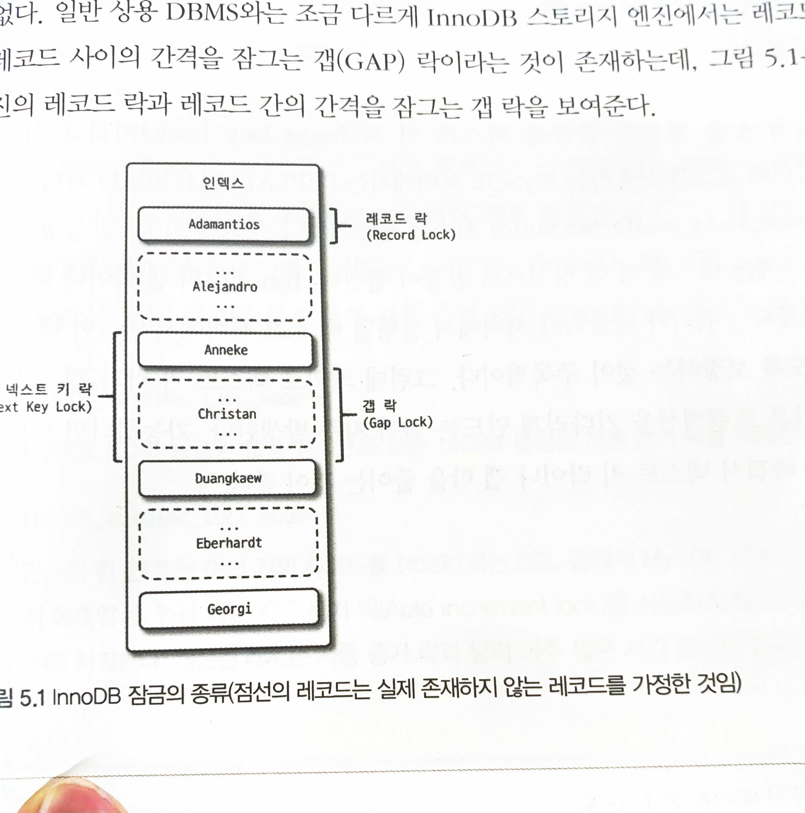

# Transaction and Lock

- 의문
- 용어
- 5.1 트랜잭션
- 5.2 MySQL 엔진의 잠금
- 5.3 InnoDB 스토리지 엔진 잠금
- 5.4 MySQL의 격리 수준

## 의문

- InnoDB의 경우, 모든 쿼리 하나하나가 transaction인가?
  - `autocommit`모드가 들어와 있으면 그렇다
    - session variable
  - `autocommit = 1`
    - SQL문이 에러를 반환하지 않으면 각 SQL문 뒤에 자동으로 커밋함
    - multi-statement 트랜잭션
      - `START TRANSACTION` or `BEGIN`으로 시작하고, `COMMIT`, `ROLLBACK`문으로 끝낼 수 있음
  - `autocommit = 0`
    - 세션은 open transaction을 항상 갖음
      - `COMMIT`, `ROLLBACK`문은 현재 트랜잭션을 끝내고, 새것을 시작하게 함
      - `COMMIT`을 하지 않으면, MySQL은 rollback함
      - `COMMIT`, `ROLLBACK`
        - 모든 락이 해제
- *바이너리 로그 포맷*
  - *STATEMENT, ROW 포맷?*

## 용어

- 잠금
  - 동시성을 제어하기 위한 기능
  - 한 시점에 하나의 커넥션만 변경할 수 있게 해줌
- 트랜잭션
  - ACID특성을 만족하는 데이터 프로세싱
    - COMMIT을 실행했을 때, 작업 셋 자체가 100% 적용되거나, 아무것도 적용되지 않아야(ROLLBACK) 함을 보장해줌
- 격리 수준
  - 하나의 트랜잭션 내에서 또는 여러 트랜잭션 간의 작업 내용을 어떻게 공유하고 차단할 것인지 결정하는 레벨

## 5.1 트랜잭션

- 개요
  - 적절하게 트랜잭션을 나눠서 구현하자
- 주의
  - 네트워크 작업과 같은 DBMS와 관련없는 I/O작업이나 CPU연산은 트랜잭션에서 배제해야함

## 5.2 MySQL 엔진의 잠금

- 락 구분
  - 스토리지 엔진 레벨
  - MySQL 엔진 레벨
    - 스토리지 엔진을 제외한 나머지 부분
    - 락 종류
      - 테이블 락
        - 테이블 데이터 동기화
      - 메타데이터 락
        - 테이블 구조 잠금
      - 네임드 락
        - 사용자의 필요에 맞게 사용

### 글로벌 락

- 개요
  - MySQL에서 제공하는 잠금 가운데 가장 범위가 큼
  - `FLUSH TABLES WITH READ LOCK`
- 범위
  - `SELECT`를 제외한 대부분의 DDL, DML을 막음
- 특징
  - mysqldump와 같은 백업 프로그램이 사용하는 경우가 존재
  - 조심해서 사용해야 함

### 테이블 락

- 개요
  - 개별 테이블 단위로 설정되는 잠금
    - 명시적, 묵시적
- 특징
  - 범위가 커서 대부분 사용할 일은 없음
  - MyISAM, MEMORY 테이블에 데이터를 변경하는 쿼리를 실행하면 발생

### 네임드 락

- 개요
  - 임의의 문자열에 대해 설정하는 잠금
- 활용
  - *잘 모르겠음*

### 메타데이터 락

- 개요
  - 데이터베이스 객체(테이블, 뷰 등)의 이름이나 구조를 변경하는 경우에 획득하는 잠금
- 활용
  - 테이블 구조변경
    - 데이터를 새 테이블에 미리 어느정도 많이 옮김
    - 작업 대상 테이블 2개에 대해 테이블 쓰기 락 획득
    - 남은 데이터 복사
    - RENAME 명령으로 새로운 테이블을 서비스로 투입
    - 불필요한 테이블 삭제

## 5.3 InnoDB 스토리지 엔진 잠금

InnoDB 스토리지 엔진의 잠금

### InnoDB 락의 종류

- 레코드 락
  - 개요
    - 레코드 자체만 잠그는 것
      - **하지만 InnoDB에서 그 구현은 인덱스의 레코드를 잠금**
      - 인덱스가 없어도 클러스터 인덱스로 레코드 잠금
        - *인덱스로 레코드를 잠금한다는게 구체적으로 어떤 의미인지?*
        - table full scan의 경우에는 어떻게 레코드 락을 하는가?
          - 대상 레코드를 찾을때까지 참조되는 모든 레코드를 락을 하는듯
- 갭 락
  - 개요
    - 레코드와 바로 인접한 레코드 사이의 간격만을 잠그는 것
      - 간격 사이에 새 레코드가 INSERT되는 것을 막아줌
      - phantom read를 방지
    - 넥스트 키 락의 일부로 자주 사용
- 넥스트 키 락
  - 개요
    - 레코드 락 + 갭 락
    - *사용되는 예시가 잘 이해가 안됨*
- 자동 증가 락
  - 개요
    - `AUTO_INCREMENT`칼럼이 사용된 테이블에 동시에 여러 레코드가 INSERT되는 경우, 각 레코드는 중복되지 않고 저장된 순서대로 증가하는 일련번호값을 갖을 수 있도록 하는 락
      - 테이블 수준의 락
    - `INSERT`시에만 걸림
    - `AUTO_INCREMENT`값을 가져오는 순간만 락이 걸렸다가 즉시 해제

### 인덱스와 잠금

- 개요
  - **`UPDATE`시 인덱스로 가져올 수 있는 모든 레코드에 락이 걸림**
    - 따라서, 인덱싱을 잘하는 것이 매우 중요
  - 테이블에 인덱스가 하나도 없는 경우, 테이블을 풀스캔하면서 모든 레코드를 잠금
    - *왜 굳이 이래야만 하는가?*
    - *그냥 마지막에 수정할때만 해당 레코드에 락을걸면 되는거 아닌가*

### 레코드 수준의 잠금 확인 및 해제

- 확인
  - 개요
    - `SHOW PROCESSLIST`
    - ...
- 해제
  - 개요
    - `KILL (스레드 아이디)`

## 5.4 MySQL의 격리 수준

- READ UNCOMMITTED
  - dirty read가 가능
- READ COMMITTED
  - 커밋해야지만 다른 트랜잭션에서 조회 가능
  - undo log를 이용해서 구현
  - c.f) 트랜잭션 안에서의 SELECT와 밖에서의 SELECT
    - READ COMMITED
      - 안에서의 SELECT, 밖에서의 SELECT 큰 차이가 없음
    - REPEATABLE READ
      - 안에서의 SELECT, 밖에서의 SELECT는 차이가 있음
- REPEATABLE READ
  - NON-REPEATABLE READ 부정합이 발생하지 않음
  - ROLLBACK될 가능성에 대비해 변경되기 전 레코드를 undo 공간에 백업해두고, 실제 레코드 값을 변경
  - 언두 영역
    - 트랜잭션은 고유한 트랜잭션 번호가 존재
    - 언두 영역에 백업된 모든 레코드에는 변경을 발생시킨 트랜잭션 번호가 포함
    - InnoDB 스토리지 엔진이 불필요하다고 판단하는 시점에 주기적으로 삭제
    - 실행 중인 트랜잭션 가운데 가장 오래된 트랜잭션 번호보다 트랜잭션 번호가 앞선 언두 영역의 데이터는 삭제 불가
  - PHANTOM READ는 발생
- SERIALIZABLE
  - 읽기 작업도 공유 잠금을 획득해야 함
    - 다른 트랜잭션은 그 레코드 변경 불가(접근 불가)
  - *InnoDB 스토리지 엔진에서는 갭 락과 넥스트 키 락 덕분에 REPEATABLE READ 격리 수준에서도 이미 PHANTOM READ가 발생하지 않기 때문에, 굳이 SERIALIZABLE을 사용할 필요성은 없다?*
    - MVCC와 락의 개념은 엄연히 다르다
      - 락을 사용해서 일관성 있는 읽기를 할 수는 있으나, MVCC를 사용하면 더 효율적으로 일관성 있는 읽기를 수행할 수 있다
