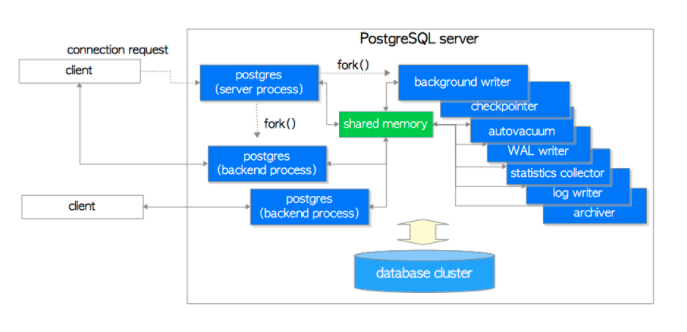
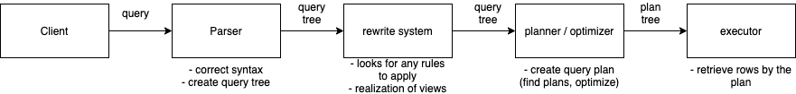

# Overview of PostgreSQL Internals

- 의문
- Connection pool
- The Path of a Query
  - Connection
  - Parser
  - Rewriter
  - Planner / Optimizer
  - Executor

## 참고

- [Overview of PostgreSQL Internals](https://www.postgresql.org/docs/13/query-path.html)

## 의문

- *왜 tree의 형태롤 파싱의 결과물을 제공 하는 것일까?*

## Connection pool

### PostgreSQL architecture

- 개요
  - 기본적으로 PostgreSQL에서는 클라이언트와의 연결마다 하나의 process를 fork함
- 장점
  - fault tolerant
    - 일부의 실패로 인한 데이터베이스의 크러시를 막음
  - 현대 Lunix system에서는 process fork와 thread 생성의 오버헤드 차이가 기존보다 많이 차가 좁혀짐
  - 지금부터 multithreaded 아키텍처로 가려면 많은 코드를 다시 작성해야 함

### Connection pool

- 개요
  - 라이브러리에서 물리적 커넥션풀을 유지하고, 그러한 풀을 사용해서 데이터베이스에 접근하는 방식
    - PostgreSQL에서는 새로 forking하지 않음
- 단점
  - 결국 풀의 사이즈가 작아도, 많은 서버 프로세스가 남게되고, 그것들 사이의 컨텍스트스위칭은 비쌈
    - *이 서버는 데이터베이스 서버? 아니면, 웹 서버?*
  - 풀링 서포트는 라이브러리와 언어마다 다양해서, 잘못된 풀은 모든 자원을 소진시켜버림
  - 중앙화된 access control 불가
    - client-specific access limit같은것을 설정 불가

### Connection pooler

- 개요
  - 데이터베이스와 클라이언트 사이에있는 미들웨어로, library에 의한 connection pool의 단점을 해결하기 위해 등장
- 장점
  - PostgreSQL에 최적화 되어있음
  - 중앙화된 access control 가능
  - client-side pool의 기능 뿐 아니라, 여러가지 더 많은 기능 수행 가능
- 단점
  - latency
    - DB서버와 같은 호스트에 설치할 경우 거의 무시가능
    - TCP socket으로 통신 localhost bounding
  - SPoF(Single Point of Failure)
    - cluster사용이 강제됨
    - 추가적인 복잡도
  - 추가적인 비용 발생
  - 서로다른 모듈에서 접근할 경우, 보안적인 취약점 생길 수 있음
    - pool에 반환하기 전에 clean작업이 필요
  - 인증 역할이 DBMS에서 connection pooler로 넘어감
  - 결국 유지보수 해야함
    - 보안 패치, 업그레이드

## The Path of a Query

- ① \[connection\]
  - application program에서 PostgreSQL 서버로의 커넥션 확립
  - application program은 서버로 쿼리를 전달하고, 서버로 부터 받은 결과를 수신
- ② \[parser stage\]
  - correct syntax
  - query tree 생성
- ③ \[rewrite system\]
  - rewrite system이 parser stage에서 생성된 query tree를 받고, query tree에 *적용할 룰(system catalogs)을 찾음*
    - *구체적으로 그 룰이라는게 무엇인지?*
  - rule body에 주어진 변환을 수행
- ④ \[planner/optimizer\]
  - rewritten query tree를 받고, executor의 input이 되는 query plan을 생성
    - 방법
      - 같은 결과에 도달하는 모든 경로를 생성(e.g 일반적인 sequential scan, index scan)
      - 각 path에 대한 실행 cost가 추정되고, 가장 효율적인 path가 선택됨
- ⑤ \[executor\]
  - recursive하게 plan tree를 탐색하여, plan에 작성된 대로 row를 가져옴
  - relation을 scanning, sort, join 하는 동안, storage system을 사용함
  - 생성된 row들을 반환함

### ① Connection

- 개요
  - 클라이언트 / 서버 모델
    - process per user
  - master process(이름: postgres)가 존재
    - 특정 TCP/IP 포트에서 connection을 listen하고 있음
    - 커넥션 요청이 오면 master process가 새 server process를 spawn
- 특징
  - 서버 프로세스
    - concurrent data access 동안, semaphore, shared memory 등을 사용하여 서버 프로세스끼리 커뮤니케이션 함
  - 클라이언트 프로세스
    - PostgreSQL protocol을 이해하면 어떠한 프로그램이라도 가능
    - c언어 라이브러리 `libpq` 기반이 많음
      - JDBC 드라이버는 예외(다른 방식으로 프로토콜을 구현)
- 커넥션 후
  - plain text로 쿼리를 전송
  - 클라이언트에서 parsing이 전혀 없음

### ② Parser

- 구성
  - parser가 생성
    - Unix 툴인 bison과 flex를 사용해서 `gram.y`, `scan.l`에 정의된 파서 생성
  - transformation process
    - 파서에 의해서 반환되는 데이터 구조에 수정, 강화를 함
- Process
  - Parser Process
    - 개요
      - query string이 valid syntax인지 체크
      - parse tree를 제작
        - parser, lexer는 bison과 flex로 구현됨
          - bison과 flex는 임의의 파일 포멧을 파싱할 수 있는 unix utility
    - 구성
      - lexer
        - `scan.l`에 정의되어있으며, identifiers(SQL key words)를 파악하는 임무를 맡음
          - flex를 사용해서 `scan.c`로 변환
        - 각 keyword나 identifier가 발견되면, token이 생성되어 parser에게 넘어감
      - parser
        - `gram.y`에 정의되어 있고, grammer rule과 action(rule is fired될 때 동작)의 집합으로 구성됨
          - bison을 사용해서 `gram.c`로 변환
        - action의 코드는 parse tree를 구성하는데에 사용됨
    - 결과물
      - parse tree
  - Transformation Process
    - query tree의 생성
      - parse tree에 semantic interpretation이 결합된 것
        - 어떤 테이블, 함수, 연산자가 참조되어야 하는지 해석(의미론적 해석)
        - 이러한 정보를 포함하는 데이터 구조가 **query tree**
    - raw parsing과 semantic analysis를 분리하는 이유
      - *system catalog lookups은 하나의 transaction에서만 시행될 수 있고, query string을 받자마자 transaction을 시작하고 싶지 않음*
        - *이게 무슨 말일까*
    - transformation process에서 생성된 query tree는 raw parse tree와 대개 유사하나, 자세히는 많은 차이가 존재
      - parse tree의 `FuncCall`노드 -> query tree의 `FuncExpr` or `Aggref`노드로 변환
      - query tree에 칼럼과 식 결과의 actual data types 정보가 query tree로 추가됨

### ③ Rewriter(Rule system)

- rule system
  - views, ambiguous view update의 스펙지원
  - **query rewriting**
    - input, output은 query tree

### ④ Planner / Optimizer

- 개요
  - query tree로부터 최적의 execution plan을 찾아주는 역할
    - 같은 결과를 생성하더라도, 다양한 방법으로 실행될 수 있음
  - computationally feasible한 경우에, query optimizer는 가능한 실행 플랜을 각각 검사하고, 결과적으로 가장 빠른 execution plan을 선택
    - 사실 이 과정 조차도, time, memory space를 사용하게 됨. 특히 많은 수의 join operation이 포함되는 쿼리에서 더더욱 그런 경향이 있음
    - PostgreSQL에서는 reasonable query plan(best는 아님)을 reasonable amount of time에 찾기 위해서 Genetic Query Optimizer를 사용(query속의 join의 숫자가 threshhold를 넘어섰을 때)
  - Planner's search procedure
    - path라는 데이터 구조를 기반으로 planner의 search procedure가 이루어짐
  - 가장 효율 좋은 path가 선택된 뒤에, 최종 plan tree가 만들어져서 executor로 보내짐

#### 구체적인 Plan 생성 방법

- 개요
  - planner/optimizer는 쿼리에서 사용되는 개별 relation(table)을 스캐닝하기 위한 plan들을 생성
  - 각 relation에 사용가능한 indexes에 기반하여 가능한 plans가 결정됨
    - sequential scan plan은 항상 가능한 plan에 포함
    - *인덱스 관련 부분은 이해가 잘안되네*
      - https://www.postgresql.org/docs/13/planner-optimizer.html
  - JOIN의 경우
    - JOIN의 종류
      - nested loop join
        - (index가 없는 경우)`O(n^2)`인 가장 쉬운 방법
        - right relation이 인덱싱 되어있으면 효율적인 방법으로 바뀜
          - left relation의 current row를 키로 활용 가능
      - merge join
        - join 전에, 각 relation을 join attribute(`JOIN on ...`)을 가지고 소팅해둠
        - 그리고 두 relation을 동시에 스캐닝하면서, 서로 매칭되는 row를 join row로 결합
          - two pointers같은 느낌인듯
        - 처음 소팅의 경우, explicit sort step을 사용하거나, join key의 index를 사용해서 올바른 순서대로 scanning하는것도 가능
      - hash join
        - 오른쪽 relation이 scan되면서, 이것의 join 속성을 해시키로 만든 hash table을 생성
        - 그 다음으로, 왼쪽 relation이 scan되고, 모든 행의 적당한 값이 해시키로 사용되어 join을 행함
    - When the query involves more than two relations
      - the final result must be built up by a tree of join steps, each with two inputs
      - The planner examines different possible join sequences to find the cheapest one
    - 쿼리가 `geqo_threshold`보다 적은 relation(join)을 사용할 경우
    - 쿼리가 `geqo_threshold`보다 많은 relation(join)을 사용할 경우
- finished plan tree
  - 구성
    - nodes
      - sequential or index scans of the base relations
      - nested-loop, merge, hash join nodes
      - auxiliary steps
        - sort nodes or aggregate-function calculation nodes
    - node의 기능
      - selection
        - 특정 boolean 조건을 만족하지 못하면 행을 버리는 기능
      - projection
        - *scalar expression의 평가*

### ⑤ \[WIP\]Executor

https://www.postgresql.org/docs/12/executor.html

- 개요
  - planner, optimizer가 생성한 plan을 받고, 재귀적으로 필요한 rows의 집합을 추출하기 위해서 작업
    - *demand-pull pipeline mechanism*
      - plan node가 호출되면, one more row를 조달하던지, delivering rows 작업이 끝났다고 report해야 함
- 구체적인 설명(예시)
  - top node가 `MergeJoin` node라고 가정하면, merge가 실행되기 전에, 두 rows가 fetched 되어야 함
