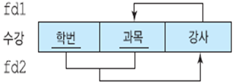

# 데이터베이스 설계 및 정규화 기본

참고 :[데이터베이스 설계 및 정규화](http://brown.ezphp.net/125)

데이터 베이스 설계 과정

1. 요구분석
2. 개념적 설계: ER모델
3. 논리적 설계: ER을 테이블(Relation) 형태로 매핑 + 이상(Anomaly)회피를 위한 정규화
4. 물리적 설계

데이터의 손실 없이 중복도만 감소 시키는 것을 정규화 라고 한다.

정규화는 성능과 이상증상의 제거를 서로 고려하여 적당한 선에서 결정. 보통은 3NF, BCNF

## 좋은 강좌

- [High Performance MySQL: 3rd Edition](https://ridibooks.com/v2/Detail?id=2409002862&_s=search&_q=High%20Performance%20MySQL)

## Functional Dependence: 함수적 종속성

### 결정자(Determinant)와 종속자(Dependent)

- 주어진 릴레이션에서 다른 애트리뷰트를 고유하게 결정 짓는 하나 또는 하나 이상의 애트리뷰트
  - A -> B (A는 B의 결정자)
  - A는 값 각각에 대해서 시간에 관계없이 항상 애트리뷰트 B의 값 하나만 연관이 되어있음
  - e.g `학번 -> 이름`, `학번 -> 학년`, `학번 -> 학과` 즉, `학번 -> (이름, 학년, 학과)`

## Anomaly: 이상

- 삽입이상
  - 데이터를 삽입할 때 원하지 않는 값도 삽입
- 삭제이상
  - 관계에서 한 튜플을 삭제할때 관계없는 값들도 함꼐 삭제
- 갱신이상
  - 관계에서 튜플의 속성을 갱신할 때 일부의 정보만 갱신하여 모순이 발생
  - 그러므로 하나의 값이 바뀌면 기존의 모든 튜플의 그 속성값도 다 바꿔야 한다

## 정규형 case

### 1NF

- Primary Key가 존재 &
- 테이블의 원자화
  - 각각의 cell에는 데이터의 집합이 들어갈 수 없다. 중복도 불가능

### 2NF

- 1NF &
- 부분종속이 존재하지 않음
  - 주 키(Primary Key)외의 다른 속성들은 키에 종속적이어야 한다.
  - 키의 일부 속성에 의해 결정되는 속성 들이 있으면 안된다.

### 3NF

- 2NF &
- 이행종속이 존재하지 않음
  - A->B->C를 결정하는 경우 A->C를 결정되므로 C는 A에 이행적 함수 종속성 이라고 함

### BCNF

- **결정자는 반드시 후보키** 여야 한다.
  - 키가 아닌 결정자는 존재하지 않는다.
  - 1NF에서 직접 만들 수 있음(결정자는 반드시 후보키 원리)

### 3NF -> BCNF

위는 3NF를 만족하지만 BCNF는 만족하지 않는 예이다.

후보키가 아닌 속성이 다른 속성을 결정하기 때문이다.

### 분해법과 합성법

책 내용에 있음.

참조

1. [기본키,대체키,후보키,슈퍼키](http://blog.daum.net/itbaeum/14)

## Key의 종류

결정자 중에서 모든 속성을 결정지을 수 있는 경우 Key라고 한다.

### 1. 후보키(CK)

한 테이블에서 유일성(o) + 최소성(o)인 키

### 2. 기본키(PK)

후보키 중에서 실제로 선정되어 사용되는 키

### 3. 대체키(AK)

후보키중 기본키로 선정되지 않은 나머지 키들

### 4. 슈퍼키(Super Key, Composite Key)

- 유일성(o) 최소성(?)
- 한 릴레이션에서 어떠한 열도 후보키가 없을 때 두 개 이상의 열을 복합(연결)할 경우 유일성을 만족하여 후보키가 되는 키를 의미
- 더 이상 줄일 수 없는 속성의 중복이 없는 슈퍼 키는 후보 키 이기도 하다.

### 5. 외래키(FK, Foreign Key)

한 테이블에 속한 속성, 외래키가 다른 참조 테이블의 PK인 경우 그 키를 FK라고 함
