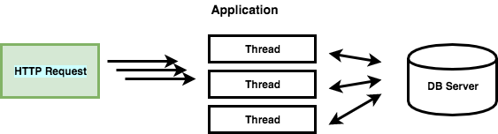
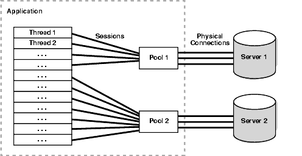

# DB Connection Pool에 관하여

## 데이터베이스 사용의 병목

보통 웹 서비스에서 데이터베이스를 사용하는 경우 다음과 같은 절차를 거친다.

1. DB서버 접속을 위해서 라이브러리를 로드한다
2. host, db이름, username, password등의 데이터를 입력하고 `getConnection()`을 통하여 DBConnection 객체를 얻는다.
3. 받은 객체를 이용해서 query를 행한다.
4. 그 결과로 받은 데이터를 처리한다.
5. 처리가 완료되면 처리에 사용된 리소스들을 `close`하여 반환한다.

위에서 가장 많은 처리 시간을 차지하는 부분은 처음 웹 서버에서 물리적으로 DB서버에 최초로 연결되어 Connection객체를 생성하는 부분이다(2)

일반적으로 웹 애플리케이션은 HTTP 요청에 따라 스레드를 생성하게 되고(nodejs는 단일 스레드) 대부분의 비즈니스 로직은 DB서버로 부터 데이터를 얻게 된다. 모든 요청에 대해서 DB접속을 위한 Driver를 로드하고 Connection 객체를 생성하여 연결하면, 물리적으로 DB 서버에 지속적으로 접근해야 한다.

여기서, DB Connection 객체를 생성하는 부분에 대한 비용과 대기 시간을 줄이고, 네트워크 연결에 대한 부담을 줄일 수 있는 방법이 바로 DBCP(Database Connection Pool)를 이용하는 것이다.

## DBCP(DataBase Connection Pool)

### 역할

- WAS가 실행되면서 미리 일정량의 DB Connection 객체를 생성하고 `Pool` 이라는 공간에 저장해 둔다.
- HTTP 요청에 따라 필요할 때 Pool에서 Connection 객체를 가져다 쓰고 반환한다.
- 이와 같은 방식으로 HTTP 요청 마다 DB Driver를 로드하고 물리적인 연결에 의한 Connection 객체를 생성하는 비용이 줄어들게 된다.

DBCP는 라이브러리를 이용해서 손쉽게 관리 가능

|이름|내용|
|---|---|
|maxActive| **동시에 사용할 수 있는 최대 커넥션** 개수|
|maxIdle|Connection Pool에 반납할 때 최대로 유지될 수 있는 커넥션 개수|
|minIdle|최소한으로 유지할 커넥션 개수|
|initialSize|최초로 getConnection() 메서드를 통해 커넥션 풀에 채워 넣을 커넥션 개수|
