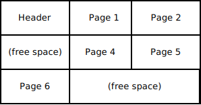

# 데이터베이스의 원리

- 의문
- How a SQL database works
  - Relation
  - Row
  - Heap
  - Index
  - Table

## 의문

- Heap이 row를 저장하는 공간이라면, table의 개념은 물리적으로 어떻게 나누는 것인가?
  - 1개의 heap, 다수의 indexes
- *복합 키 index의 경우에는 어떤식으로 B-tree가 구성되는가?*
  - 각 깊이 level이 하나의 복합키 중 순서대로의 index에 대응하는가?
- *애초에 index를 구현할 때, b-tree의 노드와 데이터베이스의 하나의 row가 어떤 방식으로 대응되는가?*

## How a SQL database works

### The relation

- 개요
  - tuple의 집합
    - 하나의 item에 대한 자세한 정보를 갖음(row)
    - relation속의 tuple form은 각 tuple마다 완전히 같음
  - 각 필드(column)들은 relation level에서 접근 가능
- 구현
  - Array(heap : 데이터 저장고)와 Associative array(b-tree : index)타입의 일반화
- 특징
  - 필드 기반으로 여러가지 연산이 가능
  - index의 존재
- 참고
  - RDB의 relation 구현 기반
    - **heap file(record)**
    - **b-trees(index)**
  - RDB는 relation의 완벽한 구현체가 아님
    - relation -> table
      - table에서는 중복 허용
    - tuple -> row

### Row

row의 예시

- row의 구성
  - header
    - total length of the row
    - *transaction에 관한 정보(concurrency)*
  - row values
    - 고정길이 값
      - float, char
    - 가변길이 값
      - strings, binary blobs, JSON, XML, ...
        - terminator 문자(NULL, ¥0)를 사용
        - leading length indicator 사용

### Heap

**RDB에서 Heap의 예시**

heap은 무한정 크기가 증가할 수 있음

**RDB에서 Page의 예시**

많은 RDB에서는 하나의 row가 여러 page를 cross할 수 있도록 설계함

- 개요
  - row를 저장하는 공간(테이블 데이터의 메인 body를 저장)
  - page들로 구성
  - insert / delete / update에 강점
- page
  - 4~8킬로바이트의 row의 컬렉션
  - header가 얼마나 많은 rows가 들었는가에 대한 정보를 갖음
- RDB operation(insert / delete / update)
  - 개요
    - (insert)관련 페이지가 필요하면 disk로부터 memory로 읽혀지고, 수정되고 나서 다시 disk로 작성
  - page사용의 장점(vs 모든 행을 다 읽고 쓰는것 보다)
    - *① IO buffering에 매우 적합하여 퍼포먼스 이득이 존재, 캐싱 가능*
      - *정확히 어떤 메커니즘?*
    - ② page접근이 빠름(page size * page number + 1)
    - ③ fragmentation을 page단위로 수행 가능
      - row가 삭제되면 듬성듬성 gap이 생김. *이를 페이지 내에서 빈 공간을 맨 뒤로 보내주는 연산(전체가 아니므로 빠르게 수행 가능?)*
      - page자체가 비어버리면, 맨 뒤에 있던 페이지를 해당 빈 공간에 넣어줌

### Index

b-tree의 예시

- 구현
  - B-tree 혹은 그의 아류를 사용
    - 각 노드는 ordered list를 갖음
    - 리스트의 각 element는 값이나 다른 노드의 reference
    - 한 노드는 하나의 db의 page의 크기와 같음
      - ordered list는 몇백 / 몇천개의 원소를 갖음
      - b-tree가 페이지 마다 매우 조밀하고, 얗다는 것을 보장
      - 일반적으로 2, 3 level정도
  - B-tree의 연산
    - logarithmic complexity
- 왜 해시테이블을 사용하지 않는가?
  - ① hash table은 길이가 고정됨
    - 중간중간 공간이 많이 차면 rebalance가 필요함
  - ② 메모리를 상대적으로 sparse하게 사용함
    - 32비트 해시 테이블은 2GB 램을 사용
    - 해시의 75%가 차면 rebalance를 한다고 할 때, 적어도 500mb는 낭비되는 것
  - ③ 두 값 사이의 모든 값들을 원할 경우, 그에 따른 적절한 operation이 없음
    - hash는 순서 자체가 없기 때문
    - query optimiser가 직접 query를 실행해서 몇개의 row를 돌려줄지 알기 전까지는 가상적으로 예측하기 귀찮음

### Table

- 개요
  - 1개의 heap
  - 다수의 indexes
    - 각각의 entry에 대해서, 어떤 page에서 관련 행을 찾을 수 있는지 기록(`O(n)`)
