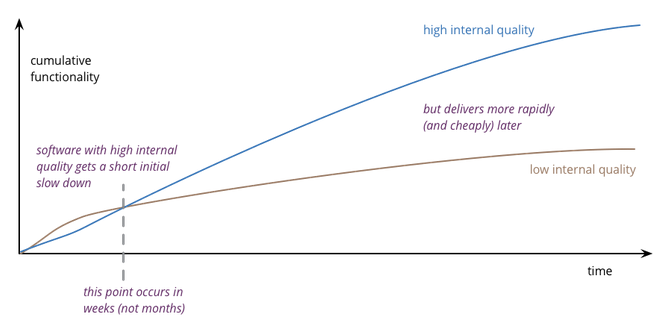

# Architecture

- 의문
- General
  - Architecture
  - Architect

## 의문

## General

### Architecture

Design stamina hypothesis

- 정의
  - ANSI/IEEE
    - 그것의 컴포넌트와 서로간의 관계와 환경과 그것의 디자인과 발전을 관리하는 원칙으로 이루어진 시스템의 근본적인 구조
  - 마틴 파울러
    - **겁나 중요한 것**
      - **프로젝트 관련 전문 개발자 끼리 공유하고 있는 지식** &
        - 해당 지식에는 모든 개발자들에 의해서 이해되는 컴포넌트와 인터페이스를 포함함
        - group consensus가 중요함
        - 따라서, 위의 정의에 의하면, 프로그래밍 언어도 architecture에 속한다고 볼 수 있음
        - 무엇이 핵심인가?
          - **개발자들이 생각하는 핵심이 아키텍처에 속함**
            - 따라서, '무엇을 개발하려는지, 그 개발하려는 것에서 무엇이 핵심인지'에 따라서 아키텍처는 달라짐
          - 핵심을 코드로 녹임
          - 아키텍처에서는 핵심 가치를 위한 결정들이 매우 중요함
      - **결정된 선택은 바꾸기 어려움**
        - 그래서 미리 잘 결정하는 것이 중요함
        - e.g)
          - DB 스키마를 가장 먼저 작성하는 이유(바꾸기 힘들어서)
          - DB 스키마를 쉽게 바꿀 수 있도록 조치하면, DB schema는 더이상 아키텍처적인 요소라고 부르지 않음
        - irreversibility(비가역성)이 그 원인
    - 특징
      - **전문 개발자들은 시스템 디자인에 대한 이해를 공유함**
        - 아키텍처는 사회적 요소가 꽤나 많이 영향을 끼침
        - 그림을 그리는 것은 '표현'일 뿐
      - 아키텍처 디자인에 관한 결정은 일찍 정해져야 함
      - 결정은 바꾸기 매우 어려움
    - 왜 아키텍처는 중요한가?
      - **경제(economics)**
        - quality라는 것은 cost의 tradeoff이다
        - 하지만, 소프트웨어의 quality는 end user에게는 전혀 보이지 않음
        - 참고: 아키텍처와 quality
          - external
            - 엔드 유저와 직접적으로 관련이 있는 quality
              - **기능 추가**
          - internal
            - 엔드 유저에게 직접적으로 보이지 않음
              - **소프트웨어 아키텍처**
            - 장기적인 관점에서 중요
      - 아키텍처를 고려한 설계와 고려하지 않은 설계의 차이
        - 고려하지 않는다면, 새로운 기능을 추가하는데에 점점 힘들어 질 것
          - Design stamina hypothesis
          - **이것이 소프트웨어 아키텍처가 중요한 이유!**
        - 낮은 퀄리티의 소프트웨어는 시간을 계속해서 잡아먹기만 함
          - CI, CD를 도입하려는 이유
          - 결국 **경제적 관점** 에서 소프트웨어 아키텍처가 매우 중요함
            - craftmanship이 아니다!!!

### Architect

- 참고
  - [마틴 파울러 - Who Needs an Architect?](http://files.catwell.info/misc/mirror/2003-martin-fowler-who-needs-an-architect.pdf)
- 정의
  - 겁나 중요한 것을 다루는 사람
    - architecture = 겁나 중요한 것
- 역할
  - 프로젝트가 어떻게 흘러가는 지 큰그림 파악
    - 심각한 문제가 터지기 전에 미리 대응 착수
  - 협력
    - e.g)
      - 아침에, 개발자와 보틀넥이 되는 코드를 같이 프로그램함
      - 오후에, requirements 세션에 참가하여 개발 비용등에 관한 협의 비 기술적인 언어로 설명
  - 개발팀 멘토링
    - 개발팀 전체의 수준을 끌어올려, 복잡한 문제도 해결 가능하게 함
    - 아키텍트가 프로젝트에 대해서 내리는 의사 결정의 개수를 줄임
      - 아키텍트의 가치는 자신이 내리는 프로젝트에 대한 의사 결정에 반비례함
  - **소프트웨어 디자인에 있어서 irreversibility를 제거할 수 있는 방법을 찾아서 architecture를 제거 하는 것**
- 명언
  - Software is not limited by physics, like buildings are. It is limited by imagination, by design, by organization, In short, **it is limited by properties of people** , not by properties of the world. **"We have met the enemy, and he is us."**
