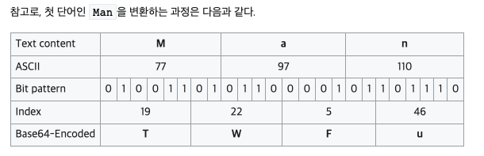

# ETC

- 의문
- General
  - LSP(Language Server Protocol)
  - UTF-8
  - Dry run
  - 타임존 도메인
  - API 작성시 클라이언트 서버 고려할 점

## 의문

## General

### LSP(Language Server Protocol)

에디터와 Language Server의 커뮤니케이션


리퀘스트와 리스폰스 예시(JSON-RPC)

```json
/* Request */
{
    "jsonrpc": "2.0",
    "id" : 1,
    "method": "textDocument/definition",
    "params": {
        "textDocument": {
            "uri": "file:///p%3A/mseng/VSCode/Playgrounds/cpp/use.cpp"
        },
        "position": {
            "line": 3,
            "character": 12
        }
    }
}

/* Response */
{
    "jsonrpc": "2.0",
    "id": 1,
    "result": {
        "uri": "file:///p%3A/mseng/VSCode/Playgrounds/cpp/provide.cpp",
        "range": {
            "start": {
                "line": 0,
                "character": 4
            },
            "end": {
                "line": 0,
                "character": 11
            }
        }
    }
}
```

- 배경
  - autocomplete, goto definition, hover documentation등을 구현하는데에 많은 노력이 필요함
  - 모든 코드 에디터마다 서로다른 API를 사용해서 해당 기능을 구현해왔음
- Language Server
  - 개요
    - Language분석기를 추상화해서 서버로 만들고, 해당 서버는 LSP(Language Server Protocol)라는 표준화된 프로토콜을 이용해서 IPC(Inter-Process Communication)를 할 수 있도록 함
  - 특징
    - Langauge Server를 다른 툴에서도 재사용 가능
  - Capabilities
    - 모든 Language Server가 모든 기능을 제공하는게 아니라서, 사용가능한 language feature의 집합을 제공
- Language Server Protocol
  - 개요
    - JSON-RPC를 이용

### UTF-8(Universal Coded Character Set + Transformation Format)

UTF-8 인코딩 방식


- 정의
  - 유니코드를 위한 가변 길이 문자 인코딩 방식 중 하나
- 특징
  - 유니코드 한 문자를 나타내기 위해서 1바이트에서 4바이트까지 사용
- 장점
  - ASCII인코딩이 UTF-8의 부분집합
  - 간단한 알고리즘을 통하여 UTF-8 문자열임을 확인 가능
    - 다른 인코딩에서 나타나는 바이트들이 올바른 UTF-8 문자열 일 가능성이 낮음
  - 모든 유니코드 표현 가능
  - 바이트 표현의 첫 바이트만 사용하여, 해당 바이트 표현의 길이를 결정할 수 있음
    - 부분 문자열을 얻는 과정이 매우 쉬움
  - 인코딩에 간단한 비트 연산만 사용
- 단점
  - 대부분의 UTF-8 문자열은 일반적으로 적당한 기존 인코딩으로 표현한 문자열보다 더 큼
    - 라틴 2바이트
    - 한중일, 표의문자들 3바이트

### Base64

Base64 example: "Man"



- 정의
  - 8비트 이진 데이터를 ASCII 영역의 문자들로만 이루어진 일련의 문자열로 바꾸는 인코딩 방식
- 특징
  - *원본보다 대략 4/3 정도 크기가 늘어남*
    - 왜지?

### Dry Run

- 정의
  - 실패의 리스크가 고의적으로 경감되는 테스팅 프로세스
- 예시
  - 실제 상황이 아니라 땅에서 비행기 조종사의 비상탈출 시스템을 가동해보기
  - 실제 배치잡을 동작시키기 전에, DB커밋은 없는 상태로 배치잡 돌려보기

### 타임존 도메인

- 타임존
  - 개요
    - 로컬 시간을 따르는 지역
    - 국가별로 각자의 고유한 타임존을 사용
      - 중국은 모든 영역이 하나의 타임존 사용해서, 서쪽지역은 오전10시에 해가 뜸
- GMT(Greenwich Mean Time)
  - 개요
    - 경도 0도에 위치한 그리니치 천문대 기준으로하는 태양 시간
    - 1972년 1월 1일까지 세계 표준시로 사용되었음
- UTC
  - 개요
    - 국제 원자시를 기준으로 다시 지정된 시간대(GMT를 대체하는 새로운 표준)
    - GMT와 거의 비슷함
- 오프셋
  - 개요
    - UTC와의 차이를 나타낸 것
    - e.g)
      - `UTC+09:00`
        - UTC의 기준시간보다 9시간이 빠르다
  - 특징
    - 특정 지역의 타임존을 단순히 오프셋이라고 지칭하기 어렵다
      - 서머 타임(DST - Daylight Saving Time)
        - 하절기에 표준시를 원래 시간보다 한 시간 앞당긴 시간으로 이용하는 것
        - 국가나 지역에 따라 다름
        - e.g)
          - PST(UTC-08:00), PDT(UTC-07:00)
      - 타임존은 가변이다
        - 정치적 이유로 변경 가능함
- 타임존1 : 오프셋N(서머타임 등 / 정치적 상황)
  - 한 지역의 타임존은 하나 혹은 그 이상의 오프셋을 가지며, 어느 시점에 어떤 오프셋을 기준시로 사용할지는 해당 지역의 정치/경제적 상황에 따라 계속해서 달라진다고 할 수 있음
  - "뉴욕의 타임존은 **현재** PST를 기준시로 사용하고 있어"(o)
    - "뉴욕의 타임존은 PST야"(x)
  - 따라서, 특정 지역의 타임존을 오프셋이 아니라, 지역명으로 지칭해야 함
- IANA time zone database(tzdata)
  - 타임존에 대한 역사적인 변경 내역을 모두 저장하고 있음
    - 전 세계 모든 지역의 표준시와 DST 변경 내역을 담고 있음
    - UNIX 시간(1970.01.01 00:00:00) 이후의 데이터의 정확도 보장
  - Area / Location 규칙 사용
    - e.g)
      - Asia/Seoul / Asia/Tokyo
        - 두 지역 모두 UTC+09:00을 표준시로 현재 사용하고 있지만, 실제 역사적인 변경 내역이 다르고, 다른 국가에 속해있기에 별도의 타임존으로 관리됨

자바 Instant 사용법

- 타임스탬프
  - UTC기준으로 1970년1월1일0시0분0초를 숫자0으로 정하고, 그로부터 경과된 시간을 양수 또는 음수로 표현
- `Instant`
  - 개요
    - 시간을 타임스탬프로 다루기 위해서 사용되는 클래스

타임스탬프를 Instant로 나타내기

```java
Instant epoch = Instant.EPOCH; // Instant.ofEpochSecond(0); 와 동일
System.out.println("epoch = " + epoch);
// epoch = 1970-01-01T00:00:00Z

Instant epochInFuture = Instant.ofEpochSecond(1_000_000_000);
System.out.println("epochInFuture = " + epochInFuture);
// epochInFuture = 2001-09-09T01:46:40Z

Instant epochInPast = Instant.ofEpochSecond(-1_000_000_000);
System.out.println("epochInPast = " + epochInPast);
// epochInPast = 1938-04-24T22:13:20Z
```

현재 시간의 타임스탬프 값 구하기

```java
Instant current = Instant.now();
System.out.println("Current Instant = "+ current);
// Current Instant = 2017-12-22T08:30:18.870Z

long epochSecond = current.getEpochSecond();
System.out.println("Current Timestamp in seconds = " + epochSecond);
// Current Timestamp in seconds = 1513931481

long epochMilli = current.toEpochMilli();
System.out.println("Current Timestamp in milli seconds = " + epochMilli);
// Current Timestamp in milli seconds = 1513931418870
```

Instant와 ZonedDateTime 간 상호 변환하기

```java
ZonedDateTime zdtSeoul = Year.of(2002).atMonth(6).atDay(18).atTime(20, 30).atZone(ZoneId.of("Asia/Seoul"));
System.out.println("Time in Seoul = " + zdtSeoul);
// Time in Seoul = 2002-06-18T20:30+09:00[Asia/Seoul]

Instant instant = zdtSeoul.toInstant();
System.out.println("Instant = " + instant + ", Timestamp = " + instant.getEpochSecond());
// Instant = 2002-06-18T11:30:00Z, Timestamp = 1024399800

ZonedDateTime zdtVancouver = instant.atZone(ZoneId.of("America/Vancouver"));
// ZonedDateTime zdtVancouver = ZonedDateTime.ofInstant(instant, ZoneId.of("America/Vancouver")); 와 동일
System.out.println("Tine in Vancouver = " + zdtVancouver);
// Tine in Vancouver = 2002-06-18T04:30-07:00[America/Vancouver]
```

### API 작성시 클라이언트 서버 고려할 점

- 질문
  - 서버에서는 클라이언트의 렌더 순서에 맞게 데이터를 소팅해서 전달해주거나, 해줘야 하는가?
- 나름대로의 해답
  - 서버에서 클라이언트로 데이터를 전달할 떄
    - **정책이나 비즈니스로직과 관련된 부분은 단순한 소팅이나, 데이터 포함 제거와 같은 부분을 반영해줘야 한다**
      - e.g) 부정리뷰의 태그들을 보여주는 순서(리뷰 태그가 생성, 제거될 수 있으므로), 추천 데이터 보여주는 순서 등
    - **단순 디자인과 같은 보다 뷰에관련된 부분은 클라이언트가 알아서 한다.**
      - e.g) 별점의 소숫점 몇째짜리까지 데이터를 내려줄것인지, 섹션의 보여주는 순서 등
        - 여기서 만약, 섹션의 보여주는 순서가 디자인적인 부분보다는 비즈니스로직과 관련된 것이라면 그것은 서버에서 담당한다.
    - **만약, 클라이언트가 네이티브앱같이 서버보다 업데이트 라이프사이클이 훨씬 느리다면, 그럴 경우에는 어쩔 수 없이 서버에서 다자인 순서까지 고려한 데이터 response를 생성해줄 때도 있음**
