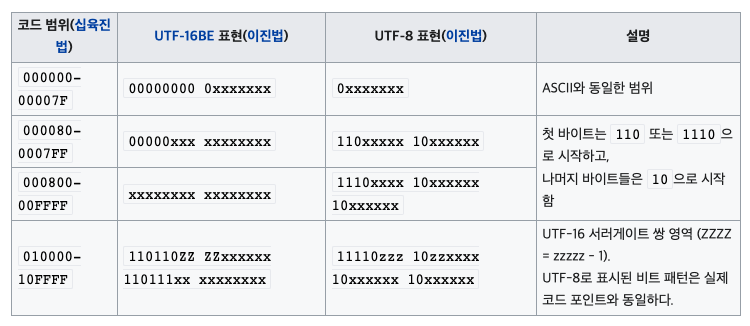

# ETC

- 의문
- General
  - LSP(Language Server Protocol)
  - UTF-8

## 의문

## General

### LSP(Language Server Protocol)

에디터와 Language Server의 커뮤니케이션


리퀘스트와 리스폰스 예시(JSON-RPC)

```json
/* Request */
{
    "jsonrpc": "2.0",
    "id" : 1,
    "method": "textDocument/definition",
    "params": {
        "textDocument": {
            "uri": "file:///p%3A/mseng/VSCode/Playgrounds/cpp/use.cpp"
        },
        "position": {
            "line": 3,
            "character": 12
        }
    }
}

/* Response */
{
    "jsonrpc": "2.0",
    "id": 1,
    "result": {
        "uri": "file:///p%3A/mseng/VSCode/Playgrounds/cpp/provide.cpp",
        "range": {
            "start": {
                "line": 0,
                "character": 4
            },
            "end": {
                "line": 0,
                "character": 11
            }
        }
    }
}
```

- 배경
  - autocomplete, goto definition, hover documentation등을 구현하는데에 많은 노력이 필요함
  - 모든 코드 에디터마다 서로다른 API를 사용해서 해당 기능을 구현해왔음
- Language Server
  - 개요
    - Language분석기를 추상화해서 서버로 만들고, 해당 서버는 LSP(Language Server Protocol)라는 표준화된 프로토콜을 이용해서 IPC(Inter-Process Communication)를 할 수 있도록 함
  - 특징
    - Langauge Server를 다른 툴에서도 재사용 가능
  - Capabilities
    - 모든 Language Server가 모든 기능을 제공하는게 아니라서, 사용가능한 language feature의 집합을 제공
- Language Server Protocol
  - 개요
    - JSON-RPC를 이용

### UTF-8(Universal Coded Character Set + Transformation Format)

UTF-8 인코딩 방식



- 정의
  - 유니코드를 위한 가변 길이 문자 인코딩 방식 중 하나
- 특징
  - 유니코드 한 문자를 나타내기 위해서 1바이트에서 4바이트까지 사용
- 장점
  - ASCII인코딩이 UTF-8의 부분집합
  - 간단한 알고리즘을 통하여 UTF-8 문자열임을 확인 가능
    - 다른 인코딩에서 나타나는 바이트들이 올바른 UTF-8 문자열 일 가능성이 낮음
  - 모든 유니코드 표현 가능
  - 바이트 표현의 첫 바이트만 사용하여, 해당 바이트 표현의 길이를 결정할 수 있음
    - 부분 문자열을 얻는 과정이 매우 쉬움
  - 인코딩에 간단한 비트 연산만 사용
- 단점
  - 대부분의 UTF-8 문자열은 일반적으로 적당한 기존 인코딩으로 표현한 문자열보다 더 큼
    - 라틴 2바이트
    - 한중일, 표의문자들 3바이트

### Base64

Base64 example: "Man"


- 정의
  - 8비트 이진 데이터를 ASCII 영역의 문자들로만 이루어진 일련의 문자열로 바꾸는 인코딩 방식
- 특징
  - *원본보다 대략 4/3 정도 크기가 늘어남*
    - 왜지?
