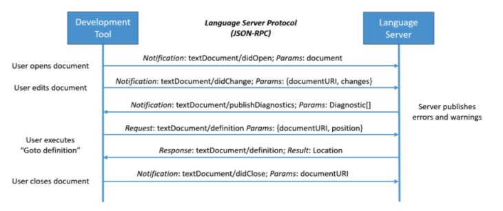

# ETC

- 의문
- General
  - LSP(Language Server Protocol)

## 의문

## General

### LSP(Language Server Protocol)

에디터와 Language Server의 커뮤니케이션



리퀘스트와 리스폰스 예시(JSON-RPC)

```json
/* Request */
{
    "jsonrpc": "2.0",
    "id" : 1,
    "method": "textDocument/definition",
    "params": {
        "textDocument": {
            "uri": "file:///p%3A/mseng/VSCode/Playgrounds/cpp/use.cpp"
        },
        "position": {
            "line": 3,
            "character": 12
        }
    }
}

/* Response */
{
    "jsonrpc": "2.0",
    "id": 1,
    "result": {
        "uri": "file:///p%3A/mseng/VSCode/Playgrounds/cpp/provide.cpp",
        "range": {
            "start": {
                "line": 0,
                "character": 4
            },
            "end": {
                "line": 0,
                "character": 11
            }
        }
    }
}
```

- 배경
  - autocomplete, goto definition, hover documentation등을 구현하는데에 많은 노력이 필요함
  - 모든 코드 에디터마다 서로다른 API를 사용해서 해당 기능을 구현해왔음
- Language Server
  - 개요
    - Language분석기를 추상화해서 서버로 만들고, 해당 서버는 LSP(Language Server Protocol)라는 표준화된 프로토콜을 이용해서 IPC(Inter-Process Communication)를 할 수 있도록 함
  - 특징
    - Langauge Server를 다른 툴에서도 재사용 가능
  - Capabilities
    - 모든 Language Server가 모든 기능을 제공하는게 아니라서, 사용가능한 language feature의 집합을 제공
- Language Server Protocol
  - 개요
    - JSON-RPC를 이용
