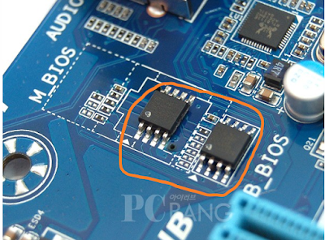

# 하드웨어 용어 모음집

- 의문
- General
  - Bus
  - Hard-disk
  - ROM
  - RAID
- GPU
  - MIG

## 의문

## General

### Bus

- 정의
  - 컴퓨터나 컴퓨터들 사이에서 데이터를 전달하는 커뮤니케이션 시스템
    - wire, optical fiber 부터, software나 communication protocol을 포함
  - 초기 컴퓨터 버스는, 다수의 하드웨어 연결을 갖는 parallel electrical wires 였으나, 지금은 하나의 parallel electrical bus로서 논리적으로 같은 기능을 수행하는 물리적인 처리기 혹은 처리 방식을 말함
- 종류
  - PCI(Peripheral Component Interconnect) 버스
    - 정의
      - 컴퓨터 메인보드에 주변 장치를 장착하는 데 쓰이는 컴퓨터 버스의 일종
    - 특징
      - 비트폭
        - 32 or 64
      - 속도
        - 133 MB/s
        - 266 MB/s
        - 533 MB/s
      - 스타일
        - 병렬
  - PCIe
    - 정의
      - 입출력을 위한 직렬 구조의 인터페이스이며 인텔 주도하에 만들어짐
    - 특징
      - PCI를 대체하기 위해서 개발됨
- Bus의 중요성
  - 그래픽 메모리 용량이 부족할 경우 PCIe 인터페이스 -> CPU -> 메인보드의 시스템 버스 -> 메인 메모리까지 거쳐서 부족한 그래픽 메모리 용량을 메인 메모리의 여유 공간에 잠시 할당하게 되는데, 그래픽 메모리에만 머물러야 할 데이터가 메인 메모리까지 왔다갔다할 일이 많아지다보니 PCIe 대역폭의 의존도가 높아져 성능이 크게 좌우될 수 있다.

### Hard-disk

하드웨어의 모습 및 구성

플래터

섹터

트랙

액츄에이터

실린더

- 구성
  - Flatter
    - 정의
      - 데이터를 저장하는 장소
    - 특징
      - 위 아래, 둘다 저장 가능(그래서 Actuator도 위 아래로 달려있음)
    - 구성
      - Sector
        - 디스크의 데이터 저장 최소 단위 0.5KB(일반적으로)
      - Track
        - 플래터내 반지름이 같은 섹터들
          - 헤드가 지나치는 길이라 트랙이라 부르는 것
      - Cylinder
        - 하드 디스크내에 존재하는 모든 플래터의 같은 반지름의 트랙들의 집합
  - Actuator
    - 정의
      - Flatter에 있는 데이터를 읽고, Flatter에 데이터를 쓰기위한 장치
    - 구성
      - Head
      - Arm
  - Spindle
    - 정의
      - Flatter를 회전시키는 장치
    - 구성
      - 스핀들 모터
    - 특징
      - 스핀들 모터가 플래터를 돌리는데, 계속해서 플래터를 돌림
      - 액추에이터의 헤드가 필요한 정보가 있는 섹터가 지나가려는 순간 순식간에 해당 섹터에서 정보를 빼감
      - 액추에이터의 헤드는 해당 트랙에 원하는 정보가 없으면 다른 트랙으로 수직으로 이동
    - 성능
      - RPM(Revolutions Per Minute - 분당 회전률)
        - 높을 수록 하드디스크 내용을 읽고 쓰는게 빠름
- 데이터 저장 방식
  - 전제
    - 디스크는 현재 위치에서 순차적으로 근처에 데이터를 저장한다
  - 방식
    - 첫번째 플래터 위편 섹터에 데이터 채움
    - 첫번째 플래터 아래편 섹터에 데이터를 채움
    - 두번째 플래터 위편 섹터에 데이터 채움
    - 두번째 플래터 아래편 섹터에 데이터를 채움
    - ...
    - 모든 높이의 플래터를 다 채우고나면 실린더를 회전시켜서 다음 위치로 이동

### ROM

ROM의 예시

- 정의
  - 메안보드에 부착돼 있는, 오직 읽기만 가능한 메모리(메모리임)
- 특징
  - M_BIOS, B_BIOS 메인 바이오스가 저장된 롬, 백업 바이오스가 저장된 롬

### RAID(Redundant Array of Inexpensive Disks)

- 정의
  - 다수의 물리적 디스크 드라이브 컴포넌트를 하나 혹은 더 많은 논리적인 단위로 결합하는 데이터 저장 가상화 기술
    - 하드웨어 적인 방법
      - 운영 체제에 이 디스크가 하나의 디스크 처럼 보이게 함
    - 소프트웨어 적인 방법
      - 운영체제 안에서 구현되며, 사용자에게 하나의 디스크인것 처럼 보이게 함
- 목적
  - 데이터 중복화(redundancy)
    - reliability 향상
  - 성능 향상
- 특징
  - 데이터 분배 방식은 여러가지가 있고, 각 방법은 RAID level 이라고 불림
    - level은 data redundancy와 performance level을 어떻게 설정하느냐에 따라서 갈림
  - 많은 RAID level은 `parity`라는 error protection scheme을 채용
- RAID0
  - Striping
    - 여러 개의 멤버 하드디스크를 병렬로 배치하여 거대한 하나의 디스크처럼 사용
  - 특징
    - 데이터 입출력이 각 멤버 디스크에 공평하게 분배
    - Performance
    - 개인 / 소규모 서버에서 많이 사용
- RAID1
  - Mirroring
    - 각 멤버 디스크에 같은 데이터를 중복 기록
  - 특징
    - 멤버 디스크 중 하나만 살아남으면 데이터는 보존(복원은 1:1 복사)
    - Availability
      - 백업이 아님
    - 대규모 서버에서 많이 사용

## GPU

### GPGPU(General-Purpose computing on Graphics Processing Units)

CPU vs GPU - 구조적 관점에서

- 정의
  - GPU를 CPU가 맡았던 연산에 사용해 연산 속도를 향상 시키는 기술
- CPU vs GPU
  - CPU
    - 큰 코어를 소수 집적하라
  - GPU
    - GPU 단독으로는 어떤 작업도 처리할 수 없음
      - GPU를 제어하는 것은 CPU의 역할
    - 가능한 많은 작은 코어를 집적하라
- GPGPU의 고려사항
  - CPU 쪽에서 GPU 쪽으로 데이터를 전송하는 작업의 오버헤드
    - GPU자체의 계산이 아무리 빨라도, GPU로 데이터를 보내고 받는 동안 IO 시간 소모가 클 수 있음
    - CPU와 GPU 사이에 PCI-E를 이용해서 통신할 경우, 이 대역폭이 VGA의 로컬 메모리 대역폭(단위 시간당 데이터 전송 속도)보다 아직까지 부족하고, CPU에 물려있는 메인 메모리에 비해서도 넉넉하지 못함
    - CPU와 GPU가 물리적으로 멀리 떨어져 있으므로, 레이턴시의 문제도 발생
      - 따라서, PCI-E를 통해서 데이터가 왔다갔다 하는 경우 성능을 다 까먹음
      - 그래서 나온 기술이 APU(GPU통합형 CPU)
  - GPU를 소프트웨어로 사용가능하게 할 수 있는 라이브러리가 필요
    - CUDA or OpenCL

### 그래픽 카드의 구성

### MIG(Multi-Instance GPU)

- 정의
  - Nivida에서 지원하는 GPU 자원을 여러 인스턴스로 격리해서 사용할 수 있도록 하는 기술
    - NVIDIA A100 GPU를 최대 7개의 독립적인 GPU 인스턴스로 파티션을 나눌 수 있음
    - A100 모델에서 지원
- 특징
  - 파티션을 고유하게 나눴으므로, 각 인스턴스마다 각자의 메모리가 존재하고, 캐시가 존재하고, multiprocessor streaming이 가능함을 보장
  - 각 인스턴스의 성능이 일정하게 동작함을 보장
    - Latency, Throughput
  - Kubernetes와 협응력이 좋음
    - 컨테이너단위로 GPU 자원의 효율적 배분 가능
  - 기존의 CUDA programming model이라던지, Kubernetes설정, Linux OS를 변경하지 않아도 됨
