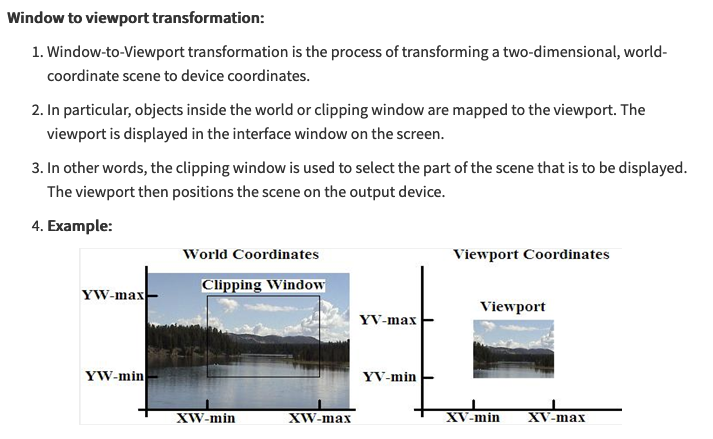
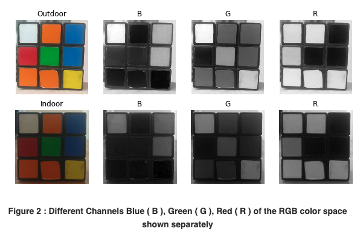
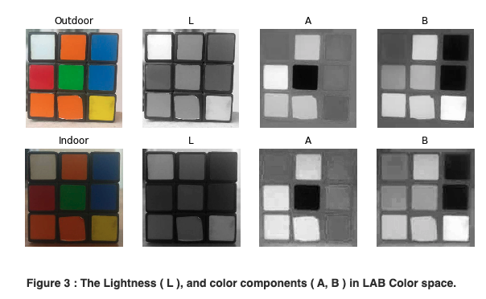
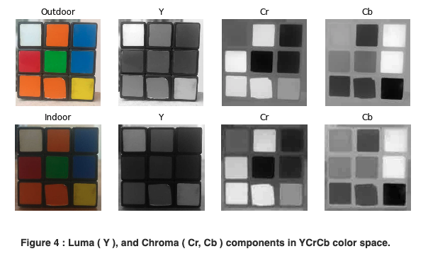
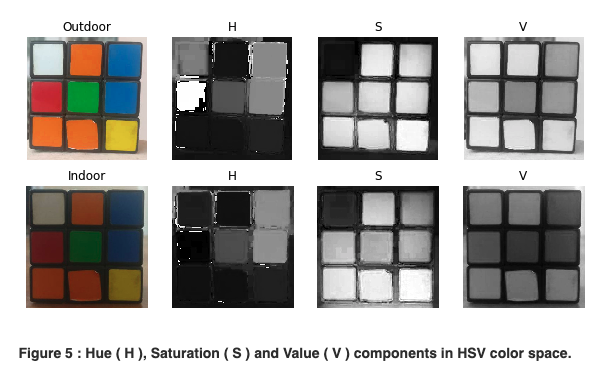
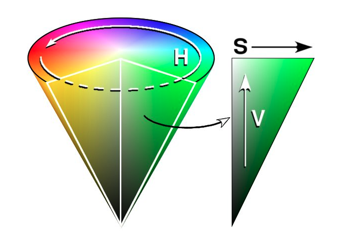
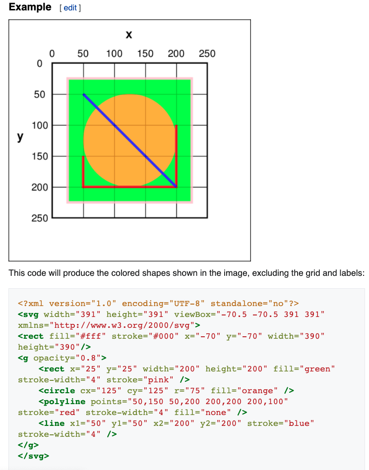

# 용어 정리

- General
  - pixel
  - grayscale
  - channel
  - luminance
  - shader
  - 색상 용어
    - 명도
    - 채도
  - viewport
  - window
- Color spaces
  - RGB
  - Lab
  - YCrCb
  - HSV
- Format
  - SVG(Scalable Vector Graphics)
- Medical image
  - Hounsfield scale(HU)

## 의문

- channel과 component의 차이는?

## General

- pixel
  - picture element
  - 이미지를 구성하는 최소 단위
- grayscale
  - image인데, 각각의 pixel의 값이 빛의 양(강도)을 나타내는 하나의 샘플(sampling)을 나타내는 것
  - 즉, 오직 intensity 정보만 갖고 있음
- channel
  - grayscale image인데, primary color(e.g RGB)중 하나로만 만들어진 것
- luminance(휘도)
  - **텔레비전이나 컴퓨터 등의 표시 화면으로부터 방사되는 빛의 밝기**
    - 인간이 느끼는 주관적 밝기와 비교적 잘 대응하도록 정해진 시각 자극의 강도
- shader
  - 화면에 출력할 픽셀의 위치와 색상을 계산하는 함수
- 색상 용어
  - **명도(V)**
    - 색의 밝고 어두운 정도
    - 명도가 높으면 흰색에 가깝고, 낮으면 검은색에 가까움
  - 채도(S)
    - 색의 강약 / 맑고 탁한 정도
    - 채도가 높으면 본래 색에 가깝고, 낮으면 흰/검 색에 가까움

- window
  - world coordinate에 속해있는 다각형의 area
- viewport
  - 일종의 카메라가 찍고 있는 viewing region
    - panning, zooming은 카메라가 움직이는 것으로 생각하면 됨(viewport의 변화)
  - display device에 종속된 좌표계에서의 area ∧ 컴퓨터 그래픽스에서 다각형의 viewing region
    - window를 viewport에 매핑하여 사용자가 자신의 디바이스에서 적당한 크기로 해당 내용을 볼 수 있음
    - **world-coordinates window clipping ---- window-to-viewport transformation ----> viewport rendering**
  - physical-device-based 좌표계가 portable하지 않으므로, 정규화된 device coordinates로 알려진 소프트웨어 추상 계층이 viewport를 표현하는데에 사용됨

## Color spaces

- *각 Color space사이에는 bijective function이 존재하는가?*
  - 존재하는 경우도 있고, 존재하지 않는 경우도 있다.
  - RGB와 HSV에는 존재할 수 없다
    - 두 공간의 원소 수가 다름

### RGB

RGB color space decomposition

- 의미
  - Red
  - Green
  - Blue
- 개요
  - linear combination of Red, Green, Blue values
  - 세 채널은 표면에 부딪히는 빛의 양과 모두 관련있음
- 단점
  - 조명의 세기가 달라지면, 인식하기 어려움
  - perceptual non-uniformity
  - chrominance(색과 관련된 정보)와 luminance(정보에 대한 강도)가 섞여있음
    - 각각의 채널에 복잡적으로 encode되어있음

### Lab

Lab color space decomposition

- 의미
  - Lightness(intensity)
  - a(Green에서 Magenta까지의 색 범위)
  - b(Blue에서 Yellow까지의 색 범위)
- 개요
  - L채널은 색과 관계없이 오직 밝기만을 다룸
  - 나머지 두 채널이 색을 encode함
- 특징
  - Perceptually uniform color space
  - 장치의 독립성
    - *정확히 장치의 독립성이라는 것이 무엇을 의미하는가?*
      - *어떠한 장치냐에 의존하지 않고 전부 일정하다는 것인가?*
  - Photoshop에서 많이 사용됨
- 관찰
  - illumination의 변화로 L 채널에 영향을 많이 주는 것 확인 가능
  - 특정 색의 A, B 채널의 값 변화는 그다지 존재하지 않음

### YCrCb

YCrCb color space decomposition

- 의미
  - Y(RGB로부터의 gamma correction을 거친 후의 Luminance or Luma(밝기) component)
  - Cr = R - Y (red component가 Luma로부터 얼마나 먼지, chroma)
  - Cb = B - Y (blue component가 Luma로부터 얼마나 먼지, chroma)
- 특징
  - luminance와 chrominance(색조)을 서로 다른 채널로 분리
  - 주로 TV전송에서 Cr Cb 컴포넌트의 압축을 위해서 사용됨
  - 장치에 의존적
- 관찰(위 사진)
  - illumination의 변화로 Y 채널에 영향을 많이 주는 것 확인 가능
  - 흰색은 3개의 component(채널)에서 다 변화를 겪은것을 확인 가능

### HSV

HSV color space decomposition

HSV color space visualization

- 의미
  - H(Hue 색조 - Dominant Wavelength)
    - 0 ~ 360
  - S(Saturation 채도 - Purity / shades of the color)
    - 0 ~ 100
  - V(Value 명도 - Intensity)
    - 0 ~ 100
- 특징
  - 색을 기술하는 채널은 오직 H 하나뿐
  - 장치에 의존적
- 관찰
  - H component는 indoor나 outdoor나 큰 차이가 없음
    - 대신 빨강색은 큰 차이를 보임
    - Hue가 원을 이루기 때문
      - `[300, 360]`사이의 값이 `[0, 60]`값으로 변화
  - S component도 indoor, outdoor사이에 큰 차이가 없음
  - V component가 빛의 강도를 나타냄

## Format

### SVG(Scalable Vector Graphics)

SVG의 예시

- 정의
  - **XML 기반의 2차원 벡터 이미지 포맷**
    - XML 텍스트 파일로 이미지와 그 행동이 정의됨
- 특징
  - interactivity, animation 지원
  - XML 기반
    - 탐색, 인덱싱, 스크립트, 압축 가능
      - 압축은 `gzip`알고리즘 으로 한 경우, SVG 1.1 뷰어는 해당 이미지를 보여줄 수 있음(코덱이 존재하나봄)
    - 텍스트 에디터로 변경 가능
  - 현대 웹 브라우저는 svg 렌더링을 지원
  - 기존에 렌더링된 오브젝트에 그루핑, 스타일링, 트랜스포밍, 구성될 수 있음
  - SVG 그리기
    - XML 엘리먼트를 이용
    - SVG DOM을 이용
      - CSS를 이용해서 styling
      - JavaScript를 이용해서 scripting 가능
- 허용 그래픽 오브젝트
  - vector graphic shapes
  - bitmap images
  - text

## Medical image

- Hounsfield scale(HU)
  - 정의
    - raiodensity를 묘사하는 정량 척도
      - 주로 CT scan에서 많이 사용됨(CT number라고도 불림)
      - 물질마다 서로 다른 값을 가지고 있어서, 몸의 부위 볼 떄 특정 HU 값에서 방사선 이미지속의 특정 부위가 잘 보이도록 할 수 있음
        - e.g) 결절을 보기위한 HU값의 범위 존재
  - 특징
    - 물과, 공기를 기준으로 값을 상대적으로 결정 가능
  - 값 예시
    - Air => -1000
    - Fat => -120 to -90
    - Blood(Clotted) => +50 to +75
    - Lung => -700 to -600
    - Steel => +20,000
    - adrenal tumor이며 rediodensity가 10HU 이하인 경우, 거의 양성 adrenal tumor일 확률이 높음
