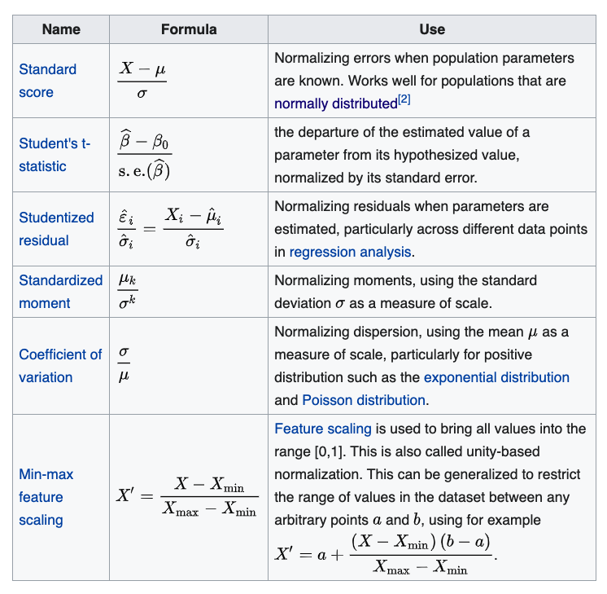
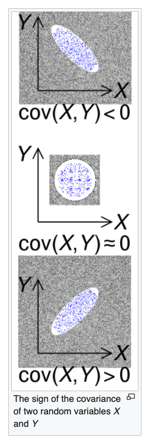
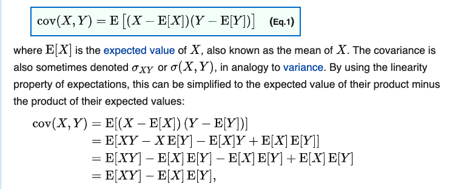

# Mathematics

- 의문
- General
- Statistics
  - Normalization
  - Covariance

## 의문

## General

### 집합의 조건 제시법에 대한 이해

- `A = {a|a는 짝수}`
- `B = {a∈A|a%4=0}`
  - 위와 같이, B의 원소가 A의 원소이기도 하면, `|`의 왼쪽 부분에 특정 집합의 원소라는 것을 명시, 특정 집합의 원소라는 조건이 없으면 명시하지 않음
  - 그리고 오른쪽은, 해당 원소가 집합에서 만족하는 조건들을 나열

## Statistics

### 확률 변수

- 개요
  - 확률 공간의 각 사건에 값을 단 것
    - 주사위, 동전과 같은 물질이나, 던진다는 사건에 집중하지 않고 값 자체에 집중 가능하게 하는 추상화

### Normalization

다양한 normalization의 예시

- 개요
  - 다양한 정의가 존재함(context에 따라 다른 의미)
  - non-dimensional normalization과 dimensional normalization이 존재
    - non-dimensional normalization이어야만, scale-invariant
- 종류
  - normalization of ratings
    - different scale로 측정된 값을 common scale로 조정
    - 전체 probability distribution을 조정하고 정렬하는 것
  - normalization of scores
    - distribution을 normal distribution으로 정렬하는 것
  - normalization으로, 서로 다른 데이터셋과 비교

### Covariance

Graph and covariance

Expression of covariance

- 정의
  - 두 확률변수의 **선형 관계** 를 나타내는 값
    - covariance는 normalize되지 않았으므로, 해석하기 쉽지 않음
    - covariance의 normalized버전은 correlation coefficient
  - c.f) similar behavior
    - 한 확률 변수가 다른 확률 변수와 양의 상관을 갖으면 covariance는 positive
- 주의
  - 모집단의 covariance인지, 표본의 covariance인지 구분이 필요
  - covariance는 measurement unit이 존재
  - uncoreelatedness(두 확률변수의 covariance가 0)와 independence
    - `두 확률변수가 Uncorrelated -> 두 확률변수는 independent`
      - 거짓
      - 반례
        - `X가 [-1, 1]에서 uniform하게 배치되어있음 ∧ Y=X^2 => cov(X,Y)=0`
        - cov가 두 확률 변수의 선형 관계를 나타내는 값이기 때문
    - `두 확률변수가 independent => 두 확률변수가 uncorrelated`
      - 참
