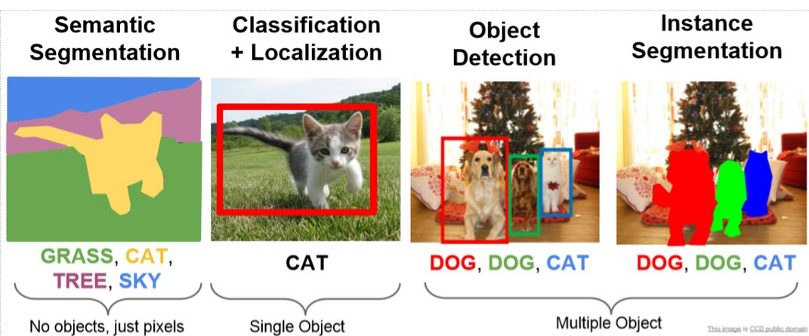
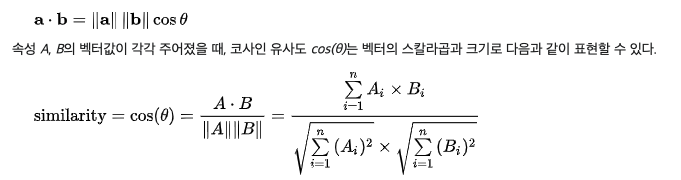
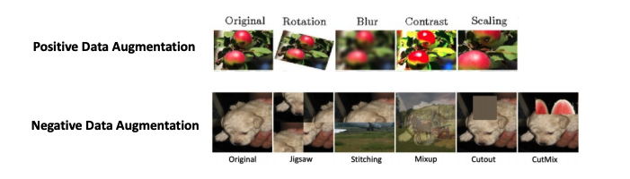

# ML

- General
  - Feature(ML)
  - Image task
  - Cosine similarity
- Neural Network
  - Autoencoder
- Technique
  - Batch Normalization(BN)
- Data
  - Adversarial example
  - Fast Gradient Sign Method
  - Negative Data Augmentation(NDA)

## General

### Feature(ML)

- 개요
  - 관찰되는 현상의 특징이나 측정가능한 개개의 특성
  - informative, discriminating, independent feature를 선택하는 것이, 패턴인식, classification, regression 문제 해결에 매우 중요
  - 일반적으로 수치로 나타나지만, string이나 graph와 같은 structure로 나타나는 경우도 존재
    - syntactic pattern recognition

### Image related tasks

Image 관련 태스크

- classification
- segmentation
  - semantic
  - instance
- detection

### Cosine similarity

Cosine similarity

- 개요
  - 내적공간의 두 벡터간 각도의 코사인값을 이용하여 측정된 벡터간의 유사도
- 예시
  - 유사 문서 측정
    - 텍스트 마이닝에서, 단어 하나하나가 차원을 구성하고, 문서는 각 단어가 나타나는 회수로 표현되는 벡터값으로 두면, 유사한 문서를 측정하기에 매우 유용

## Neural Network

### Autoencoder

Simple Autoencoder Architecture Diagram

Autoencoder Architecture and mathematical expressions

- 정의
  - NN의 한 종류
    - input을 output으로 복사
    - 단순히 복사하는 것이 아니고, 근사적으로 복사해서, 데이터의 가장 관련있는(핵심) 점만 복사해서 보존
      - noise제거
  - unsupervised한 방식으로 *efficient data coding*을 학습하는 인공 신경망의 한 종류
  - signal noise를 무시하기 위해서 network를 학습시키므로써 데이터 집합의 representation(encoding)를 학습시키는 것이 목적
    - dimensionality reduction
- 구조
  - encoder(reductor)
    - input -> code
  - decoder(reconstructor)
    - code -> output(reconstruction of the input)
    - reduced encoding으로 부터, original input과 아주 유사한 representation을 생성
- 학습
  - `L(x, x') = ||x-x'||^2`
    - MSE등의 error를 이용해서 loss function을 구성 가능
- 응용
  - dimensionality reduction
  - feature learning
  - *Information retrieval*
  - Anomaly detection
    - normal data로만 training시키고, anomaly data가 들어오면 reconstruction performance가 나빠지는 것을 이용해서 anomaly detection을 행함
      - reconstruction error
      - 그런데, 최신 논문에서는 anomaly마저 reconstructing을 매우 잘하는 모델이 생겼다고 함
  - Image processing
    - lossy image compression
    - image denoising
    - super-resolution
    - machine translation

## Technique

### Batch Normalization(BN)

Batch Normalization Transform

\

training mode에서는 minibatch statistics로 normalizing을 하고, prediction mode에서는 dataset statistics로 normalizing을 행함

- 정의
  - re-centering, re-scaling을 통한 input layer의 normalization을 통하여, 더 빠르고, 안정적인 인공 신경망을 만드는 방법
    - in-layer normalization
- 동기
  - NN의 각 레이어는 분포를 갖는 input을 갖고 있고, 이러한 input은 parameter initialization과 input data에서의 randomness에 의해서 training process에 영향을 받음
    - 이러한 internal layer들에 대한 input 데이터 분포의 randomness의 영향을 **internal covariate shift** 라고 함
    - 실제로 실험에서 training시에 internal layer input의 mean, variance를 변화하면 관찰이 되는 현상
  - BN은 internal covariate shift를 완화 하기 위함
    - training stage중에, 앞선 layer들의 파라미터가 변하면, 현재 layer에 있어서의 input의 분포도 따라서 변화하고, 결국 현재 layer도 새로운 distribution마다 계속 다시 조정되어야 함
    - deep network의 경우, shallower hidden layer의 작은 변화가 network의 더 깊은 layer에 그 효과가 증폭됨
- 특징
  - Optimization을 도와줌(속도 향상)
    - **정확한 이유는 모름**
      - 내부적 covariate shift를 완화?
        - not valid explanation
      - *objective function* 을 smooth함?
      - length-direction decoupling?
  - Regularization효과
    - 굳이 dropout을 사용할 필요가 없음
  - Learning rate에 크게 영향을 받지 않음
    - gradient exploding / vanishing이 없어짐

## Data

### Adversarial example

- 개요
  - neural network를 혼란시키기 위해서 생성된 특별한 input
    - misclassification을 야기시킴
- 특징
  - 사람 눈으로 구별 불가
- 종류
  - white box attack
    - Fast Gradient Sign Method

#### Fast Gradient Sign Method

- 개요
  - neural network의 gradients를 사용해서 adversarial example을 생성 하는 방식
    - original image에 loss function의 값을 최대로 하는 노이즈를 넣음
- 특징
  - chain rule을 사용하면 per image베이스로 각 픽셀이 얼마나 loss값에 기여하는지 빠르게 알 수 있으므로, image베이스로 작동시킬 수 있음

### Negative Data Augmentation(NDA)

NDA와 PDA의 차이

- 개요
  - Out-Of-Distribution(OOD) 샘플들을 생성
- 좋은 NDA의 조건
  - *NDA is informative if its support is close to that of pdata, while being disjoint*
    - 무슨 소리?
  - local feature를 보존하면서, global feature는 파괴함
    - CNN이 global feature를 배울 수 있도록 함
