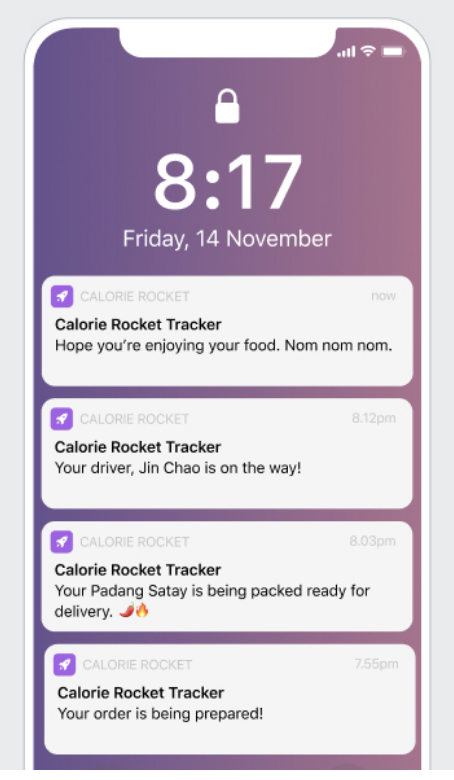
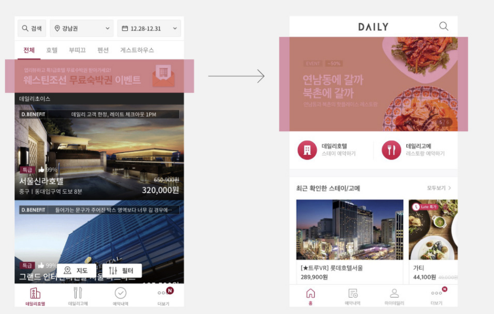
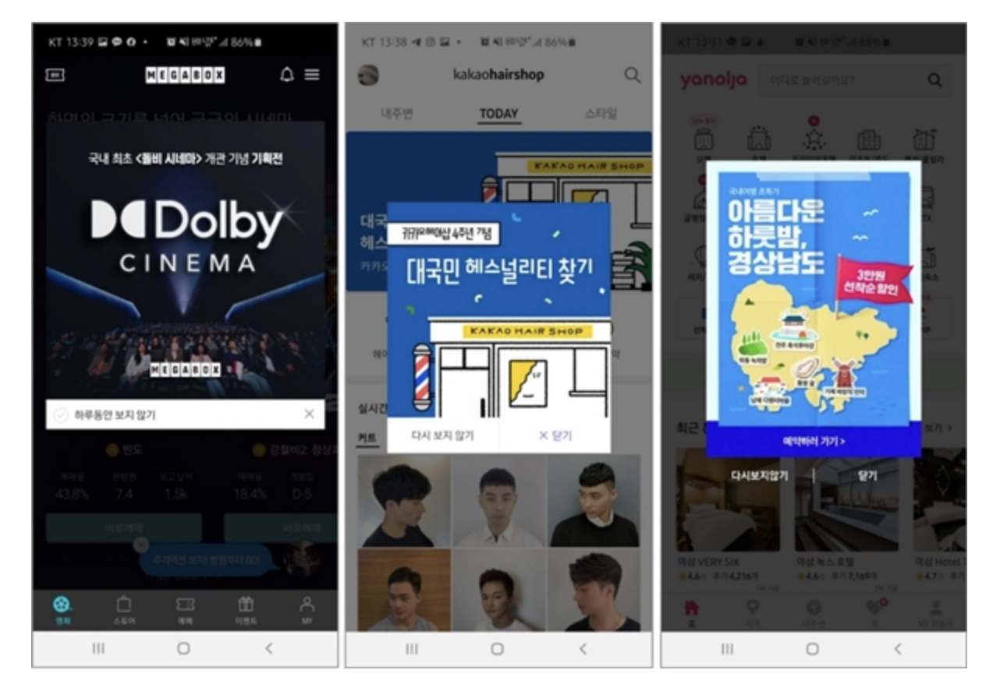
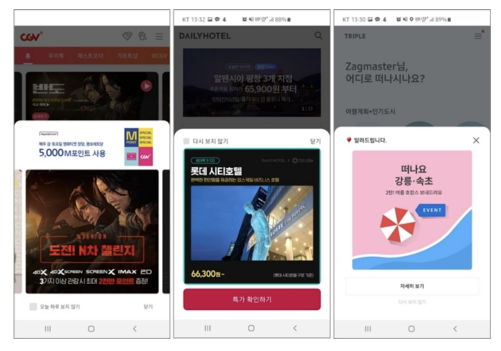
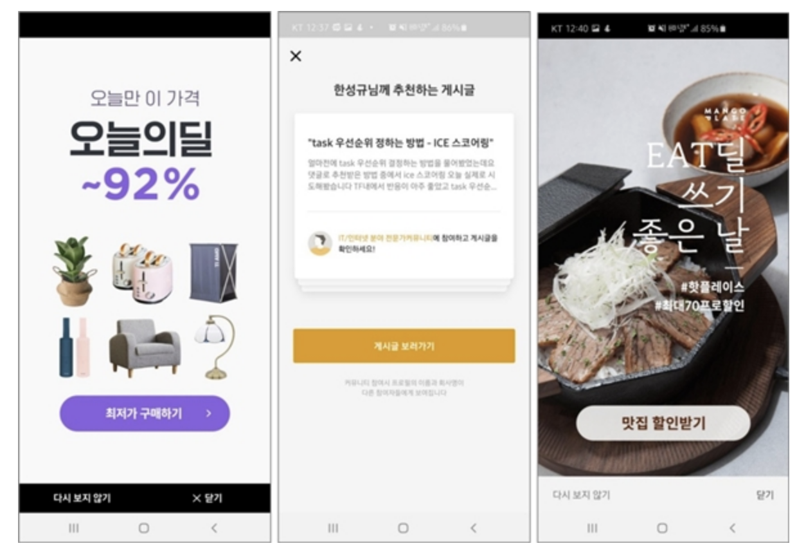
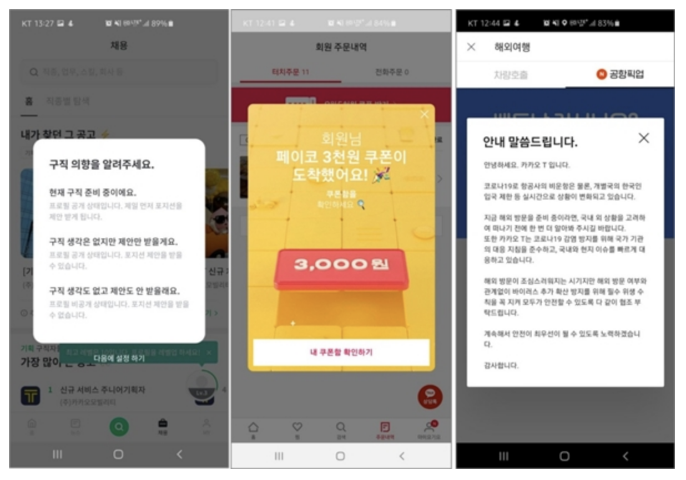

# 모바일

- general
  - 딥링크
  - notification
  - 배너 vs 팝업

## general

### 딥링크

- 개요
  - 모바일 애플리케이션의 특정 페이지에 도달할 수 있는 링크
    - *이게 모바일 웹만 가능한건지? 아니면 네이티브도 가능한건지?*
- 특징
  - ios, Android는 서로 다른 딥링크가 필요
- 주목 배경
  - 검색엔진은 컨텐츠가 곧 트래픽이고 곧 수익인데, 기존에 검색 및 인덱싱이 가능했던 웹 컨텐츠 생산량보다, 검색 및 인덱싱이 불가능한 모바일 컨텐츠의 생산량이 많아지기 시작하면서 위기 의식을 느끼기 시작
    - 모바일 컨텐츠 역전 현상

### notification

푸시 예시

- Push Notifications
  - 유저의 디바이스로 앱이 오픈되어있지 않아도 보내지는 노티
  - 종류
    - Standard
      - 유저의 디바이스에 팝업이나 배너로 메시지를 보여줌
    - Rich
      - 이미지나 비디오나 버튼같은 내용을 포함할 수 있음
    - Silent
      - 유저에게는 아무것도 보여주지 않고, 앱의 액션을 이끌어냄(백그라운드 업데이트)
    - Geolocation-Based
      - 유저의 지역 기반으로 정보나 프로모션을 제공
    - Scheduled
      - 일정 시간에 유저에게 메시지를 전송
    - Personalized
      - 유저의 선호에 따른 푸시 메시지 전송
- In-App Notifications
  - 앱 안에서 보여지는 노티
    - 주로 팝업 배너로 보여짐
- SMS Notifications
  - 유저의 핸드폰으로 텍스트 메시지를 보내는 노티
- Badge Notifications
  - 앱의 뱃지로 보여지는 노티
- Email Notifications
  - 유저의 이메일에 보내지는 노티
- Sound Notifications
  - 노티를 받으면 소리를 울림
- Light Notifications
  - 노티를 받으면 디바이스에 플래시가 비춰짐

### 배너 vs 팝업

배너

팝업 - 정중앙

팝업 - 바텀시트

팝업 - 전면

팝업 - 특정 시점

