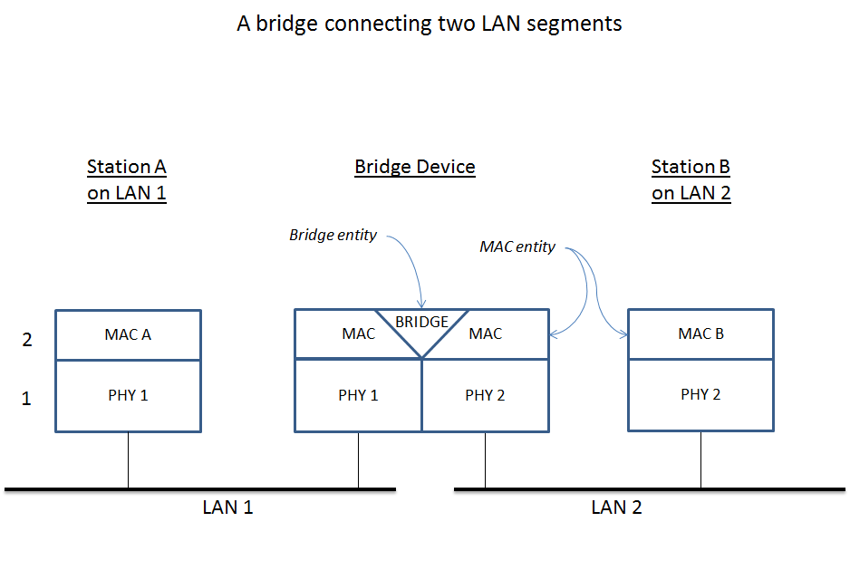
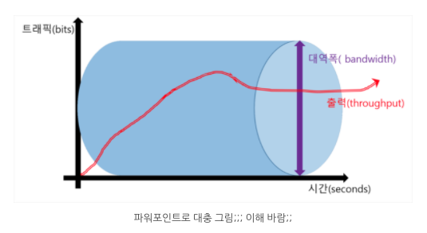
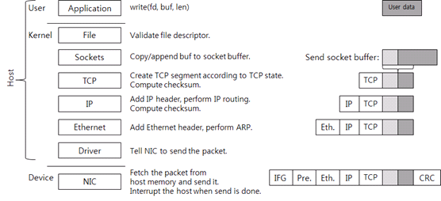
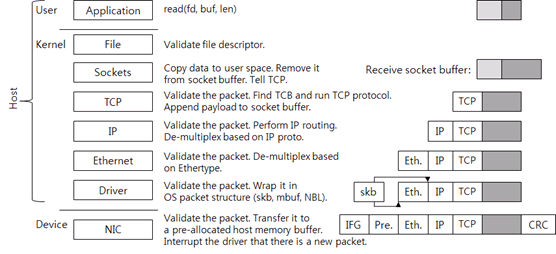
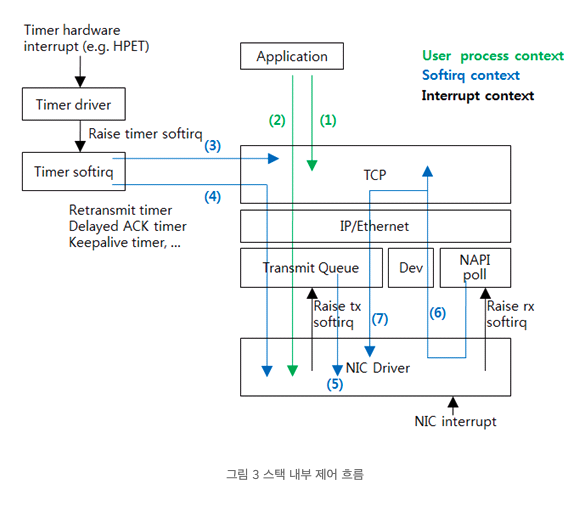
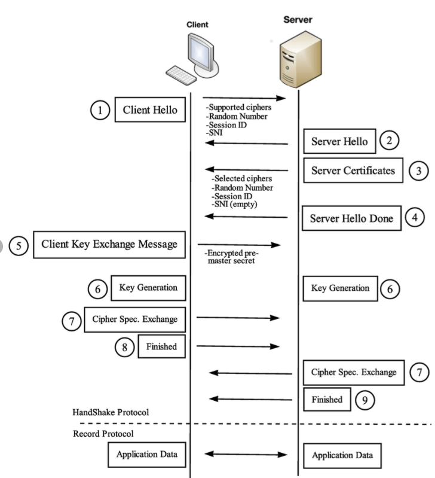

# Network 관련 정의

- General
  - computer network
  - internet
  - intranet
  - ethernet
  - host
  - router
  - gateway
  - bridge
  - intranet
  - network bandwidth
  - Unicast vs Broadcast vs Multicast
  - TCP/IP
  - DHCP
  - In-band control vs Out-of-band control
  - Throughput vs Bandwidth
- Hardware
  - 케이블
  - NIC
- 네트워크 스택
- Physical Layer
  - 장비
    - 허브
- Datalink Layer
  - 장비
    - 브릿지
    - 스위치
    - 브릿지 vs 스위치
    - 허브 vs 스위치 vs 라우터
  - MAC
  - ARP
- Network Layer
  - URI
- Transport Layer
  - TCP
  - TLS
- Application Layer
  - LDAP
- KT-Wifi 공유기 뜯어보기
  - RSSI

## 의문

- 이더넷
  - *Broadcast로 네트워크에 연결된 노드들의 availability를 공격할 수 있지 않을까?*
  - *ARP를 이용하여 MAC Address를 알아내고 그쪽으로 데이터를 전송한다면, 자신의 MAC address를 위조할수도 있는 것 아닌가?*

## General

### Computer Network

- 정의
  - **네트워크 노드(머신)에 의해서 제공되는 혹은 네트워크 노드에 위치한 자원을 공유하는 목적을 달성하기 위해서, 디지털 상호 연결 위에서 공통의 커뮤니케이션 프로토콜의 집합을 사용하는 컴퓨터들의 그룹**
- 특징
  - 노드들 사이의 상호 연결은 다양한 telecommunication network 기술을 사용하여 형성됨
    - 물리적, 광학 와이어, 와이어리스, 라디오 주파수 방식 등
  - 각 노드는들은 hostname과 network address로 구별됨
    - IP 프로토콜을 이용한 노드의 locating / identification 가능
- 역사적 배경
  - 과거 IBM 호스트 장비가 엄청 비쌌는데, 그래서 '터미널'이라 불리는 지금 쓰는 단말기와 비슷하게 생긴 장비들 여러 대를 호스트 컴퓨터에 붙여서 사용하고
  - 프린터를 공유하고 사용하고
  - 여러 호스트를 공유해서 사용

### Internet

- 정의
- 특징
  - 하나의 프로토콜만 사용(IP)

### intranet

- 정의
  - 외부의 접근을 배제한 한 조직내의 컴퓨터 네트워크
- 구성
  - LAN, WAN 등의 기술을 이용

### Ethernet

- 정의
  - 컴퓨터 네트워킹 기술중 하나(LAN, MAN, WAN)
- 특징
  - CSMA/CD(Carrier Sense Multiple Access / Collision Detection) 프로토콜 사용해서 통신
    - CS(Carrier Sense)
      - 현재 네트워크 자원이 사용되고 있는지(누군가가 통신을 하고 있는지) 감지
    - MA(Multiple Access)
      - 다수의 노드가 동시에 네트워크상에 데이터를 실어 보내는 경우
    - CD(Collision Detection)
      - 데이터를 실어 보낸 노드가 네트워크 상의 동시 전송에 의한 충돌을 감지하는 것
      - 충돌이 감지되면 임의의 짧은 시간 이후에 전송될때까지 계속해서 재전송
  - 상대적으로 높은 bit rates
    - 일정 시간에 많은 비트를 통신 가능
  - 더 많은 노드 수용 가능
  - 보다 긴 link 거리
- 통신 방법
  - 데이터 링크 레이어에서 동작
  - 데이터 스트림을 frame이라는 더 작은 조각으로 나눔
  - 각 frame은 source, destination 주소를 갖고, error-checking-data를 갖음
    - 만일, 손상된 frame이 탐지되면, 버려지고 상위의 레이어 프로토콜이 lost frame의 retransmission을 행함
  - 48-bit MAC 주소를 표준으로 채택
  - Internet Protocol도 Ethernet에서 흔하게 *carried over* 되므로, internet 구성의 핵심기술이기도 함
- c.f)
  - token ring
  - FDDI
  - ATM
  - 어떤 네트워크 방식을 사용하느냐에 따라 랜카드를 비롯한

### host

- 정의
  - 네트워크에 연결된 머신

### router

- 정의
  - 다수의 네트워크와 연결되어 있으며, 서로 다른 독립된 네트워크간에 데이터를 중계할 수 있는 호스트

### gateway

- 정의
  - 하나의 네트워크에서 다른 네트워크로 데이터를 흐를 수 있도록 하는 네트워크 하드웨어
- 특징
  - 일반적으로, 라우터나 default gateway같은 하나의 gateway의 일을 행하도록 설정된 컴퓨터 프로그램이나 컴퓨터를 지칭하는 경우도 존재
  - 라우터나 스위치와의 차이
    - **하나 이상의 프로토콜을 사용해서 많은 네트워크와 연결 가능**
    - **OSI 7 layer 어느 레이어에서도 동작 가능**
- c.f) Network gateway(protocol translation gateway, mapping gateway)
  - 서로 다른 네트워크 프로토콜을 갖는 네트워크들 사이에 protocol conversion을 가능하게 함
  - enterprise network에서는 network gateway가 일반적으로 proxy server와 firewall의 역할도 하는 경우가 존재
  - e.g)
    - office와 home intranet <-> internet

### bridge

network bridging의 high level overview

- 정의
  - 다수의 network segments, communication networks 로부터 하나의 aggregate network를 만드는 컴퓨터 네트워크 장치
    - 그러한 기능을 network bridging이라고 함
- 특징
  - vs routing
    - routing
      - 다수의 네트워크가 독립적으로, 분리된 채로 커뮤니케이션 가능하게 함
    - bridging
      - 서로 다른 네트워크들을 하나의 네트워크인 것 처럼 연결하는 것
  - data link layer에 작용
- 종류
  - *Transparent bridging*
  - *Simple bridging*
  - *Multiport bridging*

### Network Bandwidth(대역폭)

- 정의
  - 주어진 경로를 통해서 단위 시간당 데이터를 전송 속도
    - 즉, 단위시간 당 주어진 경로에 얼마나 많은 데이터를 전송할 수 있는가

### Unicast vs Broadcast vs Multicast

네트워크에서 동신을 하는 방식에 따른 구분

- Unicast
  - 정의
    - 1:1 통신 방식
  - 특징
    - 데이터프레임 속에 하나의 destination MAC주소를 포함시킴
    - 로컬 이더넷은 모든 머신에게 프레임을 뿌리는 Shared방식인데, 프레임을 받은 다른 머신은 destination MAC주소를 자신의 MAC주소와 비교해서 같지 않으면 드롭
      - 다른 머신의 성능을 저하시키지 않음
- Broadcast
  - 정의
    - 1:로컬 네트워크 모든 머신, 통신 방식
    - 로컬 LAN에 붙어있는 모든 머신(노드)에게 보내는 통신
  - 특징
    - MAC주소가 정해져있음
      - `FF:FF:FF:FF:FF:FF`
    - 브로드캐스트 MAC 주소로 설정된 데이터프레임이 컴퓨터로 도달하면, 버리지 않고 처리하게 됨
      - 따라서 너무 많아지면 성능 저하의 문제가 생김
- Multicast
  - 정의
    - 1:다(선택한 네트워크 내부의 노드들의 그룹) 통신
  - 특징
    - 라우터나 스위치에서 지원을 해줘야 쓸 수 있음
      - 라우터에서 지원하지 않으면 브로드캐스트로 취급해서 막아버림
    - IP의 경우에는 클래스 D를 사용

### TCP/IP

- 정의
  - 인터넷의 기본 프로토콜
- 특징
  - 두 프로토콜의 결합
    - TCP
    - IP

### DHCP(Dynamic Host Configuration Protocol)

- 정의
  - PC마다 각각 IP 주소를 미리 지정해 놓지 않고, DHCP 서버가 그 네트워크에 필요한 IP 주소를 전부 가지고 있다가 IP 주소를 요구하는 PC에는 그때그때 자동으로 분배해주는 방식
  - 다 사용된 IP주소는 회수

### In-band control vs Out-of-band control

- In-band control
  - 정의
    - control data를 main data와 같은 연결(채널)로 보내는 네트워크 프로토콜의 특성
- Out-of-band control
  - 정의
    - control data를 main data와 다른 연결(채널)로 보내는 네트워크 프로토콜의 특성

### Throughput vs Bandwidth

Throughput vs Bandwidth

- Throughput
  - 정의
    - 단위 시간당 처리량 or 네트워크 전달 가능량
  - 특징
    - 현재의 state를 나타내는데에 사용
      - 값이 시간에 따라 변화하므로 Average throughput 값을 사용
- Bandwidth
  - 정의
    - 단위 시간에 전달할 수 있는 최대 크기의 전달 양
  - 특징
    - 현재 state가 아닌, 용량(설비)과 관계가 있음

## 하드웨어

- 케이블
- NIC(랜카드)

### 케이블

- UTP(Unshielded Twisted Pair) 케이블
  - 개요
    - 가장 많이 사용하는 케이블
- 케이블 카테고리
  - 카테고리1
    - 전화망에 사용하는 용도로 만들어진 케이블
    - 데이터 전송용(x)
  - 카테고리2
    - 별로 안중요(?)
  - 카테고리3
  - 카테고리4
    - 토큰링 네트워크에서 사용되는 케이블
  - 카테고리5
    - 최대 전송 속도 100Mbps를 지원하는 Fast Ehternet용도
  - 카테고리6
    - 기가비트 이상 속도에 적합한 케이블
    - 최근 가장 많이 사용
  - 카테고리7
    - 10Gbps 이상을 지원하기 위한 케이블
  - 참고
    - 10Gbps를 사용하여 100미터 이상을 지원하기 위해서는 최소 Cat6a 이상의 케이블이 필요
- 케이블 종류
  - e.g
    - 10 Base T
      - 10
        - 속도(10Mbps)
      - Base
        - Baseband용 케이블(디지털 방식)
        - Broadband(아날로그 방식)
      - T
        - Twisted Pair 케이블
      - T대신 숫자 3
        - 300M 길이

### NIC(Network Interface Card - 랜카드)

- 정의
- 종류
  - **환경에 따른 분류**
    - 이더넷용
      - 일반적으로 이더넷용을 많이 사용
    - 토큰링용
    - FDDI
    - ATM
  - 설치 장소
    - 데스크톱
    - 노트북용(PCMCIA)
    - 프린터 포트에 연결
    - USB 포트에 연결
  - PC 버스(랜카드는 PC 버스의 종류와 같은 종류로 맞춰야 함)
    - PCI
    - ISA
    - EISA
  - 케이블
    - TP 포트
    - 광케이블

## TCP/IP 네트워크 스택

### 데이터 전송

네트워크 스택과 레이어(데이터 전송시 설명)

*각 레이어는, 독립적인 프로그램인가? 아니면 그냥 OS kernel하나에서 동작하는 것인가? 후자일것같긴 하다만...*

#### User 영역

- 애플리케이션의 데이터의 생성
- `write`시스템 콜 호출
- 커널 영역으로 전환

#### Kernel 영역

*데이터를 송신하는 경우, User layer부터 아래로 내려가면서, 코드가 실행되는것으로 이해했는데, 그럼, TCP connection이 ARP보다 먼저 이루어지는 것인가? 이건 말이 안되는것 같은데*

- File layer
  - 단순 검사 후 파일 구조체에 연결된 소켓 구조체를 사용해서 소켓 함수 호출
    - POSIX계열 운영체제는 소켓을 file descriptor로 애플리케이션에 노출
- Sockets layer
  - 과정
    - write 시스템 콜을 호출하면, 유저 영역의 데이터가 커널 메모리로 복사되고, send socket buffer 뒤에 추가됨
    - TCP 호출
      - *정확히 TCP를 호출한다는 것은 무슨의미인가?*
  - 데이터 구조
    - 두개의 버퍼 존재
      - send socket buffer
      - receive socket buffer
- TCP layer
  - 과정
    - TCP 상태가 데이터 전송을 허용하는 경우(*핸드셰이크가 잘 되었다는 뜻인가?*)
      - TCP segment를 생성
        - TCP segment
          - TCP 헤더와 payload가 있음
          - payload에는 ACK를 받지 않은, send socket buffer에 있는 데이터가 담겨져 있음
          - 최대 길이는 max(receive window, congestion window, MSS(Maximum Segment Size))중 최댓값
      - 만약, Flow control같은 이유로 데이터 전송이 불가능하면 시스템 콜은 여기서 끝나고, 유저모드로 돌아감
        - 애플리케이션으로 제어권이 넘어감
    - TCP 체크섬 계산(헤더 정보도 포함)
      - 사실, 요즘 네트워크 스택에서는 *checksum offload*기술을 사용하기 때문에, 커널이 직접 하지 않고, NIC가 함
    - IP layer로 데이터 보냄
  - 데이터 구조
    - TCP Control Block(TCB) 구조체
      - TCP 연결처리에 필요한 정보 존재
        - connection state(LISTEN, ESTABLISHED, TIME_WAIT)
        - receive window
        - congestion window
        - sequence 번호
        - 재전송 타이머
- IP layer
  - 과정
    - TCP segment에 IP헤더 추가
    - IP routing
      - destination IP로 가기 위한 다음 장비의 주소(next hop IP)를 찾는 과정
    - IP 헤더 체크섬을 덧붙임
    - Ethernet layer로 데이터를 보냄
- Ethernet layer
  - 과정
    - ARP(Address Resolution Protocol)을 사용해서 next hop의 IP의 MAC 주소를 찾음
    - Ethernet 헤더를 패킷에 추가
    - 패킷 완성
    - transmit NIC의 드라이버 호출
    - *만약 tcpdump나 Wireshark 같은 패킷 캡처 프로그램이 작동 중이면 커널은 패킷 데이터를 프로그램이 사용하는 메모리 버퍼에 복사한다. 수신도 마찬가지로 드라이버 바로 위에서 패킷을 캡처한다. 대개 traffic shaper 기능도 이 레이어에서 동작하도록 구현되어있다.*
- Driver layer
  - driver-NIC 통신 규약에 따라 패킷 전송을 요청

#### Device 영역(NIC)

- 패킷 전송 요청 받음
- 메인 메모리에 있는 패킷을 자신의 메모리로 복사
  - *자신의 메모리가 뭐지?*
- Ethernet 표준에 따라, IFG(Inter-Frame Gap), preamble, CRC를 패킷에 추가
  - IFG, preamble
    - 패킷의 시작을 판단(framing)
  - CRC
    - 데이터 보호를 위해 사용(checksum과 같은 용도)
- 네트워크 선으로 전송
  - Ethernet의 물리적 속도, Ethernet flow control에 따라 전송할 수 있는 상황일 때 시작
- 패킷 전송
  - 호스트 CPU에 interrupt 발생 시킴
  - OS의 적합한 드라이버 찾기
  - 드라이버가 인터럽트 핸들러를 드라이브가 가동되었을 때 미리 등록
  - 운영체제가 핸들러 호출
  - 핸들러는 전송된 패킷을 운영체제에 반환

### 데이터 수신

네트워크 스택과 레이어(데이터 수신시 설명)

#### Device 영역(NIC)

- 패킷을 자신의 메모리 영역에 기록
- CRC로 패킷이 올바른지 검사
- 호스트의 메모리버퍼로 전송
  - 드라이버가 커널에 요청하여 수신용으로 미리 할당해 놓은 메모리를 할당 받은 후 드라이버는 NIC에 메모리 주소와 크기를 알려줌
    - NIC가 패킷을 받았는데, 미리 할당해 놓은 호스트 메모리 버퍼가 없음 => NIC가 패킷을 버릴 수 있음(packet drop)
- NIC가 호스트 운영체제에 인터럽트를 보냄
  - *인터럽트를 보내고나서 어떤 핸들러가 실행되어서 결국 드라이버가 동작하는지?*
  - *드라이버는 결국 또 다른 소프트웨어인가?*

#### Kernel 영역

- Driver layer
  - 패킷을 보고 처리가능한지 검사
    - 드라이버 - NIC 통신 규약 사용
  - 운영체제가 이해할 수 있도록, 받은 패킷을 운영체제가 사용하는 패킷 구조체로 포장
    - e.g)
      - Linux: `sk_buff`
      - BSD: `mbuf`
      - MS: `NET_BUFFER_LIST`
  - 포장한 패킷을 상위 레이어로 전달
- Ethernet layer
  - 패킷이 올바른지 검사
  - 상위 프로토콜(네트워크 프로토콜)을 찾음
  - Ethernet 헤더를 제거하고 IP레이어로 패킷 전달
- IP layer
  - 패킷이 올바른지 검사
  - IP routing을 해서 패킷을 로컬 장비가 처리해야하는지, 다른 장비로 전달해야 하는지 판단
  - if) 로컬 장비 처리
    - 헤더의 proto값을 보고, 상위 프로토콜(transport 프로토콜)을 찾음
  - IP 헤더를 제거
  - TCP 레이어로 패킷 전달
- TCP layer
  - TCP control block(연결)을 찾음
    - 패킷의 소스IP, 소스 port, 타깃 IP, 타깃 port를 식별자로 사용
  - 연결을 찾으면 프로토콜을 수행해서 받은 패킷을 처리
  - 새로운 데이터를 받았다면, 데이터를 receive socket buffer에 추가
  - TCP 상태에 따라 새로운 TCP 패킷(e.g ACK패킷) 전송 가능
- Socket layer
  - read 시스템 콜을 호출하면 커널 영역으로 전환
  - socket buffer에 있는 데이터를 유저 공간의 메모리로 복사
  - 복사한 데이터는 socket buffer에서 제거
  - TCP 호출
    - receive window증가
    - 상황에 따라 패킷 전송
  - 시스템 콜 종료
- File layer

#### User 영역

#### 스택 내부 제어 흐름

스택 내부 제어 흐름 간단 도식

- 개요
  - 네트워크 스택은 기본적으로 이벤트 발생에 반응하는 event-driven 방식으로 작동
    - 스택 수행을 위한 별도 스레드가 없음
- 위 그림 해설
  - (1) 애플리케이션이 시스템 콜을 호출하여 TCP

## Physical Layer

- 장비
  - 허브

### 장비

- 장비
  - 통신 케이블, 리피터, 허브

#### 허브

- 정의
  - 서브넷 구성을 위한 하드웨어
  - multiport, repeater
    - 한 포트로 들어온 데이터를 나머지 모든 포트로 전송
- 특징
  - 랜카드, 케이블, 허브만 있으면 서브넷에 연결된 머신끼리 통신이 가능해짐
  - 하나의 머신에서 다른 머신으로 데이터를 전송할 경우, 모든 다른 포트에 데이터를 프레임 형태로 전송하는데, 각 머신의 랜카드는 프레임의 MAC address를 보고, 자신의 MAC address와 일치하지 않으면 버림
  - 또한, **이더넷 허브**의 경우에는, CSMA/CD 프로토콜을 따르므로, 하나의 머신이 데이터를 전송하는 동안 다른 머신이 데이터를 전송할 수 없음
    - 해당 머신들은 같은 collision domain에 있다고 함
    - 여러 허브를 이어서 하나의 네트워크를 만들면, 그만큼 collision횟수가 많아지는 문제 발생
      - collision domain의 크기가 너무 큼
      - 결과론적으로 네트워크 퍼포먼스 저하
- 종류
  - NMS 유무
    - intelligent hub
      - NMS(네트워크 관리 시스템)를 통한 관리가 가능
        - 한 네트워크 노드가 이상한 데이터를 허브로 계속 보내는 경우, 그 노드를 격리(나머지 머신이 네트워크 영향을 받지 않도록 - 포트 분리)
    - dummy hub
      - NMS 기능이 존재하지 않음
  - Stackable
    - Stackable
      - 허브간 연결이 최적화 되어있음(속도가 standalone을 연결한 것보다 빠름)
    - Standalone

## Datalink Layer

- 장비
  - 브리지, 스위치
- MAC
- ARP

### 장비

#### 브릿지

- 정의
  - 허브의 기능 ∧ collision domain분리(MAC address table)
- 배경
  - 허브는 모든 네트워크 노드들이 하나에 붙어있기 때문에, collision이 발생
  - 네트워크 규모가 커지는 경우 위의 상황이 더 심화되므로, 허브대신 브릿지나 스위치를 사용해야 함
- 특징
  - collision domain 사이를 반으로 나누고, 중간에 다리를 놓는 방식
  - MAC address table이 존재
- **기능**
  - Learning
    - 머신이 통신할 때, source의 MAC address를 MAC address table에 저장
  - Flooding
    - 들어온 포트를 제외한 나머지 모든 포트로 데이터를 전송
    - e.g)
      - destination MAC address가 bridge의 MAC address table에 존재하지 않는 경우
  - Forwarding
    - destination MAC address가 bridge의 MAC address table에 존재하는 경우 ∧ source 와는 다른 세그먼트에 데이터를 보내야 하는 경우
  - Filtering
    - 다른 세그먼트에 데이터가 넘어가지 않게 막는 경우
      - collision domain을 나눠주는 핵심 원리
    - e.g)
      - 브릿지가 destination의 MAC address를 알고있음 ∧ source 와 destination이 같은 세그먼트에 존재
  - Aging
    - 기존에 기억해두었던 MAC address table에서의 주소를 일정 시간이 지나도록 통신을 안하면 지움
- 브릿지에서 프레임의 흐름
  - 프레임 접수
  - source MAC address를 learning하거나, timer를 refresh
  - destination이 broadcast, multicast or unknown
    - => frame flooding
  - destination MAC address가 source MAC address와 같은 세그먼테이션에 존재
    - => frame filtering
  - Unicast를 해당 포트로 forwarding

#### 스위치

- 정의
  - 스위치 기능 ∧ 포트별 collision domain나눔(브릿지와 동일)
    - 1-2 포트 통신중에 3-4 포트 통신 가능
- 특징
  - 가격이 많이 싸져서 보통 허브보다 스위치를 많이 사서 쓰는 추세
  - 스위치나 브릿지에 두 개 이상의 경로가 생기면 루핑이 발생
    - Spanning Tree Algorithm으로 해결

#### 스위치 vs 브릿지

|구분|스위치|브릿지|설명|
|--|----|------|-----|
|처리 방식|하드웨어(ASIC - Application-Specific Integrated Circuit)|소프트웨어|스위치가 브릿지에 비해서 속도가 훨씬 빠름|
|서로다른 속도 연결|O|X|스위치는 10메가 포트와 100메가 포트가 한 장비에 같이 있게 됨|
|포트의 수|상대적으로 많음(몇백개)|상대적으로 적음(2-3개)||
|프레임 처리 방식|Cut-through or Store-and-forward|Store-and-forward||

- c.f) 프레임 처리 방식
  - Store-and-forward
    - 정의
      - 스위치나 브릿지가 일단 들어오는 프레임을 전부 받아들인 후 처리를 시작하는 방식
    - 특징
      - 에러 탐지
      - 요즘에는 Cut-through보다 엄청 뒤지는 속도는 아니라고 함
  - Cut-through
    - 정의
      - 프레임의 목적지 주소만 본 후 바로 전송 처리 시작
    - 특징
      - 처음 48비트만 확인
      - 에러 탐지가 힘듬
  - Fragment-free
    - 정의
      - Store-and-forward 방식 + Cut through 방식
    - 특징
      - 처음 512비트만 확인
      - 에러 탐지 능력이 Cut-through방식 보다 향상

#### 허브 vs 스위치 vs 라우터

- 허브
  - collision domain 나눠주지 못함
- 스위치
  - collision domain 나눠줌
  - broadcast domain 나눠주지 못함
- 라우터
  - broadcast domain 나눠줌
  - 로드 밸런싱 가능
  - QOS(Quality Of Service)
    - 프로토콜이나 데이터의 크기, 중요도 등 상황에 따라 트래픽의 전송 순서 조정

### MAC(Media Access Control) address

- 정의
  - 네트워크에서의 물리적 주소
- 구성
  - 48bit(6octet)
  - 예시
    - `00-60-97-8E-4F-86`
    - `00:60:97:8F:4F:86`
    - `0060.978F.4F96`
  - OUI(Organizational Unique Identifier)
    - 앞쪽6개의 16진수
  - Host Identifier
    - 뒤쪽6개의 16진수

### ARP(Address Resolution Protocol)

- 정의
  - IP주소로부터 MAC주소를 알아내기 위한 프로토콜
- 절차
  - 어떤 서브넷에 속한 머신(X)은 통신하고자 하는 머신(Y)의 MAC주소를 알아내기 위해 Broadcast요청을 보냄(X자신의 맥어드레스 포함된 메시지)
  - (통신하고자 하는 머신이 다른 네트워크에 존재하는 경우)라우터가 브로드캐스트 메시지를 보고, X에게 자신의 맥 어드레스를 알려줌
  - X가 보내고자 하는데이터와 IP주소를 라우터가 받고, Y머신이 있는 네트워크로 전달

### Service set(802.11 network)

- 정의
  - 같은 SSID(Service Set IDentifier)로 구분되는 무선 네트워크 디바이스의 그룹
- 특징
  - 하나의 서비스는 논리적인 네트워크를 형성
- SSID
  - 자연어로 되어있는, network 이름 라벨

## Network Layer

- 장비
  - 라우터, L3 스위치
- URI

### URI(Uniform Resource Identifier)

- 정의
  - 인터넷 프로토콜에서 인터넷에 있는 자원을 나타내는 유일한 주소
- 문법
  - `scheme:[//[user[:password]@]host[:port]][/path][?query][#fragment]`

## Transport Layer

### TCP(Transmission Control Protocol)

- 개요
  - Transport레이어의 프로토콜
- 특징
  - connection oriented
    - 두개의 엔드포인트 사이에 연결을 먼저 맺고 데이터를 주고 받음
    - TCP연결 식별자
      - 로컬 IP주소, 로컬 포트번호, 리모트 IP주소, 리모트 포트번호
  - bidirectional byte stream
    - 양방향 데이터 통신을 하고, 바이트 스트림 사용
  - reliable
    - reliability through ACK
      - 데이터를 송신하고 수신자로부터 ACK를 받지 않으면, 송신자 TCP가 데이터 재전송
      - 송신자 TCP는 수신자로부터 ACK를 받지 않은 데이터 보관(buffer)
  - ordered
    - 데이터의 순서가 존재(32bit 정수형)
  - flow control
    - 송신자는 수신자가 받을 수 있을 만큼 데이터를 전송
    - 수신자가 자신이 받을 수 있는 바이트 수(receive window)를 송신자에게 전달
    - 송신자는 수신자 receive window가 허용하는 바이트 수만큼 데이터를 전송
  - congestion control
    - 네트워크 정체를 방지하기 위해서 congestion window를 사용
    - 송신자가 단독으로 구현
      - *TCP Vegas, Westwood, BIC, CUBIC 등 다양한 알고리즘 존재*

### TLS(Transport Layer Security)

TLS handshake

- 정의
  - Transport layer에서 정보를 암호화해서 송수신하는 프로토콜
- 순서
  - 1 서버가 CA로부터 인증서 발급받음
    - 사이트 정보(도메인), 공개키 제출
  - 2 클라이언트와 TLS 핸드셰이크
  - 3 생성된 세션키(대칭키)를 이용한 암호화 통신
- 장점
  - 기밀성
  - 데이터 무결성
  - 서버 인증
    - 인증서 이용
- 참고 개념
  - 인증서
    - 구조
      - 서비스 정보
      - 서버 측 공개키
      - 서명
        - 핑거 프린트를 CA의 비밀키로 암호화한 것
        - 핑거프린트(지문)
          - 서버 측 공개키를 SHA-256으로 해시하여 인증서에 등록한 것
    - self-signed
      - 자신의 공개키를 해시한 후, CA가 아닌 자신의 비밀키로 암호화하여 서명으로 등록하는 것
        - '신뢰할 수 없는 사이트입니다'
  - SNI(Server Name Indication)
    - IP 주소 하나에 여러개의 도메인이 연결되는 경우, 어떤 도메인에 접속하는지 명시하는 부분
    - 평문
      - 보안상 문제

## Application Layer

- LDAP

### LDAP(Lightweight Directory Access Protocol)

- 정의
  - TCP/IP 위에서 분산 디렉터리 정보 서비스를 조회하고 수정하는 application protocol
- 응용
  - username과 password의 저장소를 제공
    - 여러 서로 다른 애플리케이션이 user를 validate하기 위해서 연결함
- 연산
  - Add
  - Bind
  - Delete
  - Search and Compare
  - Modify
  - StartTLS
  - ...
- URI scheme
  - `ldap://host:port/DN?attributes?scope?filter?extensions`

## KT-Wifi 공유기 뜯어보기

### RSSI()
