# OS 관련 정의

- 의문
- General
  - Booting
  - Firmware
  - BIOS
  - Buffer(data buffer)
  - POSIX
  - Everything is a file
- File system
  - File descriptor vs System open-file table vs Vnode Table
  - I/O multiplexing
  - Partition
  - File system
  - Mount
  - Inode
  - Softlink vs Hardlink
  - file system types
    - UnionFS
- Process
  - Process
  - Daemon
  - Processor affinity
  - Process group
  - Pipeline
  - IPC
- Memory
  - Address space
  - Virtual memory
  - Paging
  - Swap in and out
  - Memory segmentation
  - Overlay
  - OOM killer
  - Memory overcommitment
- Virtualization
  - OS-level virtualization
  - LXC
  - Virtualization
  - Server Virtualization
- Application Layer
  - deb

## 의문

- File system
  - *다음 설명은 참인가?*
    - 각 저장장치는 어떤 File system에 형식에 따라 데이터를 저장하는지 지정 가능(포맷)
    - 컴퓨터의 OS는 그 저장장치를 인식하면 지원하는 File system인지 확인한 후에, 지원한다면 해당 저장장치 내의 파일들에 접근 및 수정 가능
  - *unix-like os에서 장치 혹은 socket을 file로 관리한다는 것은 어떤것을 의미하는가?*
  - 우리가 그럼 commandline에서 보는 디렉터리 구조들과 같은 것들은 결국 정체가 무엇인가?
    - 하드 디스크 내부의 파일들의 메타 데이터
      - 우리는 데이터 저장장치의 Meta Area속에 존재하는 인덱싱된 파일 혹은 디렉터리의 메타 데이터를 보고 있는 것임
  - *파일 시스템의 부팅 영역이란*
    - *무엇에 대한 부팅을 의미하는가? 컴퓨터? 아니면 저장장치? 애초에 부팅이 뭐지?*
  - *애초에 파일 시스템의 파일과 드리아브 크기 제한을 빵빵하게 만들면 될텐데 왜 제한이 빡빡하게 만들어서 계속 확장하게 되었는가?*
  - *구체적으로 Inode란 무엇인가?*
    - 무엇을 저장하는가?
- Memory
  - *Paging에 사용되는 TLB, Page Table역시 데이터를 저장해야 하는데, 해당 공간은 어디에서 나는가?*
    - *MMU?? 아니면 physical 메모리이긴 하나 별도 메모리에서 분리된 특수한 공간?*

## General

### Booting(운영체제를 initializing(메모리에 올리는 것))

Booting process

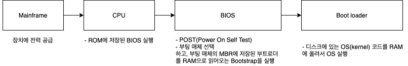

Bootstrap

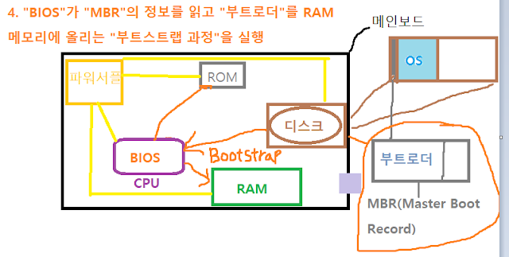

- 정의
  - 운영체제 프로그램을 메모리에 올리는 것
- 과정
  - ① 컴퓨터 전원버튼을 누르고, 메인보드에 전력이 들어오며, 메인보드에 부착된 장치들에게 전력이 공급
  - ② CPU가 ROM에 저장된 펌웨어인 BIOS(Basic Input/Output System)를 실행시킴
  - ③ 실행된 BIOS는 POST(Power On Self Test)즉, 컴퓨터 주변 하드웨어를 체크
    - POST
      - 컴퓨터를 킬 때, 문제가 있나 자가검사 하는 것
  - ④ BIOS가 부팅매체(하드디스크, USB, SSD, ...)를 선택하고, 부팅매체의 MBR(부팅 프로그램이 저장된 영역)에 저장된 부트로더를 RAM으로 읽어오는 Bootstrap을 실행
    - 부팅 우선순위가 존재함(e.g 하드디스크 -> USB -> CD -> Network -> ...)
    - MBR(Master Boot Record)
      - 모든 기억장치(USB, 하드디스크 등)은 첫 번째 섹터(512바이트)에 MBR영역을 갖고 있음
      - Primary partition에 대한 정보 4개를 기록할 수 있는 64바이트 공간 + 운영체제(커널) 코드를 복사해서 메모리에 올려주는 부트 로더가 저장
        - 부트 로더를 RAM 메모리에 올리는 것을 **부트스트랩 과정** 이라 함
  - ⑤ Bootstrap 과정으로 RAM에 Bootloader가 올라가고, 부트로더는 디스크에 있는 OS(커널) 코드를 복사해 RAM에 올려 OS 실행
    - Bootloader
      - 운영체제를 initializing(메모리에 올림) 해주는 역할
  - ⑥ OS가 부팅됨

### Firmware

- 정의
- 특징
  - ROM과 같은 비휘발성 메모리에 저장해 사용
- 종류
  - BIOS, ...

### BIOS(Basic Input Output System)

- 정의
- 특징
  - 하드웨어들의 Input / Output을 관리하는 소프트웨어
  - 운영체제가 컴퓨터 하드웨어의 입출력을 컨트롤 할 경우에 사용

### Buffer(data buffer)

- 정의
  - 데이터를 한 장소에서 다른 장소로 이동시키는 동안, 임시적으로 저장하기 위해 사용되는 물리적 메모리 저장 장소
- 특징
  - 주로 queue를 이용해서 input, output의 timing을 조정함
- 예시
  - device에 관련
    - input device로 부터 데이터를 가져오기 전에 buffer에 데이터가 저장됨
    - output device로 데이터를 내보내기 전에 buffer에 데이터가 저장됨
  - 하나의 컴퓨터 안에서 process간에 데이터를 옮기기 위해서도 사용됨

### POSIX

- 정의
  - Portable Operating System Interface
  - **OS 사이의 compatibility를 유지하기 위하여 IEEE가 제정한 OS 인터페이스 표준**
- 정의 범위
  - API
  - Shells
  - Utility interfaces
- 윈도우와 POSIX
  - Cygwin
  - WSL(Windows Subsystem for Linux)

### Everything is a file

- 정의
  - Unix의 특징 중 하나
  - **다양한 범위의 input/output 자원은 filesystem name space를 통해서 노출된 simple streams**
    - documents, directories, hard-drives, modems, keyboards, printers, inter-process, network communications
- 특징
  - 같은 툴이나 유틸리티와 API가 다양한 범위의 자원으로 활용 가능
  - 다양한 파일 타입이 존재
  - **정확히는 Everything is a file descriptor가 맞음**
  - psudo, virtual filesystem들도 존재해서, file-like 구조로 시스템의 정보나 프로세스의 정보를 노출
    - mount됨
    - virtual filesystem의 예시
      - `/proc`
        - owner, access permissions등의 유닉스 파일 속성을 갖음

## File system

*파일 시스템에서 파일과 inode는 어떻게 연결되는가? 파일 이름은 어디에 저장되는가?*

### File descriptor vs System open-file table vs Vnode Table

파일 그 자체와, 파일로 연결을 open하는 것은 차이가 존재함

File descriptor, File table, Inode table1

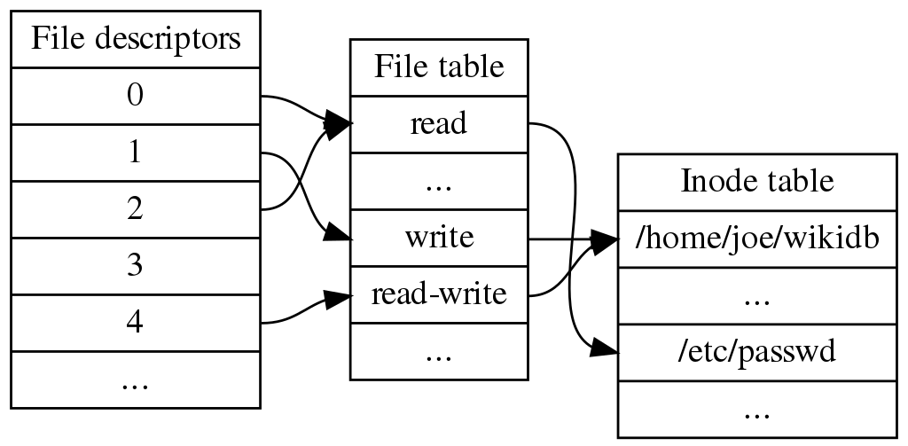

File descriptor, File table, Inode table2

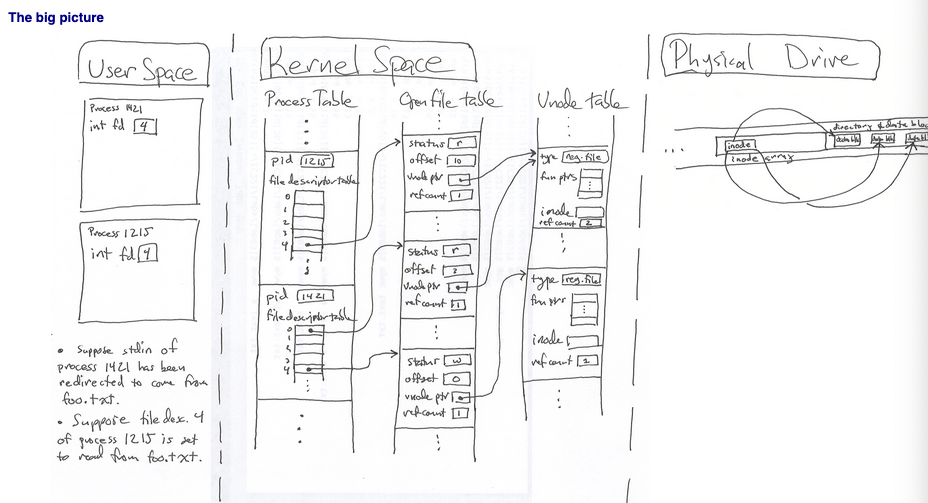

File descriptor, File table, Inode table3

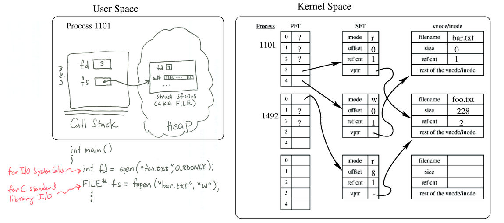

- file descriptor
  - 정의
    - Unix계열의 OS에서(POSIX), file이나 input/output 자원을 접근하기 위해서 사용하는 abstract handler(indicator)
    - file descriptor는 **per-process file descriptor table** 이라는 곳으로 인덱싱 되며, 각각의 file descriptor는 **(open)file table** 이라고 불리는 시스템 전체의 scope인 모든 프로세스에 의하여 open된 파일들을 담는 테이블과 연결이 됨
    - inode table과도 인덱싱되어서, 실제 파일이 어디있는지와도 대응이됨
    - e.g)
      - `pipe`, `network socket`
  - 특징
    - POSIX API에 포함됨
    - 음이 아닌 정수
      - `C File*`로 open된 file descriptor를 `int fileno(FILE* fp);` 함수로 가져올 수 있음
    - 유닉스 계열의 시스템에서는, 유닉스 파일 타입이라고 명명된 모든 것을 참조할 수 있음
      - regulart files, directories, block, character device, unix domain sockets, named pipe 등
        - 그래서 `lsof`커맨드로 소켓등도 확인할 수 있는것임
    - 유닉스 계열 시스템에서의 fd에의 operations
      - fd의 생성
        - `open()`
        - `socket()`
        - `pipe()`
        - `epoll_create()`(linux)
        - ...
      - 하나의 fd에 대한 operation
        - `read()`, `write()`
        - `recv()`, `send()`
        - `fstat()`
        - `fchmod()`, `fchown()`
        - ...
      - 여러 fd에 대한 operation
        - `select()`
        - `poll()`
        - `kqueue()`
        - ...
      - fd-table에 대한 operation
        - `close()`
        - `dup()`
        - `fcntl()`
      - file locking
        - `flock()`
        - `fcntl() (F_GETLK, F_SETLK and F_SETLKW)`
        - `lockf()`
      - Sockets
        - `connect()`
        - `bind()`
        - `listen()`
        - `accept()`
        - `getsocketname()`
        - `getsocketopt()`

three standard POSIX file descriptors

|Integer value|Name|`<unistd.h>` symbolic constant|`<stdio.h>` file stream|
|-------------|----|-------------------------------|----------------------|
|0|(해당 프로세스의) Standard input|STDIN_FILENO|stdin|
|1|(해당 프로세스의) Standard output|STDOUT_FILENO|stdout|
|2|(해당 프로세스의) Standard error|STDERR_FILENO|stderr|

- system open-file table(file table)
  - 정의
    - 하나의 파일에 대한 connection을 트래킹 하기 위한 테이블(kernel에서 관리)
  - 특징
    - 각각의 엔트리는 connection status를 갖음
      - read, write
      - 파일의 current offset
      - vnode의 pointer
- vnode table
  - 정의
    - open file이나 device에 대한 엔트리를 갖는 테이블(kernel에서 관리)
    - 각 엔트리는 vunode라고 함
      - 파일에 대한 메타데이터, *pointers to functions that operate on the file.*
        - *정확히 어떤 함수의 포인터를 말하는 것인지*
  - 특징
    - inode의 copy를 갖음

각각의 개념은 reference count를 갖으며, reference count가 0이 되어야만 각각의 entry를 삭제 가능 >> 그래서 파일이 열린 상태에서는(다른 프로세스가 해당 파일을 참조하고 있음) 삭제가 불가능했던것임

*만약 파일을 close하지 않은 상태로 프로세스가 종료된다면 무슨 일이 벌어지는가? 그냥 system open-file table에 대응하는 entry를 process종료 전에 dereference시켜주는가?*

### I/O multiplexing

- 정의
  - 하나 이상의 I/O대상(file descriptor)이 준비가 될 때 kernel로부터 notification을 받는 것
    - file descriptor의 이벤트 감지
    - *결국 내부적으로는 무한 루프를 도는 것인지*
- 예시
  - I/O대상은 Unix의 경우에는 파일로 나타나는 모든 것으로 이해가 가능하겠다
    - client가 다수의 file descriptor들을 다룰 때(stdin, stdout, network socket) - file
    - client가 다수의 socket을 다룰 때 - file
    - TCP server가 연결 listen과 생성된 client socket을 다룰 때 - file
    - 서버가 TCP, UDP를 동시에 다룰 때 - file
- 방식
  - `select`
  - `poll`
  - `epoll`

### Partition

- 정의
  - 하나의 물리적인 하드디스크에 논리적으로 분할 영역을 만드는 것
  - 하나의 하드디스크를 서로 별개의 하드디스크 처럼 쓰기 위해서 분할하는 것
- 특징
  - 파티션을 나누면 서로 다른 드라이브로 인식
    - C드라이브에 심각한 오류가 발생해도 D드라이브에 있는 파일들은 안전하게 보존 가능
    - 윈도우를 2개이상 설치해서 사용하는 멀티부팅 가능
    - 중요 데이터만 따로 보관 가능

### File system

- 정의
  - **저장장치의 파티션 내에서 클러스터 단위의 데이터를 배치하고 관리하기 위한 논리적 체계(저장장치의 파티션 별로 하나씩 둘 수 있음)**
    - 특정 데이터가 하드웨어 파티션 상에서 어디서부터 어디까지 저장된 것인지 파악
    - 사실상, 저장장치의 데이터를 인덱싱하는 것
      - 인덱싱 할 때, 키(파일 이름: case sensitivity, suffix의 길이)와 value(파일 내용 or 내용 크기 등)에 관한 스펙을 다 정해줌
    - 파일에 대한 메타데이터도 다 가지고 있고, 따로 관리
      - 메타데이터는 Unix-like 시스템에서 `inode`의 데이터 구조로 저장됨
      - *우리가 윈도우즈 탐색기로 파일들을 파악하는 것은 다 메타데이터로 하는 일(?)*
- 등장 배경
  - ① 클러스터와 블록개념의 도입
    - 하드 디스크를 단순히 실린더로 관리하면 큰 파일의 데이터를 읽고 쓰는데 너무 느린 문제가 발생
      - e.g) 10MB 파일 하드디스크로부터 읽기
        - 2 * 1024 * 10 개의 섹터(0.5KB)를 불러와야 함
    - **클러스터, 블록의 도입** (섹터들을 한 번에 여러 개를 읽는 기술 도입)
      - 섹터 한개 단위가아니라, 다수의 섹터 단위로 묶어서 읽고 저장
      - 대신, 한번에 여러 섹터를 읽으면 빈 섹터를 읽어버리는 경우가 존재(e.g 한 번에 4개의 섹터를 읽는데, 마지막엔 2개만 읽어도 충분한경우)
        - **Slack space**
      - 클러스터 => 윈도우 운영체제에서 사용되는 용어
      - 블록 => 유닉스 계열 운영체제에서 사용되는 용어
    - 블록(클러스터)를 몇 개의 섹터로 계싼하는 지는 파일 시스템 마다 다름!
    - **물리적으로는 클러스터, 또는 블록이라는 대응체가 없으므로, 블록이라는 것을 파일시스템이 소프트웨어적으로 계산해줘서 운영체제가 사용할 수 있는게 함**
      - 클러스터, 블록 이라는 단위를 계산해주는 것도 파일시스템의 역할 중 하나
    - 파일 시스템 덕분에 운영체제는 블록(클러스터) 단위로 데이터를 사용할 수 있는 것
      - 파일 시스템은 운영체제에 포함되어있음
  - ② 효율적으로 디스크의 데이터를 관리하는것의 필요성(파일의 삭제, 편집)
    - 섹터에 저장된 기존 파일의 크기가 더 커지면?
      - 같은 트랙에 데이터가 꽉 찼다면, 다른 빈 트랙에 넣어야 하는데, 컴퓨터가 다른 트랙의 어디에 저장되어있는지 어떻게 알 수 있는가?
    - 섹터에 저장된 기존 파일의 크기가 줄어들거나, 지워졌을 때는?
      - 트랙 중간중간에 빈 섹터가 생겨남
      - 디스크 모음의 필요성
- 역할
  - Each different filesystem provides the host operating system with metadata so that it knows how to read and write data. When the medium
  - 디스크의 데이터를 더 빠르게 읽고 저장할 수 있는 블록(클러스터)를 소프트웨어적으로 계산
  - 분산 저장된 연관 데이터들을 빠르게 찾게 해줌(인덱싱)
  - 디스크 조각(섹터) 모음과 같이 디스크 공간을 효율적으로 사용하게 해줌
- 블록(클러스터) 계산 방식(Addressing)
  - CHS(Cylinder-Head-Sector)
    - 물리적 주소 지정 방식
    - 실린더와 헤드 섹터 순으로 주소를 지정
    - 초창기에 사용
  - LBA(Logical Block Addressing)
    - 논리적 주소 지정 방식
      - 마치 3D 디스크 공간이 한 줄인양 할당이 됨
    - BIOS(Basic Input/Output System)
      - 실제 디스크 섹터 위치 <--> 논리적 섹터 위치 변환
    - 파일 시스템은 BIOS가 구현한 LBA를 이용해서 데이터를 효율적이게 관리하고 사용할 수 있게 블록(클러스터)계산
      - 블록(클러스터)은 LBA에서 논리적인 개념이 되어버림
    - 현재에도 사용중
    - **LBA에 의해서, 파일시스템은 섹터, 트랙, 실린더를 다루는 것이 아닌, 블록(클러스터) 기준으로 데이터를 다룸**

파일 시스템의 추상화 구조

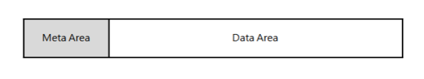

- 파일시스템의 추상화 구조(Meta Area, Data Area)
  - Meta Area
    - 데이터에 대한 데이터들이 저장되는 장소(인덱싱)
      - Linux의 I-node
      - 데이터의 블록 위치를 효율적으로 파악 가능
  - Data Area
    - 데이터를 저장하는 장소
- 특징
  - 저장공간을 사용한다면 무조건 필요한 소프트웨어이며, 운영체제에 무조건 필수적으로 포함 되어야 함
  - 저장장치의 종류마다 각자의 파일 시스템을 사용
    - 파일 하나의 크기 제한, 전체 디스크에 대한 크기 제한, 파일에 대한 저장 방식 등이 다 다름
  - local data storage 뿐 아니라, Network protocol을 이용한 파일 시스템을 사용하여 원격 서버의 파일을 제어가능
  - 특정 유저나 유저의 그룹만 파일이나 폴더를 읽고 쓸 수 있게 설정 가능

FAT 파일 시스템의 구조

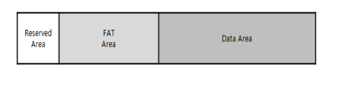

NTFS의 구조

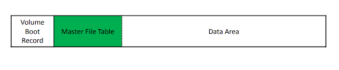

ext2의 구조

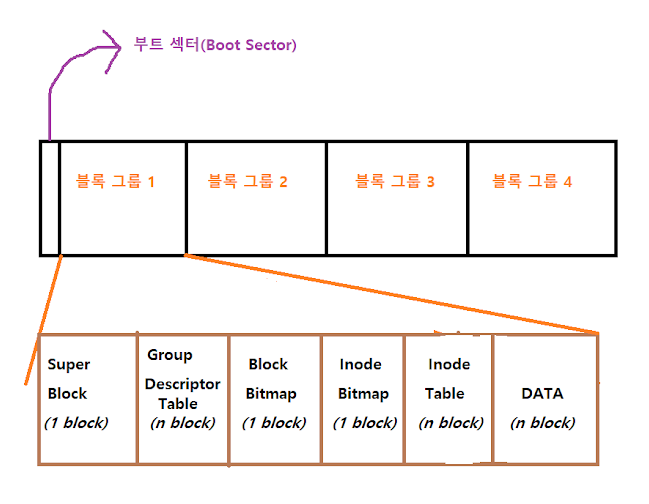

- 파일 시스템의 종류와 역사
  - FAT(File Allocation Table)
    - 종류 및 특징
      - FAT12
        - 2^12개수의 클러스터를 가질 수 있음
      - FAT32
        - USB에 자주 쓰임
        - 지원하는 최대 드라이브 크기는 32GB, 한 파일당 4GB
          - 4GB 이상 크기의 파일을 USB에 옮기려 하면, 파일 시스템을 바꿔야 함
    - 구조
      - Reserved Area
        - 예약된 행위 정보들이 들어있는 곳
        - Boot Block
          - 컴퓨터 부팅에 관련된 정보들이 들어있는 블록
        - FSINFO(File System INFOrmation) Block
          - 운영체제에게 알려줄 파일 시스템 정보가 있는 블록
        - 추가 예약 공간 블록
      - FAT Area
        - Meta Area
        - 파일에 얼마나 클러스터가 할당 됐는지 적혀있는 테이블(File Allocation Table)
          - 어떤 파일에 얼마나 많은 클러스터가 할당됐는지, 어디 있는지, 언제 수정되고 만들어졌는지 등의 정보 존재
      - Data Area
        - 데이터가 저장된 공간
  - NTFS(New Technology File System)
    - 특징
      - 디스크 크기 256TB
      - 한 파일 크기 제한 16TB
      - 디스크 복구 기능 존재
      - 서버용으로 사용 가능
    - 구조
      - VBR(Volume Boot Record)
        - 부팅에 관련된 정보들이 저장된 공간
      - MFT(Master File Table)
        - Meta Area
        - FAT Area와 유사
      - Data Area
        - 데이터가 저장된 공간
  - ext(extended file system)
    - 종류 및 특징
      - ext1
        - 2GB까지 용량 지원 파일 이름 255글자까지 지원
        - VFS 시스템 도입
          - 각각 파일 시스템의 정보들을 일관되게 가상적으로 같은 정보처럼 만들어서 운영체제에서 같이 사용할 수 있게 함
          - *구체적인 예시?*
        - 단편화 문제
          - 디스크 저장 공간 중간중간에 빈 공간이 생기는 현상
      - ext2
        - 2TB까지 용량 지원
        - 한 파일 크기 16GB까지 지원
        - i-node 기능 지원
        - 리눅스의 본격적인 파일 시스템 형태
        - 데이터를 저장하는 동안 전원이 끊기면 심각한 손상이 일어남
        - 블록 그룹 사용
          - 블록들의 집합
        - 구조
          - Boot Sector
            - 블록크기 까지는 필요 없는 부팅에 관한 정보들이 저장된 공간
          - Block Group
            - Super Block
              - 모든 블록에 해당되는 공통 정보들을 관리하는 블록
              - 블록의 크기, 총 블록의 개수, 블록 그룹의 개수, 블록 그룹 내 블록과 아이노드 개수
              - 중요하므로, 모든 블록 그룹의 맨 앞에 복사본을 만들어놓음. 사용은 첫번째 블록그룹에 속한 것만 함
            - Group Descriptor Table
              - 블록 그룹들의 데이터들이 어떻게 저장 됐는지 알려주는 데이터가 들어있음
                - Block Bitmap의 번호(위치)
                - Inode Bitmap의 번호(위치)
                - 블록 그룹안에 있는 빈 블록, 빈 디렉토리 수
                - Inode 수
                - Inode 테이블 번호(위치)
              - 모든 블록 그룹에 복사본이 존재
            - Block Bitmap
              - 사용되고 있는 블록이 몇개인지 기록
            - Inode Bitmap
              - 사용되고 있는 Inode가 몇개인지 기록
            - Inode Table
              - Inode들이 기록된 테이블
              - Inode한 개의 크기가 128Byte
            - DATA
      - ext3
        - 저널링 기술 도입
          - 디스크에 정보를 변경하기 전에 변경사항들을 저널이라고 부르는 로그 공간에 미리 기록
          - 디스크에 정보를 저장하던 도중에 전원이 끊겨도, 저널 로그를 보고 복구 가능
      - ext4
        - 1엑사 바이트 디스크 크기
        - 파일당 16테비 바이트 지원 2^40
  - XFS
    - 64비트 저널링 파일시스템
    - Redhat Linux 7버전 부터 기본 파일 시스템으로 채택
    - Centos 7 버전 부터 기본 파일 시스템으로 채택
    - 속도가 매우 빠름
- c.f) 포맷
  - 저장장치의 파일 시스템을 설정하여, 데이터 저장 장치를 준비하는 작업
  - 다만, 파일 시스템을 변경할 때, 저장 장치의 내용을 모조리 삭제하므로 보통은 이런 의미로 잘못되어 사용됨
- c.f) I-node
  - 개요
    - `ls -li` 이라는 명령어로 확인 가능
      - `i`는 i-node의 번호 조회
    - i-node list table에 i-node정보를 저장
  - 구성
    - 파일 형식
    - 파일 권한
    - 링크 수
    - 파일 소유주
    - 파일 그룹
    - 파일 크기
    - 파일이 만들어진 시간

### Mount

- 정의
  - OS가, storage device에 있는 파일과 디렉터리를, 유저가 컴퓨터의 파일 시스템을 통해서 접근할 수 있도록 만드는 과정
    - *근데 결국 디렉터리 구조에 편입시킨다는 것은 다른 파일 시스템(메인 파일 시스템??)과 연결 시킨다는것 아닌가?*
      - e.g) 리눅스에 usb를 연결 시키면, 특정 위치의 디렉터리가 생겨서 usb에 접근 가능(usb 내부의 경로도 인터페이스 변경 없이 터미널로 접근 가능)
- 과정
  - storage device에 접근 권한 획득
  - 인식
  - 읽기
  - 파일 시스템 구조와 메타데이터 processing
  - VFS(Virtual File System) 컴포넌트로 등록
- mount point
  - 새로 마운트 된 저장 장치 파티션의 VFS상의 location
    - *애초에 우리가 아는 절대경로 / 등은 그냥 VFS의 인터페이스?*
  - 마운트 프로세스가 끝나면 이 장소에서 파일과 디렉터리를 접근 가능
- unmount
  - OS가 mount point에 있는 파일과 디렉터리에 대한 모든 유저접근을 막음
  - 큐에 남아있는 유저데이터를 스토리지 디바이스에 넘겨줌
  - file system metadata를 refresh 해줌
  - 디바이스에 접근을 포기함
    - 안전한 디바이스 제거 가능하게 함

### Inode

*파일의 이름은 파일시스템의 어디에 저장되는것인지?*

- 정의
  - 유닉스 계통 파일 시스템에서 사용하는 자료구조
    - 정규 파일, 디렉터리 등 파일 시스템에 관한 정보를 가지고 있음
- inode에 포함된 정보
  - `ls -alh`의 필드
    - 파일 모드(16비트 플래그)
      - 파일 형식(-, d, b, c, p, ...)
      - *실행 플래그*
        - 이게 뭐야?
      - 소유자 rwx
      - 그룹 rwx
      - 다른 사용자 rwx
    - 소유자 아이디
    - 그룹 아이디
    - 파일 크기
    - 마지막 수정 시각
    - 파일 주소(39바이트)
  - 그 외
    - 링크 수
    - 마지막 접근 시각
    - 아이노드 수정 시각
- 특징
  - 파일들은 각자 1개의 inode를 가지고 있음
  - 일반적으로 파일 시스템을 생성할 때 전체 공간의 약 1%를 inode를 위해 할당
    - 따라서, 파일 시스템이 가질 수 있는 파일 최대 개수도 한정적(사실상 사용자가 느끼기에는 무한대로 생성가능)

### Softlink vs Hardlink

Simplified hardlink illustration

- Softlink
- Hardlink

Softlink storage

Early implementations of symbolic links stored the symbolic link information as data in regular files. The file contained the textual reference to the link's target, and the file mode bits indicates that the type of the file is a symbolic link.

This method was slow and an inefficient use of disk-space on small systems. An improvement, called fast symlinks, allowed storage of the target path within the data structures used for storing file information on disk (inodes). This space normally stores a list of disk block addresses allocated to a file. Thus, symlinks with short target paths are accessed quickly. Systems with fast symlinks often fall back to using the original method if the target path exceeds the available inode space. The original style is retroactively termed a slow symlink. It is also used for disk compatibility with other or older versions of operating systems.

Although storing the link value inside the inode saves a disk block and a disk read, the operating system still needs to parse the path name in the link, which always requires reading additional inodes and generally requires reading other, and potentially many, directories, processing both the list of files and the inodes of each of them until it finds a match with the link's path components. Only when a link points to a file in the same directory do "fast symlinks" provide significantly better performance than other symlinks.

The vast majority of POSIX-compliant implementations use fast symlinks. However, the POSIX standard does not require the entire set of file status information common to regular files to be implemented for symlinks. This allows implementations to use other solutions, such as storing symlink data in directory entries. - Wikipedia

### File system types

#### UnionFS

- 정의
  - 다른 file system과의 union mount를 구현한 Linux, FreeBSD, NetBSD용 파일 시스템
    - *여기서 다른 file system 이라는 것은 같은 UnionFS 계열의 FS를 말하는 것인가? 아니면 ext4 이런 파일 시스템도 지원이 가능하다는 것인가?*
  - c.f) union mount
    - 다수의 디렉터리를 하나의 디렉터리로 합쳐서, 결합된 컨텐츠 처럼 보이게 하는 것
    - *e.g) CD-ROM 또는 DVD 안에 있는 컨텐츠를 업데이트 할경우, CD의 마운트 포인트를 union mount에 있는 writable directory로 overlay할 수 있고, 그 다음에, union directory 속에 있는 파일들을 업데이트하면 결국에는 writable directory로 만드는 것과 같음*
      - *애초에 CD-ROM이 Read-only인데 파일 시스템을 overlay하고 union directory속의 내용을 바꾼다고 정말 내부 내용이 바뀌는가?*
- 특징
  - 분리된 파일 시스템의 디렉터리와 파일들을(branches) 투명하게 overlay해서 하나의 일관성 있는 파일 시스템으로 만듬
    - 같은 경로에 있는 디렉터리의 컨텐츠들은 새 virtual fs의 하나의 통합된 디렉터리 안에서 같이 보이게 됨
  - branch들을 마운트 하는 경우에는, priority가 명시됨
    - 같은 브랜치가 같은 이름의 파일을 갖고 있다면, 우선순위가 높은쪽을 보게 됨
  - *각 브랜치는 read-only 혹은 read/write 파일 시스템이 될 수 있어서, 그 경우에는 merged copy는 특정한 real file system으로 보내짐*
    - *이게 무슨소리?*
    - Copy on Write
    - e.g) Live CDs
  - docker
    - *docker image의 레이어화를 시키기 위해서 사용됨*
      - *구체적으로 어떤 원리인지?*
      - 각 레이어마다 실행되고나서의 fs상의 이전레이어의 state와의 state diff를 저장?
- 다른 unionfs 구현체
  - aufs
  - overlayfs

## Process

### Process

- 정의
  - 하나 혹은 그 이상의 스레드에 의해서 실행되고 있는 컴퓨터 프로그램의 인스턴스
- 분류
  - fg
    - 사용자가 직접적으로 제어 하는 프로세스
  - bg
    - 사용자가 직접적으로 제어 하지 않는 프로세스

### Daemon

- 정의
  - 사용자가 직접적으로 제어하지 않고, 부팅 때 자동으로 initialize되어, 백그라운드에서 동작하면서 여러 작업을 수행하는 프로그램
- 특징
  - 유닉스에서 부모 프로세스가 PID 1(init process) 이고, 제어하는 터미널이 없을 때, 그 프로세스를 데몬이라고 부름
    - 자식 프로세스를 fork 하여 생성 -> 자식을 분기한 자신을 죽임 -> init이 고아가 된 자식 프로세스를 자기 밑으로 데려감
  - MS 계열에서는 서비스라고 부름
- Daemon vs Service
  - Daemon
    - 최초 프로세스인 `init(or systemd)`가 initialize할 때, 실행하는 스크립트 디렉토리에 두면 바로 "데몬"이 됨
  - Service
    - `sc.exe`와 같은 프로그램으로 윈도우 API 함수를 이용해 등록해야 함

### Processor affinity

- 동의어
  - CPU pinning, cache affinity
- 정의
  - process나 thread를 하나의 CPU나 복수개의 CPU 그룹으로 바인딩 하여, process나 thread가 지정된 CPU나 CPU 그룹에서만 실행되도록 하는 것
    - queue를 이용하여 구현
- 장점
  - processor를 고정시키므로써, cpu cache memory속의 캐시를 그대로 사용할 수 있게 함(퍼포먼스 향상)
- 단점
  - 로드 밸런싱을 해야함

### Process group

- 정의
  - POSIX 준수 OS에서의 하나 혹은 하나이상의 프로세스들을 의미
- 기능
  - signal의 분배를 조정하는데에 사용됨
    - signal이 프로세스 그룹으로 보내지면, 그룹의 모든 프로세스로 해당 시그널을 보냄(broadcast)
- 참고) session
  - 정의
    - 하나나 하나이상의 프로세스 그룹의 컬렉션
  - 특징
    - 프로세스는 하나의 세션에서 다른 세션으로 migration불가

### Pipeline

- *pipe는 왜, 어떻게 파일로 관리되는것인지?*
- *pipeline은 socket과 어떤 차이가 있는지?*
  - pipeline은 특정 호스트 안에서만 IPC가능하게 함
  - socket은 IPv4, IPv6를 사용해서 호스트 사이의 IPC를 가능하게 함
    - unix socket은 pipeline과 거의 비슷한 역할을 함

Pipeline

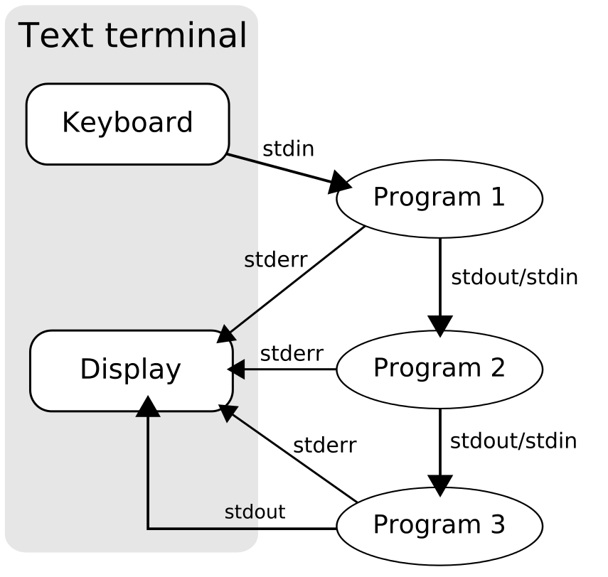

- 정의
  - Unix 계열 OS에서, *message passing* 을 사용하는 IPC(Inter-Process Communication)
  - standard stream에 의해서 process들의 집합이 체인된 것인데, 그리하여, 각각의 프로세스의 stdout이 다른 프로세스의 stdin으로 패싱됨
  - 두번째 프로세스는 첫번째 프로세스가 실행되고 있는 동안에 실행되며 concurrent한 성질을 갖음
- 종류
  - **anonymous pipes**
    - 하나의 프로세스에서 작성되는 데이터는 OS에 의해 다음 프로세스로 읽히기 전까지 buffer로 저장됨
    - uni-directional
    - shell 문법에서는 `|`로 구분
      - `process1 | process2 | process3`
      - `|`는, shell에게 왼쪽 커맨드의 stdout을 오른쪽 커맨드의 stdin으로 연결해주는 역할
    - 일반적으로 프로세스의 stderr는 pipe로 전달되지 않음
  - **named pipes**
    - 파일을 생성하므로써, 메시지가 프로세스 양방향으로 전달될 수 있음
    - 프로세스들이 끝나도 그대로 존재
    - python3의 `multiprocessing.Queue`가 named pipe를 사용해서 프로세스 사이의 데이터 송수신을 함
      - object가 queue에 놓임
      - object가 pickled됨
      - background thread가 pickled데이터를 pipe로 전달
        - 다수의 프로세스끼리 queue에 데이터를 주고 받을 때에는 항상 순서대로 전송 / 수신이 된다는 보장이 없음
        - *근데 굳이 왜 background thread를 사용해야 했을까?*
- 구현
  - 유닉스 계열의 시스템에서, *파이프라인의 모든 프로세스(파이프 라인의 모든 프로세스가 무슨 의미인지?)*는 동시에 시작되며, 스트림이 적절하게 연결되고, 스케줄러에 의해 관리되며, 다른 모든 프로세스가 machine에서 실행됨
  - buffering이 존재
    - 보내는 쪽이 5000bytes/s 로 보내고, 받는 프로그램이 100bytes/s로 받아도, 데이터가 상실되지 않음
      - 보내는 쪽의 데이터가 buffer에 일시적을 존재
      - 받는 쪽은 buffer로 부터 데이터를 받음
  - `netcat`, `socat`을 이용해서 socket과 연결도 가능

### IPC(Inter-Process Communication)

- 정의
  - **OS가** 프로세스들이 데이터를 공유하는 방법을 제공하는 매커니즘
    - 주로 client-server 모델을 사용
- 접근
  - host 내부
    - File
      - 대부분의 OS
    - Socket
      - 대부분의 OS
      - network interface 사용
        - Stream-oriented(TCP)
        - Message-oriented(UDP)
    - Unix domain socket
      - POSIX / Windows 10
      - kernel 내부에서 커뮤니케이션 발생
        - domain socket은 file system을 주소공간으로 사용
    - Shared memory
      - POSIX / Windows
      - 다수의 프로세스가 같은 메모리 블록을 접근(shared buffer)
    - Pipe
      - Anonymous pipe
        - POSIX / Windows
        - stdin, stdout을 활용한 unidirectional data channel
        - 프로세스에 의해서 데이터가 작성되면, OS는 다른 프로세스가 다 읽을 때 까지 데이터 buffering함
      - *Named pipe*
        - POSIX / Windows
        - pipe가 file과 같이 간주됨(stdin, stdout 대신)
        - 프로세스들은 named pipe에 일반 파일처럼 write하거나 read함
    - Signal
      - 대부분의 OS
      - system message를 프로세스끼리 주고 받음
      - 데이터 전송 보다는, 명령을 내리기 위해서 사용
    - *Message queue*
      - 대부분의 OS
      - 프로세스들이 직접적으로 연결되지 않아도, message queue를 이용해서 읽고 쓸 수 있음
    - *Message passing*
      - RPC 등에서 사용
      - 다수의 프로그램이 message queue들을 이용해서 커뮤니케이션을 하고 non-OS managed channel을 이용하기도 함
        - concurrency 모델에서 사용됨
    - *Memory-mapped file*
      - 파일이 RAM과 매핑되어있고, memory 주소들을 바꿈으로써, 수정될 수 있음
  - host-to-host
    - Socket
      - 대부분의 OS
      - network interface 사용
        - Stream-oriented(TCP)
        - Message-oriented(UDP)
    - RPC

#### Signal(IPC)

- 정의
  - IPC의 제한된 형태이며, Unix, Unix-like나 POSIX-compliant 운영체제에서 사용됨
  - 프로세스 혹은 스레드에게 전송되는 비동기 notification
- 동작
  - 1 signal을 보냄
  - 2 OS가 타겟 프로세스의 일반적인 실행 흐름을 interrupt해서 signal 전달
  - 3 프로세스가 signal handler를 등록했었으면, 해당 루틴이 실행되며, 그렇지 않은 경우에는 default signal handler가 실행됨
- 특징
  - 임베디드 프로그램은 IPC에 있어서 유용하게 사용함
    - 오버헤드가 적음
  - interrupt와 유사
    - 차이점
      - signal
        - kernel에 의해서 mediated(중재? 매개?)되며(아마도 via systemcall), process에 의해서 다뤄짐
          - 커널은 interrupt를 프로세스에 signal로써 넘겨줄 수 있음
          - e.g) `SIGSEGV`, `SIGBUS`, `SIGILL`, `SIGFPE`
      - interrupt
        - processor에 의해서 mediated되며, 커널에 의해서 다뤄짐

## Memory

Memory abstraction example

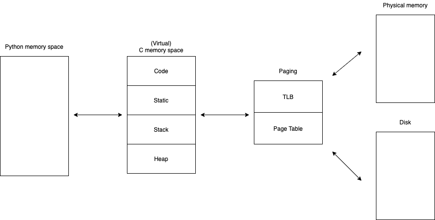

*Memory segmentation / paging / virtual memory / swap 개념들 사이의 관계?*

- 메모리 관리 역사
  - plain physical memory
  - overlays
  - segmentation
  - paging

### Address space

virtual address space and physical address space

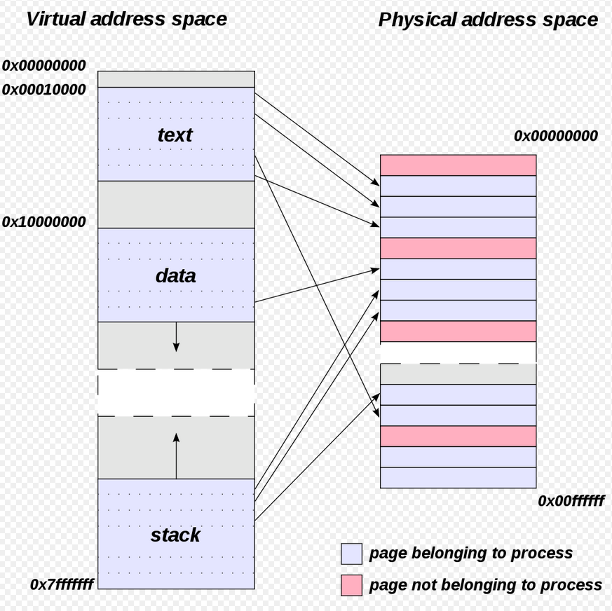

- 정의
  - 논리적 혹은 물리적인 entity에 대응할 수 있는 주소들의 범위
    - 반드시 memory에만 해당하는 것이 아님. DNS - IP - MAC 이런식으로 네트워크 address space를 분리할 수 있음
  - space이므로, 수학적인 대수구조로 생각하면 mapping도 쉽게 의미 유추 가능
- 특징
  - 다양한 layer끼리의 mapping and translation
    - higher-level address는 lower-level address로 매핑되어야 함
      - e.g)
        - logical disk위에 있는 fs는 linear한 주소를 absolute LBA sector 주소(Cylinder-Head-Sector 등)로 바꿔야 함
        - DNS - IP - MAC address space 매핑
  - virtual - physical address translation
    - virtual address space의 서로 다른 pages를 page file 혹은 메인 메모리의 physical address로 매핑

### Virtual memory

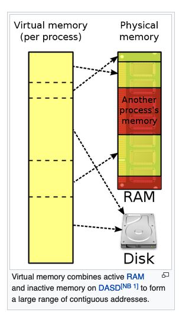

- 정의
  - memory 관리 기술 s.t. 실제로 주어진 머신에서 사용가능한 메모리 자원의 idealized abstraction
  - 결과적으로, 유저에게는 매우 큰 main memory가 있는 것 처럼 보임
- 개요
  - OS는 프로그램이 사용하는 memory address(virtual address)를 컴퓨터 메모리의 실제 physical address로 매핑함
  - 일반적으로 하드웨어 MMU(Memory Management Unit) 라는 하드웨어 서포트가 필요함
    - CPU에 존재하는 address를 변환해주는 하드웨어
      - virtual addresses <-> physical addresses
  - OS 내부의 소프트웨어는 실제 메모리의 크기보다 더 큰 virtual address space를 사용할 수 있도록 하는 기능도 있음
- 장점
  - 프로그램이 다른 프로그램과 공유가 되는 메모리공간을 다루는 복잡도로부터 해방
    - 실제 메모리의 fragmentation을 숨김
    - kernel이 다루도록 함
  - memory isolation
    - 보안 강화
  - paging
    - 실제 물리적으로 사용가능한 메모리보다 더 많이 메모리 사용 가능
- 단점
  - Embedded system과 같은 특수 목적의 컴퓨터 시스템은, 반응속도가 느린 등의 단점이 생김
  - MMU와 같은 하드웨어를 내장해야 하므로, 비용 문제
- 사용
  - 과거의 컴퓨터 메인프레임은 Virtual memory 기능이 없었음
  - 1960, 1970 년대에는 메모리가 매우 비쌌음
    - virtual memory가 널리 퍼진 계기
  - 현대 OS에서는 각 프로세스마다 그에 대응되는 virtual address space를 갖음
    - 옛날 OS에서는 모든 프로세스를 하나의 virtualized memory로 이루어진 address space에서 실행

#### Paged virtual memory

- 개요
  - 거의 모든 현재의 virtual memory 구현은 virtual address space를 page(연속된 virtual memory address의 블록들)로 분리함
  - page는 적어도 4KB의 크기이며, 보다 더 큰 페이지 사이즈를 사용할 수 있음

### Paging

*페이징 기술을 사용하면, 각 프로세스마다 virtual memory를 사용하게 되는데, 어떻게 buffer overflow공격이 가능한 것인지? 자신의 process 내부의 virtual address의 값을 바꾸는 것인지?*

결국 페이징이라는 것은, 프로그램이 virtual memory를 사용할 수 있도록 하는 방법론인데, 그 virtual memory속의 page는 physical memory 혹은 disk의 같은 크기의 page와 1:1매칭되는 unit이고, virtual memory는 linear하게 구성됨

- 정의
  - 메인 메모리에서 사용하기 위해, secondary storage(디스크)로부터 데이터를 가져오거나 거기에 데이터를 저장하는 메모리 관리 scheme
- 특징
  - OS가 관장
  - OS는 page라고 불리는 secondary storage로부터 같은 크기의 블록 데이터를 갖고 옴
  - virtual memory 구현에 매우 중요함
    - 실제 물리적 메모리 보다 더 많은 메모리를 프로그램이 사용가능하게 함
  - 하나의 process의 virtual address space는 여러개의 page의 구성으로 이루어져 있음
- page fault
  - 경우의 수
    - 1 해당 virtual address에 변환이 불가능한 경우(invalid)
      - OS는 segmentation fault signal을 해당 프로그램을 보냄
        - *paging인데 왜 segmentation fault인가? memory segmentation과는 전혀 다른 의미인가?*
    - 2 RAM(Physical memory)에 존재하지 않는 페이지를 프로세스가 참조하려 할 때 나는 에러
      - 다른 page를 위하여 일시적으로 disk로 해당 page 저장
        - backing store은 다음과 같이 불림
          - swap partition (if it is a disk partition)
          - swap file (if it is a file)
          - page file (if it is a file)
      - control을 해당 프로그램에서 os로 넘김
      - physical memory가 가득 차지 않은 경우
        - page를 disk로부터 가져와서 physical memory로 넣어줌
        - page가 physical memory에 저장되고, page table, TLB가 업데이트 됨
        - 다시 instruction 실행
      - physical memory가 가득 차 있는 경우
        - 하나 혹은 그 이상의 physical memory의 페이지가 paged out되어서 여유 공간을 만들어야 함
        - page table은 기존에 physical memory에 존재하던 page들이 더 이상 존재하지 않는다고 마킹함
        - TLB 업데이트
          - paged out된 페이지를 제거함
          - 새로운 페이지를 TLB에 등록
      - *page frame?*

the structure of page table

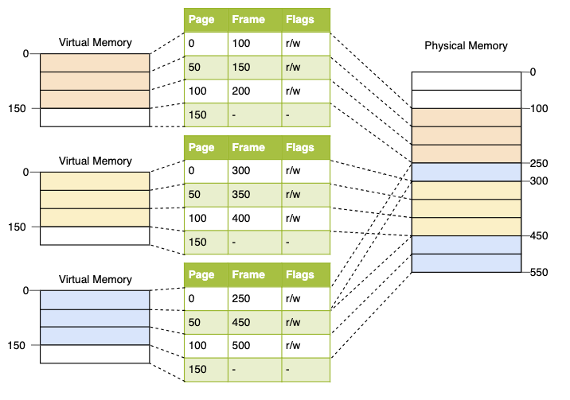

page table translation process

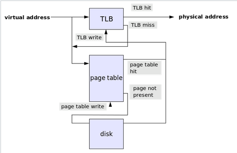

- page table
  - 정의
    - OS의 virtual address - physical address매핑을 저장하는 장소
      - 각각의 mapping은 PTE(Page Table Entry) 라고 불림
  - 개요
    - program이 마치 linear한 메모리를 사용할 수 있는 것처럼 virtual address를 다룰 수 있게 하고, 해당 virtual address를 physical address로 매핑함
      - 매핑을 가능하게 해주는 하드웨어는 MMU
  - 구조
    - TLB(Translation Lookaside Buffer)
      - 최근에 사용된 매핑 캐시를 저장
      - *associative cache*
  - virtual address - physical address translation(mapping)
    - virtual address가 physical address로 변환 시도
    - TLB를 탐색
      - 존재하면 physical memory address를 반환
    - Page walk
      - MMU나 OS TLB miss handler가 Page table을 확인해서 매핑이 존재하는지 확인
    - 존재하면 TLB에 작성해야 함
    - 다시 처음 시도했던 변환을 처음부터 다시 시도(TLB 서칭이 다시 일어남)
- page supervisor
- pinned pages

### Swap in and out

- 개요
  - swap out
    - 프로세스가 사용하는 메모리를 메인메모리에서 디스크로 저장함
  - swap in
    - 프로세스가 사용하는 메모리를 디스크에서 메인메모리로 불러옴

### Memory segmentation

*segmentation fault와 관련이 있는가?*

- 정의
  - 컴퓨터의 primary memory를 segment나 section들로 분리하는 메모리 관리 기술
- 특징
  - 메모리 위치에 대한 참조는 세그먼트임을 나타내는 값과 offset을 가지고 이루어짐
  - x86-64 아키텍처에서는 레거시 시스템이 되었음
    - 대신 memory-paging을 사용함
    - 그래도 backward compatibility를 이유로 서포트 자체는 함
- 장점
  - process간의 memory를 격리시켜서 system의 reliability를 높임

### Overlay

- 정의
  - 프로그램 코드나 다른 데이터의 블록을 기존에 메인메모리에 저장되어 있던 것을 덮어씌우는 프로세스
- 특징
  - 컴퓨터의 메인 메모리보다 더 큰 메모리를 차지하는 프로그램을 동작할 수 있게 하는 방법(Paging과는 다른)
    - *더 필요하면 기존에 자신이 사용하던 메모리도 덮어씌워서?!*

### OOM killer(Linux)

왜 페이징을 안쓰고 그냥 메모리를 죽여버리는지? >> 페이징과 스와핑까지 사용하고 남은 공간이 없을 때 kill함

*시스템에 현재 동작하는 모든 프로세스의 메모리 사용량이 피지컬 메모리를 상회해서 그런가?*

- 정의
  - 시스템의 가용 메모리가 매우 적을때, Linux 커널이 프로세스를 동작시키기 위한 메모리 확보를 하기 위해서, 여타 프로세스를 죽이는 프로세스
- 배경
  - 일반적으로 프로세스가 시작하면, 커널에 메모리를 요청하는데, 그 요청은 프로세스가 초기에 사용하는 양 보다 더 많음
    - redundant memory(over allocation)
    - e.g)
      - 시스템은 8GB메모리 공간이 존재하는데, 커널은 8.5GB를 해당 프로세스에 할당할 수 있음
  - 일반적으로는 문제를 일으키지 않으나, 프로세스들이 요청한 메모리를 다 사용하면서, physical memory가 모든 프로세스를 돌리기 위해 충분하지 않은경우에 문제가 생김
    - *그냥 메모리 스왑하면 안돼?*
      - *스왑 공간 제한도 다 차서 그런가?*
- 삭제할 bad 프로세스 선택
  - 특징
    - 1 kernel은 필요한 최소한의 메모리만 확보함
    - 2 Try to reclaim a large amount of memory
      - *??? 1이랑 모순되는 내용?*
    - 3 적은 양의 메모리를 사용하는 프로세스는 죽이지 않음
    - 4 최소한의 숫자의 프로세스만 kill
    - 5 *Some meticulous algorithms that elevate the sacrifice priority on processes the user wants to kill*
  - 선정
    - 리눅스 `proc_oom_score(seq_file, pid_namespace, pid, task)` 함수 호출
      - *여기서 나오는 seq_file, pid_namespace, pid, task란 무엇인가?*
      - `oom_badness(task_struct, totalpages)`
        - 이곳에서 프로세스의 OOM score결정
- 프로세스 삭제
  - 삭제할 프로세스가 생긴 경우에는, OOM-Killer가 `oom_kill_task()`함수 실행
    - 해당 프로세스에 `SIGKILL` 시그널을 보냄
    - 커널 로그도 남김(Print a warning-level message)
  - 주로 DB, Apache, 등의 프로세스가 죽을 떄가 많음 or task worker
- 관련 설정
  - OOM-killer 자체
    - `sudo -s sysctl -w vm.oom-kill = 1`
      - enable
      - 0은 disable
      - temporary
      - permanent
        - `/etc/sysctl.conf`파일에 `vm.oom-kill = 1`을 텍스트로 넣어둬야 함
    - `echo 0 > /proc/sys/vm/panic_on_oom`
      - disable
  - Memory overcommit(`vm.overcommit_memory`)
    - 0
      - kernel이 overcommit할지 말지 결정함(Heuristic)
    - 1
      - 항상 overcommit 허용
    - 2
      - 제한적 overcommit 허용
      - `commit 최댓값 = Swap 영역 + 물리 메모리 * vm.overcommit_ratio`
  - Swappiness(`/proc/sys/vm/swappiness`)
    - 값이 클 수록 OOM killer가 프로세스를 죽일 확률이 적어지나, 전반적인 작업속도 성능이 나빠짐
    - 값이 적어지면 OOM killer가 프로세스를 죽일 확률이 높아지나, 전반적인 작업속도 성능이 향상됨

### Memory overcommitment

*실제 필요한 메모리 사용량 > swap + physical memory 인 경우에 OOM-killer가 동작하는 것인지?*

- c.f) Memory commitment
  - 정의
    - **프로세스는 메모리 공간을 할당받았다고 생각하지만, 실제로는 물리 메모리 어느 곳에도 할당되어지지 않은 상태**
- 정의
  - 실제 physical machine보다 더 많은 메모리를 virtual computing device(or process)에 할당하는 것을 다루는 개념(physical machine의 메모리 양보다 더 많은 양의 메모리를 commit하는 것)
    - 이것이 가능한 이유는, 할당받은 virtual machine혹은 process는 반드시 할당 받은 메모리를 일정 시점에 다 소비하지 않아도 되기 때문
    - e.g)
      - 4GB의 물리적 메모리를 갖는 호스트 내에 4개의 VM이 1GB의 메모리를 갖는 경우에는, 실제로 VM이 겨우 500MB 밖에 메모리를 사용하지 않는경우, 추가적인 VM을 생성할 수 있음
- 특징
  - 메모리 사용이 급증하면, Memory swapping이 사용됨
    - swapping은 실제 메모리를 사용하는 것 보다 느림
  - `vm.overcommit_memory` 변수의 값에 따라 다름
    - 0
      - kernel이 overcommit할지 말지 결정함(Heuristic)
    - 1
      - 항상 overcommit 허용
      - OOM 에러가 날 가능성 존재(risky)
    - 2
      - 제한적 overcommit 허용
      - `commit 최댓값 = Swap 영역 + 물리 메모리 * vm.overcommit_ratio`
      - PostgreSQL에서 추천되는 옵션
- 사용 예시
  - VM
  - `fork()`
    - 일시적으로 부모 프로세스의 모든 메모리 주소 공간만큼의 메모리 확보가 필요함

## Virtualization

- 종류
  - OS-level virtualization
  - Application virtualization

### OS-level virtualization

OS-level virtualization

- 정의
  - **kernel이 다수의 격리된 user space instance를 허락하는 OS 패러다임**
    - user space는 kernel space와 대비되는 개념
- user space instance를 부르는 이름
  - containers, Zones, virtual private servers, partitions, virtual environments, virtual kernels, jails
    - 위의 user space instance에서 동작하는 프로그램은 진짜 computer의 user space처럼 보이게 됨
    - 그러나, 컨테이너에 할당된 컨텐츠와 장치만 볼 수 있음
- 동작
  - **OS-virtualization(containerization) 에서는 전체 OS의 일부의 자원들만 할당된 컨테이너 에서 프로그램을 동작시킬 수 있음**
  - 각각의 컨테이너는 임의의 개수의 컴퓨터 프로그램을 포함함
  - 이러한 프로그램들은 concurrently, separately 동작하고 서로서로 상호작용하기도 함
  - c.f) application virtualization
    - 하나의 프로그램이 파일 시스템만 격리된 곳에 놓여짐
- 사용
  - virtual hosting 환경
    - 제한된 하드웨어 자원을 서로 신뢰하지 못하는 다수의 유저들사이에 안전하게 할당시킬 때
  - 서버 하드웨어의 통합
    - 여러 호스트에 존재하는 하드웨어 자원의 통합
  - improved security
- 특성
  - 오버헤드
    - full virtualization보다는 적은 오버헤드
      - OS 레벨 virtual partition에 있는 프로그램들은 OS의 일반적인 system call 인터페이스만 사용하며, emulation이나 중간의 virtual machine이 존재하지 않음
  - 유연성
    - 다른 virtualization 접근 방식보다 유연하지는 않음
      - guest OS를 호스트 OS와 다른 것으로 *호스팅* 할 수 없음
        - *근데 docker는 windows docker에서 linux호스팅 가능하지 않나?*
  - 스토리지
    - file-level *copy-on-write(COW)* 메커니즘 제공하는 경우도 존재
      - 파티션끼리 기본 fs는 공유되고, 파티션들은 파일을 수정할 때, 자신들의 카피를 만듬
    - block-level copy-on-write 보다 공간 복잡도에 효율적이고 캐시하기에 간단함
      - whole-system virtualization에서 채용

### LXC(Linux Container)

- 정의
  - **다양한 격리된 Linux system(container)을 하나의 Linux kernel을 사용하는 컨트롤 호스트 위에 동작시키는 OS level의 virtualization**
- 원리
  - **cgroups**
    - 자원의 제한과 우선순위 부여
      - CPU, memory, block I/O, network, ...
      - virtual machine이 필요 없음
    - Linux kernel이 제공하는 기능
  - **namespace isolation**
    - OS의 environment에 대한 application의 뷰를 완전히 격리
      - process tree, networking, user IDs, mounted fs 등
  - LXC는 위의 두 기술의 결합

### Virtualization

- 정의
  - 가상의 무엇인가를 만드는 기술
- 구체적 예시
  - NAT(Network Address Translation)
    - 존재하지 않는 IP를 가상으로 만들어서 배정
  - VPN(Virtual Private Network)
    - 같은 공용 통신망을 통해 통신을 하지만, 패킷을 암호화해서 주고 받아, 마치 사설 네트워크를 만드는 것과 같은 기술
  - RAID, LVM

### Server Virtualization

- 정의
- 사용하는 이유
  - 서버의 자원을 효율적으로 최대한 사용하기 위함
- 구현에 따른 분류
  - 전 가상화(Bare-metal/hypervisor)
    - 개요
      - 순수한 하드웨어 위에 운영체제나 BIOS가 아닌 Hypervisor가 있는 구조로 이루어지는 가상화
        - 하이퍼바이저는 가상머신을 만들고 관리하는 프로그램
    - 특징
      - VM의 입장에서 하드웨어 자원은 무조건 하이퍼바이저를 통해서 사용 가능
  - 반(더 진보한) 가상화(Para-virtualization)
    - 개요
      - 전 가상화와 달리, VM이 하드웨어 자원을 직접적으로 사용 가능
  - 호스트 기반 가상화
    - VMware나 VirtualBox와 같은 가상화 구현 프로그램을 이용한 가상화
- 세대 별 분류(기술 수준)
  - 1세대
    - 하나의 물리적인 서버에 하이퍼바이저로 여러 개의 가상머신을 생성하는 수준
    - 예시
      - VirtualBox
  - 2세대
    - 다수의 물리적인 서버의 자원들을 하나로 묶어서 서버 풀을 구성하고 관리할 수 있는 수준
      - 특정 서버에 문제가 생겼을 때, 문제 있던 서버에서 실행중이던 가상머신들을 다른 정상 작동하고 있는 서버로 옮기는 실시간 마이그레이션 기술 사용
  - 3세대
    - 다른 하이퍼바이저끼리도 서버 풀을 구성하고 관리가 가능
    - 예시
      - OpenStack, CloudStack, Eucalyptus, OpenNebula, ...

## Application Layer

### deb

- 정의
  - Linux distribution Debian과 해당 관련 리눅스 배포판의 software package format의 확장자
