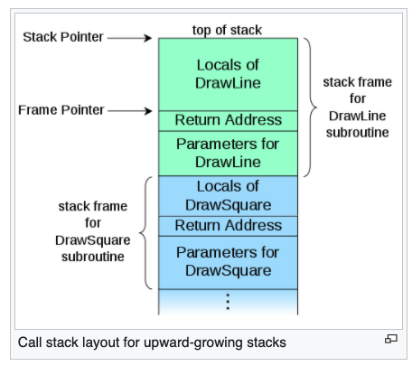

# Programming 용어

- General
  - coroutine
  - generator
  - iterator
  - asynchronous iterator, generator
  - promise
  - future
  - event loop
  - argc vs argv
  - weak reference
  - mutex(lock)
  - scope
  - closure
  - call stack
  - stack trace(stack backtrace, stack traceback)
- Data structure
  - stream
  - buffer
  - lookup table
- Program
  - *Library*
    - *DLL*
  - Manifest file
  - Magic number

## General

- coroutine
- generator
- iterator
- promise
- future

### coroutine

- 정의
  - non-preemptive인 multitasking을 위한 subroutine의 일반화 버전의 컴퓨터 프로그램 컴포넌트

### generator

참고

- [이터레이터와 제너레이터](https://mingrammer.com/translation-iterators-vs-generators/)

Generator, Iterator relation diagram


- 정의
  - *루프의 iteration 행위를 컨트롤하는데에 사용될 수 있는 (서브)루틴*
    - *정확히 이게 무슨 뜻일까?*
  - **lazy value producer**
    - iterator를 generate한다는 것 보다는, 값을 lazy하게 generate한다고 해석하는것이 바람직해 보임
- 특징
  - 값의 수열을 생성하나, 모든 값을 전부 포함하는 array를 생성해서 한번에 반환하는 대신, 한 번에 하나의 값을 반환
    - 메모리를 덜 차지함
    - lazy producing
  - 함수처럼 보이나, 행동은 iterator
    - 단순 iteration뿐 아니라, 값을 기존 스테이트(프레임) 기반으로 동적으로 필요할 때 생성 및 반환
  - vs coroutine
    - generator(semi-coroutine)
      - caller에게 컨트롤을 yield
    - coroutine
      - 컨트롤을 yield할 대상을 지정 가능

### iterator

- 정의
  - container(특히 리스트)를 traverse할 수 있게 하는 object
    - `next()`를 호출할 때 다음값을 생성해내는 상태를 가진 헬퍼 객체
- 종류
  - **Internal Iterators**
    - 정의
      - `map`, `reduce`와 같은 high order function들
        - 컨테이너를 traverse하면서 인자로 주어진 함수를 모든 원소에 적용하는 것을 구현함
  - **External iterators and the iterator pattern**
    - Iterator pattern
      - 정의
        - iterator 구현을 위한 디자인 패턴
        - 컨테이너의 내부 구조를 유저와 격리시키면서, 컨테이너의 모든 원소를 프로세싱할 수 있도록 함
    - Generator
      - 정의
        - generator를 이용하여 iterator를 구현할 수 있음
        - tree traversal과 같은 비교적 복잡한 stateful iterator를 생성 가능
      - 언어에 따른 차이
        - 파이썬
          - iterator를 반환하는 iterator constructor를 의미
  - **Implicit iterators**
    - 정의
      - 몇몇 객체지향 언어에서, 명시적인 iterator object를 사용하지 않고, iterating을 하는 것
        - 실제로 iterator object가 존재할 수 있으나, 언어의 소스코드 내부에 있으며, 노출되지 않음
- 참고
  - Streams
    - 개요
      - iterator는 input stream의 유용한 추상화가 될 수 있음
      - infinite iterable object를 제공 가능(not necessarily indexable)
    - 파이썬
      - **iterator = 데이터의 stream을 나타내는 오브젝트**
  - Contrasting with indexing

### asynchronous iterator, generator

- asynchronous iterator
  - 의미
    - iterator가 container원소를 traverse할 때, IO bound 동작과 같은 비동기적인 동작도 함께 할 때, 그러한 iterator를 말함
- asynchronous generator
  - 의미
    - generator가 lazy하게 값을 produce하는 경우 IO bound 동작과 같은 비동기적인 동작도 함께 할 때, 그러한 generator를 말함

### futures and promises(delay, deferred)

https://en.wikipedia.org/wiki/Futures_and_promises

*일반적으로 python에서는 promise 부분은 threading이나 multiprocessing을 이용해서 계산하고, 그 결과는 child thread or process로부터 받아와서 `set_result()`로 future 값을 설정해주는가? 그럼 결국 asyncio의 coroutine에서도 마찬가지?*

- 정의
  - **처음에는 알 수 없는 결과에 대한 프록시의 역할을 하는 오브젝트**
    - 일반적으로 해당 값에 대한 computation이 끝나지 않았기 떄문
  - **value(future)를 계산(promise)과 decouple 하는 것**
- 특징
  - concurrent programming languages에서 동기적으로 프로그램을 실행하는데에 사용되는 구조물
  - future의 값을 설정하는 것의 명칭
    - `resolving` or `fulfilling` or `binding`
- *future vs promise*
  - *이해가 잘 안됨*
  - future
    - read-only placeholder view of a variable
    - 어떤 promise가 해당 future의 값을 정할지는 정해지지 않고, 서로 다른 promise가 값을 설정할 수 있으나, 그것은 오직 한번만 가능함
      - *???*
  - promise
    - writable
      - single assignment container which sets the value of the future
- future와 promise가 동시에 사용되는 경우
  - future가 값이고, promise가 값을 설정하는 함수의 역할
    - return value (future)
    - asynchronous function (promise)
- implicit vs explicit
  - implicit
    - future를 사용하면, 자동적으로 값을 받아서 일반적인 reference처럼 사용할 수 있는 경우
    - 일반적으로 프로그래밍 언어에서 구현
  - explicit(stinging, forcing)
    - user가 값을 갖기 위해서 `get`과 같은 메서드를 사용해야 하는 경우
    - 일반적으로 라이브러리로 구현
      - e.g) celery future 오브젝트, 파이썬 내장 future 오브젝트
- Blocking vs non-blocking semantics
  - future의 값을 즉시 혹은 동기적으로 접근하려고 하는 경우 디자인
    - future가 resolve될 떄 까지 thread나 process를 blocking
    - 동기적 접근을 하면 언제나 error를 throwing
    - 동기적 접근을 할 타이밍에 future가 resolve되어 있으면 future 값에 접근 가능하게 두고, resolve되어 있지 않으면 error를 throw
      - race condition이 발생할 가능성이 높음

### event loop

- 정의
  - 하나의 프로그램 안에서, 이벤트나 메시지를 wait하거나 dispatch해주는 프로그래밍 구조물
  - event provider, event handler와 함께 조합되어 동작함
  - 동의어
    - message dispatcher, message loop, message pump, run loop
- 특징
  - 하나의 프로그램의 central control flow를 event loop가 구성할 경우(nodejs), main loop 혹은 main event loop라 불림
- 사용

```
function main
    initialize()
    while message != quit
        message := get_next_message()
        process_message(message)
    end while
end function
```

### argc vs argv

- `argc`
  - 정의
    - argument count
    - 프로그램으로 전달되어진 인자의 개수
- `argv`
  - 정의
    - argument vector
    - 스트링 인자 벡터

### weak reference

- 정의
  - reference s.t 참조하는 오브젝트를 garbage collector로부터 보호할 수 없음
- 특징
  - 언제든지 gc에 의해서 회수될 수 있음
  - 다양한 level의 weak reference가 존재
    - Java
      - soft, weak, phantom references
  - 일반적으로 weak reference는 직접 사용되기 보다는, weak array 혹은 key나 value가 weak reference인 container를 통해서 사용됨
- use case
  - reference counting을 사용하는 gc의 경우, reference cycle의 하나의 링크를 weak reference로 만들어서 reference cycle을 부술 수 있음
  - key가 object에의 reference인 associative array(map, hash map)가 있을 때, 해당 object를 단순히 key로서 사용한다고 해서 계속 살려두는 것을 방지
    - list of references
  - observer pattern을 사용하는 경우(event handling), strong reference가 유지되는 경우에는, 해당 오브젝트들은 반드시 명시적으로 unregistered 되어야 함
    - 그렇지 않으면 memory leak이 발생
    - weak reference를 사용하는 경우에는 unregister가 필요 없게 됨
      - *근데, 언제든지 gc에 의하여 회수될 수 있는 것 또한 위험한것 아닌가?*
  - *언제든지 다시 생성될 수 있는 cached data를 갖고 있을 때, weak reference는 cache가 reclaimed 되도록 도와줌. 효과적으로 discardable memory를 만들면서*
    - 무슨 소리인지..
- 예시
  - DOM에서는 parent-to-child reference는 strong, child-to-parent reference는 weak

### mutex(lock - mutual exclusion)

- 정의
  - 다수의 스레드가 실행되는 환경에서, 자원에 접근하는데에 제한을 강제하는 synchronization mechanism
    - mutual exclusion concurrency control policy를 강제함
- c.f) vs semaphore
  - mutex
    - locking 매커니즘
      - 오직 하나의 쓰레드만이 동일한 시점에 뮤텍스를 얻어 임계 영역에 들어올 수 있음
      - 쓰레드만 뮤텍스 해제 가능
  - semaphore
    - wait을 호출하면 세마포어 카운트 1줄임
    - 세마포어 카운트가 0보다 작거나 같아질 경우 락이 실행
    - signal을 호출하면 세마포어 카운트 1늘림

### scope

*the function name sum_of_squares has file scope. 라고 표현하는데, name has scope? scope includes name?*

*namespace는 scope의 구체적인 구현?(e.g python에서는 이름과 대응되는 값의 dictionary `__dict__`)*

- 정의
  - 특정 name(identifier)-entity binding이 적용되는 범위
  - e.g) 이 name은 이 블록의 스콥을 가진다
  - 정책적 정의
    - 변수와 같은 이름이 해당 엔티티를 참조할 때, 그러한 바인딩이 valid한 프로그램상의 region(부분)
      - scope block이라고도 불림
      - **본질은 이름과 entity의 바인딩을 적용한다는 것!**
        - 다만, **프로그램상의 부분** 을 어떻게 두느냐가 다름
    - e.g)
      - 파이썬은 블록 스코프를 채택하고 있으므로, 지금의 컨텍스트에서는 해당 name은 어떠한 entity에 대응되고 있다
- scope of binding
  - visibility of an entity
    - 이름으로부터의 관점이 아니라, entity로부터의 관점

lexical scope vs dynamic scope

```sh
$ # bash language
$ x=1
$ function g () { echo $x ; x=2 ; }
$ function f () { local x=3 ; g ; }
$ f # does this print 1, or 3?
3
$ echo $x # does this print 1, or 2?
1
```

bash는 dynamic scope를 채택하므로, 위의 결과는... 3,1
lexical scope의 경우에는... 1,2

- 분류
  - **lexical scope(static scope)**
    - 정의
      - **이름과 엔티티사이의 바인딩이 적용되는 소스코드의 부분**
        - 소스코드에 있어서의 scope
    - 특징
      - 대부분의 프로그래밍 언어가 채택
      - name resolution은 소스코드의 위치와 lexical context(변수나 함수가 정의된 위치)에 기반하여 행해짐
      - **closure를 위한 scope는 호출된 장소가 아니라, closure가 정의된 lexical context에 의존함**
      - early binding
        - name resolution이 컴파일 타임에 정해짐
  - **dynamic scope**
    - 정의
      - 런타임에 있어서의 scope
    - 특징
      - name resolution은 name이 실행시에 조우할 때의 program state에 의존함
        - execution context or calling context
      - late binding
        - name resolution이 런타임에 정해짐
- scope vs extent vs context
  - scope
    - identifier의 property
    - 고정됨
  - *context*
    - *실제 특정 스콥(함수, 블록, 모듈 등)에서의 상황?*
    - program에서의 포지션의 property
      - source code에서의 포지션(lexical context)
      - runtime 에서의 포지션(execution context, runtime context, calling context)
        - execution context
          - lexical context + runtime state(e.g call stack)
          - 예시
            - 변수(name)가 컨텍스트에 들어왔다 == 프로그램의 실행 포인트가 변수(name)의 스코프에 존재한다
            - 변수(name)가 컨텍스트를 벗어났다 == 프로그램의 실행 포인트가 변수(name)의 스코프를 벗어났다
              - 함수의 반환 등
        - 실행 중에, 프로그램은 다양한 스코프에 들어갔다가 나왔다가 하며, 실행할 시에, identifiers are "in context" or "not in context", hence identifiers "come into context" or "go out of context" as the program enters or exits the scope
    - 위치에 따라서 다름
  - extent(lifetime)
    - scope의 super set
      - 존재하는 변수는 반드시 보인다고 할 수 없음, 존재하나 접근할 수 없을 수도 있고, 주어진 이름으로 참조가 불가능한 경우(out of context == 프로그램이 out of the scope of the name)
  - *아직 scope와 context의 차이가 뭔지 잘 모르겠다*
- name resolution(binding)
  - 컴파일러나 인터프리터는 매칭을 하기 위해서, 컨텍스트에 있는 모든 entities를 체크함
  - name resolution rule을 따름
    - 애매함 방지
    - inner-to-outer rule
      - Python의 LEGB(Local, Enclosing, Global, Built-in)
        - frame object에서 scope관리
      - name은 implicit하게 narrowest relevant context로 resolving함
  - 일부 경우에는, `global`, `nonlocal` 등의 키워드를 사용해서 name resolution을 명시적으로 지정 가능
- level of scope
  - 개요
    - scope의 시작과 끝
      - C
        - scope이 선언과 함께 시작함
        - 따라서, 다른 주어진 블록에서 선언된 다른 이름은 다른 scope를 가질 수 있음
        - 함수를 사용하기 전에 선언해야만 함(정의는 하지 않더라도)
        - mutual recursion을 위해서는, forward declaration이 필요함
      - js, python
        - 정의된 장소와 상관없이 name의 scope이 관련 블록의 시작 부분에서 시작함
        - 주어진 블록에 존재하는 모든 name은 같은 scope를 갖음
  - 종류
    - **name-entity binding에서 프로그램의 부분이 무엇인가?**
    - expression scope
      - 개요
        - 주로 함수형 언어에서 `let-expression`이라는 식을 활용해서, declaration's scope를 하나의 식으로 한정할 수 있도록 함
      - e.g) perl
        - `do { my $x = f(); $x * $x }`
      - e.g) python
        - list comprehension
    - block scope
      - 개요
        - 많은 언어들이 채용
        - 주로 함수에 속하는 블록이 많음
          - 단독 블록으로 사용되는 경우에는, 변수 scope를 나이스하게 다룰 수 있도록 함
        - control flow를 위해서 사용되는 경우도 많음
          - `if`, `while`, `for` 등
    - function scope
      - 개요
        - 함수의 local variable은 함수가 return할 때, 즉, scope가 끝날때 끝남
        - 함수 내부에서 함수가 실행되는 경우
          - lexical scoping
            - 함수 안에서 함수가 실행되면 caller의 context는 goes out되는 것이고, called 함수는 caller함수의 local variables에 대한 접근이 불가능함
            - local variables는 그것들이 선언된 함수 안에서만 in context임
          - dynamic scoping
            - caller의 context는 called의 context에 유지됨
            - 오직 반환될 때만 context가 날라감
        - 함수가 first-class object ∧ 함수의 안에서 지역적으로 생성되고 반환될 수 있을 때 매우 복잡해짐
          - local이 아닌, nested 함수의 변수들은 closure를 생성함
          - **함수 자체 뿐 아니라, 함수의 environment 역시도 반환되어야 하고, 잠재적으로 다른 컨택스트에서 실행됨**
            - 파이썬에서는, frame object를 생성할 때, closure argument가 존재함
          - 컴파일러 지원이 필수
      - static local variables
        - C에서는 variable의 lifetime이 program의 lifetime과 같음
    - file scope
      - 개요
        - 어떠한 함수에도 속하지 않고 파일의 top level에 선언된 scope이며, 해당 file 전체에 영향을 끼치는 scope
        - C와 C++ 에서 특히 사용됨
    - module scope
      - 개요
        - 특정 모듈 전체에서 유효한 scope
      - 예시
        - 파이썬
          - `sys.__dict__.keys()`
            - `__dict__`는 sys의 namespace를 갖으며, module scope의 구체적인 구현체이다
    - global scope
      - 개요
        - 전체 프로그램을 통틀어 효력을 갖는 scope
- 언어별 scope / name resolution policy
  - js
    - lexical scope
    - hoisting(variable, function)
  - python
    - **LEGB(Local, Enclosing, Global, Built-in)**
    - forward reference

js scoping problem

```js
a = 1;
function f() {
  alert(a);
  var a = 2;
}
f()

// alert message is undefined
// local hoisted variable a shadows global variable a
```

python scoping examples

```py
## forward reference

def f():
    print(x)

x = 'global'
f() # global

## lexical scope & function scope

def f():
    x = 'f'
    print(x)

x = 'global'

print(x) # global
f() # f
print(x) # global

## lexical scope & function scope & error

def f():
    print(x)
    # declared local variable makes this variable's scope to this function
    x = 'f'

x = 'global'
f()
# Traceback (most recent call last):
#   File "<stdin>", line 1, in <module>
#   File "<stdin>", line 2, in f
# UnboundLocalError: local variable 'x' referenced before assignment

## default name resolution overriding

def f():
    print(x)

def g():
    global x
    print(x)
    x = 'g'

x = 'global'
f() # global
g() # global
f() # g

## global keyword for default name resolution(LEGB) overriding

def f():
    def g():
        global x
        print(x)
    x = 'f'
    g()

x = 'global'
f() # global

## nonlocal keyword for default name resolution(LEGB) overriding

def f():
    def g():
        nonlocal x
        x = 'g'
    x = 'f'
    g()
    print(x)

x = 'global'

f() # g
print(x) # global
```

### closure(lexical closure / function closure)

- 정의
  - **함수와 environment를 저장하는 record**
    - *record* 가 무엇인지?
    - environment
      - 해당 함수의 각각의 free variable를 값 또는 reference로 매핑하는 특수한 scope
    - free variable
      - locally 사용되나, enclosing scope에서 정의된 변수
- 용어 및 관계 정리
  - **클로저는 함수가 captured variables를 closure의 값 혹은 references의 복제본을 통하여 접근하는 것을 허용함**
    - 함수가 해당 scope의 밖에서 호출되었을 때에도
    - *왜 복제본을 통하여 접근하는가?*
  - 일부 문헌에서는 반환되는 함수 자체를 클로저라고 하는 경우도 있으므로 혼동하지 않도록 조심

#### The stale closure

```js
function createIncrement(i) {
  // entity의 initialization1
  let value = 0;
  let values = {
    num: 0
  };
  function increment() {
    // entity의 갱신(값의 갱신)
    value += i;
    values.num += i;

    console.log(values);
    // entity의 initialization2
    let message = `Current value is ${values.num}`;
    return function logValue() {
      console.log(message);
      console.log(values);
      console.log(value);
      return values;
    };
  }

  return increment;
}

const inc = createIncrement(1);
const log1 = inc(); // 1
const log2 = inc(); // 2
inc();              // 3
// Does not work!
const ref1 = log1();             // "Current value is 1", { num: 3 }, 3
const ref2 = log2();             // "Current value is 2", { num: 3 }, 3
log1();

console.log(ref1); // { num: 3 }
console.log(ref2); // { num: 3 }
console.log(ref1 === ref2); // true
```

**entity와 name을 분리해서 생각하는 것이 핵심!!!!(scope의 정의: name과 entity를 연결하는 프로그램 상의 한 부분)**

- 위의 코드 해석
  - js는 lexical scope
    - scope는 미리 정해지지만(즉, name과 entity의 바인딩(둘의 관계)은 lexer 타임에서 정해지지만), 정작 **entity 자체(값, reference)** 는 런타임에 결정된다.
  - 각 함수마다 고유한 function scope 존재
  - `const inc = createIncrement(1);`
    - 이 시점에 `value`, `values` 변수를 increment, logValue 함수 입장에서 free variable로 생성(entity의 결정)
  - `log1 = inc()`
    - 이 경우에, `logValue`의 입장에서 당시에 free variable인 message의 entity(값)이 "Current value is 1"로 고정됨
      - free variable의 scope는 lexcal이나, 함수가 호출되면 그 값이 생성됨
      - 그 변수의 값을 변화시키려면, 런타임에 enclosed함수에서 값을 변화시키는 로직을 실행하는 수 밖에 없음
    - 그리고, 기존에 있던 `value`, `values`의 entity를 갱신
  - `log2 = inc()`
    - 이 경우에, `logValue`의 입장에서 당시에 free variable인 message의 값이 "Current value is 2"로 고정됨
  - `ref1 = log1()`
    - js는 lexial scope를 채용하므로, 이미 name과 entity(reference, value)는 binding이 되어있는상태인데, entity가 이전의 operation에 의해서 runtime에 변하였으므로 그것을 따름
      - message의 값은 변함없이 고정되어 있으므로, 그 값을 반환
      - values의 entity는 reference이고, runtime에 내부의 값이 변화하였으므로 incremented된 것을 반환
      - value의 entity는 value이고, runtime에 값이 변화하였으므로 3반환
  - `ref2 = log2()`
    - 위와 마찬가지
  - `ref1 === ref2`
    - 서로 같은 values의 reference를 비교하는 것이므로 true반환

#### The stale closure react hook

React는 Immutability가 기본.

따라서, useEffect에 인자로 넘겨주는 create함수인 closure는 일반적으로 stale closure가 됨
(변수의 entity 갱신이 아니라, 변수 자체가 다른 것으로 갱신 되므로)

이러한 stale closure를 막기 위하여, `useEffect()`는 deps(`useEffect`의 두번째 인자)가 빈 배열이 아닌 경우 매 렌더링마다 다시 호출되어, `useEffect()`의 `create()`함수 속에서 free variable의 entity(값)를 맞춰줌. 그리고 그 맞춰진 entity를 기준으로,  `useEffect()` 의 두번째 인자인 배열속의 내용이 변경되었을 때에만 `create()`함수를 호출.
(`create()` 함수는 `useEffect()`의 첫번쨰 인자)

포인트

- React `useEffect()`함수의 구현
- Immutability

좋은 예

`SlideList.js`의 좋은 예

```js
import { Col, Grid, Row } from "antd"
import React, { useEffect, useState } from "react"
import { useParams } from "react-router-dom"
import styled from "styled-components"
import { ISlide } from "../../interfaces/Slide"
import { fetchAPI } from "../../utils/DataService"
import SlideItem from "./SlideItem"
import * as _ from "lodash"
const SlideList: React.FC = () => {
  const { slide_case_id } = useParams<{ slide_case_id?: string }>()
  const [slides, setSlides] = useState<Array<ISlide>>([])
  const { useBreakpoint } = Grid
  const screens = useBreakpoint()
  const f = async () => {
    if (!slide_case_id) {
      setSlides([])
      return
    }
    const r = await fetchAPI(
      `/v1/api/slide-cases/${slide_case_id}/slides`,
      "get",
    )
    setSlides(r)
  }
  // 임의의 state가 변화하면 재정의 됨
  // 또한, 재정의 시 그 시점에서의 slides로 함수 내부의 slides의 entity가 fix됨
  // **useCallback()을 사용하면 두번째 array에 등록된 인자가 변했을 때만 함수를 재정의함
  const updateSlide = (slide: ISlide) => {
    const index = _.findIndex(slides, (x: ISlide) => x.id === slide.id)
    if (~index) {
      const newSlides = _.cloneDeep(slides)
      newSlides[index] = slide
      setSlides(newSlides)
    }
  }
  useEffect(() => {
    f()
  }, [slide_case_id])
  return (
    <Container>
      <Header>
        <p>{slide_case_id}</p>
      </Header>
      <Body>
        <Row>
          {slides.map((slide, index) => (
            <Col span={screens.xxl ? 12 : 24} key={`slide-item-${slide.id}`}>
              <SlideItem
                slide={slide}
                hasRightBorder={!(index & 1) && screens.xxl ? true : false}
                updateSlide={updateSlide}
              />
            </Col>
          ))}
        </Row>
      </Body>
    </Container>
  )
}
export default SlideList
```

`SlideItem.js`의 좋은 예

```js
const SlideItem: React.FC<ISlideItemProps> = ({
  slide,
  hasRightBorder,
  updateSlide,
}) => {
  const history = useHistory()
  const ws = useWebsocket()
  const [updatedSlide, setUpdatedSlide] = useState<ISlide | null>(null)
  // 주의!!!!
  useEffect(() => {
    // 웹 소켓 stream으로부터 slide가 push됨
    const observable = ws.onChangeStatusOfSlide(slide.id)
    observable.subscribe((slide) => {
      setUpdatedSlide(slide)
    })
  }, [])
  // deps가 빈 배열 => props, state는 초깃값 유지 (component의 lifecycle에서 더이상 create함수 갱신 없음. 그리고, react state, props는 immutable 즉, state, props등과 같은 free variable의 값이 변화하지 않음)
  // 따라서 이러한 경우에는 props, state는 사용하지 않는것이 바람직(사용할 이유가 없음 - 어차피 초기값만 참조되니까)

  // 컴포넌트가 새로 rendering되면 useEffect함수를 실행, 즉, create함수의 free variable의 entity도 재정의됨
  // useEffect에 전달된 create 함수가 react fiber의 linked list의 effect 노드로 등록될 경우, 해당 함수는 모든 등록 phase에서 다 다름
  // create함수는 매번 새로 생성됨
  useEffect(() => {
    if (!updatedSlide) return

    updateSlide(updatedSlide)
  }, [updatedSlide])
  return (
    <Container
      hasRightBorder={hasRightBorder}
      onClick={(e) => {
        if (!slide.dzi_complete) {
          message.warning(
            "You can view the slide images after generating pyramid images",
          )
          return
        }
        history.push(
          `/viewer/slide-cases/${slide.slide_case_id}/slides/${slide.id}`,
        )
      }}
      dzi_complete={slide.dzi_complete}
    >
      ...
    </Container>
  )
}
export default SlideItem
```

---

안좋은 예

`SlideList.js`의 잘못된 예

```js
const SlideList: React.FC = () => {
  const { slide_case_id } = useParams<{ slide_case_id?: string }>()
  const [slides, setSlides] = useState<Array<ISlide>>([])
  const { useBreakpoint } = Grid
  const screens = useBreakpoint()
  const f = async () => {
    if (!slide_case_id) {
      setSlides([])
      return
    }
    const r = await fetchAPI(
      `/v1/api/slide-cases/${slide_case_id}/slides`,
      "get",
    )
    setSlides(r)
  }
  // 임의의 state가 변화하면 재정의 됨
  const updateSlide = (slide: ISlide) => {
    const index = _.findIndex(slides, (x: ISlide) => x.id === slide.id)
    if (~index) {
      const newSlides = _.cloneDeep(slides)
      newSlides[index] = slide
      setSlides(newSlides)
    }
  }
  useEffect(() => {
    f()
  }, [slide_case_id])
  return (
    <Container>
      <Header>
        <p>{slide_case_id}</p>
      </Header>
      <Body>
        <Row>
          {slides.map((slide, index) => (
            <Col span={screens.xxl ? 12 : 24} key={`slide-item-${slide.id}`}>
              <SlideItem
                slide={slide}
                hasRightBorder={!(index & 1) && screens.xxl ? true : false}
                updateSlide={updateSlide}
              />
            </Col>
          ))}
        </Row>
      </Body>
    </Container>
  )
}

export default SlideList
```

`SlideItem.js`의 잘못된 예

```js
interface ISlideItemProps {
  slide: ISlide
  hasRightBorder: boolean
  updateSlide: (_: ISlide) => void
}
const SlideItem: React.FC<ISlideItemProps> = ({
  slide,
  hasRightBorder,
  updateSlide,
}) => {
  const history = useHistory()
  const ws = useWebsocket()
  useEffect(() => {
    const observable = ws.onChangeStatusOfSlide(slide.id)
    // 여기서 subscribe로 등록된 함수는 불변, 즉, 초기의 updateSlide의 entity역시 변화하지 않음
    // 근데 updateSlide() 함수가 호출되었을 시, parent에서는 updateSlide자체가 다른 entity로 변경됨
    // 그럼 기존에 아래 함수에서 호출하고 있는 updateSlide라는 entity는 environment에는 존재하지만 내부의 slides는 처음 값 그대로임(왜냐하면, 기존에 entity가 변화한 것이 아니라, 아에 새로 만들어졌기 때문)
    // 따라서 변경된 entity가 반영되지 않음
    // props의 변화에 의존하지 않음
    observable.subscribe((slide) => {
      console.log(slide)
      updateSlide(slide)
    })
  }, [])
  return (
    <Container
      hasRightBorder={hasRightBorder}
      onClick={(e) => {
        if (!slide.dzi_complete) {
          message.warning(
            "You can view the slide images after generating pyramid images",
          )
          return
        }
        history.push(
          `/viewer/slide-cases/${slide.slide_case_id}/slides/${slide.id}`,
        )
      }}
      dzi_complete={slide.dzi_complete}
    >
      ...
    </Container>
  )
}

export default SlideItem


```

### \[WIP\] call stack

Call stack diagram



- 정의
  - 컴퓨터 프로그램에서 현재실행중인 서브루틴에 관한 정보를 저장하는 스택 자료구조
- 동의어
  - execution stack, control stack, run-time stack, machine stack, the stack
- 특징
  - 현재 실행 중인 서브루틴의 실행이 끝났을 때, 제어를 반환할 지점을 보관하기 위함
    - caller는 stack에 return address를 푸시함
    - 해당 서브루틴이 다 끝나면 return address로 돌아가서, 제어권을 넘겨줌
      - *여기서 말하는 return address는 PC의 address를 말하는건가?*
  - 하나의 스레드에 하나의 call stack이 존재
  - 고차원 언어 vs 저차원 언어
    - 고차원 언어
      - 추상화 되어있어서 프로그래머가 스택을 직접 조작하지 않음
    - 어셈블리어
      - 프로그래머가 직접 스택을 조작
  - 정적 타입 언어 vs 동적 타입 언어
    - 정적 타입 언어
      - 서브루틴내의 local variable의 메모리 크기를 이미 알고 있으므로, 로컬 변수 자체를 stack에 저장가능
    - 동적 타입 언어
      - 서브루틴내의 local variable의 메모리 크기가 런타임에 변경되므로, 로컬 변수 자체가 stack에 저장 불가능
- 기능
  - 서브루틴의 return address를 저장
  - local data 저장
  - parameter passing
  - evaluation stack
    - 특정한 경우, 레지스터에서 연산이 힘든 경우가 존재
    - e.g) CPython thread's stack
  - pointer to current instance
    - e.g) C++ this
- c.f)
  - CPython에서는 return address저장(frame object)과 evaluation stack으로서만 동작하는듯?

### stack trace(stack backtrace, stack traceback)

- 정의
  - 프로그램 실행 중 특정한 시점에서의 스택 프레임에 대한 리포트
- 기능
  - 사후 분석 디버깅

## Data structure

### stream

- 정의
  - **시간의 경과에 따라서 사용가능하게 만들어진 데이터 요소의 sequence**
    - codata(potentially infinite) 라고 불림
      - data(finite)
- 특징
  - 큰 batch 대신에, 한 번에 하나씩 처리되는 아이템과 유사
  - filter
    - 스트림을 반환하며, 스트림을 제어하는 함수
  - pipelines
    - 필터들을 연결하는 대상
- 예시
  - **Stream editing**
    - `sed`, `awk`, `perl`
    - 파일이나 파일들을 in-place로, user interface에 파일을 load하지 않은채로 processing함
    - 예시
      - 커맨드라인으로부터 디렉터리에 들어있는 모든 파일을 찾아서 바꾸는 작업
  - **Unix와 C언어 기반의 시스템에서, 개별적인 바이트 혹은 문자인 데이터의 source 혹은 sink**
    - **파일을 읽거나 쓰거나 network socket위에서 상호작용 할 때 사용되는 추상화**
  - **standard stream은 운영 체제에서 기본적으로 제공하는 추상화된 입출력 장치**
    - stdin
      - fd는 0
      - 키보드
    - stdout
      - fd는 1
      - 쉘을 실행한 콘솔이나 터미널
    - stderr
      - fd는 2
      - 쉘을 실행한 콘솔이나 터미널
  - I/O 장비
    - 시간의 경과에 따라서 잠재적으로 끝 없는 데이터를 produce하거나 consume할 수 있기 때문
  - OOP에서는 input stream을 iterator로 구현함
  - Scheme 언어 등에서는 스트림을 lazily evaluated 혹은 데이터 요소의 delayed sequence로 정의함
    - 리스트와 비슷하나, 뒤의 요소들은 필요할 때 calculated 됨
    - Stream은 무한 수열과 급수를 나타낼 수 있음
  - Smalltalk standard library나 다른 프로그래밍 언어에서는 stream이 external iterator
  - Stream processing
    - 병렬 프로세싱, 특히 그래픽 프로세싱에서는 stream이라는 말이 소프트웨어 뿐 아니라 하드웨어에도 적용됨
    - There it defines the quasi-continuous flow of data that is processed in a dataflow programming language as soon as the program state meets the starting condition of the stream.

### buffer

- 정의
  - 데이터를 한 곳에서 다른 한 곳으로 전송하는 동안 일시적으로 그 데이터를 보관하는 메모리영역
- c.f) 버퍼링
  - 버퍼를 채우는 동작
  - 처리 속도의 차이를 흡수하는 방법
    - 음성, 영상, 애니메이션 등이 구현될 때 끊김현상이 생기는데, 이런 경우 버퍼링을 통해 이미 수신된 정보를 일시적으로 기억해냄으로써 다음 정보와 부드럽게 연결
    - 미리 영상을 어느정도 다운로드 받아놓기

### lookup table

- 정의
  - runtime computation을 보다 간단한 array indexing operation으로 치환한 배열
    - runtime computation 뿐 아니라, I/O 작업 등도 해당됨
- 특징
  - 테이블은 precalculated 되어, static program storage에 저장되는 경우도 있음
    - 프로그램의 initialization phase에 계산되기도 함
  - value validation으로 사용되기도 함
  - pointer function을 input에 대응시켜서, matching input을 시행하기도 함
  - hardware 자체에 LUT를 심어둔 경우도 있음
- 역사
  - 상용로그표도 LUT라고 할 수 있음
  - 99단도
  - 엑셀의 `LOOKUP(lookup_value, lookup_vector, result_vector)`함수
    - lookup_value와 같은 값을 lookup_vector에서 찾아서 그것에 대응하는 result_vector를 반환
- 응용
  - Image processing
    - 개요
      - input data를 더 바람직한 output format으로 변환
    - 예시
      - grayscale picture를 color image로 변환하는 테이블
      - Hounsfield unit값을 0~255정수로 변환하는 테이블
      - colormap(palette)
        - 특정 이미지가 보여질때, 색이나 강도의 값을 정하기 위해서 사용
      - windowing
        - 측정된 radiation의 강도를 어떻게 나타낼 것인지 나타내는 개념
    - 특징
      - interpolation을 사용하여, LUT와 간단한 computation을 결합하는 방법도 존재
        - 프로세싱 시간 up, but 정확도 up

## Program

### Library

이 부분 내용이 어렵다

- 정의
  - 컴퓨터 프로그램에 의해서 사용되는 non-volatile 자원의 collection
    - 포함되는 자원
      - configuration data
      - documentation
      - help data
      - message templates
      - pre-written code
      - subroutine
      - classes
      - values
      - type specification
    - 행동 구현의 collection
      - resuability
        - independent program들이나 sub-program들에서 재사용됨
      - interface
        - 라이브러리를 사용할 때 내부 구현을 알 필요가 없음
- 종류
  - 프로그램 라이프 사이클에 따른 분류
    - static library
      - 라이브러리의 코드가 메인 프로그램 빌드 타임에 접근되는 경우
    - dynamic library
      - 프로세스가 시작할때, 혹은 동작하는 도중의 부분으로 executable이 실행되고 나서 library behavior이 연결되는 경우
        - loaded at runtime
        - linker에 의해서 dynamic library가 로드 되고 링크될 수 있음 or 실행 도중에 application이 명시적으로 module이 로드되도록 요청할 수 있음
      - 메인 프로그램의 executable를 빌드하고 배포하는 것을 library 구현과는 독립적으로 시행함
- Linking
  - 정의
    - library module에 대한 링크나 심볼로 알려진 참조를 resolve하는 것
      - *구체적으로 무엇인지?*
    - executable file이 생성될 때 혹은 런타임에 사용될 때 링킹이 동작함
  - 특징
    - *주어진 라이브러리의 집합에서 하나의 링크 타켓이 여러번 등장하는 것은 에러가 아님*
      - *무슨 소리인지*
    - 몇몇 프로그래밍 언어는 smart linking을 사용함
- Shared libraries(object)
  - 정의
    - file s.t. executable files과 shared object files 사이에서 공유되도록 의도된 파일
  - 특징
    - 프로그램에 의해서 사용되는 모듈은 개개인의 shared objects로부터 memory로 load time이나 runtime에 로드됨
      - executable file을 만들 때 링커에 의해서 복사되는 것이 아님(static)
    - 현대 OS는 executable file과 같은 포맷의 shared library files을 갖을 수 있음
      - 장점
        - loader는 하나만 있어도 됨
        - executable 파일들이 shared libraries로 사용될 수 있게 함
  - 종류
    - Unix
      - ELF
      - Mach-O
    - Windows
      - PE

#### DLL(Dynamic-link library) file

*DLL은 어떤 언어의 라이브러리인것인가?*

- 정의
  - Windows와 OS/2 운영체제에서 shared library 개념의 마이크로소프트의 구현체
- 특징
  - 확장자
    - `DLL`, `OCX`, `DRV`
  - DLL의 파일 포맷은 EXE 파일과 동일함
    - code, data, resources 포함 가능
  - 시기별
    - 초기
      - DLL이 address space에 로드 되면, 해당 라이브러리를 사용하는 모든 프로그램이 그것에 접근함
      - 라이브러리의 데이터는 모든 프로그램 사이에서 공유됨
        - indirect IPC(Inter-Process Communication)
        - corruption
    - Windows95의 32비트라이브러리 도입
      - 모든 프로세스가 자신만의 address space를 갖음
      - DLL 코드는 공유되나, 데이터는 private하게 유지 (명시적으로 요청하는 경우에만 public)
        - *런타임에 같은 라이브러리가 이미 메모리에 존재하는 것을 어떻게 인식하지?*
- 배경
  - 초기 Windows는 하나의 메모리 공간에 모든 프로그램이 함께 동작했음
  - CPU를 다른 프로그램들에게 양보를 했어야 함
    - 그래야 GUI가 responsive하게 멀티태스킹이 가능했음
  - 그래서 operating system 레벨의 연산은 OS인 MS-DOS에서만 제공 되었고, 그것보다 보다 높은 서비스는 윈도우 라이브러리인 DLL에 의해서 제공됨
  - DOS위의 이 DLL 레이어는 모든 윈도우 프로그램들에게 공유가 되었어야 함
    - 그래야 1MB 안에서 윈도우가 돌아갈 수 있었음
  - *연역적 사고 연결이 끊김*
  - 윈도우는 GDI(Graphics Device Interface)가 서로 다른 드라이버 장치를 로딩할 수 있게 한 것과 같이, 프로그램들이 공유 USER및 GDI 라이브러리에서 API 호출을 할 수 있도록 하였음
    - 동적 연결
    - 만약 정적 연결이라면, 이미 컴파일 타임에 해당 라이브러리가 메모리의 code영역으로 올라가게 되므로, 라이브러리를 공유할 수 없음
  - 초기 윈도우에서는 DLL이 GUI전체의 핵심 토대였고, 지금도 OS를 구축하는데에 핵심 개념임
- 장점
  - Modularity
    - 1 하나의 DLL의 코드와 데이터만 수정해도 다른 모든 애플리케이션을 수정하지 않아도 변화를 적용가능하게 함
    - 2 플러그인을 위한 일반적인 인터페이스의 사용함으로써, 기존의 모듈 뿐 아니라 새 모듈이 run-time에 seamless하게 인테그레이션 가능
- 단점
  - DLL hell
    - 해결
      - .NET Framework
      - Virtualization-based 방식 도입
- 기능
  - 개요
  - 메모리 관리
  - import libraries
  - symbol resolution and binding
  - explicit run-time linking
  - delayed loading

#### ActiveX

### Manifest file

- 정의
  - accompanying files 그룹의 metadata를 포함하는 파일
- 특징
  - 단순 메타 데이터
    - name, version number
  - 라이센스
  - 패키징
    - distribution포함된 파일들 열거
    - entry point
    - cryptographic hash, checksum
      - authenticity & integrity 보장

### Magic number

- 정의(다음 중 하나 혹은 그 이상)
  - 1 이름이 부여된 상수와 대체될 수 있는 여러번 나타날 수 있는 unexplained 고유 값
  - 2 file format 혹은 protocol을 구별하기 위해 사용되는 텍스트 값 혹은 숫자 상수
    - file signatures e.g)
      - JAVA
        - hex `CAFEBABE`
      - GIF
        - ASCII code `GIF89a(47 49 46 38 39 61)` or `GIF87a`
      - JPEG
        - 일반
          - 시작 `FF D8`
          - 끝 `FF D9`
        - JPEG/JFIF
          - null terminated string으로 `JFIF(4A 46 49 46)`코드가 포함됨
        - JPEG/Exif
          - null terminated string으로 `Exif(45 78 69 66)`코드가 포함됨
          - 그 다음은 metadata
      - PNG
        - `\211 P N G \r \n \032 \n (89 50 4E 47 0D 0A 1A 0A)`
      - MIDI
        - `MThd (4D 54 68 64)`
      - Unix, Linux scripts
        - shebang `#! (23 21)`
      - PDF
        - `%PDF (25 50 44 46)`
      - MBR(Master Boot Record)
        - `55 AA`
      - TIFF
        - `II*NUL (49 49 2A 00)`
          - Intel
          - little endian
        - `MM*NUL (4D 4D 00 2A)`
          - Motorola
          - big endian
  - protocol
    - SSL transaction
      - `client hello`
    - DHCP
      - `0x63 0x82 0x53 0x63`
  - 3 GUID
