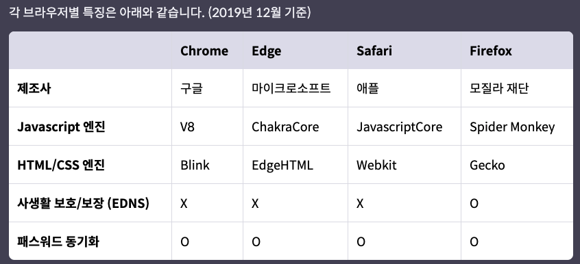
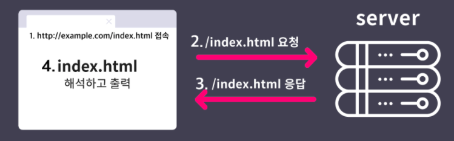
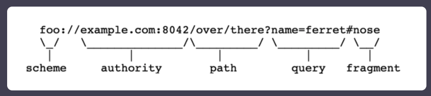
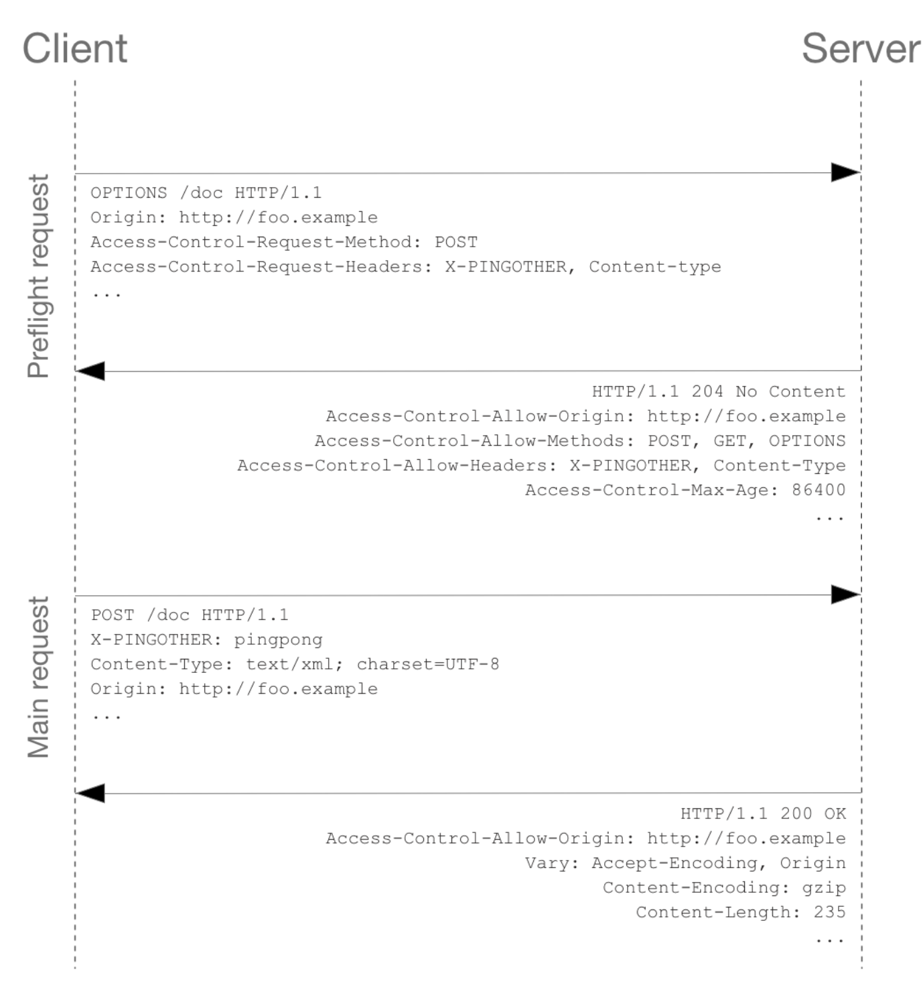

# Web 관련 용어 정리

- 의문
- General
  - Web Browser
  - Web Resource
    - URI
  - HTTP
  - Origin
  - Same-origin policy
  - CORS
  - Iframe(HTML Inline Frame Element)
  - Referer
- Architecture
  - REST
- Server
  - WSGI
- JS
  - Document Object Model(DOM)
    - Virtual DOM
    - Reconciliation(React)
  - Document(interface)
  - ArrayBuffer
  - Source map

## 의문

- Cross origin error는 어디에서 generate되는 것일까?
  - 브라우저이다.
- CORS동작에서 preflight request를 보내는 주체는 누구인가?
  - 브라우저일듯

## General

### Web Browser

웹 브라우저의 종류



웹 브라우저 동작 방식



- 개요
  - HTTP를 통해 인터넷 상에서 통신을 하며, 서버로부터 전달받은 다양한 웹 리소스들을 가공해 사용자가 웹과 HTTP의 동작 원리를 알지 못해도 웹을 사용할 수 있도록 도와주는 소프트웨어
- 포인트
  - 웹 브라우저는 웹 표준(Web Standard)를 구현한 구현체 소프트웨어
    - 완벽한 표준은 아니지만, 웬만한 인터페이스와 구현 부분은 표준을 따름
  - 구현의 구체적 detail은 각 브라우저마다 다름
    - 그래서 엔진이 다 다름

### Web Resource

- 개요
  - 웹에서 사용하는 콘텐츠
  - URI(Uniform Resource Identifier)를 이용하여 접근 가능
    - 실제 경로를 추상화하여 사용
- 종류
  - HTML
    - 웹 문서 구조
  - CSS
    - 웹 문서 표현
  - JS
    - 웹 문서 동작
  - Etc
    - 문서, 이미지, 동영상, 폰트

#### URI

URI 구성 요소



- URI(Uniform Resource Identifier)
  - 개요
    - 리소스의 위치를 식별하기 위한 개념
  - 구성
    - Scheme
    - Authority(Userinfo, Host, Port)
    - Path
    - Query
      - 웹 서버에 전달하는 파라미터
    - Fragment
      - 메인 리소스 내에 존재하는 서브 리소스에 접근할 때 이를 식별하기 위한 정보
      - *이건 어떻게 활용되는가? 구현?*

#### Encoding

- 개요
  - 문자 또는 기호 등의 정보, 형태를 표준화, 보안 등의 목적으로 다른 형태나 형식으로 변환하는 처리 혹은 그 처리 방식
  - c.f) 디코딩
    - 변환된 형태를 원래 형태로 변경하는 것
- encoding vs encryption
  - encoding
    - 알고리즘이 모두 공개되어있고, 키와 같은 요소가 포함되어 있지 않아서 모두가 원래 정보로 복원 가능
    - e.g) Base64, ASCII, UTF-8
  - encryption
    - 양방향 암호 알고리즘. 일치한 알고리즘과 유효한 키를 가지고 있다면 원래 정보로 복원 가능
- 웹에서 사용되는 인코딩
  - URL Encoding
    - 개요
      - URI 구조내에서 예약어로 사용되는 문자들을 전송하고자 할 때 사용
        - e.g GET메소드로 `a=?b`, `c=&d`의 데이터를 보내기 위해서는
          - `http://example.com/?a=%3Fb&c=%26d`의 형태로 전송되어야 서버에서도 정상적으로 데이터 해석 가능
    - 방식
      - ASCII테이블 매칭되는 Hex값 앞에 `%`붙이기
  - HTML Entity Encoding
    - 개요
      - HTML문서 내에서 사용하는 문자열들이 HTML에서 사용하는 태그로 인식하지 않도록 하기 위해서 사용
    - 방식
      - 1 ASCII테이블 매칭되는 Hex값 앞에 `&#x`붙이기
      - 2 주요 문자들에 대해서 지정되어 있는 entity name을 사용하기
        - `& = &amp; = &#x26`
        - `< = &lt; = &#x3C`
        - `> = &gt; = &#x3E`
  - c.f) 한글 인코딩
    - ?

### HTTP

- Request
  - 개요
    - 각각의 줄은 `CRLF`로 줄 바꿈이 이루어져야 함
  - 구조
    - Method
      - PATCH
        - 특정 리소스의 내용 중 보낸 값의 key만 변경(e.g 게시글 업데이트 등)
    - Header
      - HOST
      - Cookie
      - User-Agent
        - 사용자가 사용하는 프로그램 정보
      - Referer
        - 페이지 이동시 이전 URI의 정보를 나타냄
      - Content-Type
        - 사용자가 전달하는 데이터의 처리 방식과 형식을 나타냄
          - 사용자와 서버간의 데이터 처리 방식 일치되어야 정상적으로 데이터 통신이 이루어짐
- Response
  - 개요
    - 각각의 줄은 `CRLF`로 줄 바꿈이 이루어져야 함
  - 구조
    - Status code
    - Header
      - Content-Type
        - 서버의 응답 데이터를 웹 브라우저에서 처리할 방식과 형식을 나타냄
      - Content-Length
        - 서버가 사용자에게 응답해주는 데이터의 길이를 나타냄
      - Server
        - 서버가 사용하는 소프트웨어 정보
      - Allow
        - 허용되는 method 목록을 사용자에게 알려줄 때 사용
      - Location
        - 300번 영역의 응답 코드 사용시, 변경된 웹 리소스의 주소를 나타냄
      - Set-Cookie
        - 사용자에게 쿠키를 발급할 때 사용
          - 해당 헤더를 받은 웹 브라우저는 쿠키를 저장

### Origin

- 정의
  - URL의 scheme(protocol), host(domain), port까지를 결합한 것
- 특징
  - 같은 origin
    - scheme, host, port가 모두 일치하는 경우
- origin 예시
  - 다른 경우
    - different schemes
      - `http://example.com/app1`
      - `https://example.com/app2`
    - different hosts
      - `http://example.com`
      - `http://www.example.com`
      - `http://myapp.example.com`

### Same-origin policy

자원에 대한 AC(Access Control) policy

- 정의
  - 하나의 origin으로 부터 로드 된 document나 script가 어떻게 또 다른 origin으로 부터의 자원과 상호작용하는가에 대한 내용을 제한하는 보안 매커니즘
- 특징
  - Origin 변환
    - 정의
      - 페이지는 자신의 origin을 제한조건 속에서 변환 가능
        - `document.domain`을 현재의 도메인 혹은 superdomain으로 변경 가능(js)
  - Cross-origin network access
    - 정의
      - same-origin policy는 서로다른 두 origin 자원 사이에서 상호작용하는 것을 제어할 수 있음
      - e.g)
        - `XMLHttpRequest`, `` element
    - cross origin 상호작용의 종류
      - *각 상호작용은 writes, embedding, reads*로 나뉘어지는데, 구체적으로 무슨 기준인것인가?
      - Cross-origin writes
        - 일반적으로 허용됨
        - e.g)
          - 링크, 리다이렉트, form submission
      - Cross-origin embedding
        - 일반적으로 허용됨
        - e.g)
          - `<script src="..."></script>`
            - syntax error에 대한 detail은 same-origin script에서만 볼 수 있음
          - `<link rel="stylesheet" href="...">`
            - `Content-Type` header가 올바르게 설정되어있어야 함
          - ``로 나타나진 image들
          - `<object>` or `<embed>`로 embedded된 외부 자원
          - `@font-face`가 적용된 font들
          - `<iframe>`에 의해서 embedded된 모든 것
            - `X-Frame-Options` 헤더를 사용해서 cross-origin framing을 막을 수 있음
      - Cross-origin reads
        - 일반적으로 허용되지 않음
          - 가끔씩 embedding에 의해서 leaked됨
        - e.g)
          - embedded된 이미지의 차원을 읽을 수 있음
          - embedded된 스크립트의 액션
          - embedded된 자원의 가용성
    - [cross-origin script API access](https://developer.mozilla.org/en-US/docs/Web/Security/Same-origin_policy)
      - `Window`
        - method
          - `window.blur`
          - `window.close`
          - `window.focus`
          - `window.postMessage`
            - 서로 다른 origin 자원(document, scripts)사이에서 communication할 때 사용하는 메서드
        - attributes
          - `window.closed`
          - `window.frames`
          - ...
      - `Location`
        - methods
          - `location.replace`
        - attributes
          - `URLUtils.href`
      - Cross-origin data storage access
        - 개요
          - web storage, indexedDB에 저장된 데이터는 origin마다 격리되어 있음
            - 다른 origin의 js에서 접근 불가능
        - c.f) 쿠키
          - 다른 개념의 origin을 사용
            - 하나의 페이지는 자신의 domain 뿐 아니라, 임의의 parent domain으로 설정 가능(대신, public suffix가 아니어야 함)
- 서버 입장에서
  - Cross-origin access를 허락하는 방법
    - `CORS`(Cross-Origin Resource Sharing)를 사용하면 됨
    - **`CORS`는 서버로부터 어떠한 호스트가 content를 가져올 수 있도록 허가되었는지 명시한 HTTP의 일부분**
  - Cross-oirign access를 막는 방법
    - *request에서 CSRF라고 불리는 예측이 불가능한 토큰을 확인*
      - 이 토큰을 요구하는 페이지의 읽기를 막아야만 함
      - *정확히 무슨 뜻인지?*
    - 자원이 embeddable하지 않은 것을 확실하게 해야함
- SOP가 적용된 상태에서 리소스 공유하는 방법
  - `postMessage`
    - 메시지를 주고받기 위한 이벤트 핸들러를 이용해 리소스를 공유함
  - `JSONP`
    - 스크립트 태그를 통해 외부 자바스크립트 코드를 호출하면 현재 오리진에서 해당 코드가 실행된다는 점을 이용한 방법입니다. 스크립트 태그를 통해 다른 오리진의 리소스를 요청하고, 응답 데이터를 현재 오리진의 Callback 함수에서 다루는 방식으로 리소스를 공유합니다.
  - `CORS헤더 사용`
    - 다른 오리진이 허용하는 설정 등을 HTTP 헤더를 통해 확인한 후 허용하는 요청을 보내 리소스를 공유하는 방식

### CORS(Cross-Origin Resource Sharing)

Preflight request sequence diagram



Preflight Cross-Origin HTTP request, response header의 예시

```
OPTIONS /doc HTTP/1.1
Host: bar.other
User-Agent: Mozilla/5.0 (Macintosh; Intel Mac OS X 10.14; rv:71.0) Gecko/20100101 Firefox/71.0
Accept: text/html,application/xhtml+xml,application/xml;q=0.9,*/*;q=0.8
Accept-Language: en-us,en;q=0.5
Accept-Encoding: gzip,deflate
Connection: keep-alive
Origin: http://foo.example

# actual request가 보내질 때에는 POST 리퀘스트 메소드를 사용
Access-Control-Request-Method: POST

# actual request가 보내질 때, X-PINGOTHER, Content-Type 커스텀 헤더를 포함시킬 것
Access-Control-Request-Headers: X-PINGOTHER, Content-Type

#######
# 서버가 위 CORS request를 보고 받아들이지 말지 판단 가능
#######

HTTP/1.1 204 No Content
Date: Mon, 01 Dec 2008 01:15:39 GMT
Server: Apache/2

# 서버의 CORS Access control에 관한 정보
Access-Control-Allow-Origin: https://foo.example

# POST, GET method로 주어진 자원 query가능함
Access-Control-Allow-Methods: POST, GET, OPTIONS

# 해당 자원을 query할 때, 사용 가능한 헤더
Access-Control-Allow-Headers: X-PINGOTHER, Content-Type

# preflight request에 대한 response를 얼마나 캐시 가능한지(86400초 = 24시간)
Access-Control-Max-Age: 86400

Vary: Accept-Encoding, Origin
Keep-Alive: timeout=2, max=100
Connection: Keep-Alive
```

Real Cross-Origin HTTP request, response header의 예시

```
POST /doc HTTP/1.1
Host: bar.other
User-Agent: Mozilla/5.0 (Macintosh; Intel Mac OS X 10.14; rv:71.0) Gecko/20100101 Firefox/71.0
Accept: text/html,application/xhtml+xml,application/xml;q=0.9,*/*;q=0.8
Accept-Language: en-us,en;q=0.5
Accept-Encoding: gzip,deflate
Connection: keep-alive
X-PINGOTHER: pingpong
Content-Type: text/xml; charset=UTF-8
Referer: https://foo.example/examples/preflightInvocation.html
Content-Length: 55
Origin: https://foo.example
Pragma: no-cache
Cache-Control: no-cache

<person><name>Arun</name></person>


HTTP/1.1 200 OK
Date: Mon, 01 Dec 2008 01:15:40 GMT
Server: Apache/2
Access-Control-Allow-Origin: https://foo.example
Vary: Accept-Encoding, Origin
Content-Encoding: gzip
Content-Length: 235
Keep-Alive: timeout=2, max=99
Connection: Keep-Alive
Content-Type: text/plain

[Some XML payload]
```

- 정의
  - 브라우저가 어떤 origin에서 동작하는 웹 애플리케이션에게 다른 origin에 존재하는 자원의 접근권을 주기 위한 추가적인 HTTP 헤더를 사용하는 매커니즘
  - e.g
    - `https://domain-a.com`로부터 서빙된 js코드가 `XMLHttpRequest`를 사용해서 `https://domain-b.com/data.json` 자원을 요청하는 경우
- 특징
  - 브라우저가 기본적으로 cross-origin HTTP request를 막음
    - 다른 origin으로부터의 response가 올바른 CORS 헤더를 갖고 있어야지만 자원을 사용할 수 있게 함
    - 같은 origin자원으로의 요청은 항상 허락됨
  - credentials(XMLHttpRequest)
    - actual request를 credential을 이용해서 보낼 수 있는지 여부 확인
      - **쿠키를 사용하는 경우에 필요!**
      - `HTTP cookies` or `HTTP Authentication information`을 이용
    - cross-site XMLHttpRequest는 default로는 브라우저가 credentials(쿠키 등)을 보내지 않음
      - `const invocation = new XMLHttpRequest();`
      - `invocation.withCredentials = true`로 설정해야 Cookie도 같이 전송함
    - 서버에서는 `Access-Control-Allow-Credentials`를 true로 설정해주어야 함
    - 서버에서는 반드시 `Access-Control-Allow-Origin` 헤더 필드를 설정해주어야 함(`*` 제외)
- CORS 대상
  - `XMLHttpRequest` or `Fetch API`
  - web fonts
  - webGL textures
  - Images/video frames
  - CSS Shapes from images
- 동작
  - 서버가 웹 브라우저로부터 어떤 origin이 해당 정보를 접근할 수 있도록 허용할 것인지 작성된 추가적인 HTTP header를 더해야 CORS 표준이 동작함
  - \[preflight\]
    - server data에 side-effect를 일으킬 수 있는 HTTP request method에 대해서, CORS 스펙은 browser에게 preflight request를 보내도록 함(Simple request는 해당하지 않음)
      - 미리 한 번 request가능한지 체크
    - simple request의 조건
      - Http Method
        - `GET`, `HEAD`, `POST`
      - User agent로 인해서 자동적으로 선택된 헤더 & CORS-safelisted request-header들 만 헤더필드에 존재해야 함
        - `Accept`
        - `Accept-Language`
        - `Content-Language`
        - `Content-Type`
          - `application/x-www-form-urlencoded`
          - `multipart/form-data`
          - `text/plain`
        - ...
      - `XMLHttpRequestUpload` 오브젝트에 이벤트 리스너가 존재하지 않아야 함
      - `ReadableStream`이 리퀘스트에서 사용되지 않아야 함
  - 서버로부터 approval을 받은 이후에는 실제 request를 보냄
    - 서버는 `credential`을 requests와 같이 보내도록 강제할 수 있음
      - Cookie나 HTTP Authorization
  - CORS 실패는 에러를 나타내나, 보안적인 이유로, js에서 error를 사용할 수 없음
    - 코드상으로는 그저 에러가 났다는 것만 알 수 있음
    - 브라우저 콘솔상에서만 확인 가능

### Iframe(HTML Inline Frame Element)

- 정의
  - 현재의 HTML에 또 다른 HTML page를 embedding하는 nested된 browsing context
  - c.f) browsing context
    - 정의
      - 브라우저가 Document를 나타내는 environment
    - 특징
      - 현대 브라우저에서는 tab, window의 부분(`frame`, `iframe`)등이 될 수 있음
      - 각각의 browsing context는 specific origin을 갖고 있음
        - active document의 origin과 표시된 document들의 히스토리 등
      - browsing context 사이의 커뮤니케이션은 엄격하게 제한됨
        - same origin의 경우, `BroadcastChannel`을 사용해서 커뮤니케이션 가능
- 특징
  - 각각의 browsing context는 자신만의 session history, document를 갖음
  - parent browsing context
    - 다른 browsing contexts를 embed하는 browsing context
    - topmost browsing context는 `Window` 오브젝트라고 함
- Scripting
  - `<frame>` 요소들은 `window.frames` pseudo-array에 포함됨
  - script는 framed 자원의 `window`오브젝트를, `contentWindow` 속성을 이용해서 접근 가능
  - script는 framed 자원의 `document`오브젝트를, `contentDocument` 속성을 이용해서 접근 가능
  - frame 속에서, 스크립트는 `window.parent`를 이용해서 parent window 접근가능
  - frame의 자원 접근은 same-origin 정책에 종속됨
    - 서로 다른 origin의 경우, 대부분의 `window`의 속성에 접근 불가
    - cross origin communication은 `Window.postMessage()`를 이용해서 가능

### Referer

- 정의
  - request header로서, 이전 웹 페이지의 주소를 포함하고, 그 뒤에 현재 요청된 페이지가 따라옴
    - 서버가 사람들이 어떤 페이지를 방문하는지 알 수 있게 함(analytics, logging, optimized caching 등)
- Referer를 사용하지 못하는 경우
  - referring resource가 file or data URI인 경우
  - An unsecured HTTP request is used and the referring page was received with a secure protocol (HTTPS).
    - *??*
- e.g)
  - `Referer: https://developer.mozilla.org/en-US/docs/Web/JavaScript`

## Architecture

### REST(REpresentational State Transfer)

- 정의
  - web service를 만드는데에 사용되는 제한사항의 집합을 정의한 소프트웨어 아키텍처
  - c.f) RESTful web service
    - REST 아키텍처 스타일을 따르는 웹 서비스
- 특징
  - **stateless protocol & standard operation**
    - 일정한, 사전에 정의된 stateless operation을 사용해서, 텍스트로 표현된 웹 자원을 access할 수 있도록 하는 웹 서비스
      - c.f) SOAP
        - 각 서비스마다 자신만의 임의의 operation들의 집합을 노출함
    - HTTP가 사용되는 경우, `GET`, `HEAD`, `POST`, `PUT`, `PATCH`, `DELETE`, `CONNECT`, `OPTIONS`, `TRACE`등이 사용됨
    - 빠른 퍼포먼스, reliability, scalability
- 아키텍처적 제한사항
  - **Client-server architecture**
    - 역할 분담
    - 서버 컴포넌트 단순화
  - **Statelessness**
    - 어떠한 클라이언트로부터의 리퀘스트던, request를 serve하기 위해서 필요한 정보가 전부 들어있음
      - 클라이언트는 새로운 state로 이행될 때, requ`est를 날림
  - **Cacheability** PI가 다양한 웹 애플리케이션 프레임워크가 servlet를 지원하는 다양한 웹 서버에서 동작할 수 있었음
  - 그래서 WSGI라는 implementation-agnostic interface가 생겨남
- 구성
  - server <-> \[WSGI middleware\] <-> application

Example1: WSGI-compatible "Hello, World" application

```py
def application(environ, start_response):
    start_response('200 OK', [('Content-Type', 'text/plain')])
    yield b'Hello, World\n'

# environ
## CGI environment variable들을 포함하는 딕셔너리. 그외에도 request parameters, metadata 도 포함

# start_response(status, response_headers)
## 호출할 수 있으며, status와 response_headers를 인자로 받을 수 있음

# yield b'Hello, World\n'
## iterable of byte strings
```

Example2: calling an application

```py
from io import BytesIO

def call_application(app, environ):
    status = None
    headers = None
    body = BytesIO()

    def start_response(rstatus, rheaders):
        nonlocal status, headers
        status, headers = rstatus, rheaders

    app_iter = app(environ, start_response)
    try:
        for data in app_iter:
            assert status is not None and headers is not None, \
                "start_response() was not called"
            body.write(data)
    finally:
        if hasattr(app_iter, 'close'):
            app_iter.close()
    return status, headers, body.getvalue()

environ = {...} # environ dict
status, headers, body = call_application(app, environ)
```

## JS

### Document Object Model(DOM)

**Document <---브라우저---> DOM**

JS와 같은 Scripting언어를 통하여 DOM을 수정 가능하고, 그것은 브라우저에 의해 다시 Document에 반영됨

- 정의
  - cross-platform ∧ XML, HTML document를 다루는 language-independent 인터페이스
    - Document에 대한 UI는 Document그 자체
    - Document에 대한 API는 DOM
  - 메모리속에서 웹 페이지와 같은, document(e.g HTML, XML)의 구조를 논리적인 트리구조로 표현하여, scripts or 프로그래밍 언어와 연결하는 것
    - 각 노드는 document의 일부를 나타내는 오브젝트
    - 구조화된 **objects** 로 문서를 표현
      - **nodes(= elements)**
      - **property**
      - **method**
- 특징
  - 웹 페이지의 객체지향적 표현
  - 문서와 문서의 요소에 접근하기 위해 DOM이 사용됨
    - Web or XML page = DOM + JS (scripting language)
      - DOM은 프로그래밍 언어와 독립적으로 디자인되었음
      - JS는 결국 document를 조작하기 위한 프로그래밍 언어임
  - 모든 웹 브라우저는 각각 자신만의 방법으로 DOM을 구현하였음
- 구조
  - logical tree
    - branch는 하나의 node에서 끝남
  - node
    - property
    - DOM method는 tree에 programmatic access를 가능하게 함
      - 그것들을 가지고, document의 구조, 스타일, 내용을 변화시킬 수 있음
    - node는 event handler를 갖을 수 있음
- HTML DOM
  - HTML을 포함하는 document는 `Document` 인터페이스를 사용해서 나타나짐
    - HTML-specific 기능을 포함하기 위해서 확장된 Document
    - 특히 `Element` interface가 강화됨
  - tab, windows, css style, browser history를 비롯한 다양한 브라우저 기능에 접근 가능
- 중요한 데이터 타입
  - `document`
  - `element`
  - `nodeList`
  - `attribute`
  - `namedNodeMap`
- DOM interfaces
  - 핵심
    - DOM의 각 노드 오브젝트는 다양한 인터페이스의 구현으로 되어있음
  - 예시
    - `HTML FROM element`
      - `HTMLFormElement` interface의 구현
        - `name` property
      - `HTMLElement` interface의 구현
        - `className` property
    - `table object`
      - `HTMLTableElement` interface의 구현
        - `createCaption()`
        - `insertRow()`
      - `HTMLElement` interface의 구현
        - `Node` interface의 구현

```js
var table = document.getElementById("table");
var tableAttrs = table.attributes; // Node/Element interface
for (var i = 0; i < tableAttrs.length; i++) {
  // HTMLTableElement interface: border attribute
  if(tableAttrs[i].nodeName.toLowerCase() == "border")
    table.border = "1";
}
// HTMLTableElement interface: summary attribute
table.summary = "note: increased border";
```

#### Virtual DOM

- 정의
  - DOM의 가상적인 표현을 메모리에 저장하고, `ReactDOM`과 같은 라이브러리에 의해 실제 DOM과 동기화하는 프로그래밍 개념
    - 해당 과정을 `Reconciliation`이라고 함
    - *시간 복잡도를 위해서 공간복잡도를 희생? DOM은 그렇게 메모리를 많이 차지하지는 않는가보다?*
- 특징
  - React의 선언적 API를 가능하게 함
    - React에게 원하는 UI의 상태를 알려줌
    - DOM이 그 상태와 일치하도록 해줌
      - 마치, SQL과 RDB Engine과 같은 관계랄까?
    - attribute조작, event handling, 수동 DOM update를 추상화 함
      - 선언적으로 인터페이스를 작성할 수 있도록!
  - 기술보다는 패턴에 가까움(선언적!)
    - `React elements`
      - UI를 나타내는 오브젝트와 연관이 큼
    - `React Fibers`
      - **React 16의 새 reconcile엔진**
        - Virtual DOM의 incremental rendering을 활성화
      - 컴포넌트 트리에 대한 추가 정보 포함
      - virtual DOM 구현의 일부
- React element
  - 정의
    - React 앱의 가장 작은 요소
  - 특징
    - 브라우저 DOM 엘리먼트와 달리, React element는 일반 객체이며, 쉽게 생성 가능
    - `ReactDOM.render()`
      - React 엘리먼트를 루트 DOM 노드에 렌더링하기 위한 함수
- React component
  - 정의
    - React element를 구성 요소로 하는, UI를 재사용 가능한 조각으로 나눈 것

#### Reconciliation(재조정)

그냥 새로 생성된 React element tree를 그대로 DOM에 적용시키면 안돼?

그럼 매번 엄청난 수의 `document.createElement()`를 실행해야 해서 비효율적. 그래서 시간복잡도가 상승

- 정의
  - **`render()`함수로 생성된 새 React element tree와 기존의 React element tree를 비교하는 알고리즘**
    - *차이를 반영하는것 까지는 포함되지 않음?*
- 배경 및 reconcile 순서
  - `render() - 새 react element tree 생성`
    - `render()`함수는 React element tree를 만드는 것
    - state나 props가 갱신되면 `render()`는 새로운 React element tree를 반환
    - React는 방금 만들어진 트리에 맞게 가장 효과적으로 UI를 갱신하는 방법을 알아낼 필요가 있음
  - React element tree끼리 비교(Diffing)
    - 하나의 트리를 다른 트리로 변환하기 위한 최소한의 연산 수를 구하는 알고리즘 문제의 시간복잡도는 `O(n^3)`
    - React는 휴리스틱 알고리즘 구현 `O(n)`
      - 서로 다른 타입의 엘리먼트는 서로 다른 트리를 만들어낸다.
      - 개발자가 `key` prop을 통해 여러 렌더링 사이에서 어떤 자식 엘리먼트가 변경되지 않아야 할지 표시해줄 수 있음.
  - DOM 트리에 기존 트리와의 차이만큼만 다시 re-rendering
- 비교 알고리즘(Diffing Algorithm)
  - Root react element부터 비교
  - React element의 변화
    - React element 타입이 다른 경우
      - 이전 트리를 버리고 완전히 새로운 트리를 구축
      - 이전 DOM 노드들은 모두 파괴됨
      - 새로운 DOM 노드들이 DOM에 삽입됨
      - `componentWillMount()`와 `componentDidMount()`가 연속적으로 실행
      - 이전 트리와 관련된 모든 state가 사라짐
    - React element 타입이 같은 경우
      - 두 엘리먼트의 attribute확인하여, 동일한 내역은 유지하고 변경된 attribute만 갱신
  - React component의 변화
    - 같은 타입의 컴포넌트 엘리먼트
      - 컴포넌트가 갱신되면 인스턴스는 동일하게 유지되어 렌더링 간 state가 유지
      - React는 새로운 엘리먼트의 내용을 반영하기 위해 현재 컴포넌트 인스턴스의 props를 갱신
      - `componentWillReceivePorps()`와 `componentWillUpdate()`를 호출
      - `render()` 메서드가 호출되고 비교 알고리즘이 이전 결과와 새로운 결과를 재귀적으로 처리
  - DOM 노드의 처리가 끝나면 해당 노드의 자식들을 재귀적으로 처리
- 자식에 대한 재귀적 처리
  - 개요
    - DOM node의 자식들을 재귀적으로 처리할 때, React는 기본적으로 동시에 두 리스트를 순회하고 차이점이 있으면 변경을 생성
  - `key`속성
    - 자식들에게 key를 부여하여, 자식 노드의 단순 순서 변경에 의한 자식 전체 re-redering을 방지함
    - 배열의 index를 key로 부여하지 말자
      - 배열의 요소가 재배열되면 비효율적인 동작이 됨

key 속성 사용 예시

```html
/* key 도입 전 - 전체 list re-rendering */

/* before */
<ul>
  <li>Duke</li>
  <li>Villanova</li>
</ul>

/* after */
<ul>
  <li>Connecticut</li>
  <li>Duke</li>
  <li>Villanova</li>
</ul>

/* key 도입 후 - 새로 추가된 key인 2014 li 엘리먼트만 추가해서 rendering */

/* before */
<ul>
  <li key="2015">Duke</li>
  <li key="2016">Villanova</li>
</ul>

/* after */
<ul>
  <li key="2014">Connecticut</li>
  <li key="2015">Duke</li>
  <li key="2016">Villanova</li>
</ul>
```

- 고려 사항
  - `re-rendering`은 모든 컴포넌트의 `render()`를 호출하는 것
    - `render()` 함수는, 위에서 설명한 **Diffing알고리즘** 을 수행하는 것 뿐
      - 무조건 unmount 후 mount하는 것이 아님
    - **이게 reconcile!!!!**

### Document(interface)

- 정의
  - **브라우저에 로드된 웹 페이지를 나타내는 인터페이스, document의 DOM인터페이스의 root node**
    - e.g) 엔트리 포인트 역할: `document.getElementById('....')`
- 특징
  - DOM tree는 `<body>`, `<table>` 등의 태그를 포함하며, 페이지의 URL을 가져오는 것, 새로운 element를 생성하는 등의 기능을 제공
  - Document 인터페이스는 common properties와 methods를 기술
  - document의 type에 따라서, 서로 다른 범위의 API가 사용 가능
    - `text/html`
      - `HTMLDocument` interface
    - `XML`, `SVG`
      - `XMLDocument` interface

### ArrayBuffer

- 정의
  - *generic*, fixed-length raw 바이너리 데이터 버퍼를 나타낼 때 사용됨
  - array of bytes
    - 다른 언어에서는 byte array와 유사
- 특징
  - 직접 수정할 수 없음
    - `typed array object`를 생성하거나 `DataView` 라는 특정 포맷의 버퍼 오브젝트를 생성해서 buffer를 read, write할 수 있음
  - 이미 존재하는 데이터로부터 array buffer를 얻을 수 있음
    - Base64 string
    - local file

### Source map

- 정의
  - minified나 coffeeScript, TypeScript와 같은 언어로부터 컴파일된 js의 경우, debug할 때, 기존 소스에 기반하여 할 수 있도록 도와주는 파일
    - original source <-(map)-> transformed source
- 사용법
  - source map을 생성
  - transformed file에 source map의 경로를 지정
    - `//# sourceMappingURL=http://example.com/path/to/your/sourcemap.map`
