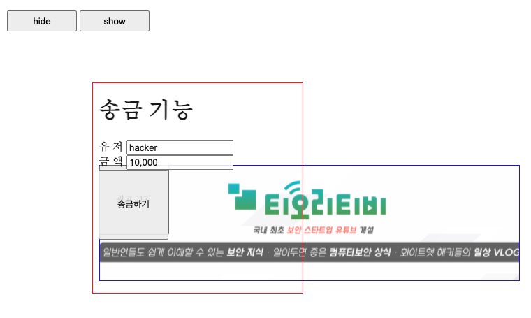

# Web Hacking

- Web Hacking
  - Client-side
    - XSS
  - Server-side
- Reverse Engineering
- System Exploitation
- Cryptography Fundamental

## Client-side

- 1 XSS
- 2 CSRF
- 3 Open Redirect
- 4 Click Jacking

### 1. XSS(Corss Site Scripting)

- 개요
  - 서버의 응답에 공격자가 삽입한 악성 스크립트가 포함되어 사용자의 웹 브라우저에서 해당 스크립트가 실행되는 취약점
  - 임의의 악성 스크립트를 실행하여, 사용자 쿠키 또는 세션을 탈취해 사용자의 권한을 얻거나 사용자의 페이지를 변조하는 등의 공격 수행 가능
- 공격의 조건
  - **1 입력 데이터에 대한 충분한 검증 과정이 없어야 함**
  - **2 서버의 응답 데이터가 웹 브라우저 내 페이지에 출력시 충분한 검증이 없어야 함**
- 종류(스크립트의 전달 방식 차이)
  - Stored XSS
    - 악성 스크립트가 서버 내에 존재하는 데이터베이스 또는 파일 등의 형태로 저장되어 있다가 사용자가 저장된 악성 스크립트를 조회하는 순간 발생하는 형태의 XSS
      - e.g) 게시판 서비스에서 게시물 조회시
    - 파급력은 서비스의 형태와 접근성, 해당 서비스를 통해 얻을 수 있는 정보 행위에 따라 다름
  - Reflected XSS
    - 악성 스크립트가 사용자의 요청과 함께 전송되는 형태
      - 사용자가 요청한 데이터가 서버의 응답에 포함되어 HTML등의 악성 스크립트가 그대로 출력되어 발생
    - 변조된 데이터가 사용자의 요청으로 전송되는 형태를 유도해야 함
      - e.g) Click Jacking, Open Redirect
    - e.g) 게시물 조회시, 서버는 조회 한 결과를 응답에 출력 + 사용자가 조회한 내용을 포함하기도 함
- 공격의 결과
  - 쿠키 및 세션 탈취
  - 페이지 변조
  - 위치 이동(피싱)
- Mitigations
  - Server-side Mitigations
    - 사용자 입력값 HTML Entity Encoding을 이용해 태그로 인식하지 않도록 escape
      - URI Query, POST Body, User-Agent, Referer와 같은 사용자로부터 입력된 모든 값에 적용해야 함
    - 사용자 입력값에 HTML을 지원하는 경우 화이트리스트 필터링을 해야 함
      - `bleach`라이브러리 이용
    - 로그인 세션에 로그인한 IP주소나 국가를 적어두고, 접속한 국가가 변경된 경우 탐지
  - HTTPOnly flag 사용
    - Javascript에서 해당 쿠키에 접근하는 것을 방지(세션쿠키에 저장)
    - XSS취약점이 발생해도 공격자가 알아낼 수 없음
  - Content Security Policy(CSP) 사용
    - `Content-Security-Policy: <지시어>; ...`
      - `Content-Security-Policy: default-src 'self' *.dreamhack.io`
        - 모든 리소스(이미지 파일, 스크립트 파일 등)의 출처가 현재 도메인이거나 `*.dreamhack.io`도메인일 경우만 허용
        - CDN이 해킹되면 무력화
      - `<meta http-equiv="Content-Security-Policy" content="script-src 'sha256-5jFwrAK0UV47oFbVg/iCCBbxD8X1w+QvoOUepu4C2YA='">`
        - script태그 안의 자바스크립트 코드의 해시를 알아내고 CSP 설정하여 `alert(1)`을 성공적으로 호출한 예시
    - 사이트에서 로드하는 리소스들의 출처 제한
  - X-XSS-Protection Header
    - 최신 브라우저에서는 사용하지 않는다 함

### 2. CSRF

- 개요
  - 사용자의 의도와 무관하게 다른 사이트에 HTTP요청을 보내는 것
    - 특히, 쿠키가 Referer과는 관계없이 무조건 포함되는 것을 이용
- 공격의 조건
  - 해당 웹 사이트가 쿠키를 이용한 인증 방식을 사용해야 함
  - 공격자가 사전에 알 수 없는 파라미터가 존재해서는 안됨
- Mitigations
  - 0 SameSite Cookie
    - Strict
      - 모든 크로스 사이트에서 출발한 요청에 해당 쿠키를 삽입하지 않음
    - Lax
      - Link, Prerender, Form GET을 제외한 요청에는 쿠키 삽입x
    - Normal
      - 기존과 동일하게 모든 요청에 쿠키 삽입
  - 1 세션 쿠키 대신 커스텀 헤더를 사용하여 사용자 인증
    - e.g) Authorization
  - 2 공격자가 예측할 수 없는 파라미터 추가 및 검증
    - CSRF Token
    - CAPTCHA
    - 정상적인 사용자만 알고있는 기존의 값을 검증(e.g 현재 비밀번호)

### 3. Open Redirect

- 개요
  - Redirect가 공격자에 의해 변조되는 경우 공격자의 값이 함께 전달되도록 사용자를 유도
    - e.g) searchParameter값으로 js를 이용하여 redirect시키는 경우
  - `https://example.com` or `javascript:<JS Code>`의 형태로 자바스크립트 실행 가능
- Mitigations
  - 서버에서 이동을 허용한 주소에 대해서만 이동하게끔 함
    - 서버에서 해당 주소에 대해서 검증을 하고, 애초에 외부 링크로 리다이렉트하는것을 사용자가 알 수 있도록 함

### 4. Click Jacking

Click Jacking 예시

- 개요
  - 외부 페이지 리소스를 불러올 수 있는 태그 엘리먼트(`<frame>, <iframe>, <object>, <embed>, <applet>`)를 사용하여, 사용자의 눈을 속여 클릭을 유도하는 공격 방법
  - `<iframe>`등의 태그로 누르게 할 페이지를 opacity를 조절하여, 숨겨두고 클릭하게 만듬
    - `iframe`태그가 웹 브라우저 상에서는 더 앞에 위치
    - 결국에는 iframe도 자원을 현 자원에 포함시키는 것에 불과
- Mitigations
  - 부모 페이지의 URL을 제한하는 방식
    - HTTP Header `X-Frame-Options`
      - DENY
        - 부모 페이지 URL 상관없이 모두 차단
      - SAMEORIGIN
        - 부모 페이지 URL이 Same Origin이라면 허용
      - e.g
        - `X-Frame-Options: DENY`
    - HTTP Header `Content-Security-Policy: frame-ancestors ...`
      - 'none'
        - 부모 페이지 URL 상관없이 모두 차단
      - 'self'
        - X-Frame-Options SAMEORIGIN과 동일
      - http://, https://
        - scheme이 같으면 모두 허용
      - *.dreamhack.io, dreamhack.io, https://dreamhack.io
        - host나 scheme + host가 같으면 모두 혀용, 와일드카드(*) 사용 가능
      - e.g
        - `Content-Security-Policy: frame-ancestors http://dreamhack.io *.google.com https://`

## Server-side

- 개요
  - 사용자로부터 받는 모든 입력을 신뢰하지 않도록 해야 함
    - 데이터에 대한 검증 과정의 부재 or 올바르지 않은 검증에 의해 취약점 발생
- 종류
  - Injection
  - File vulnerability
  - Business Logic Vulnerability
    - 정상적인 로직 흐름 악용
  - Language specific vulnerability(PHP, Python, NodeJS)
  - Misconfiguration

### 1. Injection

- 개요
  - 사용자의 입력 값이 어플리케이션의 처리 과정에서 구조나 문법적인 데이터로 해석돼 발생하는 취약점
  - 변조된 입력을 주입해 의도하지 않은 행위를 발생시킴
- 종류
  - SQL Injection
  - (OS) Command Injection
  - Server Side Template Injection(SSTI)
    - 템플릿 변환 도중 사용자의 입력 데이터가 템플릿으로 사용돼 발생하는 취약점
  - Path Traversal
    - 임의의 경로에 접근하는 취약점
  - Server Side Request Forgery(SSRF)
    - 공격자가 서버에서 변조된 요청을 보낼 수 있는 취약점

#### 1.1 SQL Injection

- 개요
  - SQL 쿼리에 사용자의 입력 값이 삽입돼, 사용자가 원하는 쿼리를 실행할 수 있는 취약점
  - SQL Injection이 발생하게 되면, 현재 쿼리를 실행하는 DBMS 계정의 권한으로 공격이 가능함
    - 데이터 베이스 내용 추출, 변조, 삭제 행위 가능
- SQL의 구조 분류
  - DDL(Data Definition Language)
    - 데이터 정의하기 위한 언어
    - 스키마, 데이터베이스의 생성/수정/삭제
    - e.g)
      - `CREATE`, `ALTER`, `DROP`
  - DML(Data Manipulation Language)
    - 데이터를 조작하기 위한 언어
    - 조회/저장/수정/삭제
    - e.g)
      - `INSERT`, `UPDATE`, `SELECT`, `DELETE`
  - DCL(Data Control Langauge)
    - 데이터베이스의 접근 권한 등의 설정을 하기 위한 언어
    - e.g)
      - `GRANT`
        - 사용 권한 부여
      - `REVOKE`
        - 권한 박탈
- 공격
  - 간단한 로그인 쿼리
    - `SELECT * FROM user_table WHERE uid='{uid}' and upw='{upw}';`
      - `1'or'1` 페이로드 공격
      - `SELECT * FROM user_table WHERE uid='admin' or '1' and upw='1';`
        - and우선으로, False가 나옴
        - or 조건으로 어차피 `uid='admin'`은 살아남음
      - `SELECT * FROM user_table WHERE uid='admin' and upw='1' or '1'`
        - and우선으로, False가 나옴
        - or조건으로 '1'이 true이므로 모든 유저 정보 나오게 함
- Mitigations
  - ORM을 사용하면 어느정도 방어 가능
    - but, 입력 데이터의 타입 검증이 있어야함

#### 1.2 Command Injection

- 개요

### 2. File vulnerability

### 3. Business Logic Vulnerability

### 4. Language specific vulnerability

### 5. Misconfiguration
