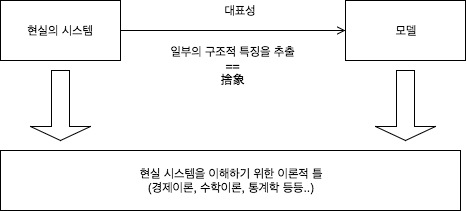
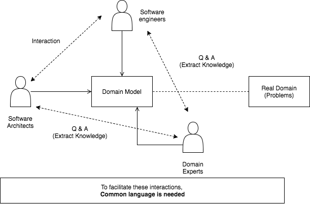

# Domain Driven Design Basic Concepts

Eric Evans

복잡한 문제 영역의 소프트웨어 생성에 대한 도전(복잡성 관리)

## 참고

- [DDD - 욱's 노트](http://opennote46.tistory.com/96)

## Domain-Driven Design이란

### 1. 본질의 파악

Software developement는 business의 자동화나 실제 세상의 문제들을 해결하기 위해 자주 적용된다.

그러므로, 소프트웨어가 이러한 문제들과 깊은 관계가 있음을 이해하는 것이 매우 중요하다.

(애초에 왜 software를 개발해야 하는가? 문제의 본질은 무엇인가?)

예를들어 banking software를 제작한다고 했을때, `domain of banking`에 대한 좋은 이해 없이 좋은 소프트웨어를 만들 수 없다. 그러므로, 개발자는 항상 `domain`에서 시작해야한다.

> 소프트웨어의 모든 목표는 특정 도메인의 개선이다.
> 그 목표를 달성하기 위해서는, 그 도메인에 소프트웨어가 적절하게 조화되어야 한다.
> 도메인을 반영(모델링)하는 소프트웨어의 제작.

### 2. 모델의 작성

도메인은 현실세계의 개념. 그러므로 코딩을 위해서는 추상화가 필요.

그 추상화는 곧 모델이다(model of domain)

도메인 모델은 단순한 diagram이 아니라, 지식의 선택이고 축약이다. 모델링으로 만들어진 diagram은 model을 나타내고 동시에 의사소통가능하게 한다. model화 할때 무엇을 버리고 무엇을 취할것인지 항상 생각해야한다.(c.f system thinking의 모델화)

Domain에 대한 디자이너, PM, 전문가와의 지식 공유(커뮤니케이션)는 필수적이다. 그러기 위해서는 공통 언어 혹은 그림과 같은 매개체가 필요하다.

### 3. code design

Model이 바람직하게 표현된 다음에 그제서야 우리는 `code design`을 할 수 있다. 여기서의 `code design`은 `software design`과는 거리가 있는 개념이다.

- software design: 집의 구조를 생성
- code design: 집 안의 그림을 어디에 배치할지 생각

> DDD는 디자인에서 나온 피드백이 개발을 발전시키고, 개발에서 나온 피드백이 디자인을 발전시키는 것을 지향한다.

### 핵심

결국에 가장 중요한 것들은 이하와 같다.

1. 문제의 본질
2. 도메인추상화에 의한 모델링
3. 모델링을 위한 Stake holders(software engineer, software Architects, Domain experts)의 커뮤니케이션
