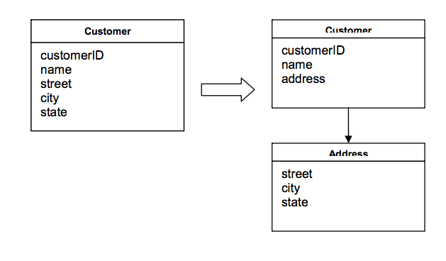

# Model-Driven Design

## 개관

## Model-Driven Design Patterns

### 1. Layered Architecture

예시

[from Domain-Driven Design Quickly](http://infoq.com/books/domain-driven-design-quickly)

> For example, a typical, the interaction of the application, domain and infrastructure could look like this. The user wants to book a flights route, and asks an application service in the application layer to do so. The application tier fetches the relevant domain objects from the infrastructure and invokes relevant methods on them, e g to check security margins to other already booked flights. Once the domain objects have made all checks and updated their status to “decided”, the application service persists the objects to the infrastructure.

#### Entities

OOP 언어들은 오브젝트를 메모리에 보유한다. 그리고 각각의 오브젝트를 참조나 메모리 주소로 연동한다. 이러한 참조는 일정 시간동안 각각의 오브젝트에 있어서 독립적이지만 언제까지나 그럴 것이라고 단정할 수 없다. 오히려 오브젝트는 메모리안에서 계속 이리저리 움직이고 변화하고 사라진다. 예를들면, 날씨 정보를 갖는 클래스가 있는데, 온도를 state로 갖는다고 하자. 하지만 별개의 다른 오브젝트가 같은 온도를 갖을 수 있다. 이 두 오브젝트들은 완벽히 같고, 서로 바꿀 수 있지만 다른 **참조(references)**를 갖는다. 그러므로 그들은 entities가 아니다.

오브젝트는 반드시 구분지을 수 있는 id를 갖아야 한다(e.g. 사람 클래스에서 주민번호의 state라던지) 그렇지 않으면, data corruption이 일어난다.

그러므로, 소프트웨어에서 entities를 도입한다는 것은 id를 만드는 것을 의미한다. 보통, id는

- an attribute of the object
- a combination of attributes
- an attribute specially created to preserve and express identity
- a behaviro

두 오브젝트가 쉽게 구분되기 위해서 시스템에 의한 다른 id를 갖는 장치가 있는것이 매우 중요하다. (그렇지 않으면 data corruption이 일어나기 때문)

[from Domain-Driven Design Quickly](http://infoq.com/books/domain-driven-design-quickly)

> When an object is distinguished by its identity, rather than its attributes, make this primary to its definition in the model. Keep the class definition simple and focused on life cycle continuity and identity. Define a means of distinguishing each object regardless of its form or history. Be alert to requirements that call for matching objects by attributes. Define an operation that is guaranteed to produce a unique result for each object, possibly by attaching a symbol that is guaranteed unique. This means of identification may come from the outside, or it may be an arbitrary identifier created by and for the system, but it must correspond to the identity distinctions in the model. The model must define what it means to be the same thing.

Entities는 도메인 모델의 중요한 오브젝트들이고, 그것들은 modeling process의 시작부터 중요하게 고려되어야 한다. 단순히 오브젝트가 entity가 되어야하는지 아닌지 판단하는것도 매우 중요하다.

#### Value Objects

Entities는 Domain model에서 매우 중요한 역할을 차지하지만, 모든 오브젝트가 반드시 entity여만 할까? 그래서 모든 오브젝트는 id를 갖고 있어야 할까?

만일 그림 그리기 어플리케이션을 만든다고 할때, 유저가 하나의 점을 찍는 것을 고려해서 Point클래스를 만들고 그 인스턴스변수로는 x좌표 y좌표를 넣을 수 있다고 할때, 과연 이 클래스의 인스턴스(오브젝트)는 id를 갖고 있어야 할까? => 그렇지 않다.

어떤 오브젝트인지는 관심없고, 어떤 속성을 갖고 있는지만 관심 있는 오브젝트 => Value Object

- Entity Objets와 Value Objects를 구분하는 것이 중요하다.
- Entity definition을 만족해야 하는 것만을 entity object로 해야한다.
- 그리고 나머지 오브젝트를 Value Objects로 한다.

위와 같은 조건은 디자인을 간단화 시킬 것이며, 다른 긍정적인 효과가 있을 것이다.

**특징**

- 쉽게 쓰이고 쉽게 버려진다.
- **Sharable & Immutable**: golden rule
  - 언제든지 복제하고 언제든지 버릴 수 있다.
- 또한 value object가 entity를 포함할 수 있다.



#### Services

domain을 분석하고, 모델을 구성하는 main objects를 정의할 때, 몇몇 측면의 도메인은 objects로 쉽게 매핑되지 않는 경우가 있다. 예를들어, "돈을 하나의 계좌에서 다른 계좌로 넘기는 것"은 sending account의 기능인가 receiving account의 기능인가?

만일, 이러한 행위가 도메인에서 관찰되었을 때에는 Service(오브젝트의 일종)로 정의하는것이 바람직하다.

서비스

- 내부 state가 없음
- 도메인에게 functionality를 제공
- 명확하게 선언되어야 함
- operation의 인터페이스

서비스는 operation을 실행하는 오브젝트와 operation의 대상이되는 오브젝트와 관계가 있다. 즉, 서비스는 많은 오브젝트들을 연결하는 포인트가 된다. 오브젝트간의 loosely coupled된 connection을 유지하기 위해서도 중요한 개념이다.

서비스의 특징

1. 서비스가 행하는 operation은 domain concept를 나타내지만, entity나 value object에 속하지 않는다.
2. 그 operation은 도메인의 다른 objects로부터 참조된다.
3. operation은 상태를 갖지 않는다.

도메인 속의 매우 종요한 process나 transformation이 entity나 value object의 자연스러운 책임이 아니라면, Service의 형태로 model에 그 operation을 추가하고, 그 interface를 model language와 Ubiquitous language의 형태로 표현하라. 그리고 서비스를 stateless하게 하라.

서비스를 사용할때, domain layer를 분리시키는 것이 중요하다. 그리고 service를 각 층의 어느쪽에 속하는지 판별하는 것도 중요하다. operation이 어느쪽에 속하는지에 따라서 service가 어느쪽에 속하는지 판단하는 것이 중요.

#### 예시

웹 reporting application이 있다고 하자.

- UI layer
  - (UI)
  - 웹 페이지에서 유저가 보는 부분
- Application layer
  - (Redux, Client side controller?)
  - 얇은 층으로, UI와 데이터베이스 인프라, 로그인 작업, 도메인층과의 상호작용을 담당
  - ex) redux, redux-saga(최근에는 그렇게 얇은 층 같지도 않다. interaction이 많기 때문)
- Domain layer
  - (Server Logic?)
  - 도메인의 핵심을 포함. 위의 경우에서는 reports와 직접 관련이 있는 오브젝트들을 포함한다.
  - Report / Template
  - 레포트 생성에 직접적인 관여
- Infrastructure layer
  - (DB API, File Access API)
  - 데이터 베이스 접근
  - 파일 접근

그렇다면, reportID와 일치하는 report object를 받는 operation은 어디에 속해야 할까?

정답은 Service를 새로 정의해서 report id에 대응하는 report를 받는 operation을 포함하도록 만들어야 할 것이다. 이는 domain layer의 서비스가 될 것이다. 그런데 이 서비스의 인터페이스 자체는 application layer에 backend와의 api로서 있을 수 있다. 그리고 그것도 하나의 서비스가 될 것이다.

### 2. Modules

모델이 너무 거대해지면, 전체적으로 파악하기 힘들어진다. 그래서 모듈로 나눈다. 모듈은 관련 개념들을 구성하는 방법으로 사용되고, 복잡도를 줄이는 수단이다. 모듈간의 상호작용을 파악하면 전체의 모델을 파악할 수 있다.

또한, 모듈은 코드 퀄리티 향상에도 도움을 준다. High level of cohesion and a low level of coupling.

- cohesion
  - Communicational cohesion
    - Operate on the same data
  - Functional cohesion
    - all parts of the module work together to perform a well-defined task.

잘 정의된 interfaces를 갖고 있어야, 다른 module들이 접근하기 쉬워진다.

그 시스템의 스토리를 말하주고 개념을 종합하고 있는 모듈을 선택하는 것이 중요하다.

모듈 이름은 Ubiquitous Language로. 이름을 봤을 때 domain에 대한 insight를 얻을 수 있도록 해야한다.

### 3. Domain Object Life cycle management

1. Aggregates
2. Factories
3. Repositories

#### 1. Aggregates

1. 오브젝트들의 associations의 단순화
2. 삭제할때의 reference를 확실하게 제거
3. 변하지 않는 룰의 작성

object ownership과 boundaries를 정의하기 위해서 사용되는 도메인 패턴이다.

하나의 모델에는 수많은 도메인 오브젝트가 들어가 있다. 그러한 오브젝트들은 서로서로 아주 복잡한 관게를 이루고 있는것이 보통.

**one-to-one**

Customer <-> Bank account

Model화를 하는 과정에서 어려운것은 그저 단순히 구현하는 것이 아니라, 그것들을 심플하고 쉽게 이해할수 있도록 하는 것이다.

**one-to-many**

위와 같은 경우에는, 간단화 하기 위해서는

하나의 오브젝트 속에 다른 오브젝트의 집합을 두는 것으로 어느정도 해결 가능하나, 언제나 가능하다고 할 수 없다.

**many-to-many**

서로의 계가 `bidirectional`이기 때문에 매우 복잡하며, 그러한 object의 life cycle관리가 어렵다. 그러므로, associations의 수가 가능한 많이 감소되어야 한다.

1. 모델과 직접적인 연관이 없는 associations는 반드시 제거되어야 한다.
2. 제어하기 힘든 다양성은 제약을 둠으로써, 어느정도 사라지게 할 수 있다.
3. 많은 경우, bidirectional associations는 unidirectional하게 될 수 있다.

이러한 단순화 이후에는 데이터 삭제에 있어서 `references`까지 확실히 제거하는것을 목표로 해야한다. 이는 보통 데이터베이스에서 이루어진다. 그러므로 모델을 제대로 작성해야만 한다.

불변성을 강제하는것이 필요할 수 있다. 데이터는 변해도 룰은 변하면 안된다.

그러므로 **Aggregates** 를 사용하라.

Aggregate란, 데이터 변화에 관한 하나의 unit의 연관된 오브젝트의 집합이다. object를 안과 밖으로 경계를 두어 관리. 각각의 Aggregate는 하나의 root를 갖는데 그 root는 Entity이며 이곳으로만 바깥 밖에서부터 접근 가능하다.　root는 다른 어떠한 aggregate오브젝트의 references를 갖고 있을 수 있고, 다른 오브젝트들은 서로서로의 references를 갖을 수 있으나, outside object는 root object에만 references를 갖을 수 있다.

경계 밖의 objects들은 root를 바꾸거나, root라 어떠한 action을 취하도록 메세지를 보낼 뿐이다. root가 사라지면 모든 다른 aggregates의 objects역시 사라진다.

코드 안에대해서 의미를 갖도록 하자.

```js
game.score.home // 이런 느낌으로 의미론적으로 알기쉬운 코드를 쓰자.
```

#### 2. Factories

Entities와 Aggregate는 종종 너무 비대화하고 복잡하게 되는 경우가 있다. 특히 새로운 object를 클라이언트에서 생성하는 경우, 그 복잡한 내부를 전부 알아야 되며, 각각의 object의 관계도 알아야 되는경우 이는 **도메인 오브젝트** 의 캡슐화를 어기는 케이스가 된다. 만일 클라이언트가 application layer이라고 한다면 이는 domain layer에서 해야하는 일이 밖으로 유출되는 일이므로 바람직하지 못하다.

Factory란, aggregates생성에 유용한 개념이며, 오브젝트의 생성의 캡슐화를 지원한다. 여기서 오브젝트를 생성할 때, atomic하게 생성하는 것이 중요하다.

Use Constructor when..

- 생성이 복잡하지 않을때
- 오브젝트의 생성이 다른 오브젝트들을 생성하지 않는 경우. 모든 속성이 Constructor로 전달되는 경우
- 클래스가 타입인 경우. 더이상의 계층이 없는 경우.
