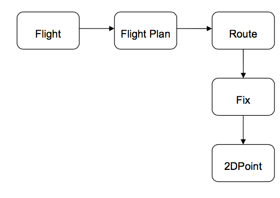

# The Ubiquitous Language

## The Need for a Common Language

도메인 전문가와 프로그래머는 다른 커뮤니케이션 스타일을 갖고 있다. 도메인 전문가는 그들의 도메인의 전문적인 지식을 갖고 있고, 그것으로 소통하려 하며, 프로그래머는 프로그래밍적 지식으로 소통하려 한다.

따라서 모델을 정의하고 얘기하기 위해서는 같은 언어를 사용해야만 한다.

**Model Based Language를 사용해야한다.**

**Ubiquitous Language**

- 모델을 기준으로 한 언어
- 팀 내의 모든 커뮤니케이션을 consistent하게 한다.
- 발언, 작문, 작도 등을 다양하게 사용하라.
- 모든 디자인 프로세스에 사용되며 관여한다.
- 도메인 전문가가 모델의 일부를 이해하지 못하거나, 언어의 일부를 이해하지 못한다면 잘못된 부분이 있다.
- 개발자들은 디자인에 있어서 애매모호하고 일관적이지 못한 표현에 주의해야 한다.

## Creating the Ubiquitous Language

도메인 전문가와 개발자가 커뮤니케이션을 할 때에 항상 고려해야 할 사항

- 문제의 본질을 생각한다.
- Ubiquitous Language를 사용하려고 노력한다.

개발자의 입장에서

- Model의 main concepts를 추상화하여 코드화 한다(class의 사용 등..)
  - 아래의 그림에서는 Fix클래스를 만들고 Fix클래스는 2DPoint클래스를 상속하도록 한다.
- Model관의 관계를 잘 파악하여 소프트웨어의 구조를 파악한다.
- Model-code mapping, Language-code mapping
  - 이로 인하여, 코딩을 하면서 새로운 클래스가 생기거나 아이디어가 생겨서 model에 긍정적인 영향을 줄 수 있다(알지 못했던 새로운 기능 추가, 새로운 추상화 레이어)

그럼 어떤 방식으로 커뮤니케이션 하는 것이 좋을까? 무엇을 Ubiquitous Languages로써 둘까?

- UML
  - class가 적을 때 매우 유효
  - 그러나 많아지면 이해하기 곤란
  - 문제의 본질을 알기 힘듬
- Diagram Document
  - 하나의 diagram으로 모든 복잡한 관계를 표현하기가 힘듬
- Code
  - XP적인 접근(잘 쓰여진 코드는 communicative하다)

....
