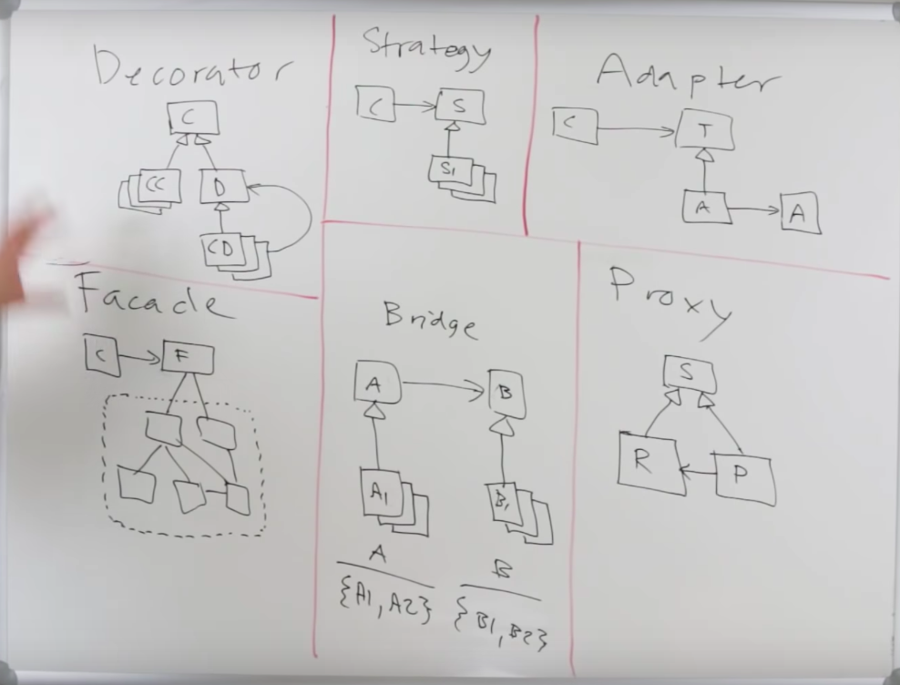

# 디자인 패턴

- 목차
  - 디자인 패턴이란
    - 정의
    - 역사
  - 디자인 패턴과 언어
  - 디자인 패턴의 분류
  - 대표적인 디자인 패턴(Head first)
    1. Strategy Pattern
    2. Observer Pattern
    3. Decorator Pattern

## 디자인 패턴이란

- 정의
  - 설계 문제에 대한 해답을 문서화하기위해 고안된 형식 방법
  - **과거의 소프트웨어 개발 과정에서 발견된 설계의 노하우를 축적하여 이름을 붙여, 이후에 재이용하기 좋은 형태로 특정의 규약을 묶어서 정리한 것**
- 역사
  - 크리스토퍼 알렉산더가 제안한, 건축의 여러 기법을 틀로 고안한 아이디어. 기존의 작은 패턴을 묶어서 조합하여 건물 / 도시를 설계
  - 각각의 패턴은 **패턴 언어**를 통해 기술 / 정리
    - 건축가가 아닌 사람도 원하는 설계를 전문가에게 정확히 전달할 수 있게 도와줌

## 런타임 오브젝트 디자인 패턴과 컴파일 타임 클래스 디자인 패턴

- 런타임 오브젝트 디자인 패턴
  - 오브젝트의 커뮤니케이션이나, polymorphism, DI 등을 이용해서 구현
  - 런타임에 동작이 확정되고, 구현보다 추상화에 의존하기 때문에 컴파일 타임 클래스 디자인 패턴보다 보다 loose한 속박
  - 대신 코드 실행에 있어서는 다소 오버헤드 발생
- 컴파일 타임 클래스 디자인 패턴
  - 상속을 이용해서 구현
  - 컴파일 타임에 동작이 확정되기 때문에 런타임 오브젝트 디자인 패턴보다 tight한 속박
  - 대신 코드 실행에 있어서는 보다 나은 최적화

## 디자인 패턴과 언어

- 디자인 패턴에서 나온 다양한 패턴들을 언어 자체가 언어의 명세로서 구현하는 경우도 있다.
  - e.g
    - OOP 지향 언어의 오브젝트의 컨스트럭터
    - 루비의 `module` 키워드(mixin)

## [디자인 패턴의 분류](https://en.wikipedia.org/wiki/Software_design_pattern)

이미 알고있는 것은 기울기가 없는 글자로 표현

- Gang of Four patterns
  - Creational
    - *Abstract factory / Builder / Factory method / Prototype / Singleton*
  - Structural
    - *Adapter / Bridge / Composite / Decorator / Facade / Flyweight / Proxy*
  - Behavioral
    - Strategy / Observer / Template method
    - *Chain of responsibility / Command / Interpreter / Iterator / Mediator / Memento / State / Template method / Visitor*
- Concurrency patterns
  - *Active object / Balking / Binding properties / Double-checked locking / Event-based asynchronous / Guarded suspension / Join / Lock / Monitor / Proactor / Reactor / Read write lock / Scheduler / Thread pool / Thread-local storage*
- Architectural patterns
  - Inversion of control
  - *Front controller / Interceptor / MVC / MVP / MVVM / ECS / n-tier / Specification / Publish-subscribe / Naked objects / Service locator / Active record / Identity map / Data access object / Data transfer object / Model 2*
- Other patterns
  - Dependency injection
  - *Blackboard / Business delegate / Composite entity / Intercepting filter / Lazy loading / Mock object / Null object / Object pool / Servant / Twin / Type tunnel / Method chaining / Dlegation*

## 대표적인 디자인 패턴


- 화살표의 방향으로 **의존한다** 라는 뜻
  - A <- B
    - B는 A에 의존한다
- is_a 관계
  - `A <|- B`
  - B는 A의 종류중 하나
- has_a 관계
  - `A <- B`
  - B는 A를 갖고 있음

### 1. Strategy Pattern


- Defines a family of algorithms
- Encapsulate & Interchangeable
- Independent to client that uses it
  - decouple

```scala
trait IFlyBehavior {
  def fly(): Unit
}

trait IQuackBehavior {
  def quack(): Unit
}

trait IDisplayBehavior {
  def display(): Unit
}

class Duck(
  flyingBehavior: IFlyBehavior,
  quackBehavior: IQuackBehavior,
  displayBehavior: IDisplayBehavior
) {
  def fly(): Unit =
    flyingBehavior.fly

  def quack(): Unit =
    quackBehavior.quack

  def display(): Unit =
    displayBehavior.display
}

val wildDuck: Duck = new Duck(fb, qb, db)
val mountainDuck: Duck = new Duck(fb2, qb2, db2)
```

- 적용
  - 암호화폐 자동거래 시스템의 시뮬레이터
    - 다양한 전략이 존재하기 때문에, 그전략들을 돌아가면서 검증해야 함
    - 이 떄에 strategy 패턴을 사용해서, 각각의 전략의 parameter를 Interchangeable하게 하면 검증하고 테스트하기 쉬울 듯

### 2. Observer Pattern


- Polling vs Pushing
  - Polling
    - 관찰의 주체(관찰을 하는 엔티티)가 주기적으로 관찰의 대상의 상태를 확인
  - Pushing
    - 관찰의 대상이 자신의 상태가 변경 되었을 때, 관찰의 주체에게 그것을 알려줌
    - 리모컨 조작
- One-to-many dependency
- One object change state => all of its dependency notified / updated automatically

```scala
trait IObserver {
  def update(): Unit
}

trait IObservable {
  def add(observer: IObserver): Unit
  def remove(observer: IObserver): Unit
  def notify(): Unit
}

class WeatherStation extends IObservable {
  private var temperature: Int = 0
  private var observers: List[IObserver] = List[IObserver]()

  def add(observer: IObserver): List[IObserver] = {
    observers = observer :: observers
  }

  def remove(observer: IObserver): Unit = {
    observers = observers.filter(_ != observer)
  }

  def notify(): Unit = {
    observers.foreach(_.update)
  }

  def getTemperature(): Int = temperature
}

class PhoneDisplay(weatherStation: WeatherStation): IObserver {
  // send data via update function's parameter
  // then, this observer does not need to have observable data
  def update(): Unit = {
    weatherStation.getTemperature

    // ...
  }
}
```

- 적용
  - 암호화폐 자동거래 시스템의 Balance 기록 시스템
    - 물론, 거래소 마다 Balance를 알아보는 것은 polling으로 밖에 할 수 없다.
    - 하지만 그것을 wrapping해서 마치 푸시할 수 있는 것 처럼 Observable로 둔다.
    - 그리고 Observer로 그것을 구독하게 하고, 변화가 있으면 update함수를 Observable에서 호출하면 Balance를 데이터베이스에 기록하게 한다.
    - 이렇게 하면 DB에 데이터를 기록하는 컴포넌트와 거래소의 Balance의 변화를 탐지하는 컴포넌트가 loosely coupled된다.

### Structural Pattern



#### 3. Decorator Pattern


- 정의
  - 런타임에 특정 오브젝트를 변경시키지 않고, 어떠한 오브젝트의 속성이나 메서드의 행위를 변경 / 혹은 추가 시키는 방법
  - 오브젝트의 래핑
  - 데코레이터는 컴포넌트를 갖을 뿐아니라, 자기자신이 컴포넌트다
  - 서브클래스의 extends보다 더 유연한 오브젝트 확장 방식을 제공
- 적용

#### 4. Adapter Pattern

- 정의
  - 클라이언트는 특정 인터페이스를 갖고 있는데, 어떠한 어댑티는 그 인터페이스를 만족하지 못하므로, 어댑터가 클라이언트의 특정 인터페이스를 만족하도록 래핑해서 클라이언트가 어댑티를 사용할 수 있도록 래핑 함

#### 5. Facade Pattern

- 정의
  - 서브 시스템을 쉽게 사용할 수 있도록 추상화한 인터페이스
  - 클라이언트가 내부의 복잡한 내용의 로직을 추상화한 Facade를 이용해서 쉽게 오브젝트의 로직을 사용할 수 있도록 함

#### 6. Proxy Pattern

- 정의
  - 다른 오브젝트에 대한 접근을 제어하기 위한 같은 인터페이스의 대리 오브젝트가 존재
  - 서브젝트라고 불리는 인터페이스를 구체적인 구현과 프록시 둘다 구현했는데, 프록시는 구체적인 구현 오브젝트를 갖고 있는 경우
  - 구현 오브젝트에 대한 접근(access)에 더 초점을 둔 디자인 패턴
    - 접근에 대한 제어를 목표로 함
    - 캐싱을 위해서 사용하는 경우가 있음(HTML 캐싱 등)

#### 7. Bridge Pattern

- 정의
  - 추상과 구현을 디커플링해서 독립적으로 다룰 수 있도록 함
  - 서로 다른 다형 계층을 이어주는 패턴
  - Strategy 패턴 + Adapter 패턴

### ?. Template Method Pattern


- IOC(Inversion Of Control)과 깊은 관계가 있음
- Super class에 Template method를 정의해두고 Subclass에서 Template method에 필요한 일부 서브 로직을 구현
- 장점
  - 공통된 로직 구성을 서브 클래스를 추가하는 것으로 쉽게 재사용 할 수 있음
  - 프레임 워크 IOC를 구현하기에 용이. 서브클래스는 자기자신이 언제 호출되는지 신경쓰지 않아도 됨(복잡성이 낮아짐)
  - e.g
    - Active record
    - Validation
    - Arbitrage Executor(각각의 거래소)
- 단점
  - 상속을 이용하므로, 클래스 사이의 커플링이 심해짐.
  - 앞으로 Template method의 컨트롤 내용이 많이 변하지 않는다는 것을 전제할 때에 사용해야 함(결국 코드의 변화가 생기면 서브 클래스의 메서드를 전부 변화시켜야 할 가능성도 존재)
  - 그냥 Strategy패턴을 사용하는 것이 좋을 수도 있음
