# 디자인 패턴

- 의문
- 디자인 패턴이란
  - 정의
  - 역사
- 디자인 패턴의 요소
- 디자인 패턴의 분류
- 디자인 패턴을 이용하여 문제를 푸는 방법
- UML 표기 소개
- 대표적인 디자인 패턴(Head first)
  - Creational Pattern
  - Structural Pattern
    - ① Decorator
    - ② Adapter
    - ③ Facade
    - ④ Proxy
    - ⑤ Bridge
  - Behavioral Pattern
    - ① Strategy
    - ② Observer
    - ③ Command
    - ④ Template method
    - ⑤ Composite
    - ⑥ Iterator

## 의문

- Behavioral Pattern관련
  - *Command Pattern은 구체적으로 어떤 메리트가 있고, 어디에서 주로 사용되는가? 유스케이스?*

`a.함수(정의역): 공역`

## 디자인 패턴이란

재사용 가능한 객체지향 소프트웨어

과거의 반복된 문제의 패턴들을 해결책의 패턴을 사용해서 해결

- 정의
  - 설계 문제에 대한 해답을 문서화하기위해 고안된 형식 방법
  - **과거의 소프트웨어 개발 과정에서 발견된 설계의 노하우를 축적하여 이름을 붙여, 이후에 재이용하기 좋은 형태로 특정의 규약을 묶어서 정리한 것**
  - 범위
    - 특정한 전후 관계에서 일반적 설계 문제를 해결하기 위해 상호교류하는 수정 가능한 객체와 클래스들에 대한 설명
- 역사
  - 크리스토퍼 알렉산더가 제안한, 건축의 여러 기법을 틀로 고안한 아이디어. 기존의 작은 패턴을 묶어서 조합하여 건물 / 도시를 설계
  - 각각의 패턴은 **패턴 언어**를 통해 기술 / 정리
    - 건축가가 아닌 사람도 원하는 설계를 전문가에게 정확히 전달할 수 있게 도와줌
- 디자인 패턴의 장점
  - 좋은 설계나 아키텍처를 재사용하기 쉬워짐
  - 재사용을 방해하는 설계는 배제하도록 도와줌
  - 시스템의 유지보수나 문서화도 개선 가능
  - 클레스의 명세나 객체 간의 상호작용 또는 설계의 의도 등까지 명확하게 정의할수 있음
- 참고
  - 만일 절차지향적 언어를 사용했다면, 상속, polymorphism, encapsulation도 패턴에 포함되었을 것
    - 즉 일부언어는 패턴이라고 정의된 것을 문법적으로 지원하는 경우가 있음(루비의 module)

### 패턴의 요소

- 패턴 이름
  - 한두 단어로 설계 문제와 해법을 서술
- 문제
  - 언제 패턴을 사용하는가, 해결할 문제와 그 배경를 서술
- 해법
  - 설계를 구성하는 요소들과 그 요소들 간의 관계, 책임 그리고 협력 관계를 서술
  - 구현 대신 추상적인 설명
    - 클래스나 객체들의 인터페이스 및 관계 나열(UML)
- 결과
  - 디자인 패턴을 적용해서 얻는 결과와 장단점
  - e.g)
    - 시간, 공간 효율
    - 시스템의 유연성, 확장성, 이식성
- (간단한 예시코드)

## 런타임 오브젝트 디자인 패턴과 컴파일 타임 클래스 디자인 패턴

- 런타임 오브젝트 디자인 패턴
  - 오브젝트의 커뮤니케이션이나, polymorphism, DI 등을 이용해서 구현
  - 런타임에 동작이 확정되고, 구현보다 추상화에 의존하기 때문에 컴파일 타임 클래스 디자인 패턴보다 보다 loose한 속박
  - 대신 코드 실행에 있어서는 다소 오버헤드 발생
- 컴파일 타임 클래스 디자인 패턴
  - 상속을 이용해서 구현
  - 컴파일 타임에 동작이 확정되기 때문에 런타임 오브젝트 디자인 패턴보다 tight한 속박
  - 대신 코드 실행에 있어서는 보다 나은 최적화

## [디자인 패턴의 분류](https://en.wikipedia.org/wiki/Software_design_pattern)

- 목적
- 범위
- 관계

gang of four

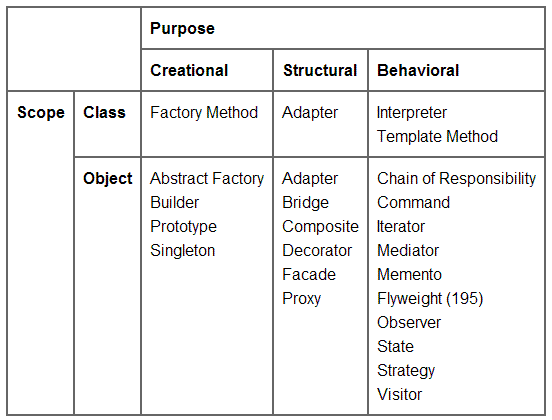

### 분류 기준: 목적

- 생성
  - 개요
    - 오브젝트 생성 매커니즘을 다룸
    - 각 상황에 맞도록 오브젝트를 생성하도록 도와줌
  - 클래스
    - 객체를 생성하는 책임의 일부를 서브클래스가 담당 하도록 넘김
  - 객체
    - 객체를 생성하는 책임을 다른 객체로 위임
- 구조
  - 개요
    - 엔티티들 사이의 관계를 쉽게 확인할 수 있는 방법을 구현
      - 엔티티의 관계 구조를 명확히 할 수 있도록 하는 패턴
  - 클래스
    - 상속을 이용해서 클래스를 복합
  - 객체
    - 객체를 합성하는 방법을 정의
- 행동
  - 개요
    - 오브젝트 사이의 공통 커뮤니케이션 패턴을 확인하여 커뮤니케이션을 행하는데에 유연함을 제공
  - 클래스
    - 상속을 이용해서 알고리즘과 제어 흐름을 기술
  - 객체
    - 하나의 작업을 수행하기 위해 객체 집합이 어떻게 협력하는지를 기술

이미 알고있는 것은 기울기가 없는 글자로 표현

- Gang of Four patterns
  - Creational
    - *Abstract factory / Builder / Factory method / Prototype / Singleton*
  - Structural
    - *Adapter / Bridge / Composite / Decorator / Facade / Flyweight / Proxy*
  - Behavioral
    - Strategy / Observer / Template method
    - *Chain of responsibility / Command / Interpreter / Iterator / Mediator / Memento / State / Template method / Visitor*
- Concurrency patterns
  - *Active object / Balking / Binding properties / Double-checked locking / Event-based asynchronous / Guarded suspension / Join / Lock / Monitor / Proactor / Reactor / Read write lock / Scheduler / Thread pool / Thread-local storage*
- Architectural patterns
  - Inversion of control
  - *Front controller / Interceptor / MVC / MVP / MVVM / ECS / n-tier / Specification / Publish-subscribe / Naked objects / Service locator / Active record / Identity map / Data access object / Data transfer object / Model 2*
- Other patterns
  - Dependency injection
  - *Blackboard / Business delegate / Composite entity / Intercepting filter / Lazy loading / Mock object / Null object / Object pool / Servant / Twin / Type tunnel / Method chaining / Dlegation*

### 분류 기준: 범위

- 개요
  - 디자인 패턴을 주로 클래스에 적용하는지 아니면 객체에 적용하는지 구분

## 디자인 패턴을 이용하여 문제를 푸는 방법

### 기본 배경 지식

- 객체
  - 구성
    - 데이터
    - 연산(메서드)
      - 객체 내부 데이터의 상태를 변경하는 유일한 방법
        - 이러한 접근의 제약 사항으로 객체의 내부 상태는 **캡슐화** 된다고 말함
  - 커뮤니케이션
    - 사용자로부터 요청(request) 또는 메시지(message)를 받으면 연산을 수행
      - 객체가 연산을 실행하게 하는 유일한 방법
  - 객체지향 프로그램은 객체로 구성됨
- 객체지향 설계의 어려운 점
  - 객체의 분할을 결정하는 기준
    - 캡슐화
    - 크기
      - 디자인 패턴을 배우면 객체의 크기 결정 문제를 해결할 수 있음
        - Facade
        - Flyweight
        - Abstract Factory
        - Builder
        - ...
    - 종속성
    - 유연성
    - 성능
    - 진화
    - 재사용성
  - 다양한 설계 방법론이 존재
    - but 실세계를 그대로 반영하지 못하는 경우 존재
      - composite 패턴
- 객체 인터페이스의 명세
  - 연산의 시그니처(signature)
    - 연산의 이름, 매개변수로 받아들이는 객체들, 연산의 반환값
  - 인터페이스
    - 개요
      - 객체가 받아서 처리할 수 있는 연산의 집합
        - 일부 언어에서는 연산 뿐 아니라, 데이터도 나타내주기도 함(ts)
      - 객체 인터페이스에 정의된 시그니처와 일치하는 어떤 요청이 객체에 전달되면, 객체는 연산을 수행하여 그 요청을 처리
    - 특징
      - 객체지향 시스템에서 가장 기본적인 개념
      - 객체는 인터페이스로 자기자신을 드러냄
        - 외부에서 객체를 알 수 있는 방법은 인터페이스 밖에 없음. 결국 인터페이스를 통해서만 처리를 요청할 수 있음
      - 객체의 인터페이스는 구현에 대해서는 전혀 알려주지 않음
        - 동일한 인터페이스를 갖는 두 객체가 완전히 다른 구현을 가질 수 있음(polymorphism)
  - 타입
    - 개요
      - 특정 인터페이스를 나타낼 때 사용하는 이름
      - 객체가 Window타입을 갖는다 => Window 인터페이스에 정의한 연산들을 모두 처리할 수 있다
      - 객체는 여러 타입을 가질 수 있고, 서로 다른 객체가 하나의 타입을 공유할 수도 있음
    - 서브타입
      - 다른 인터페이스를 포함하는 인터페이스
    - 수퍼타입
      - 다른 인터페이스가 포함하는 인터페이스
    - 상속
      - 서브타입은 수퍼타입의 인터페이스를 **상속** 한다고 함
        - 서브타입은 수퍼타입에 정의된 연산을 포함하게 됨
  - 동적 바인딩
    - 개요
      - 어떤 요청과 그 요청을 처리할 객체를 런타임에 연결 짓는 것
      - 객체에 요청이 전달되면, 요청과 이를 받는 개체에 따라서 수행되는 처리 방식이 달라짐
    - 특징
      - polymorphism
        - 프로그램이 기대하는 객체를 동일한 인터페이스를 갖는 다른 객체로 대체할 수 있게 해줌
          - 사용자의 정의를단순화 하고, 객체간의 결합도를 없애며, 프로그램 실행중에는 서로 간읜 관련성을 다양화 할 수 있게 해줌
  - 인터페이스와 디자인 패턴
    - 인터페이스에 정의해야 하는 중요 요소가 무엇이고, 어떤 종류의 데이터를 주고 받아야 하는지 식별하여 인터페이스를 정의하도록 도와줌
    - 인터페이스 간의 관련성도 정의
- 객체 구현 명세
  - 클래스
    - 개요
      - 객체의 구현 정의
        - 데이터
        - 연산
  - 객체
    - 개요
      - 클래스의 인스턴스
    - 클래스의 인스턴스화 과정
      - 객체 내부 데이터(인스턴스 변수)에 대한 공간 할당 -> 이 데이터들을 연산과 관련지음
  - 클래스 상속
    - 개요
      - 서브클래스가 부모 클래스를 상속하면, 부모 클래스가 갖는 모든 데이터와 연산을 서브 클래스가 갖게 됨
  - 추상 클래스(반대: concrete class)
    - 개요
      - 모든 서브클래스 사이의 공통되는 인터페이스를 정의
      - 정의 한 모든 연산이나 일부 연산의 구현을 서브클래스에게 넘김
        - 정의만 하고 구현하지 않는 연산을 추상 연산이라 함
      - 인스턴스 생성 불가
  - 서브클래스와 부모클래스
    - 개요
      - 서브클래스는 부모 클래스가 정의한 행동을 재정의 하거나 정제할 수 있음
    - 오버라이드
      - 부모클래스에 정의한 연산의 구현을 바꿀 수 있음
  - mixin 클래스
    - 개요
      - 다른 클래스들에게 선택적인 인터페이스 혹은 기능을 제공하려는 목적을 가짐
      - 인스턴스로 만들 의도가 없음
    - 방식
      - 다중상속
      - module(include)
- 클래스 상속 vs 인터페이스 상속
  - 객체의 클래스 vs 객체의 타입
    - **클래스와 타입 사이의 차이는 꼭 이해해 두어야 함**
    - 객체의 클래스
      - 그 객체가 어떻게 구현되느냐를 정의
        - 내부상태
        - 객체의 구체적인 구현 방법 정의
    - 객체의 타입
      - 그 객체의 인터페이스
        - 그 객체가 응답할 수 있는 요청의 집합을 정의
        - 객체가 어떻게 구현되었는가 보다는 객체가 어떻게 쓰일것이며, 상호작용 할 것인가가 중요
    - 주의
      - **객체의 구현은 다를지라도, 인터페이스는 같을 수 있음**
      - 클래스와 타입 간에는 밀접한 관련이 있음
        - 클래스도 객체의 연산을 정의하므로, 객체의 타입을 정의하는 것이기도 함
  - 클래스 상속 vs 인터페이스 상속(서브타이핑)
    - 클래스 상속
      - 객체의 구현을 정의할 때 이미 정의된 객체의 구현(implementation)을 바탕으로 함
      - **코드와 내부 표현 구조를 공유하는 메커니즘**
        - sharing
    - 인터페이스 상속(서브타이핑)
      - **어떤 객체가 다른 객체 대신에 사용될 수 있는 경우를 지정하는 메커니즘**
        - replacing
      - 인터페이스 상속 관계가 있다면, 프로그램에는 수퍼타입으로 정의하지만 런타임에 서브타입의 객체로 대체할 수 있음
    - 언어레벨에서 두 상속을 구분하지 않는 경우가 존재
      - C++에서는 순수 가상 함수만을 정의한 추상 클래스를 public으로 상속해서 인터페이스 상속을 구현하는 경우가 존재
      - 현대언어는 일반적으로 구분해서 사용(`interface`키워드의 추가)
- 구현에 따르지 않고, 인터페이스에 따르는 프로그래밍
  - 인터페이스 개념으로 객체를 다룰 떄 장점
    - 사용자가 원하는 인터페이스를 그 객체가 만족하고 있는 한, 사용자는 그들이 사용하는 특정 객체 타입에 대해 알아야 할 필요는 없다
    - 사용자는 이 객체들을 구현하는 클래스를 알 필요가 없고, 단지 인터페이스를 정의하는 추상 클래스(혹은 현대언어에서는 인터페이스)가 무엇인지만 알면 됨
    - 즉 서브시스템 간의 구현 종속성(의존성)이 사라짐
  - **결론: 구현이 아닌 인터페이스에 따라 프로그래밍 합니다**
    - 즉, 어떤 변수를 concrete 클래스의 인스턴스로 선언하는 일은 피하고, 인터페이스를 따르는 인스턴스 변수를 정의

### 재사용을 실현 가능한 것으로

- 상속 vs 합성
  - 객체지향 시스템에서 기능의 재사용을 위해 구사하는 가장 대표적인 기법
    - 클래스 상속
      - 개요
        - 다른 부모 클래스에서 상속받아 한 클래스의 구현을 정의하는 것
        - 화이트박스 재사용
          - 부모 클래스의 내부가 서브클래스에 공개되기 때문
      - 장점
        - 부모 클래스의 구현을 쉽게 수정할 수 있음
      - 단점
        - 런타임에 상속받은 부모 클래스의 구현을 변경할 수 없음
        - 서브클래스는 부모 클래스가 정의한 물리적 표현들을 전부 또는 일부 상속받는다는 점
          - 부모클래스의 변경이 생기면 서브클래스도 변경해야 함(구현의 종속성)
          - 인터페이스만 상속하는것이 대안이 될 수 있음
    - 객체 합성(object composition)
      - 개요
        - 다른 객체를 여러 개 붙여서 새로운 기능 혹은 객체를 구성하는 것
        - 블랙박스 재사용
          - 객체의 내부는 공개되지 않고 인터페이스를 통해서만 재사용되기 때문
        - 한 객체가 다른 객체에 대한 참조자를 얻는 방식으로 런타임에 동적으로 정의됨
          - 인터페이스 정의에 더 많은 주의를 기울어야 함
      - 장점
        - 캡슐화 유지 가능(다른 객체의 인터페이스에만 접근 가능하므로)
        - 동일한 타입을 갖는다면, 다른 객체로 런타임에 대체가 가능
        - 클래스와 클래스 계층이 소규모로 유지(대신 객체의 수는 조금 더 많아짐)
      - *단점*
  - 상속과 객체 합성이 적절하게 조합되어야 완벽한 재사용이 가능
- 위임(delegation)
  - 개요
    - 합성을 상속만큼 강력하게 만드는 방법
    - 두 객체가 하나의 요청을 처리
      - 수신 객체가 연산의 처리를 위임자(delegate)에게 보냄 `≒` 서브클래스가 부모 클래스에게 요청을 전달하는 것
      - 위임에서는 수신 객체는 대리자에게 자신을 매개변수로 전달해서 위임된 연산이 수신자를 참조하게 함 `≒` 상속에서는 상속받은 연산이 늘 수신 객체를 참조(`this`, `self`키워드 사용)
  - 예시
    - `Window`클래스는 `Rectangle`클래스를 자신의 인스턴스 변수로 만들고, `Rectangle`클래스에 정의된 행동이 필요할 때는, `Rectangle`클래스에 위임 (e.g `Area()`연산등)
      - `const w = new Window(new Rectangle)`
      - `w.size() -> this.rectangle.size(this)`
        - 꼭 `this`가 필요없으면 안넘겨주어도 됨
      - 이런식으로 오브젝트간 메시지가 전달됨
  - 장점
    - 런타임에 행동의 복합을 가능하게 하고, 복합하는 방식도 변경해 줌
      - e.g) `Window`객체가 런타임에 `Rectangle`인스턴스를 `Circle`인스턴스로 대체하면 원형의 윈도우가 될 것(단, `Rectangle`클래스 및 `Circle`클래스가 동일한 타입이어야 함)
  - 단점
    - 정적인 소프트웨어 구조보다 이해하기가 더 어려움
    - 런타임에 비효율적일 수 있음
  - 위임은 고도로 표준화된 패턴에서 사용하는 것이 최상
  - 위임을 사용하는 디자인 패턴들
    - State
    - Strategy
    - Visitor
    - Mediator
    - Responsibility chaining
    - Bridge
- 상속 vs 매개변수화된 타입(generic or template)
  - 매개변수화된 타입
    - 개요
      - **상속, 합성에 이어서 기능의 재사용에 이용할 수 있는 다른 방법**

## UML 표기 소개

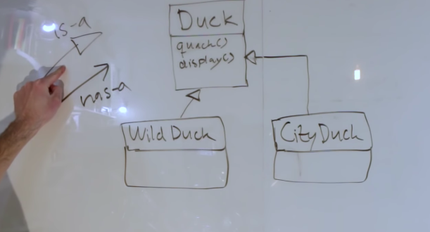

- 화살표의 방향으로 **의존한다** 라는 뜻
  - A <- B
    - B는 A에 의존한다
- is_a 관계
  - `A <|- B`
  - B는 A의 종류중 하나
- has_a 관계
  - `A <- B`
  - B는 A를 갖고 있음

## 대표적인 디자인 패턴

### Creational pattern

- 정의
  - 오브젝트를 각 상황에 적합한 방식으로 생성하기 위하여, 오브젝트 생성 매커니즘을 다루는 디자인 패턴

#### 1. Factory Pattern

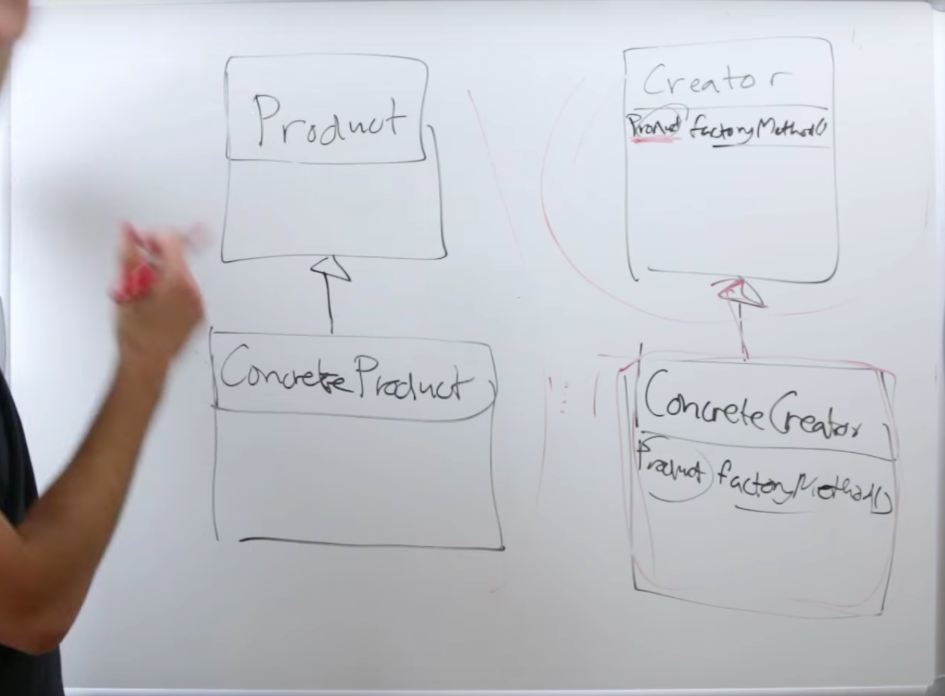

- 정의
  - 오브젝트를 생성하기 위한 인터페이스를 정의하는 것. 다만, 팩토리 메서드는 서브클래스가 어떤 클래스를 인스턴스화 하는가를 결정하게 함
  - 생성 로직을 일반화시켜서 파라미터화 하는 것

### Structural pattern

- 정의
  - 엔티티 사이의 관계를 쉽게 파악하기 위한 디자인 패턴
    - 패턴의 적용으로 결과의 변경은 일어나지 않으나,

#### 1. Decorator Pattern

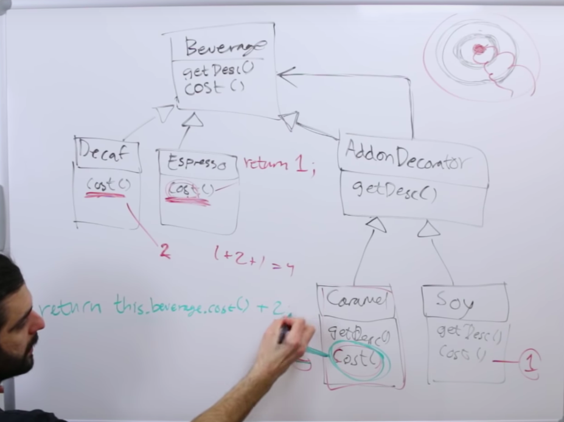

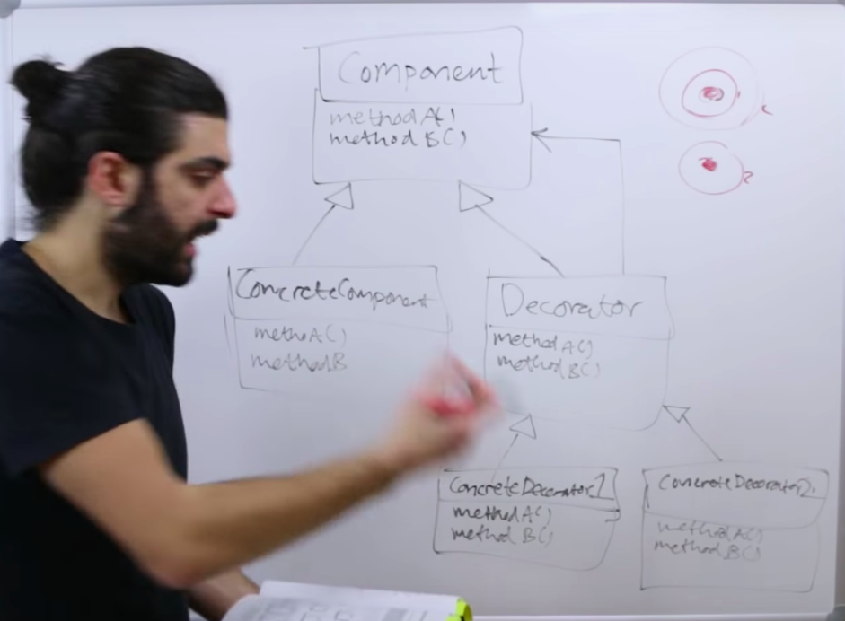

**Decorator Pattern 코드 예시**

```scala
package DesignPattern

object DesignPattern extends App {
  val espressoWithCaramel: Beverage = new Caramel(new Espresso())

  println(espressoWithCaramel.cost())
}

abstract class Beverage {
  def cost(): Int
}

class Espresso extends Beverage {
  override def cost(): Int = 4
}

abstract class AddOnDecorator extends Beverage {
  def cost(): Int
}

class Caramel(val beverage: Beverage) extends AddOnDecorator {
  def cost(): Int = beverage.cost() + 2
}

```

- 정의
  - 런타임에 특정 오브젝트를 변경시키지 않고, 어떠한 오브젝트의 속성이나 메서드의 행위를 변경 / 혹은 추가 시키는 방법
    - 동적으로(런타임에서) 특정 오브젝트의 역할을 늘려줌
  - 오브젝트의 래핑
  - 데코레이터는 컴포넌트를 갖을 뿐아니라, 자기자신이 컴포넌트다
  - 서브클래스의 extends보다 더 유연한 오브젝트 확장 방식을 제공
  - Open Close Principle를 지원
  - 상속관계에서 Interface Segregation Principle을 지킬 수 있도록 함
    - 부모클래스가 Beverage고, 자식 클래스가 Espresso인 경우에 Beverage에 있는 메서드가 Espresso에서는 필요 없는 경우가 생김.
    - Decorator Pattern은 위의 문제를 해결 가능
- 장점
  - 외부 라이브러리를 decorator로 사용할 경우 직접 코드를 변경하는 것 보다 loosely coupled하게(언제든지 detach 가능하게) 탈부착이 가능
    - 외부라이브러리를 domain logic에 직접 포함시키면, 나중에 라이브러리 업데이트가 되었을 경우, 코드 자체의 변경이 불가피해져 복잡도가 증가됨. 데코레이터 패턴으로 그것을 방지
    - e.g) react에 inline style 적용을 가능하게 한 radium
- 단점
  - runtime에 컴포넌트를 확장하므로 오버헤드발생
- 활용 시나리오
  - 외부 라이브러리를 내부 라이브러리에 적용할 때, decorator pattern을 이용해서 loosely coupled 하게 확장

---

**Decorator Pattern vs 미들웨어(특히 서버에서)**

- Decorator Pattern
  - 가장 초기에 생성한 오브젝트를 변경하지 않음(immutability)
  - 단순히 래핑해서 responsibility가 확장
    - 특히, 오브젝트의 행위의 responsibility확장
- Middleware
  - 가장 초기에 생성한 오브젝트를 변경할 수 있음(mutability)
  - 실행의 흐름을 변경할 수 있음(부작용 존재)
    - 인증 middleware를 이용해서, 로그인상태가 아닌 유저를 login페이지로 리다이렉팅 시킴
    - https로 주소 연결을 하지 않은 클라이언트를 강제로 https로 redirect시켜줌


#### 2. Adapter Pattern

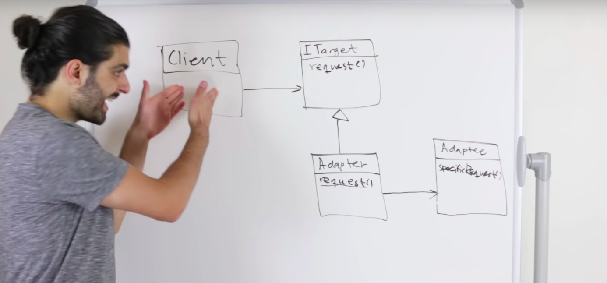

**코드 에제**

```scala
package DesignPattern

object AdapterPattern extends App {
  val adapter: ITarget = new Adapter(new Adaptee())
  val client: Client = new Client(adapter)

  client.doSomething()
}

class Client(val target: ITarget) {
  def doSomething(): Unit = {
    // do...
    target.request()
    // ...
  }
}

trait ITarget {
  def request(): Unit
}

class Adapter(val adaptee: Adaptee) extends ITarget {
  def request(): Unit = adaptee.specificRequest()
}

class Adaptee() {
  def specificRequest(): Unit = {
    println("this is specific request")
  }
}
```

- 정의
  - 클라이언트는 특정 인터페이스를 갖고 있는데, 어떠한 어댑티는 그 인터페이스를 만족하지 못하므로, 어댑터가 클라이언트의 특정 인터페이스를 만족하도록 래핑해서 클라이언트가 어댑티를 사용할 수 있도록 래핑 함
  - Client는 request라는 메서드를 실행하고 싶은데, 그것을 실행하는 대상은 request라는 메서드 인터페이스를 따르지 않으므로, adapter를 만들어서, adapter가 request라는 메서드로 메시지를 받고 그것을 원래 실행하려던 대상에게 다시 메시지를 보내서 원하는 결과를 받음
- 특성
  - 원래의 client를 변경하지 않아도 adaptee의 인터페이스 변화를 대처할 수 있음
    - 만약 adaptee가 외부 라이브러리라면?
    - OCP
  - 원래 갖고 있던 logic을 변화시키는 것이 아님. 의존하는 모듈 / 모브젝트의 인터페이스의 변화에 OCP원칙을 지켜가며 대처하기 위함
  - 혹은 기존의 구현에다가 adapter를 씌워서 interface를 변화시키는 용도로 사용할수도 있음
    - 이 용도도, 기존 코드를 직접 변경하지 않음
- 어댑터 패턴의 종류
  - 동적 합성
  - 다중 상속
- 장점
  - 기존의 코드를 변경하지 않더라도, 다른 라이브러리나 컴포넌트를 어댑터를 이용해서 활용 가능
- 단점
- 활용 시나리오
  - 코드 리팩토링
    - 기존의 코드를 변경하지 않고, 새로운 라이브러리나 코드의 적용을 어댑터를 사용해서 적용 가능


**함수형 프로그래밍에서의 유사 Adapter Pattern**

```js
// aws lambda를 hexagonal architecture형태로 구현하기
// UML diagram으로는 adapter pattern과 완전히 동일

// 일반적으로, application은 다음과 같은 모양을 띔(DI를 적용한 경우)
const app = (input, { dependency1, dependency2 }) => {
  // business logics
  // ...
  return output
}

// 하지만 최종적으로 lambda핸들러는 (event, context, callback) => ... 형태를 띄어야 함
const handler = (adapter) => (event, context, callback) => {
  // business 로직을 실행하기 위한 dependency들
  const createDependencies = () => ({
    dependency1: createDependency1(),
    dependency2: createDependency2()
  })
  // ....
  adapter(event, createDependencies())
}

// handler와 app의 서로 다른 인터페이스를 이어주기 위해서 adapter를 생성
const adapter = (app) => (event, { dependency1, dependency2 }) => {
  return response(app(convertToInput(event), { dependency1, dependency2 }));
}

// app의 비즈니스 로직을 handler와 adapter로 래핑
exports.handler = handler(adapter(app))
```

#### 3. Facade Pattern

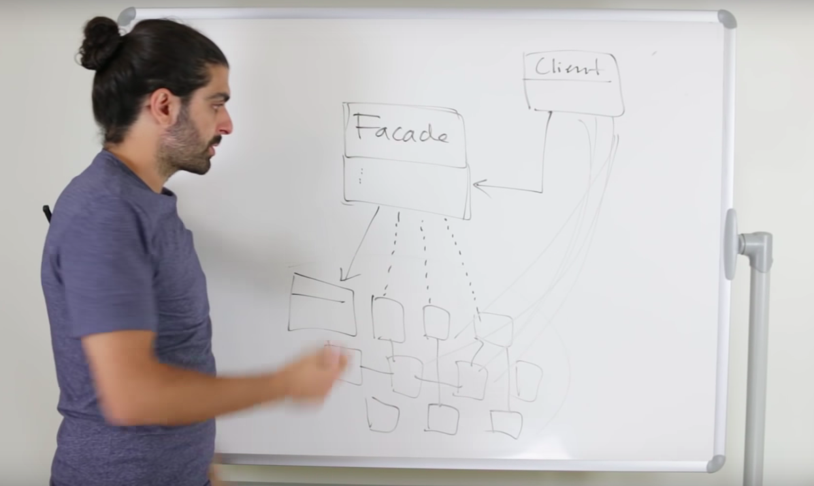

- 정의
  - 서브 시스템을 쉽게 사용할 수 있도록 추상화한 통합된 인터페이스
  - 클라이언트가 내부의 복잡한 내용의 로직을 추상화한 Facade를 이용해서 쉽게 오브젝트의 로직을 사용할 수 있도록 함
- 장점
  - 해당 모듈을 사용하는 사용자는 내부 구조의 복잡도를 몰라도 모듈을 인터페이스만을 이용하여 사용할 수 있음
- 단점
- 활용 시나리오
  - 라이브러리 제작
    - e.g) ccxt

#### 4. Proxy Pattern

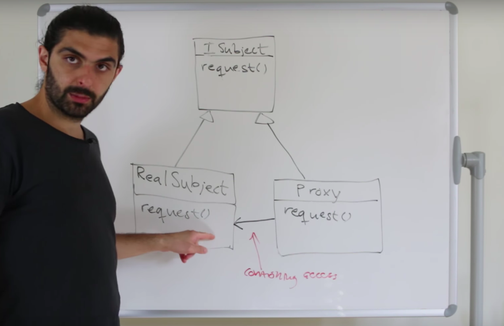

**구현 예시**

```scala
trait IBookParser {
  def getPageNumber(): Int
}

class BookParser(val filePath: String) extends IBookParser {
  val book = // really huge book, takes so long time to parse from the file path
  def getPageNumber: Int = book.getNumber()
}

class LazyBookParserProxy extends IBookParser {
  var bookParser = None
  def getPageNumber(): Int = bookParser match {
    case None => {
      // lazy instantiation
      bookParser = Some(new BookParser("filePath"))
      bookParser.getNumber()
    }
    case Some(bookParser) = bookParser.getNumber()
  }
}
```

- 정의
  - 다른 오브젝트에 대한 **접근** 을 제어하기 위해서 같은 인터페이스의 대리 오브젝트를 제공하는 것
  - 구현 오브젝트에 대한 접근(access)에 더 초점을 둔 디자인 패턴
    - 접근에 대한 제어를 목표로 함
    - 캐싱을 위해서 사용하는 경우가 있음(HTML 캐싱 등)
  - **인터페이스의 변환은 없음**
    - 캐싱이나 로깅을 위해서 사용되는 경우가 있음
    - decorator 패턴과의 차이
- 종류
  - remote
    - 원격에 있는 요소를 접근하기 위해서 사용
    - 예시
      - 원격 서버
      - 원격 code project
  - virtual
    - 생성하는데에 많은 자원을 사용하는 요소를 접근하기 위해서 사용
    - 캐싱 / lazy evalution 과 비슷한 개념
  - protection
    - protection되고 있는 자원을 사용할 수 있는 권한이 있는 유저만 사용할 수 있도록 함
- 장점
  - 관심사의 분리가 이루어진다
  - 캐싱하기 용이하다
- 단점
- 활용 시나리오
  - cache
    - 파일을 읽어들어올때, 기존에 한 번 읽었던 파일은 proxy 오브젝트에 캐싱해두었다가 나중에 같은 접근이 일어나면 바로 반환
  - access log
    - 접근 로그를 남길 떄, proxy에서 기록을 남기는 로직 작성
      - 관심사의 분리(접근해서 행동하는 로직과 기록을 남기는 로직의 분리)

#### 5. Bridge Pattern

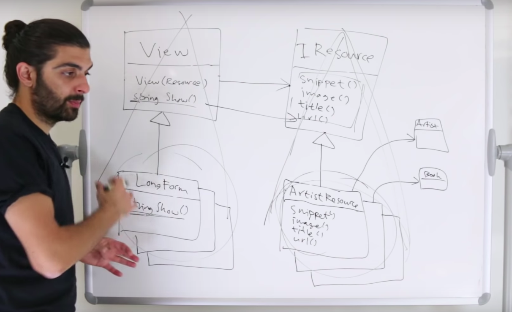

**구현 코드 예시**

```scala
package DesignPattern

object BridgePattern extends App {
  val resource: IResource = new ArtistResource(new Artist("min"))
  val longFormView: LongForm = new LongForm(resource)

  longFormView.show
}

abstract class View {
  def show(): Unit
}

class LongForm(val resource: IResource) extends View {
  def show(): Unit = {
    println(resource.snippet)
    println(resource.title)
  }
}

trait IResource {
  def snippet(): String
  def title(): String
}

class ArtistResource(val artist: Artist) extends IResource {
  def snippet(): String = artist.bio + " snippet"
  def title(): String = artist.genre + " title"
}

class Artist(val name: String) {
  def bio(): String = "My bio " + name
  def genre(): String = "My genre is " + name
}
```

- 정의
  - 구현으로부터 추상성을 디커플링해서 서로를 독립적으로 다룰 수 있도록 함
  - 서로 다른 다형 계층(polymorphic hierarchy)을 이어주는 패턴
  - Strategy 패턴 + Adapter 패턴
- 장점
  - Class들의 Cartesian Product문제 해결가능
- 단점
- 활용 시나리오
  - Controller와 View의 합성
    - 물론 이 경우에 Controller가 View를 갖고, View가 Controller를 갖게 구현할 수 있음
    - web의 경우에는, event를 이용하거나, 레퍼런스를 저장해서 View와 Controller를 커뮤니케이션 하게 할 수 있음

### Behavioral pattern

- 정의
  - 오브젝트 사이의 흔한 커뮤니케이션 패턴을 확인하는 디자인 패턴. 커뮤니케이션을 시행하는데에 보다 큰 유연성을 제공(wikipedia)
  - 패턴의 적용으로 어떠한 행위를 정의할 수 있음

#### 1. Strategy Pattern

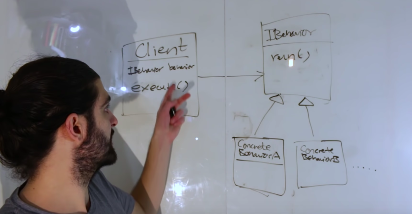

- 정의
  - Defines a family of algorithms. Encapsulate & Interchangeable. Independent to client that uses it
    - decouple
  - 나는 무엇인가 하고 싶은데, 그것이 구체적으로 어떻게 구현되는지는 관심없음
    - 그래서 외부로부터 인터페이스를 통해서 구체적인 구현을 받아들이고
    - 나는 그 인터페이스를 통해서 필요할 때 그 기능을 호출한다
  - Program to Interfaces, not implementations
- 장점
  - 컴포넌트 코드를 변경하지 않고, Strategy를 변경하므로써, strategy와 component를 분리
- 단점
- 활용 시나리오
  - 암호화폐 자동거래 시스템의 시뮬레이터
    - 암호화폐 자동거래 시스템의 구현에는 다양한 전략이 존재하기 때문에, 그 전략들을 돌아가면서 검증해야 함
    - 이 떄에 strategy 패턴을 적용해서, 자동거래 시스템을 실행하는 컴포넌트와, 각각의 전략을 분리함. 그리고 컴포넌트를 실행할 때 각각의 전략의 parameter를 Interchangeable하게 변경하면서 결과를 확인하면 컴포넌트의 코드를 변경하지 않아도 strategy의 추가 제거 만으로도 원하는 시나리오를 검증할 수 있게 됨

```scala
trait IFlyBehavior {
  def fly(): Unit
}

trait IQuackBehavior {
  def quack(): Unit
}

trait IDisplayBehavior {
  def display(): Unit
}

class Duck(
  flyingBehavior: IFlyBehavior,
  quackBehavior: IQuackBehavior,
  displayBehavior: IDisplayBehavior
) {
  def fly(): Unit =
    flyingBehavior.fly

  def quack(): Unit =
    quackBehavior.quack

  def display(): Unit =
    displayBehavior.display
}

val wildDuck: Duck = new Duck(fb, qb, db)
val mountainDuck: Duck = new Duck(fb2, qb2, db2)
```

#### 2. Observer Pattern

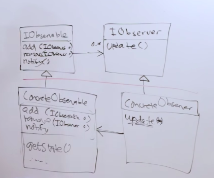

- 정의
  -
  - c.f) Polling vs Pushing
    - Polling
      - 관찰의 주체(관찰을 하는 엔티티)가 주기적으로 관찰의 대상의 상태를 확인
    - Pushing
      - 관찰의 대상이 자신의 상태가 변경 되었을 때, 관찰의 주체에게 그것을 알려줌
      - 리모컨 조작
    - One-to-many dependency
    - One object change state => all of its dependency notified / updated automatically
- 장점
- 단점
- 활용 시나리오
  - 암호화폐 자동거래 시스템의 Balance 기록 시스템
    - 물론, 거래소 마다 Balance를 알아보는 것은 polling으로 밖에 할 수 없다.
    - 하지만 그것을 wrapping해서 마치 푸시할 수 있는 것 처럼 Observable로 둔다.
    - 그리고 Observer로 그것을 구독하게 하고, 변화가 있으면 update함수를 Observable에서 호출하면 Balance를 데이터베이스에 기록하게 한다.
    - 이렇게 하면 DB에 데이터를 기록하는 컴포넌트와 거래소의 Balance의 변화를 탐지하는 컴포넌트가 loosely coupled된다.

**코드 예시**

```scala
trait IObserver {
  def update(): Unit
}

trait IObservable {
  def add(observer: IObserver): Unit
  def remove(observer: IObserver): Unit
  def notify(): Unit
}

class WeatherStation extends IObservable {
  private var temperature: Int = 0
  private var observers: List[IObserver] = List[IObserver]()

  def add(observer: IObserver): List[IObserver] = {
    observers = observer :: observers
  }

  def remove(observer: IObserver): Unit = {
    observers = observers.filter(_ != observer)
  }

  def notify(): Unit = {
    observers.foreach(_.update)
  }

  def getTemperature(): Int = temperature
}

class PhoneDisplay(weatherStation: WeatherStation): IObserver {
  // send data via update function's parameter
  // then, this observer does not need to have observable data
  def update(): Unit = {
    weatherStation.getTemperature

    // ...
  }
}
```

#### 3. Command Pattern

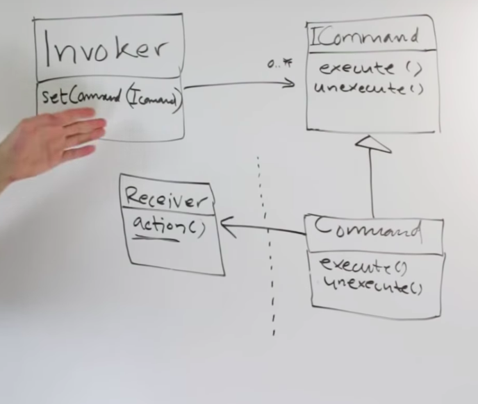

**구현 코드**

```scala
package DesignPattern

object CommandPattern extends App {
  val invoker = new Invoker(new Command(new Receiver()))

  invoker.clickOn()
  invoker.clickOff()
}

class Invoker(val lightOnCommand: ICommand) {
  def clickOn(): Unit = lightOnCommand.execute()
  def clickOff(): Unit = lightOnCommand.unExecute()
}

trait ICommand {
  def execute(): Unit
  def unExecute(): Unit
}

// Macro command is also possible
class Command(val receiver: Receiver) extends ICommand {
  def execute(): Unit = println(receiver.on)
  def unExecute(): Unit = println(receiver.off)
}

class Receiver {
  val on = "on"
  val off = "off"
}
```

- 정의
  - 요청을 자신이 처리하는 것이 아니라, 다른 객체나 객체 집합이 요청을 처리하여 구현하도록 책임지는 객체를 만들어 냄
  - 리퀘스트(command)를 오브젝트로 캡슐화 하여, 이를 파라미터화 해서 큐잉하거나 로깅하거나 undo할 수 있도록 함
  - invoker에게 command를 심어주고, command를 실행하면 receiver의 특정한 행동을 실행시킴
  - 예시
    - 리모트 콘트롤러
  - 책임의 분담
    - invoker는 명령을 시작하도록 트리거를 걸어주는 역할
    - command는 실제로 명령을 수행하는 receiver에 메시지를 전달해주고, 명령을 만들어주는 역할
    - receiver는 명령에 필요한 구성요소를 command에 돌려주는 역할
- 특성
  - 단순히 커맨드를 한 오브젝트에 구현하는게 아니고, Command를 래핑하므로써, undo역시 가능하게 함
  - 또한, Macro Command를 두어서, 다양한 Command를 하나의 Command가 실행할 수 있도록 함
- *장점*
- *단점*
- *활용 시나리오*

### 4. Template Method Pattern

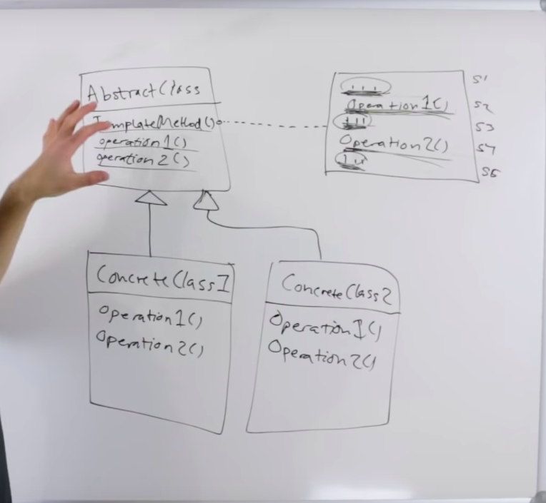

- 정의
  - IOC(Inversion Of Control)과 깊은 관계가 있음
  - Super class에 Template method를 정의해두고 Subclass에서 Template method에 필요한 일부 서브 로직을 구현
- 장점
  - 공통된 로직 구성을 서브 클래스를 추가하는 것으로 쉽게 재사용 할 수 있음
  - 프레임 워크 IOC를 구현하기에 용이. 서브클래스는 자기자신이 언제 호출되는지 신경쓰지 않아도 됨(복잡성이 낮아짐)
  - e.g
    - Active record
    - Validation
    - Arbitrage Executor(각각의 거래소)
- 단점
  - 상속을 이용하므로, 클래스 사이의 커플링이 심해짐.
  - 앞으로 Template method의 컨트롤 내용이 많이 변하지 않는다는 것을 전제할 때에 사용해야 함(결국 코드의 변화가 생기면 서브 클래스의 메서드를 전부 변화시켜야 할 가능성도 존재)
  - 그냥 Strategy패턴을 사용하는 것이 좋을 수도 있음
- 활용 시나리오
  - 암호화폐 자동거래 시스템에서 각 거래소의 거래 마다 장부 기록 방법이 차이가 생길 수 있음(거래소 API의 차이로)
    - 그러므로, parent 거래소 class에서 거래하기 메서드(template method)를 정의해두고 sub class인 각각의 거래소 class에서 장부기록 방법 operation을 따로 정의하는 방식으로 동작을 제어할 수 있음

### 5. Composite Pattern

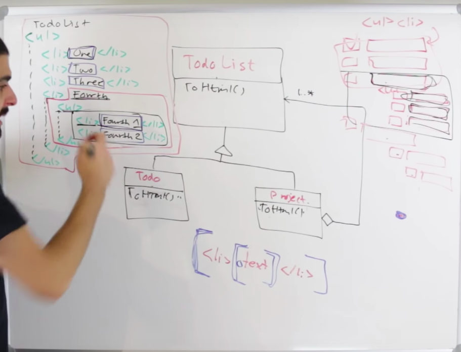

- 정의
  - 오브젝트를 트리 형태로 합성하여, 계층을 나타내도록 함. 해당 합성은 클라이언트가 각각의 합성 오브젝트와 단순 오브젝트를 일정하게 다룰 수 있도록 도와줌
- 용도
  - 합성 오브젝트와 단순 오브젝트를 일정하게 다루기 위함
  - 코드를 사용하는 클라이언트 입장에서는 오브젝트들의 합성이던 그냥 단순 오브젝트던 신경쓰지 않고 사용하고 싶어함
  - 결국에는 오브젝트들의 합성과 단순 오브젝트를 같은 인터페이스를 사용하도록 하면 됨
  - 조건문을 다형성으로 치환
    - 합성 오브젝트와 단순 오브젝트를, 공통 인터페이스를 구현하도록 함
- 장점
  - 오브젝트의 합성물과 단순 오브젝트를 일정하게 다룰 수 있음
- 단점
- 활용 시나리오
  - 트리를 순회할 때, 어떤 노드가 leaf노드인지 아닌지를 조건문으로 구별하지 않고도 순회할 수 있도록 도와줌

### 6. Iterator Pattern

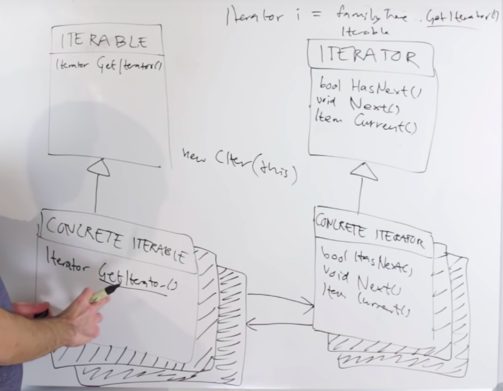

- 정의
  - 내부 구조의 노출 없이 aggregate of objects 를 순차적으로 접근할 수 있는 방법을 제공
  - 다양한 컬렉션을 내부 구조에는 관심 없이 같은 인터페이스로 iterate할 수 있도록 함
    - collection
      - 무엇인가의 컬렉션
  - 일부 언어들은 iterator pattern을 언어 차원으로 구현해둠
  - how to
    - iterate something
    - enumerate something
    - traverse something
- 장점
  - 컬렉션의 내부 구조를 알 필요 없이 traverse가 가능
- 단점
- 활용 시나리오
  - lazy evalutation
  - infinite collection의 원소들을 접근 가능
  - iteration을 언제든지 멈추고 기존의 멈춘 위치에서 다시 시작할 수 있음
