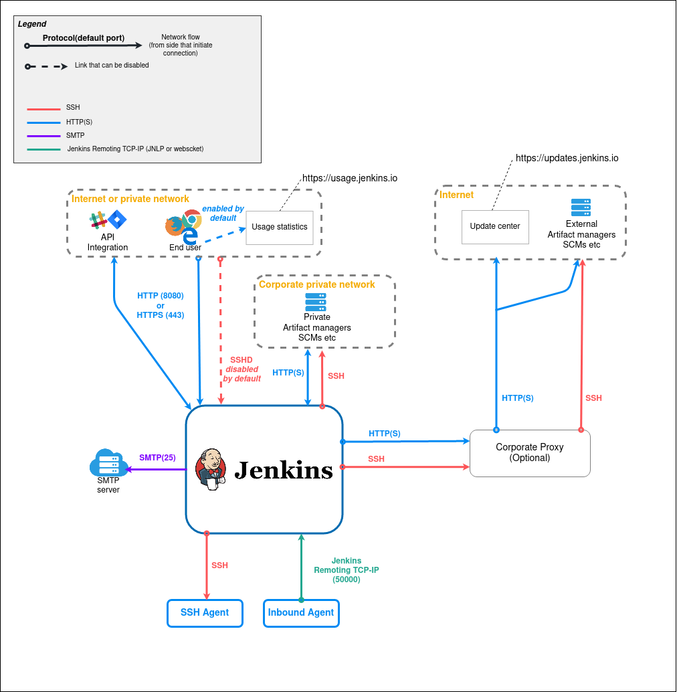
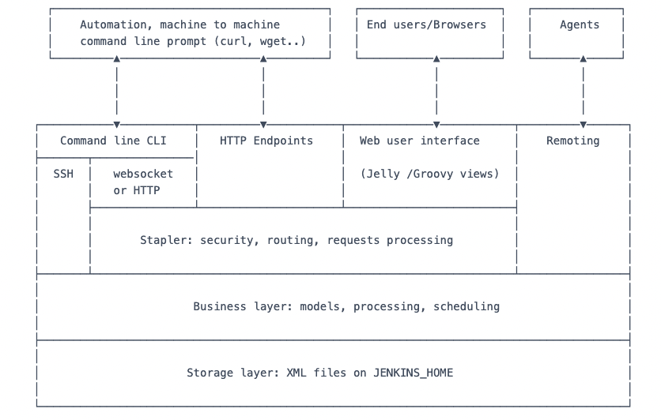
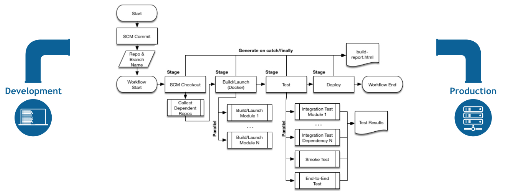

# Jenkins

- 의문
- 아키텍처
  - Jenkins Dataflow
  - Jenkins controller 아키텍처
- 파이프라인
- 용어
  - 동작의 주체
  - job관련
  - 파이프라인
  - 빌드의 상태
  - 그 외

## 의문

- 일반적으로 사용되는 플러그인
  - kubernetes
    - 쿠버네티스 agent를 사용하기 위함
  - workflow-aggregator
    - jenkins pipeline을 사용하기 위함
  - git
    - jenkins잡이 git을 사용할 수 있도록 함
  - configuration-as-code
    - JCasC(Jenkins Configuration as Code)
      - 젠킨스 설정을 코드로 할 수 있도록 함
  - job-dsl
    - DSL API참고: https://jenkinsci.github.io/job-dsl-plugin/
  - blueocean
  - slack
  - github-scm-trait-notification-context
  - reverse-proxy-auth-plugin

## 베스트 프렉티스

JCasC Seed job 예시

```yaml
cloudName: "kubernetes"

JCasC:
  defaultConfig: true
  configScripts:
    credentials: |
      credentials:
        system:
          domainCredentials:
          - credentials:
            - ... 
    job-dsl: |
      security:
        globalJobDslSecurityConfiguration:
          useScriptSecurity: false
      jobs:
        - script: >
            job('seed') {
              scm {
                git {
                  branch('main')
                  remote {
                    github('VCNC/tada-infra')
                    credentials('GitHubCredential')
                  }
                }
              }
              steps {
                dsl {
                  external('jenkins/jobs/staging.groovy')
                }
              }
              triggers {
                githubPush()
              }
            }
```

- 젠킨스 관련 모든 global 설정을 code로 관리하기
  - e.g) helm chart
- JCasC(Jenkins Configuration as Code)와 job-dsl을 활용해서, job 설정을 코드로 관리하기

## 아키텍처

### Jenkins Dataflow



- Inbound Agent
  - 개요
    - 젠킨스와 JNLP 프로토콜로 통신하여, controller로부터 어떤 태스크를 실행할지 명령을 받고, 태스크 실행 결과를 JNLP 커넥션을 이용해서 controller로 돌려줌

### Jenkins controller 아키텍처



- 참고
  - 플러그인은 무한히 기능을 추가가능하므로, 비즈니스 레이어는 무한함

## 파이프라인

파이프라인 흐름 예시



- 기본 개념
  - pipeline
    - CD 파이프라인의 유저가 정의한 모델
  - node
    - 파이프라인을 실행할 수 있는 머신
  - stage
    - 개념적으로 잡 전체를 부분집합을 나눈것(e.g Build, Test, Deploy)
  - steps
    - 젠킨스가 특정 스테이지에서 무엇을 할지 기술하는 것

### 개요

- 개요
  - CD pipeline은 소프트웨어를 버전 컨트롤에서 사용자와 고객에게 바로 전달하기 위한 프로세스의 자동화된 표현
    - 소프트웨어의 변화는 복잡한 프로세스를 타서 릴리즈되는데, 이는 믿을 수 있고 반복적인 방식임
- 특징
  - 코드(Jenkinsfile)로 파이프라인을 모델링 가능함(DSL)
  - 선언적으로, 혹은 스크립트와 같이 작성할 수 있음
- 생성 방법
  - **SCM(jenkinsfile)**
    - 베스트 프랙티스
      - 코드리뷰 가능
      - 파이프라인 트래킹 가능
      - single source of truth로 모두가 수정 및 관리 가능
  - Blue Ocean
    - 클래식 UI보다 나은수준이지만, SCM으로 하는게 베스트
  - classic UI
- 전역 변수의 사용
  - `${YOUR_JENKINS_URL}/pipeline-syntax/globals` 참고

## 용어

### 동작의 주체

- Controller(master)
  - 중앙에서 조정하고, configuration을 저장하고, 플러그인을 로드하고, jenkins를 위한 다양한 유저 인터페이스를 제공하는 역할을 하는 프로세스
  - Core(`jenkins.war`)
    - 메인젠킨스 애플리케이션으로, 기본 웹 UI와 설정, 그리고 플러그인을 설치하는 기반을 제공함
- Agent
  - 젠킨스 컨트롤러에 연결되고, 컨트롤러에 의해서 지시받은 태스크를 실행하는 (물리적, 가상)머신혹은 컨테이너(job을 실행하는 환경)
  - Label로 agent를 그루핑 할 수 있음
    - e.g) linux는 linux-based agent, docker는 docker-capable agent
  - Executor
    - agent내부의 프로세스로, 빌드를 수행함
      - 각 agent에 몇개의 executor를 둘지 설정 가능함
        - 에이전트 리소스 관리 가능
- Node
  - 파이프라인 또는 잡을 실행할 수 있는 젠킨스 환경을 구성하는 머신
    - Controller, Agent 둘다 노드로 간주됨

### job관련

- job(project)
  - 젠킨스가 실행해야하는 유저가 설정한 일의 상세이며, 예를들자면, 소프트웨어 빌드등이 있다
- build
  - 하나의 잡의 실행되는 인스턴스
- pipeline
  - 유저가 정의한 CD의 파이프라인 모델
- artifact
  - 빌드나 파이프라인 실행 도중에 생성되는 불변파일이며, 컨트롤러에 저장되어서 나중에 유저가 참조 가능하게 함
- folder
  - 파이프라인 또는 잡의 조직적인 컨테이너(파일 시스템의 폴더와 유사)
- item
  - 웹 UI에서의 엔티티
    - 폴더, 파이프라인, 잡중 하나
- Publisher
  - 빌드의 일부로, 구성된 모든 단계가 완료된 후 보고서를 게시하고 알림을 보내는 것
  - 역할
    - Stable or Unstable result를 프로세싱과 설정에 따라서 리포트함
    - e.g) JUnit publisher는 JUnit 테스트가 실패하면 빌드 결과를 Unstable하다고 할 수 있음
- Trigger
  - Pipeline 혹은 job의 실행을 트리거링하는 기준
- Upstream
  - 설정된 Pipeline 혹은 job으로, 실행의 중간에 다른 Pipeline이나 job을 트리거링함

### 파이프라인

- Stage
  - 파이프라인의 부분으로, 전체 파이프라인의 개념적인 부분을 정의할때 사용함
    - e.g) `Build`, `Test`, `Deploy`
- Step
  - 하나의 작은 태스크이며, 젠킨스에게 무엇을 해야하는지 Pipeline 혹은 job 안에서 정의됨

### 빌드의 상태

- aborted
  - 빌드가 예상되는 결과(실패)가 되기전에 중지됨
    - e.g) 유저가 수동으로 멈추거나, 타임아웃이 존재했을 경우
- failed
  - 빌드가 치명적인 에러가 존재함
- stable
  - 빌드가 successful & 퍼블리셔가 unstable하다고 하지 않음
- successful
  - 빌드가 컴파일 에러 없이 성공적이었음
- unstable
  - 빌드가 에러가 있었으나, 치명적이지 않은 경우

### 그 외

- Plugin
  - 젠킨스 코어와 별개로 제공되는 젠킨스 확장 기능
- View
  - 대시보드 스타일로 젠킨스에서 데이터를 나타내는 방식
- Workspace
  - 파이프라인이나 잡을 시행할 수 있는 노드에서의 처분 가능한 파일시스템의 디렉터리
  - 일반적으로는 특정한 cleanup 정책이 없다면 Build, Pipeline 이후에 그대로 두어짐
    - 젠킨스 컨트롤러에서 cleanup 정책을 설정 가능
