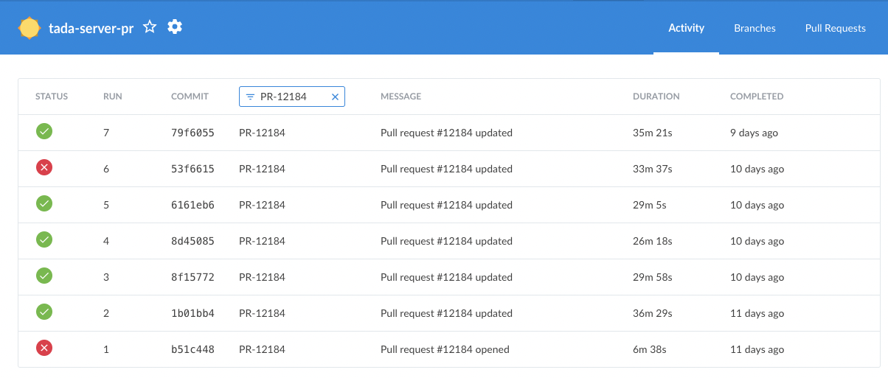
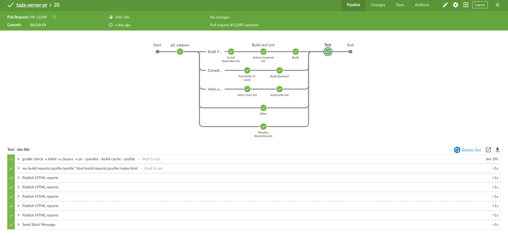
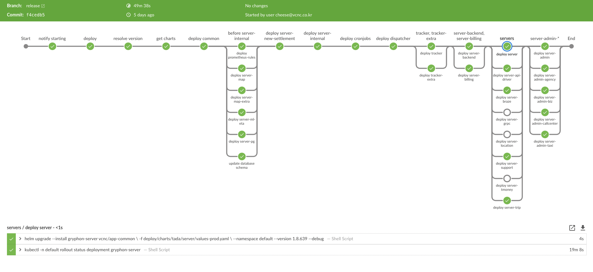
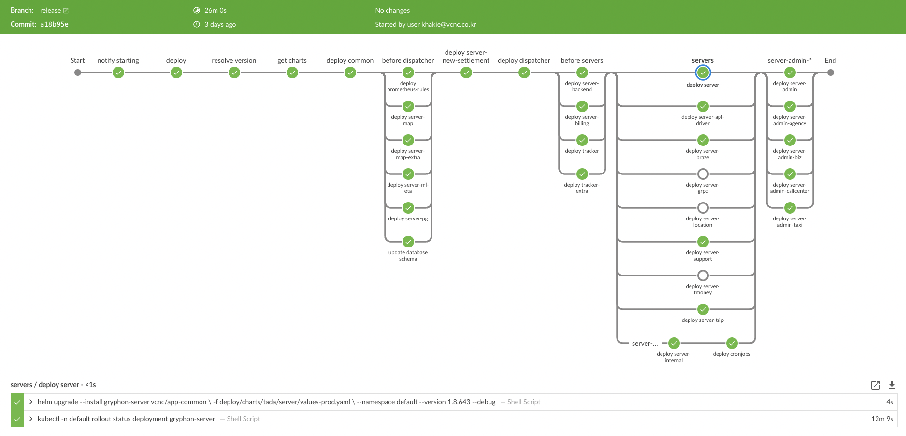

# CICD 문제 해결 리포트

- 의문
- 1 타다 서버 서비스 CI 파이프라인 개선
- 2 타다 서비스 CD 파이프라인 개선

## 의문

## 1. 타다 서버 서비스 CI 파이프라인 개선

### 1.1 현상

기존 CI 파이프라인의 속도

- 타다 서버 서비스는 여러 서브 프로젝트로 구성된 모노레포로 구성되어 있고, 코틀린 + 스프링기반의 웹 서비스이다.
- 레거시가 많이 쌓인 모노레포이기 때문에, 코드의 양도 방대하고, 의존성도 복잡하다.
- 그리하여 개발자가 개발을 마치고 PR을 깃허브로 보낸뒤에 jenkins상에서 동작시키는 기존 CI pipeline으로는 최소 25분, 최대 35분까지 걸리곤 했다

### 1.2 원인

위의 파이프라인 구성도 및 실제 동작에서 보면 다음과 같은 문제가 있었다.

- 모노레포이기 때문에
  - common모듈이 방대하여 코틀린 컴파일 시간이 너무 오래걸린다
  - 유닛 테스트가 2800개 정도로 매우 방대하게 되는데, 테스트 워커는 고작 3개였다
    - 20분이상

### 1.3 개선

- 코틀린 컴파일에 대해서
  - IC(Incremental Compile)을 사용
- 유닛 테스트에 대해서
  - 젠킨스 워커 노드의 스펙을 c5.9xlarge(36vCPUs, 72GiB) 에서 c5.12xlarge로 스케일업(48vCPUs, 96GiB)하고 워커 팟을 24vCPU, 48GiB를 사용해서 동시에 두개가 동작하도록 자원을 요청함
  - 그리고 gradle test worker를 11개로 만들어서 CPU자원을 최대한 효율적으로 사용하게 하면서, 테스트를 병렬로 돌림

### 1.4 결과

- CI 속도
  - 테스트 잡의 시간이 20분이상에서 6분으로 단축
  - 전체 테스트는 평균 27분에서 12분으로 단축
    - 하루에 엔지니어 8명이 5번의 PR을 날린다고 했을경우, 12분 * 5번 * 8명 = 60분 * 8명 = 480분의 시간을 세이브할 수 있음
- 비용
  - EC2인스턴스는 원래 사용하던 비용의 30%가 증가된 금액이지만, CI실행시간이 줄어들었으므로, 비용이 그렇게 많이 늘어나지 않았을 것으로 판단

## 2. 타다 서비스 CD 파이프라인 개선

### 2.1 현상

기존 CD 파이프라인의 속도

- 타다의 백엔드 서비스는 모노레포로구성되어있고, 다양한 서버로 때문에, 배포시에도 여러 서버를, 의존 순서에 따라서 배포해줘야할 필요가 있다
- 실서버 클러스터를 안전하게 배포하기 위해서는, 쿠버네티스의 롤링 배포를 이용한다
- 기존 배포 파이프라인은 의문없이 계속되어 사용되어왔으나, 평균 40분, 최대 한시간이상이나 걸리는 파이프라인이 되어버렸다
  - 배포 도중에 문제가 생기거나, 롤백까지의 시간이 너무 오래걸렸다
  - 또한 모니터링을 너무 길게 해야하는 문제까지 있었다

### 2.2 원인

- 애초에 모노레포를 사용하기 때문에, 서버들 사이의 배포에 디펜던시가 있다는 점이 문제였음
- 기존의 CD 파이프라인의 순서가 잘못되었음
  - server-internal이 job의 worker를 의존하는데, 배포 순서는 반대로 되어있었음
- 굳이 따로 배포하지 않아도 되는 서버들을 분리해뒀었음
  - server-billing, server-backend와 tracker, tracker-extra
  - server-internal

### 2.3 개선

- 서버 사이의 디펜던시는, 모노레포를 사용하는 이상 어쩔 수 없음
- 파이프라인 순서의 최적화
  - 의존 순서를 다시 바로잡아줌
  - 굳이 따로 배포하지 않아도 되는 서버들을 같이 배포해줌
  - 불필요하게 설정해뒀던 readiness probe를 없애줌

### 2.4 결과

- CD 속도
  - 기존에 40분에서 한시간 걸리던 배포 파이프라인이, 26분에서, 최대 30분까지로 10분 이상이 단축되었음
    - 빠른 배포로 인한, 모니터링 비용의 감소
    - 롤백의 용이성이 증가함
