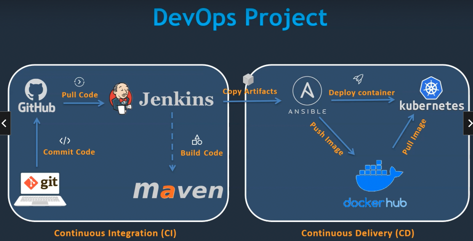

# DevOps Project - 2022: CI/CD with Jenkins Ansible Kubernetes

## 의문

## 개요

### 프로젝트 전체 구조

- 젠킨스 까지는 CI
- 젠킨스 이후는 CD

### CI/CD

- CI
  - 유닛 테스트 & 빌드
- CD
  - CI & 자동 배포

## Jenkins & Maven

- 젠킨스 서버 만들기
- 젠킨스 잡 만들기
- 젠킨스와 깃 연동하기
  - git plugin
- 젠킨스와 메이븐 연동하기
  - maven, java plugin
