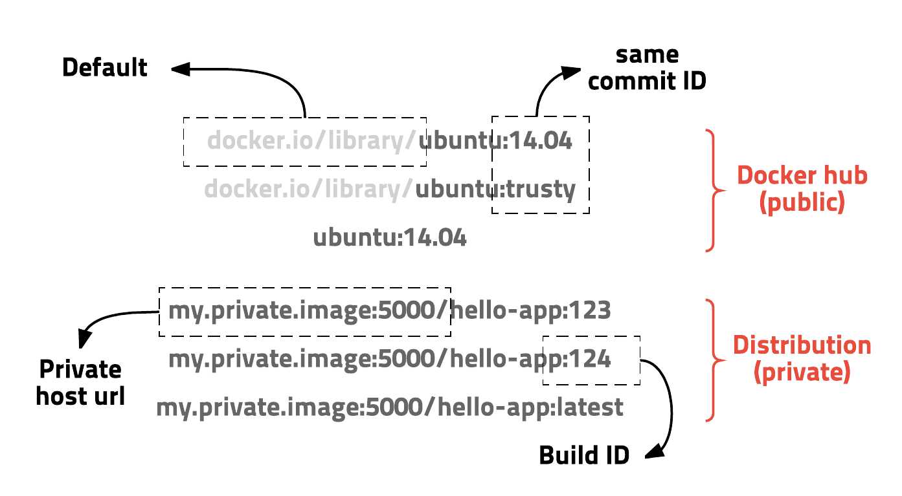
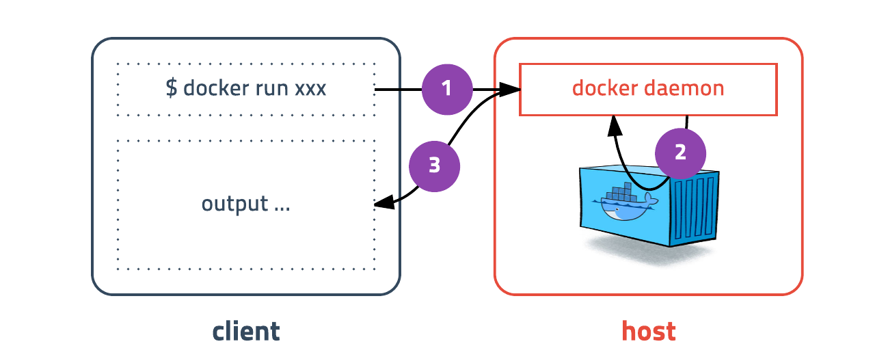
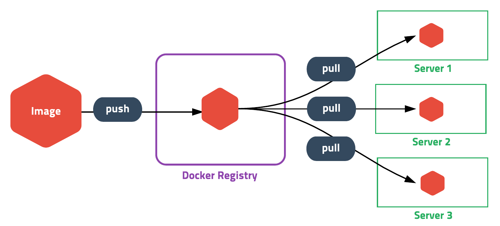

# 도커

- 도커 기초
  - 도커의 역사
  - 도커란
  - 도커 엔진
  - 도커 아키텍처
  - 도커 기반 기술
  - 컨테이너
  - 이미지
  - 핫한 이유
- 도커 Best Practice
- 도커 실습
  - (참고)도커 커맨드
  - 도커 구성
  - 도커 실습
  - 도커 기본 명령어
  - 컨테이너 업데이트
  - Docker Compose
- 도커 이미지 만들고 배포하기
- 팁

## 의문

- *도커가 존재하기 전에는, 도대체 어떻게 가상화 기술을 사용해왔는가?*
  - 예를들어서, cloud9 같은 서비스는 어떻게 동작해왔던 것인지..
  - 가상화는 여러가지 종류가 존재
- 도커 컨테이너 마다 ip가 부여된다면, 어떤 기준으로 ip가 부어되고 어떤 값을 갖게 되는가?
  - `docker network`로 묶여있는 경우, 해당 네트워크 브릿지를 기준으로 각자 private network의 ip를 부여받음
    - e.g) `172.21.0.0.1/16`
  - 각 컨테이너의 통신은 해당 docker network에 부여된 gateway(아마 virtual)로 통신가능
- docker run 에서 `-t`옵션의 역할
  - 무옵션일 경우에는 단순히 stdout stream을 갖게 됨
    - `docker run ... | ...`가 가능
  - `-t` 옵션을 부착하는 경우에는 psudo-TTY, 즉, 터미널 드라이버를 부착하는 것
    - `-t`만 주어지는 경우에는, 터미널 드라이버가 부착되나, stdin을 인식하지 못하므로, 컨테이너를 커맨드라인에서 제어할 수 없음
  - `-i` 옵션이 보통 사용되며, 이는, 유저의 입력의 stdin stream을 부착하는 것과 같음
    - `-i`만 주어지는 경우에는, 컨테이너가 유저입력을 stdin으로 받아들이므로, 컨테이너 내부에서 커맨드라인으로 제어할 수 있으나, 뷰가 단순히 stdout으로만 나오므로, 터미널 뷰가 아니라 불편함
  - 보통 `-it` 형태로 많이 사용
    - 일반적인 터미널과 같은 역할을 함

## 도커 기초

### 도커의 역사

- [The future of Linux Containers - 2013년 3월](https://www.youtube.com/watch?v=wW9CAH9nSLs&feature=youtu.be)

### 도커란

- 정의
  - 동작하는 애플리케이션을 개발하고, 운반하기 위한 Open platform
  - 컨테이너 기반의 오픈소스 가상화 플랫폼
    - 도커는 리눅스컨테이너 기반
  - **애플리케이션을 인프라로부터 격리**
    - 도커를 사용하면, 인프라를 애플리케이션을 다루듯이 다룰 수 있음
    - 코드를 작성하고 프러덕션 환경에서 애플리케이션을 쉽게 디플로이 가능
- 도커 플랫폼
  - Docker는 container라고 불리는 loosely isolated environment에서 애플리케이션을 동작시키고, 패키징하는 기능을 제공
  - 하나의 호스트에서 여러 컨테이너를 동시에 동작시킬 수 있음
  - 하이퍼바이저 도움 없이, 직접 host machine kernel에서 동작함
- 기능
  - 컨테이너의 lifecycle을 매니징 할 수 있는 플랫폼과 툴링을 제공
    - 1\. 애플리케이션 개발과 컨테이너를 사용한 supporting components
    - 2\. 컨테이너가 배포하거나 애플리케이션을 테스팅하는 하나의 단위가 됨
    - 3\. 준비되면, 애플리케이션을 배포 환경에 컨테이너나 orchestrated service로 배포할 수 있음
- 도커의 장점
  1. 애플리케이션의 빠르고 일관된 배달
  2. 반응성이 높은 배포와 스케일링
  3. 동일한 하드웨어에서 보다 많은 작업량 수행하기

### 도커 엔진

도커 엔진


- 개요
  - 클라이언트-서버 애플리케이션
- 구성
  - **데몬 프로세스(서버)**
    - `dockerd` 커맨드
  - **데몬에게 메시지를 주기 위한 REST API 인터페이스**
  - **CLI 인터페이스 클라이언트**
    - `docker` 커맨드
    - 클라이언트는 데몬과 다른 시스템에 존재해도 네트워크를 이용하여 통신 가능
- 시나리오
  - CLI는 Docker REST API를 사용하여, Docker daemon을 제어하거나 상호작용을 함
    - scripting 혹은 direct CLI command를 사용
  - 데몬은 Docker object를 생성하고 관리함
    - images, containers, networks, volumes

### 도커 아키텍처

도커 아키텍처 개요


- **Docker daemon(`dockerd`)**
  - 개요
    - Docker API 리퀘스트를 listen하고, image, container, network, volume 과 같은 Docker object들을 관리함
- **Docker client(`docker`)**
  - 개요
    - 사용자가 Docker와 상호작용할 때 주로 사용하는 방법
  - 예시
    - `docker run` 커맨드 실행
    - 클라이언트가 커맨드를 `dockerd`에 전송
    - 내용 수행
  - `docker`의 커맨드는 Docker API를 사용하는데, 하나의 클라이언트가 다수의 데몬과 상호작용할 수 있음
- **Docker registries**
  - 개요
    - 도커 이미지를 저장하는 장소
  - 특징
    - Docker Hub는 public registry
    - private registry 작성 가능
    - `docker pull` or `docker run` 커맨드를 실행할 경우, 필요한 이미지들이 설정한 레지스트리로부터 pulled됨
    - `docker push` 커맨드를 실행할 경우, 설정한 레지스트리로 이미지가 push됨
- **Docker objects**
  - **Images**
    - 정의
      - **하나의 도커 컨테이너를 제작하기 위한 read-only instruction template**
    - 특징
      - 하나의 이미지는 다른 이미지의 기반이 되기도 함
      - Dockerfile을 만들어서 자기자신의 이미지를 생성할 수 있음
        - Dockerfile속에 있는 instruction은 이미지의 layer를 만듬
        - Dockerfile을 변경했을 경우, 변경된 부분만 layer가 다시 만들어짐(instruction내용이 그대로면 cache된 것을 그냥 씀)
      - Base image는 `scratch` 이미지
        - 오직 Dockerfile 안에서만 `FROM scratch`로 minimal image생성 가능
  - **Containers**
    - 정의
      - **한 이미지의 실행 가능한 instance**
      - **컨테이너는 create하거나 start할 때 제공하는 옵션 설정 뿐 아니라, 이미지에 의해서 정의됨**
    - 특징
      - Docker API나 CLI를 이용해서 conatiner를 create, start, stop, move, delete 할 수 있음
      - 컨테이너를 하나, 혹은 그 이상의 network에 연결시킬 수 있고, storage를 장착할 수 있음
      - container의 현재 state를 기반으로 새로운 이미지를 생성할 수 있음
        - `docker commit`
      - 기본적으로 한 컨테이너는 다른 컨테이너나 호스트 머신이랑 잘 격리되어 있음
        - 컨테이너의 네트워크, 스토리지, 다른 서브시스템들을 어떻게 격리시킬 것인지 선택할 수 있음
        - OS level virtualization
      - 컨테이너가 제거될 때, 영속적 스토리지에 저장되지 않은 상태에 대한 변화는 사라짐
    - `docker run -it ubuntu /bin/bash`를 실행했을 때, 일어나는 일
      1. `ubuntu`이미지가 로컬에 존재하지 않으면, registry에서 이미지를 pull해옴(as if `docker pull ubuntu`)
      2. Docker가 새 컨테이너 생성(as if `docker container create`)
      3. Docker가 그 container의 final layer에 *read-write 파일 시스템을 할당.(구체적인 의미가 뭐지?)* running container가 로컬 파일 시스템의 디렉터리와 파일을 생성하거나 수정할 수 있게 함
      4. Docker가 default network에 연결할 수 있도록 network interface를 생성(옵션을 제공하지 않았을 경우). 컨테이너에 IP 주소 할당. 기본적으로, 컨테이너는 호스트 머신의 네트워크 연결을 사용하여 외부 네트워크에 연결할 수 있음
      5. Docker가 컨테이너를 시작하고, `/bin/bash`를 실행. container는 interactively(`-i (stdin을 연결함)`), 자신의 terminal에서(`-t (psudo terminal을 부착)`) 실행되기 때문에, input을 키보드를 통하여 제공할 수 있고, 그동안 output은 terminal로 표시됨
      6. `exit` 명령을 터미널에서 실행하면, container는 멈추지만, 제거되지는 않음. 다시 시작할 수 있거나 제거할 수 있음
  - **Services**
    - 개요
      - 다수의 Docker 데몬들에 걸쳐서 컨테이너를 스케일링 가능하게 함
        - 다수의 container가 다수의 매니저와 워커를 갖는 하나의 swarm으로, 상호작용을 함
      - 하나의 swarm의 각 멤버는 하나의 Docker daemon이며, 모든 데몬들은 Docker API를 사용하여 커뮤니케이션을 함
      - 하나의 서비스는 desired state를 정의할 수 있게 하는데, 이를테면 특정 시간에 반드시 사용 가능해야만 하는 복제 서비스의 개수 등이 포함 됨
      - consumer에게는 docker service는 하나의 application으로 보임
      - Docker engine은 Docker 1.12나 그것보다 높은 버전에서 swarm을 지원
  - Network
  - Volume

### 도커 기반 기술

- 개요
  - Docker는 Go로 작성되었으며, Linux kernel의 특정 기능을 사용함
- 종류
  - **Namespaces**
    - 개요
      - 컨테이너 별 자원 격리
        - container라고 불리는 격리된 workspace를 제공하기 위하여 사용됨
          - 컨테이너를 실행하면, 도커가 그 컨테이너의 namespace의 집합을 생성
      - layer of isolation을 제공
      - 각각의 aspect of a container는 분리된 namespace에서 동작하고, 그것의 접근은 그 namespace에서만 한정됨
      - *namespace가 정확히 무엇일까?*
    - 도커 엔진이 사용하는 namespace(Linux)
      - `pid`: Process isolation(Process ID)
      - `net`: Managing network interfaces(Networking)
      - `ipc`: Managing access to IPC resources(InterProcess Communication)
      - `mnt`: Managing filesystem mount points(Mount)
      - `uts`: isolating kernel and version identifiers(Unix Timesharing System)
  - **Control groups(`cgroups`)**
    - 개요
      - 컨테이너 별 자원 관리(제한)
        - 자원의 특정 집합으로 application을 제한함
      - Docker Engine이 사용가능한 하드웨어 자원들을 컨테이너끼리 공유하도록 하고, 선택적으로, 제한 설정을 부여
      - e.g) 하나의 특정 컨테이너의 메모리 사용량 조절
  - **Union File Systems(UnionFS)**
    - 개요
      - 레이어를 만듦으로써, 동작하는 파일 시스템
        - 그 덕분에 매우 가볍고 빠름
      - 도커 엔진은 UnionFS를 사용하여, 컨테이너들을 위한 block을 생성
    - 사용 가능한 종류
      - `UnionFS`변종
        - AUFS
        - btrfs
        - vfs
        - DeviceMapper
  - **Container format**
    - 개요
      - namespace와 control group과 UnionFS를 결합한 하나의 wrapper
      - default는 `libcontainer`
        - 미래에는, BSD Jail이나 Solaris Zones등의 기술을 결합해서 다른 container format을 지원할 예정

### 컨테이너


- 정의
  - 격리된 공간에서 프로세스가 동작하는 기술
    - 여기에서 격리된 공간의 정의?
      - namespace의 격리
      - 자원제한으로써의 격리
- 기존의 가상화 기술과의 차이
  - 기존
    - OS의 가상화(전가상화)
      - HOST OS위에 GUEST OS를 둠
      - 사용법은 간단하나 무겁고 느림
      - 반가상화 방법도 생겼으나, 여전히 무겁고 느림
  - 리눅스 컨테이너
    - 프로세스의 격리
      - 프로세스의 격리의 정확한 의미는? - 프로세스를 격리했는데 어떻게 새로운 OS(?)처럼 행동할 수 있는가?
        - 프로세스의 자원에 대한 view와 자원 자체 접근에 대한 격리임
      - CPU나 메모리는 딱 프로세스가 필요한 만큼만 추가로 사용
      - 성능적 손실이 거의 없음

### 이미지

- 정의
  - 컨테이너 실행에 필요한 파일과 설정값등을 포함하고 있는 것
- 특징
  - 상태 값을 가지지 않고 변하지 않음(immutable)
  - 컨테이너는 이미지를 실행한 상태
    - 추가되거나 변하는 값은 컨테이너에 저장
  - 컨테이너 실행을 위한 모든 정보를 갖고 있으므로, 의존성 파일을 컴파일하고 이것저것 설치할 필요가 없음
  - Docker hub / registry 저장소를 직접 만들어 관리할 수 있음
- 예시
  - ubuntu이미지
    - ubuntu를 실행하기 위한 모든 파일을 가지고 있음
  - MySQL이미지
    - debian을 기반으로 MySQL을 실행하는데 필요한 파일과 실행 명령어, 포트 정보등을 가지고 있음
- 이미지 경로
  - url방식으로 관리



### 핫한 이유

- 레이어 저장방식
  - 컨테이너 실행하기 위한 모든 정보는 수백메가에 이르나, "레이어" 개념을 도입하여, 여러개의 레이어를 하나의 파일 시스템으로 이용할 수 있게 해줌
    - 하나의 파일 시스템으로 이용할 수 있게 해줌이라는게 정확히 무슨 말인가?
      - 레이어들을 다 결합해서 하나의 컨테이너를 하나의 파일 시스템으로 구성되었다고 생각할 수 있는 것
  - 기존에 다운로드 받아놓은 레이어를 다른 이미지를 만들 때 재활용 할 수 있게 해줌
    - 이미지 = 레이어로 구성
  - 컨테이너 생성시에도 레이어 활용
    - 기존의 이미지 레이어 위에 R/W(읽기/쓰기) 레이어를 추가
    - 이미지 레이어를 그대로 사용하면서, 컨테이너가 실행중에 생성하는 파일이나 변경된 내용은 R/W레이어에 저장
- Dockerfile
  - 의존성 관리를 쉽게
- Docker Hub
- Command API
  - 알기 쉬움
- 새로운 기능들이 빠르게 추가
- 훌륭한 생태계
- 커뮤니티 지원

## 도커 Best practice

### 1. How to keep your image small

- Start with an appropriate base image
  - JDK가 필요하면, official `openjdk` 이미지를 불러오자
- Use multistage builds
  - 하나의 Dockerfile에서 java application을 구축하기 위해서`maven` 이미지를 사용한 뒤에, `tomcat` 이미지를 사용하고 java artifacts를 올바른 장소로 복사하는것이 가능
    - `RUN` 커맨드를 최소화 하자
- 공통 부분을 갖는 다양한 이미지를 갖는다면, 공유되는 컴포넌트를 갖는 base image를 만드는 것을 고려하라
- **production image를 lean하지만 debugging을 허용하기 위해서, production image를 debug image의 base image로 만드는 것을 고려하라**
  - 추가적인 testing / debugging tooling이 production image의 top에 추가될 수 있음
- 이미지를 만들 때, 자동 생성되는 `latest`에 의존하지 말고, 제대로 된 태그를 넣어라.

### 2. Where and how to persist application data

- storage driver를 사용하여 container에 application 데이터를 저장하지 말라
  - 컨테이너의 사이즈를 증가시키고, I/O 측면에서 비효율적(volumes, bind mounts에 비해서)
- production 환경에서는 **volumes**
- developement 환경에서는 bind mount
- production 환경에서는, **secret** 을 사용하여 중요한 application data를 저장하고, **configs** 를 사용하여, 덜 중요한 파일들(config)을 저장하자.
  - standalone containers를 사용하고 있다면, single-replica service를 사용하는 것을 고려하자
  - *애초에 secret, configs은 무엇을 하는 기능인지?*

### 3. Use CI/CD for testing and deployment

## 도커 실습

### (참고)도커 커맨드

[도커 커맨드](https://docs.docker.com/engine/reference/commandline/docker/)

### 도커의 구성



- 클라이언트 서버 구성
  - 클라이언트
    - `docker command`를 docker-daemon으로 보냄
  - 서버
    - 받은 도커 커맨드를 실행하고 그 결과를 다시 client쪽으로 보냄

### 도커 실습

- `docker run ubuntu:16.04`
  - 도커 이미지를 다운받고 컨테이너 실행
  - 컨테이너는 실행했으나, 명령어가 없으므로 컨테이너가 생성되자마자 종료
  - 컨테이너 = 프로세스
    - 더 이상 실행할 프로그램이 없다면 컨테이너는 종료

### 도커 기본 명령어

- `docker run`
  - 컨테이너 실행
- `docker ps`
  - 컨테이너 목록 확인
- `docker stop`
  - 실행중인 컨테이너 중지
  - 컨테이너는 종료되어도 삭제되지 않고 그대로 남아있음
  - (팁)중지된 컨테이너 모두 삭제하기
    - `docker rm -v $(docker ps -a -q -f status=exited)`
- `docker images`
  - 도커 이미지 목록 확인
- `docker pull`
  - 도커 이미지 다운로드
- `docker rmi`
  - 도커 이미지 삭제
- `docker logs`
  - 컨테이너 로그 보기
  - 도커는 표준 스트림중 stdout, stderr를 수집
    - 따라서 컨테이너에서 실행되는 프로그램의 로그 설정을 파일이 아닌 표준출력으로 바꾸어야 함
  - 컨테이너의 로그 파일은 json 방식으로 어딘가에 저장이 됨
    - 로그가 많으면 파일이 차지하는 용량이 커지므로 주의
    - 플러그인으로 json이 아닌, 특정 로그 서비스에 스트림을 전달하도록 하는것이 바람직
- `docker exec`
  - 실행중인 컨테이너에서 명령어 실행하기
    - ssh 쓰지 말자

### 컨테이너 업데이트

- 이미지 다운 -> 기존 컨테이너 삭제 -> 새 컨테이너 실행
  - 이때에, 데이터 유지가 중요(컨테이너 외부로 격리)
    - 1: 클라우드 서비스(S3)
    - 2: 데이터 볼륨(마운트)

### Docker Compose

- 컨테이너 조합이 많아지고 여러가지 설정이 추가되면 명령어가 금방 복잡해지는데 그것을 쉽게 제어할 수 있는 도구

```docker
virsion: '2'

services:
  db:
    image: mysql:5.7
    volumes:
      - db_data:/var/lib/mysql
    restart: always
    environment:
      MYSQL_ROOT_PASSWORD: wordpress
      MYSQL_DATABASE: wordpress
      MYSQL_USER: wordpress
      MYSQL_PASSWORD: wordpress

  wordpress:
    depends_on:
      - db
    image: wordpress:latest
    volumes:
      - wp_data:/var/www/html
    ports:
      - "8000:80"
    restart: always
    environment:
      WORDPRESS_DB_HOST: db:3306
      WORDPRESS_DB_PASSWORD: wordpress
volumes:
  db_data:
  wp_data:
```

## 도커 이미지 만들고 배포하기

### 도커 이미지 만들기


- 도커 이미지 만들기
  - 도커는 이미지를 만들기 위해, **컨테이너 상태를 그대로 이미지로 저장** 하는 방법을 사용
    - 콘솔에서 명령어를 직접 입력하는 것과 별 차이가 없음
  - Dockerfile이라는 DSL을 사용

```dockerfile
FROM ubuntu:16.04
MAINTAINER yeongyumin@vuno.co
RUN apt-get -y update

RUN apt-get -y install ruby
RUN gem install bundler

COPY . /usr/src/app

WORKDIR /usr/src/app
RUN bundle install

EXPOSE 4567
CMD bundle exec ruby app.rb -o 0.0.0.0
```

- Dockerfile의 기본 명령어
  - FROM
    - 베이스 이미지 지정
  - MAINTAINER
    - Dockerfile을 관리하는 사람의 이름 또는 이메일 정보
  - COPY
    - 파일이나 디렉토리를 이미지로 복사
    - target 디렉토리가 없으면 자동으로 생성
  - ADD
    - COPY + src에 URL 입력 가능 + src에 압축 파일을 입력하면 자동으로 압축을 해제하면서 복사됨
  - RUN
    - 명령어를 그대로 실행 `/bin/sh -c` 뒤에 명령어를 실행하는 방식
  - CMD
    - 도커 컨테이너가 실행되었을 때 실행되는 명령어를 정의
    - 여러개의 CMD가 있으면 마지막 CMD만 실행됨
  - WORKDIR
    - RUN / CMD / ADD / COPY 등이 이루어질 기본 디렉토리를 설정
  - EXPOSE
    - 도커 컨테이너가 실행되었을 떄 Listen하고 있는 포트를 지정
  - VOLUME
    - 컨테이너 외부에 파일시스템을 마운트 할 때 사용
  - ENV
    - 컨테이너에서 사용할 환경 변수를 지정
    - 컨테이너 실행할 때, `-e`옵션을 사용하면 기존 값을 오버라이딩 함

### 빌드 만들기

```
Sending build context to Docker daemon  5.12 kB   <-- (1)
Step 1/10 : FROM ubuntu:16.04                     <-- (2)
 ---> f49eec89601e                                <-- (3)
Step 2/10 : MAINTAINER subicura@subicura.com      <-- (4)
 ---> Running in f4de0c750abb                     <-- (5)
 ---> 4a400609ff73                                <-- (6)
Removing intermediate container f4de0c750abb      <-- (7)
Step 3/10 : RUN apt-get -y update                 <-- (8)
...
...
Successfully built 20369cef9829                   <-- (9)
```

- 빌드 별 설명
  - (1)
    - 빌드 명령어를 실행한 디렉토리의 파일들(build context)을 도커 서버(daemon)로 전송
  - (2)
    - 명령어 한줄한줄 수행
    - 이미지 다운
  - (3)
    - 명령어 수행 결과를 이미지로 저장
  - (5)
    - 명령어를 수행하기 위해 바로 이전에 생성된 f49eec89601e이미지를 기반으로 f4de0c750abb 컨테이너를 임시로 생성하여 실행
  - (6)
    - 명령어 수행 결과를 이미지로 저장
      - *근데 그냥 생성된 f4de0c750abb로 이미지 저장하면 되지 왜 또 따로 4a400609ff73을 만들어서 저장하는가?*
  - (7)
    - 임시로 만들었던 컨테이너 제거
- 빌드 분석
  - **기존의 새 이미지에서 임시 이미지 생성 -> 임시 이미지에서 커맨드 실  -> 성공 -> 임시 이미지 삭제 -> 새 이미지 생성**
    - 이렇게 하면, 각각 step에서 이미지가 생성되어있으므로, Dockerfile의 변경된 부분만 새로 이미지를 생성해주면 됨

### 도커 이미지 리팩토링

- Base Image
  - `FROM ubuntu:16.04 -> FROM ruby:2.6`
- Build Cache
  - 이미지를 빌드하는 과정에서 각 단계를 이미지 레이어로 저장하고 다음 빌드에서 캐시로 이용
  - 그러므로 최대한 캐시가 안깨지게 Dockerfile을 설계하는 것이 중요
  - 예시

```
# before
COPY . /usr/src/app    # <- 소스파일이 변경되면 캐시가 깨짐
WORKDIR /usr/src/app
RUN bundle install     # 패키지를 추가하지 않았는데 또 인스톨하게 됨 ㅠㅠ

# after
COPY Gemfile* /usr/src/app/ # Gemfile을 먼저 복사함
WORKDIR /usr/src/app
RUN bundle install          # 패키지 인스톨
COPY . /usr/src/app         # <- 소스가 바꼈을 때 캐시가 깨지는 시점 ^0^
```

- 명령어 최적화
  - 불필요한 로그는 무시
  - 문서 파일 생성할 필요가 없음

```
# before
RUN apt-get -y update

# after
RUN apt-get -y -qq update

#######

# before
RUN bundle install

# after
RUN bundle install --no-rdoc --no-ri # 필요없는 문서 생성(x) 이미지 용량 줄임
```

- 이쁘게
  - 명령어는 비슷한 것끼리 묶어주는게 레이어 수를 줄이는 데에 도움이 됨
  - 도커 엔진에 따라서 레이어 개수가 127개로 제한되는 경우도 있음

```
#before
RUN apt-get -y -qq update
RUN apt-get -y -qq install ruby

# after
RUN apt-get -y -qq update && \
    apt-get -y -qq install ruby
```

Dockerfile 개선 결과

```
FROM ruby:2.6
MAINTAINER lourie@naver.com

COPY Gemfile* /usr/src/app/
WORKDIR /usr/src/app

RUN bundle install --no-rdoc --no-ri

COPY . /usr/src/app

EXPOSE 4567

CMD bundle exec ruby app.rb -o 0.0.0.0
```

### 이미지 저장소



- 이미지 저장소
  - 도커 레지스트리
    - push & pull
    - 오픈소스
  - 도커 허브
      - 이미지 무료 저장
  - docker cloud
    - 유료 클라우드
  - private docker registry
    - `docker run -d -v $PWD/registry:/var/lib/registry -p 5000:5000 distribution/registry:2.6.0`
- 보안
  - 도커 레지스트리는 일반적으로 HTTP 프로토콜을 사용해서 이미지를 전송하는데, HTTPS를 사용하지 않으면 이미지 내용이 유출될 수 있음

## 배포하기

- 이미지 다운 후 컨테이너 실행
  - 끝


- 업데이트
  - 최신 이미지로 새 컨테이너 만들고 이전 컨테이너 삭제
- 복잡한 서버 관리
  - 가상네트워크, 공유 파일, 로그관리, CPU나 메모리 자원 분배 고민
  - service discovery
  - orchestration

## 팁

### EXPOSE와 PUBLISH의 차이

- EXPOSE / PUBLISH(-p) 둘다 하지 않는 경우
  - 컨테이너 안 서비스는 오직 그 컨테이너 안에서만 접근 가능
- EXPOSE 만 설정
  - 컨테이너 사이에서 접근 가능
- EXPOSE PUBLISH 둘다 설정
  - 다른 컨테이너 뿐 아니라, 도커 환경 밖에서도 접근 가능
