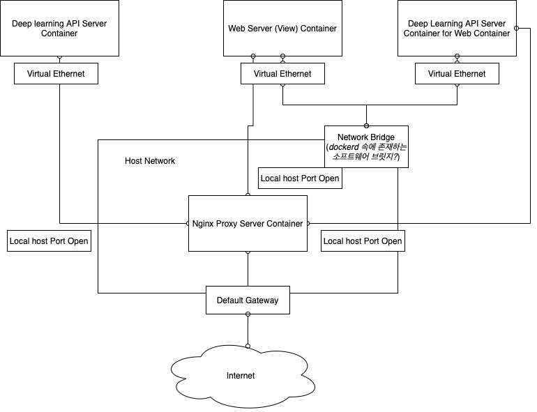

# 도커 네트워크의 예시

- 의문
- nginx 프록시 연결

## 의문

## nginx 프록시 연결

nginx컨테이너를 이용한 도커 네트워크 예시

- 만일 서브넷의 default gateway ip와 도커 브릿지의 ip가 일치한다면?
  - 도커 브릿지의 ip가 prefix가 더 기므로, 서브넷의 default gateway로 ip가 routing되지 않는 문제가 발생
  - 해결
    - `docker network create` 명령어를 실행할 때, ip주소를 고정적으로 정해줄 수 있음
    - dockerd를 종료 후, 서브넷에 인터페이스를 연결한 후, 다시 dockerd를 리부팅하면 자동적으로 서브넷의 ip 대역을 사용하지 않는 주소로 도커 브릿지 주소 매핑
