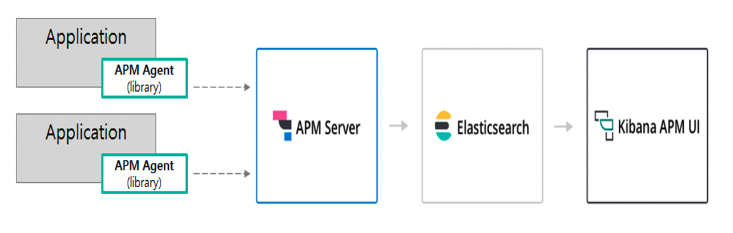
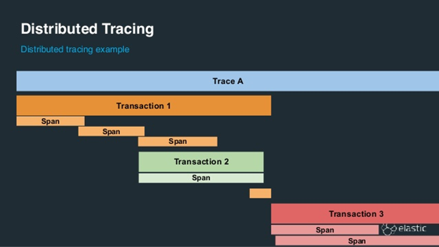

# Elastic APM

- 의문
- Elastic APM
- 데이터 모델

## 의문

## Elastic APM(Application Performance Monitoring)

Elastic APM 아키텍처



- 개요
  - 애플리케이션에 대한 성능정보 및 발생한 에러정보 그리고 애플리케이션이 동작중인 서버의 기본적인 메트릭 정보를 수집할 수 있는 기능 지원
- 아키텍처 구성
  - APM Agent
    - 개요
      - 실시간으로 퍼포먼스 및 에러 데이터를 수집하여 APM 서버로 전달
      - APM 서버 연동 실패시 데이터 저장을 위한 메모리 버퍼 존재
    - 종류
      - Go, JAVA, .NET, Nodejs, Python, Ruby, JavaScript RUM(Real User Monitoring)
  - APM Server
    - 개요
      - 에이전트에서 수집된 데이터에 대한 유효성 체크
      - 수집된 데이터를 Elasticsearch의 도큐먼트 포맷으로 전환
  - Elasticsearch
    - 개요
      - APM 데이터에 대한 저장, 검색, 분석을 지원
      - 성능 데이터에 대한 집계 기능 제공
  - Kibana
    - 개요
      - APM UI에서 데이터 필터링 및 Service, Trace, Transaction, Error, Metric에 대한 개요 및 상세 기능 제공
      - 데이터 가시화

## 데이터 모델



- Transaction
  - 개요
    - 애플리케이션내에서 측정되는 최상위 작업
      - 서버의 리퀘스트 핸들링, 배치잡, 백그라운드 잡 등
  - 구성
    - `Event Timestamp`
    - `ID, type, name`
    - `Event`가 생성된 환경에 대한 데이터
      - server
        - environment, framework, language
      - host
        - architecture, hostname, IP, etc
      - Process
        - args, PID, PPID
      - URL
        - full, domain, port, query
      - User
        - email, ID, username
- Span
  - 개요
    - 실행을 추적하기 위한 논리적 작업 단위
    - 실행되는 코드의 시작 및 소요시간 정보가 존재
    - span 사이의 부모/자식 관계를 가질 수 있음
  - 구성
    - transaction.id, parent.id
    - start time, duration
    - name, type, stacktrace
- Error
  - 개요
    - 애플리케이션에서 발생한 에러나 익셉션의 정보 및 로그
  - 구성
    - 에러 발생 위치
    - 스택트레이스 정보
      - 에러 익셉션
      - 에러 로그
    - transactiono.id
    - error 이벤트가 생성된 환경에 대한 데이터
      - server
        - environment, framework, language
      - host
        - architecture, hostname, IP, etc
      - Process
        - args, PID, PPID
      - URL
        - full, domain, port, query
      - User
        - email, ID, username
- Metric
  - 개요
    - 에이전트 호스트에 대한 CPU, memory등의 기본 매트릭 정보를 자동으로 수집
    - 자바의 JVM Metric이나 Go의 런타임 매트릭 수집 가능
- Metadata
  - 개요
    - 이벤트에 대한 부가적인정보

## JAVA Agent 설치 및 설정 방법

- 방식
  - manual
  - automatic
  - programmatic

### manual

1. APM Agent jar 파일 다운로드
2. 애플리케이션 실행시, -javaagent 옵션을 설정하여 APM Agent 설치

```sh
# 설치 및 jar 실행 예시
java -javaagent:<download>/<path>/elastic-apm-agent.jar
		-Delastic.apm.server_urls="http://<< kubernetes node ip >>:30082"
		-Delastic.apm.service_name=demoappjava-es
		-Delastic.apm.environment=dev
		-Delastic.apm.application_packages=com.example
	 -jar demoappjava.jar
```

- `application_packages`
  - stack trace frame이 in-app frame인지, library frame인지 구분하기 위함
  - 루트 패키지를 설정하면 됨
    - e.g) `kr.co.vcnc.gryphon`
