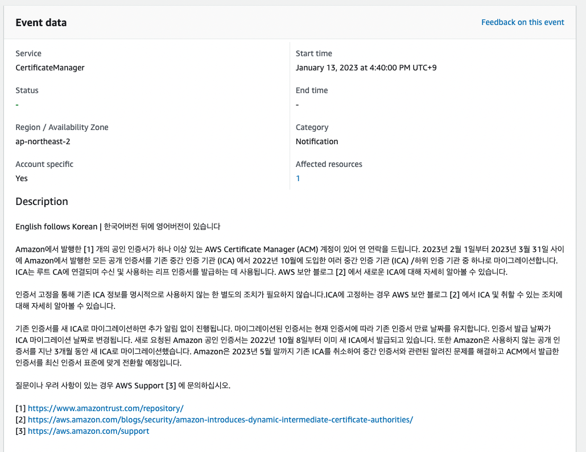

# AWS Certificate manager

- CA chain 및 검증 방법
  - 개요
  - 유저 브라우저는 root CA의 인증서가 revoke되었다는 것을 어떻게 알 수 있는가?
  - 유저의 브라우저는 root CA의 certificate을 인증하기 위해서 무엇을 갖고 있는가?
  - 유저의 브라우저는 ICA가 발급한 certificate을 어떻게 인증하는가?
- AWS health dashboard 예시
- 개요

## CA chain 및 검증 방법

### 개요

- root CA에서 end-entity certificate까지의 신뢰 체인을 만들어서, 디지털 증명에 대한 신뢰를 구축하는 방법
- 트리 구조
  - root CA가 루트이고, 중간이 ICA(Intermediate Certificate Authority) 그리고 직접 유저가 사용하는 인증서를 발급하는게 leaf CA
  - 각 레벨의 CA는 상위 레벨의 CA에 의해서 발급된 디지털 증명서를 갖고 있음
  - root CA 프라이빗 키의 숫자를 줄여줌(계층 구조 이므로)
- Intermediate Certificate Authority(ICA)
  - root CA와 leaf CA 사이에서 certificate chaining을 이어주는 역할을 함

### 유저 브라우저는 root CA의 인증서가 revoke되었다는 것을 어떻게 알 수 있는가?

- CRL(Certificate Revocation List)
  - 브라우저가 주기적으로 root CA가 발급하고 사인한 CRL을 체크하여 해당 인증서가 유효한지 검증
- OCSP(Online Certificate Status Protocol)
- CDP(CRL Distribution Points)

### 유저의 브라우저는 root CA의 certificate을 인증하기 위해서 무엇을 갖고 있는가?

- 미리 설치된 root CA certificates를 갖고 있고, 그 certificate안에는 public key를 갖고 있음
  - 그래서 rootCA의 private key로 서명된 certificate가 유효한지 판단 가능

### 유저의 브라우저는 ICA가 발급한 certificate을 어떻게 인증하는가?

- chain of trust를 사용
  - 즉, ICA의 certificate를 브라우저가 신뢰하는 root CA의 certificate로 사인하여, 브라우저는 root CA로 ICA의 디지털 서명을 확인하고, 확인이 완료되면, ICA의 certificate속에 있는 public 키로 end-entity certificate의 디지털 서명을 확인해서 최종적으로 certificate를 믿을 수 있는지 없는지를 판단함

## AWS health dashboard 예시

- 아마존의 end-entity certificate에서 ICA를 명시적으로 입력했다면 조치가 필요하다는 내용

## 개요
