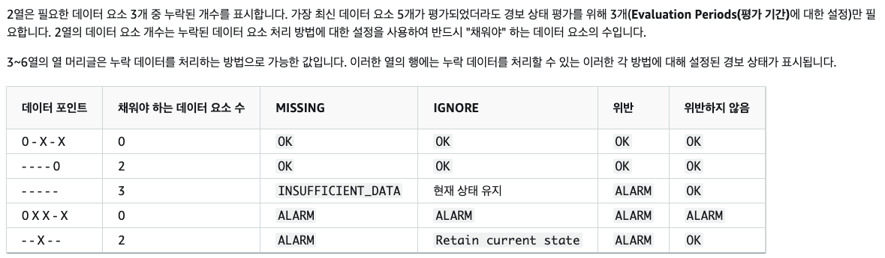

# Cloud watch

- 의문
- 개요
  - 작동 방식
- cloud watch alarm
- 기본 개념

## 의문

## 개요

- 개요
  - AWS 리소스 및 애플리케이션을 실시간으로 모니터링하는 서비스
- 특징
  - 대시보드로 서비스나 애플리케이션 모니터링 가능
  - 메트릭을 감시해 알람을 보내거나, 자동으로 설정을 변경 가능
- 관련 AWS 서비스
  - SNS
    - Cloudwatch의 경보 임계점에도달하면 SNS에 메시지 전송
  - EC2 Auto Scaling
    - EC2 인스턴스를 자동으로 시작하거나, 종료 가능
  - AWS CloudTrail
    - 계정의 Cloud watch API에 대한 호출을 모니터링 가능
  - AWS IAM

### 작동 방식

Cloud watch 아키텍처

- 리포지토리
  - AWS 서비스나 커스텀 데이터를 저장하는 저장소
    - 리전별로 저장되나, cross account region 구축도 가능
- dashboard
  - 지표를 사용하여 통계를 계산한 다음 그래픽으로 보여줌
- alarm
  - 클라우드 워치 알람을 설정함
    - action으로 SNS로 메시지를 보내거나 Auto Scaling을 가능하게 함

## cloud watch alarm

- 개요
  - 지표 경보
    - 단일 cloud watch 메트릭 혹은 메트릭을 기반으로 하는 수학 표현식의 결과를 감시 & 임계값과 메트릭 혹은 표현식의 값을 비교하여 하나 이상의 action을 수행
      - SNS 토픽에 메시지를 전송
      - EC2 오토 스케일링 작업 수행
      - ...
  - 복합 경보
    - 다른 경보의 경보 상태를 고려하는 규칙 표현식이 포함되며, 모든 조건이 충족되어야만 알람 상태로 전환
      - EC2 오토 스케일링 작업 불가
- 상태
  - `OK`
    - 지표 또는 표현식이 정의된 임계값 내에 있음
  - `ALARM`
    - 지표 또는 표현식이 정의된 임계값을 벗어남
  - `INSUFFICIENT_DATA`
    - 경보가 방금 시작되었음 or
    - 지표를 사용할 수 없거나 or
    - 지표에서 경보 상태를 결정하는 데 사용할 수 있는 데이터가 충분치 않음
- 경보 평가
  - period
    - 경보에 대해 개별 데이터 포인트를 생성하기 위해 메트릭 또는 표현식을 평가하는 기간
    - e.g) 1분으로 하면, 경보가 분당 한 번씩 메트릭을 평가
  - evaluation periods
    - 경보 상태를 결정할 때 평가 할 가장 최근의 기간 또는 데이터 요소의 수
  - datapoints to alarm
    - 평가 기간 내에 경보가 `ALARM`상태에 도달하게 만드는 위반 데이터 요소의 수
    - 연속적일 필요는 없지만, 평가 기간과 동일한 마지막 데이터 포인트 수 이내여야 함
- 경보 작업(action)
  - 경보의 상태가 `OK`, `ALARM`, `INSUFFICIENT_DATA`간에 변경될 때, 경보가 수행하는 작업 지정 가능
  - 종류
    - SNS 토픽에 메시지 전송
    - EC2 중지, 종료, 재부팅, 오토스케일링, ...
    - EventBridge에 이벤트 전송

### 누락 데이터 처리

누락 데이터 처리

- `notBreaching`
  - 누락 데이터 요소를 양호하고 임계값내에 있는 것으로 처리
- `breaching`
  - 누락 데이터 요소를 불량하고 임계값을 위반한 것으로 처리
- `ignore`
  - 현재 경보 상태 유지
- `missing`
  - 경보 평가 범위의 모든 데이터 요소가 누락된 경우 경보를 `INSUFFICIENT_DATA` 상태로 전환

## 기본 개념

- namespace
  - 개요
    - cloud watch 지표의 컨테이너이며, 다른 네임스페이스의 지표는 서리 격리됨
      - 커스텀의 경우, 지표를 생성할때 네임스페이스 이름을 지정할 수 있음
  - 특징
    - `AWS/service` 명명 규칙을 사용
      - e.g) `AWS/EC2`
- metric
  - 개요
    - cloud watch에 게시된 시계열 데이터 포인트의 집합을 나타냄
  - 특징
    - 리전 bound
    - 삭제가 불가능하지만 새 데이터가 게시되지 않으면 15개월 후 자동만료
    - (이름, 네임스페이스 및 0개 이상의 측정기준)으로 고유하게 정의됨
      - 각 데이터 포인트에는 타임스탬프와 측정 단위가 존재
  - 타임스탬프
    - 개요
      - 각 지표 데이터 요소에는 타임스탬프가 연결되어 있어야 함, `dateTime`개체(2016-10-31T23:59:59Z)
        - UTC기준
  - 보존 기간
    - 60초 미만
      - 3시간
    - 1분
      - 15일
    - 5분
      - 63일
    - 1시간
      - 15개월
- dimensions
  - 개요
    - 지표의 자격 증명에 속하는 이름/값 페어
  - 특징
    - 각 지표별 최대 30개까지 할당 가능
    - 범주화 가능
    - dimension의 조합
      - 통계 검색시 지표 생성시에 사용했던 네임스페이스, 지표 이름 및 측정기준 파라미터에 동일한 값을 지정함
      - `Server=Prod,Domain=Frankfurt`
      - `Server=Prod,Domain=Rio`
- resolution
  - standard
    - 1분 세분화(granularity) 데이터
  - high
    - 1초 세분화 데이터
    - `PutMetricData`를 호출할 때마다 요금 부과
- statistics
  - 개요
    - 지정한 기간에 걸친 metric 데이터 집계
  - 특징
    - namespace, metric name, dimensions를 사용하여 지정한 기간에 대해서 수행됨
  - 통계 지원
    - e.g)
      - period가 5분이고, sum인 경우
        - 5분 기간동안 수집된 모든 샘값의 합
      - period가 5분이고, minimum인 경우
        - 5분 기간동안 수집된 가장 낮은 값
    - SampleCount
      - period동안의 데이터 포인트의 개수
    - Sum
      - period동안의 데이터 포인트의 합
    - Average
    - Minimum
    - Maximum
    - ...
- unit
  - 개요
    - 통계의 측정 단위
  - 종류
    - `Bytes`
    - `Seconds`
    - `Count`
    - `Percent`
  - 특징
    - 측정 단위를 지정하는 지표 데이터 포인트들은 개별적으로 집계
    - 단위를 지정하지 않고 통계를 구하는 경우, Cloud watch는 동일한 단위의 데이터 포인트를 모두 함께 집계
- period
  - 개요
    - statistics와 연관된 수집된 지표 데이터의 시간의 길이
  - 특징
    - 초단위로 설정
    - 특정 시간 동안 통계가 집계되는 경우, 통계가 시작하는 시간으로 타임 스탬프 추가
- aggregation
  - 개요
    - 데이터를 메트릭 수학을 이용하여 집계하는 것
- percentile
  - 개요
    - 데이터셋에서 값의 상대적 위치를 나타냄
  - 특징
    - 이상값을 격리하는 데에 사용
      - e.g) 95%는 평균값으로부터 2표준 편차 내에 있음(정규분포를 따른다고 할 때)
