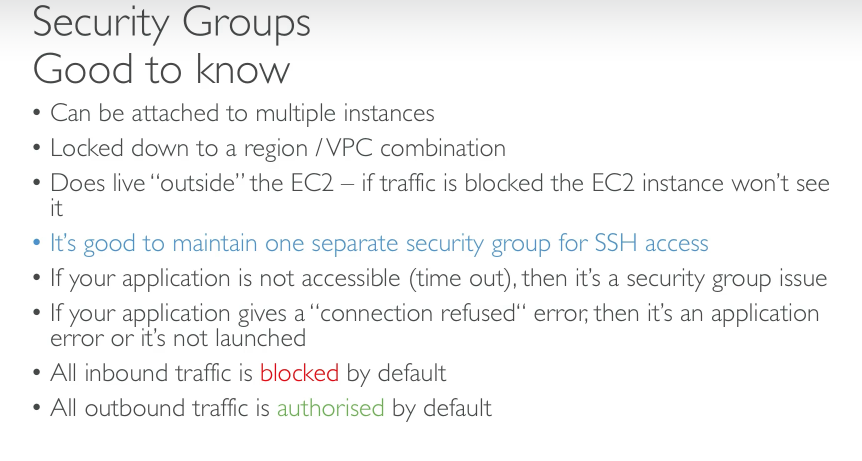

# AWS EC2

- 의문
- Elastic 모델
- 개요
  - EC2 설정
  - EC2 타입
  - Security Groups
  - EC2 비용 설정
  - Elastic IP
  - ENI(Elastic Network Interface)
- EC2 Instance Storage
  - EBS(Elastic Block Store)
  - AMI(Amazon Machine Image)
  - EIS(EC2 Instance Store)

## 의문

## Elastic 모델

- 개요
  - AWS는 일반적으로 기본적인 아키텍처 컴포넌트를 별개의 부품으로 분해했음
    - 유연함
  - e.g) EC2에 EBS, Elastic IP, Elastic LB, Elastic Network Interface를 부착가능

## 개요

- 개요
  - EC2 = Elastic Compute Cloud = Infrastructure As A Service
- 기능
  - EC2(가상 머신 대여)
  - EBS(가상 드라이브에 데이터 저장)
  - ELB(호스트 사이에 부하 분배)
  - ASG(오토 스케일링 그룹)

### EC2 설정

- OS
  - Linux, Windows, MacOS
- CPU
- RAM
- Storage space
  - EBS / EFS
  - *하드웨어*
- NIC
  - 네트워크 카드 속도
  - 파블릭 IP주소 등
- Firewall
  - security group
- EC2 User Data
  - 부트스트랩 스크립트(첫 런칭에 실행될 스크립트)

### EC2 타입

- m-family
  - 범용
    - compute
    - memory
    - networking
    - 밸런스 중시
- c-family
  - CPU 집중
    - 배치 프로세싱
    - 미디어 트랜스코딩
    - 높은 성능의 웹서버
    - 높은 성능의 컴퓨팅
    - ML
    - 게임 서버
- r-family
  - 메모리 집중
    - 높은 성능의 DB
    - 분산 웹 캐시 스토어(elastic cache)
    - 큰 규모의 실시간 데이터 프로세싱
- i,d,h1-family family
  - 스토리지 집중
    - 매우 잦은 빈도로 동작하는 OLTP(Onlint Transaction Processing)시스템
    - 관계형 & NoSQL 데이터베이스
    - 인메모리 데이터베이스
    - 데이터 웨어하우스 애플리케이션
    - 분산 파일 시스템
- t-family
  - 버스트 가능
- e.g)
  - m5.2xlarge
    - m
      - 인스턴스 클래스
    - 5
      - generation
    - 2xlarge
      - 인스턴스 클래스에서의 사이즈

### Security Groups(Firewall)

- 개요
  - EC2 인스턴스들로부터 바깥으로, 혹은 안으로 들어오는 트래픽을 제어
- 특징
  - 오직 allow룰만 포함
  - security group 룰은 IP나 security group로 참조가능
- 규제 방식(**Transport layer**)
  - ports, ip ranges, inbound network, outbound network

### EC2 비용 설정

- On-demand
  - 필요할때 잠깐 인스턴스를 쓰고 shutdown하는 방식
- Savings Plan
  - 오래 지속해서 인스턴스를 사용할떄, 시간당 과금양을 미리 정해두고 인스턴스를 사용하는 방식
    - 같은 region의 같은 EC2 타입에 적용
- Reserved Instance
  - 미리 인스턴스의 개수를 예약해두고 사용하는 방식
    - 같은 region의 같은 EC2 타입에 적용
- Spot Instance
  - 실시간 경매에 참여하여 인스턴스를 사용하는 방식
    - 자신이 설정한 비용보다 비싸지면 2분의 termination time을 주고 shutdown됨
    - 가장 큰 비용 절감 가능
- c.f) Dedicated host
  - 물리 서버 독점 전용 가능
    - MS및 Oracle과 같은 공급업체의 소프트웨어 라이선스가 있을떄 활용 가능
    - 소켓 및 물리적 코어의 가시성 확보
    - 여러개의 instance(VM 인스턴스)를 사용가능
- c.f) Dedicated instance
  - Dedicated host위에서 물리 서버의 VM instance를 전용 사용 가능

### Elastic IP

- public IP
  - instance가 stop이후 다시 start될 때마다 계속해서 변화함
- elastic IP
  - 일정한 IP
  - 계정당 5개만 부여
    - AWS에 요청하면 늘릴 수 있음
  - 사용하지 않는 것이 좋음
    - **대신, DNS이름을 random public IP와 연동하는게 좋다**

### ENI(Elastic Network Interface)

*우리가 그냥 사용하는 EC2도 ENI를 쓰는건가?*

- 개요
  - VPC 내부에서 가상 네트워크 카드의 역할을 함(EC2 인스턴스와 IP 주소의 분리)
    - EC2기본 프라이빗 네트워크가 아닌, elastic하게 붙였다 뗄 수 있어서 네트워크를 통한 failover등에 활용가능
- 속성
  - private IP address
  - elastic IP address
  - MAC address
  - security group
  - *source/destination check flag*
- 특징
  - 하나의 VCP의 서브넷에 국한되어, 하나의 AZ로 제한됨
  - EC2를 특정 VPC의 특정 subnet에서 런칭하는것이 아니라, ENI를 붙여서 동적으로 할당 가능
    - ENI자체가 subnet과 연관됨
  - EC2인스턴스와 라이프사이클이 별개
    - ENI를 별도로 부착하지 않으면, 자동으로 생성되고, delete on termination이 동작
  - 하나의 primary private IPv4와 하나 이상의 secondary IPv4를 할당
  - 하나의 public IPv4를 갖게 할 수도 있음
  - 하나 이상의 security group을 갖음
  - 하나의 MAC 주소를 갖음
  - ENI를 따로 만들고 EC2인스턴스에 붙일 수 있음

### EC2 Hibernate

- 개요
  - 메모리에 있는 상태를 보전하고 있음
    - 부팅이 훨씬 빠름(OS도 그대로)
    - RAM의 상태를 EBS 볼륨파일에 작성

## EC2 Instance Storage

### EBS(Elastic Block Store)

- 개요
  - EC2 인스턴스가 동작하는 동안에 부착할 수 있는 네트워크 스토리지 드라이브(네트워크 USB 스틱같은 느낌)
    - 따라서 네트워크에 따라서 레이턴시가 존재
- 특징
  - EC2의 라이프사이클과는 별개로 데이터를 영속화 할 수 있게 함
  - 여러 인스턴스에 한번에 마운트 가능
  - 같은 AZ에서만 사용 가능
    - 스냅샷을 떠서 다른 AZ에 옮길 수 있음
  - capacity를 프로비저닝 해야함
    - 사이즈(GB)
    - IOPS(I/O Per Seconds)
- 기능
  - Delete on Termination 특성이 있음
    - 루트 EBS 볼륨은 default true 나머지는 false
  - 스냅샷
    - detach없이 백업을 만들 수 있음
      - 스냅샷을 Region, AZ단위로 옮길 수 있음
    - 스냅샷 아카이브가 존재
      - 75% 싸지만, 복구하는데에 24~72시간이 걸림
    - Recycle bin
      - 스냅샷 삭제했을시에 retention을 지정해서 지정한 기간동안 보관
    - Fast Snapshot Restore(FSR)
      - 스냅샷을 다시 인스턴스로 만드는데에 레이턴시가 거의 없게 하지만, 돈이 많이듬
- 타입
  - gp2 / gp3 (SSD)
    - 일반적인 작업에 적합
    - 사이즈
      - 1GiB - 16TiB
    - IOPS
      - 최대 16,000
    - 스루풋
      - 최대 1000 MiB/s
  - io1 / io2 (SSD)
    - 낮은 레이턴시와 높은 스르풋이어야하는 작업의 경우에 적합
    - 사이즈
      - 4GiB - 16TiB
    - IOPS
      - 최대 32,000(Nitro EC2 인스턴스는 64,000)
    - 스루풋
      - ?
  - st1 (HDD)
    - 낮은 비용이지만, 나름 성능은 준수함
    - 사이즈
      - 125GiB - 16TiB
    - IOPS
      - 최대 500
    - 스루풋
      - 최대 500MiB/s
  - sc1 (HDD)
    - 가장 낮은 비용이며, 가장 적게 스토리지에 접근할 경우에 적합
      - cold
    - 사이즈
      - 125GiB - 16TiB
    - IOPS
      - 최대 250
    - 스루풋
      - 최대 250MiB/s
  - 참고
    - EC2의 부트볼륨의 경우, gp2/gp3와 io1/io2 만 사용가능

### AMI(Amazon Machine Image)

- 개요
  - EC2 인스턴스의 커스터마이제이션
    - 소프트웨어, 설정, OS, 모니터링 등을 넣을 수 있음
    - 빠른 부팅과 설정 시간(소프트웨어가 이미 패키징 되어있으므로)
- 특징
  - region bounded
  - 다양한 AMI로 부터 EC2를 런칭 가능
    - Public AMI
    - own AMI
    - Marcketplace AMI
- 생성 프로세스
  - EC2 인스턴스를 생성하고 커스터마이징을 함
  - 인스턴스를 멈춤(data integrity)
  - AMI를 빌드
    - EBS 스냅샷도 생성
  - 빌드된 AMI로부터 인스턴스를 생성

### EC2 Instance Store

- 개요
  - 높은 disk I/O 성능이 필요한 경우, 사용하는 물리적 스토리지
- 특징
  - EC2 인스턴스의 라이프사이클을 따름
    - EC2인스턴스가 멈추거나 삭제가 되면 이 디스크 스토리지도 삭제됨(ephemeral)
  - 버퍼 / 캐싱 / 임시 데이터를 다루는 경우에 좋음
  - 하드웨어에 문제가 생기면 데이터 손실의 문제가 생김
  - 백업과 replication은 알아서 신경써야 함
