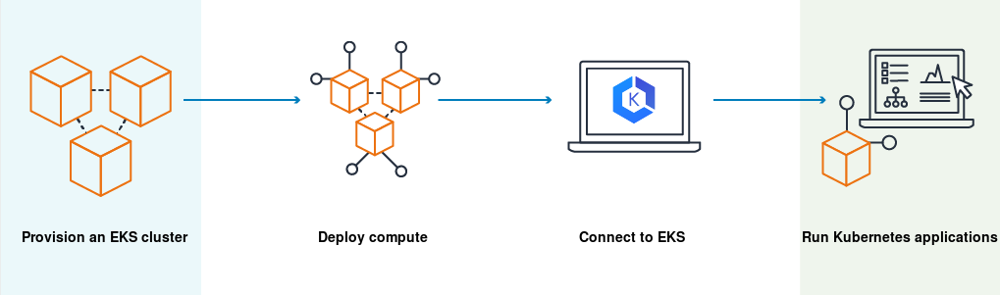

# EKS

- 의문
- 개요
- service account와 IAM role 연동

## 의문

- OIDC(Open ID Connect)
  - OAuth2.0 기반으로 유저를 인증하는 프로토콜로, OAuth2.0과의 차이점은 OAuth2.0은 authorization을 포함한다면, OIDC는 Authentication에 집중함
- EKS를 단순히 여러 AZ로 분산시키는 것의 단점
  - complexity의 증가
  - 높은 비용
    - cross-AZ traffic에 의한 비용증가
  - 성능 저하
    - AZ사이의 트래픽은 아무래도 같은 AZ에서의 트래픽보다 느림

## 타다의 구성

terraform으로 provision

- eks cluster setting
  - managed node group
    - min, max capacity
    - launch template
    - k8s label
    - aws tag
    - 종류
      - `worker`
        - 일반적인 workload를 배포하기 위함
        - `aws_launch_template.eks_node_worker`
          - `instance_type`
          - `user_data`
          - `vpc_security_group_ids`
          - `block_device_mappings`
          - `tag_specifications`
          - `lifecycle`
      - `jenkins worker`
        - jenkins worker의 팟을 배포하기 위함
        - `aws_launch_template.eks_node_jenkins`
          - 위와 동일
- network setting
  - `aws_subnet.eks_node_subnet1`
  - `aws_subnet.eks_node_subnet2`

## 개요

- 정의
  - 자체 k8s 컨트롤 플레인 혹은 노드를 설치, 운영 및 유지 관리할 필요 없이 AWS의 k8s 실행에 사용할 수 있는 관리형 서비스
- 특징
  - 여러 AZ에 걸쳐서 k8s 컨트롤 플레인을 실행하고 크기를 조정하여 높은 가용성 보장
  - 부하에 따라 컨트롤 플레인의 인스턴스 크기를 자동으로 조정하고, 비정상 컨트롤 플레인 인스턴스를 감지하고 교체, 자동화된 버전 업데이트 및 패치 제공
  - 여러 AWS 서비스와 통합
    - 컨테이너 이미지 ECR
    - 부하분산 Elastic Load Balancing
    - 인증 IAM
    - 네트워크 격리 Amazon VPC
  - 표준 k8s 환경에 완전하게 호환
- 컨트롤 플레인 아키텍처
  - 2개 이상의 API 서버 인스턴스
  - 3개의 AZ에서 실행되는 3개의 etcd인스턴스
  - k8s RBAC 정책에 따라 권한을 부여받지 않은 경우, 다른 AWS 계정의 통신을 보거나 수신 불가

### EKS Provision하기

EKS의 provision

1. Amazon EKS를 생성(terraform or AWS cli or AWS management console)
2. EC2노드 실행 혹은 Fargate를 배포
3. kubectl등의 도구를 구성하여 클러스터와 통신
4. EKS 클러스터에 워크로드를 배포 및 관리함

## service account와 IAM role 연동

- 개요
  - service account object를 이용하여 pod level에서 IAM role을 부여할 수 있게 해주는 방법
- 방법
  - IRSA(IAM Roles for Service Account)
    - OIDC(OpenID Connect) identity provider와 k8s 서비스 어카운트 애노테이션을 이용해서, IAM role을 팟 레벨로 사용할 수 있게 함
  - 1 OIDC가 IAM role을 STS(Secure Token Service)를 사용해서 취득할 수 있게 함
    - JWT(STS)로 IAM role을 취득할 수 있게 함
      - *즉, STS로 IAM role을 취득할 수 있게 한다는것인가?*
  - 2 k8s에서는 *projected service account token*을 발급하여 팟에 유효한 OIDC JWT를 발급받을 수 있음
- 해석
  -
