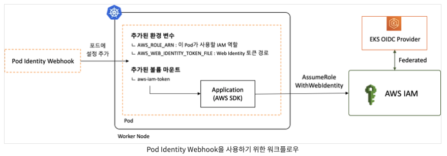

# EKS Pod IAM Role

- 의문
- 디버깅 실전 사례
- 개요
- EKS의 팟에 적용하는 순서
  - 1 EKS Cluster API에 OpenID Connect Provider(인증서버)를 연동한다
  - 2 IAM role 생성
  - 3 k8s service account 생성 & IAM 정보 주입(IAM Role의 ARN)
  - 4 JWT 토큰 생성 및 팟에 service account 연결(projected volume)
  - 5 해당 JWT를 가지고 AWS cli나 sdk가 자원에 접근

## 의문

## 디버깅 실전 사례

에러 문구

```
Logging system failed to initialize using configuration from '/app/conf/logback.xml'
java.lang.IllegalStateException: Logback configuration error detected:
ERROR in com.gu.logback.appender.kinesis.KinesisAppender[KINESIS] - Error executing the operation java.util.concurrent.ExecutionException: software.amazon.awssdk.services.kinesis.model.KinesisException: User: arn:aws:sts::111122223333:assumed-role/eks-v4-kr-prod20210825065433719400000008/i-0f0a9a4639d430c64 is not authorized to perform: kinesis:DescribeStream on resource: arn:aws:kinesis:ap-northeast-2:111122223333:stream/ProdSeoulTadaServerLogStream because no identity-based policy allows the kinesis:DescribeStream action (Service: Kinesis, Status Code: 400, Request ID: fb929598-5590-6abd-a064-05c34883f4a0, Extended Request ID: wmeKlTOwSO48pNNvl/l4eIkuoDgghTwfiuH6QonJV5YaJHhSWTr5KxS0KfpIbSp69xDOzCTSkzMVecpehB5eRD085yjrqBaE)
        at org.springframework.boot.logging.logback.LogbackLoggingSystem.loadConfiguration(LogbackLoggingSystem.java:179)
        at org.springframework.boot.logging.AbstractLoggingSystem.initializeWithSpecificConfig(AbstractLoggingSystem.java:66)
        at org.springframework.boot.logging.AbstractLoggingSystem.initialize(AbstractLoggingSystem.java:57)
        at org.springframework.boot.logging.logback.LogbackLoggingSystem.initialize(LogbackLoggingSystem.java:132)
        at org.springframework.boot.context.logging.LoggingApplicationListener.initializeSystem(LoggingApplicationListener.java:316)
        at org.springframework.boot.context.logging.LoggingApplicationListener.initialize(LoggingApplicationListener.java:282)
        at org.springframework.boot.context.logging.LoggingApplicationListener.onApplicationEnvironmentPreparedEvent(LoggingApplicationListener.java:240)
        at org.springframework.boot.context.logging.LoggingApplicationListener.onApplicationEvent(LoggingApplicationListener.java:216)
        at org.springframework.context.event.SimpleApplicationEventMulticaster.doInvokeListener(SimpleApplicationEventMulticaster.java:176)
        at org.springframework.context.event.SimpleApplicationEventMulticaster.invokeListener(SimpleApplicationEventMulticaster.java:169)
        at org.springframework.context.event.SimpleApplicationEventMulticaster.multicastEvent(SimpleApplicationEventMulticaster.java:143)
        at org.springframework.context.event.SimpleApplicationEventMulticaster.multicastEvent(SimpleApplicationEventMulticaster.java:131)
        at org.springframework.boot.context.event.EventPublishingRunListener.environmentPrepared(EventPublishingRunListener.java:82)
        at org.springframework.boot.SpringApplicationRunListeners.lambda$environmentPrepared$2(SpringApplicationRunListeners.java:63)
        at java.util.ArrayList.forEach(ArrayList.java:1259)
        at org.springframework.boot.SpringApplicationRunListeners.doWithListeners(SpringApplicationRunListeners.java:117)
        at org.springframework.boot.SpringApplicationRunListeners.doWithListeners(SpringApplicationRunListeners.java:111)
        at org.springframework.boot.SpringApplicationRunListeners.environmentPrepared(SpringApplicationRunListeners.java:62)
        at org.springframework.boot.SpringApplication.prepareEnvironment(SpringApplication.java:374)
        at org.springframework.boot.SpringApplication.run(SpringApplication.java:332)
        at org.springframework.boot.SpringApplication.run(SpringApplication.java:1343)
        at org.springframework.boot.SpringApplication.run(SpringApplication.java:1332)
        at kr.co.vcnc.gryphon.dispatcher.DispatcherApplicationKt.main(DispatcherApplication.kt:33)
2022-11-22 08:53:47.939 ERROR 1 --- [           main] o.s.boot.SpringApplication               : Application run failed
```

- 현상
  - EKS위에 팟을 카나리배포시에 위와 같은 에러가 발생하였다.
    - 핵심은 Sprinb Boot Logback설정시에 AWS SDK로 Kinesis API 리퀘스트를 보냈는데, 팟의 assumed role에 kinesis:DescribeStream 액션을 행할 권한이 없다고 나온 것
- 원인
  - 팟에 IAM role assume하기 위한 토큰을 EKS OpenID Provider와 연동시켜 service account로 주입중이었다.
  - 해당 IAM role의 Trust Relation에서 EKS OpenID Federation으로 principal은 잘 설정했으나, Condition부분에서 service-accunt가 싱크가 맞지 않음
    - `StringLike`로 sub를 `system:serviceaccount:default:gryphon-dispatcher`라고만 설정해뒀어서, `gryphon-dispatcher-canary`인 SA명이 Condition에서 싱크가 맞지 않음
  - Spring cloud aws에서 별다른 설정이 없으면`DefaultAWSCredentialsProviderChain`을 사용
    - 먼저 `WebIdentityTokenCredentialsProvider`를 사용한 assume role을 시도해보지만, token이 위의 IAM role condition에서 유효하게 설정되어있지 않으므로, assume되지 않음
    - 그래서 그 다음으로 `EC2ContainerCredentialsProviderWrapper`를 사용하여 EC2 인스턴스에 부여된 IAM role으로 assume-role을 시도함
      - 그 role이 `eks-v4-kr-prod20210825065433719400000008` 이고 EKS 워커노드(EC2)에 부착되는 기본 IAM role
      - 성공!
  - 위의 assume role에서 발급받은 임시 자격 증명을 바탕으로 aws sdk에서 kinesis로 요청을 보내지만, 관련 permission이 설정되어있지 않으므로 위의 로그에 다음과 같은 에러 발생
    - `arn:aws:sts::111122223333:assumed-role/eks-v4-kr-prod20210825065433719400000008/i-0f0a9a4639d430c64 is not authorized to perform: kinesis:DescribeStream on resource: arn:aws:kinesis:ap-northeast-2:111122223333:stream/ProdSeoulTadaServerLogStream`

## 개요

EKS에서 pod level IAM role을 service account로 사용하기 큰 그림


- AWS의 기존의 인증 체계 대체
  - IAM role
    - EC2 node에만 부여 가능하므로 least privilege principle에 위배
  - `AWS_ACCESS_KEY_ID`, `AWS_SECRET_ACCESS_KEY` 환경변수를 k8s secret으로 마운팅
    - 키의 수명주기가 매우 김
    - 유출시 피해 발생
  - 새로운 방식의 인증이 필요함
- 개요
  - EKS클러스터를 OpenID인증 가능하게 해두고, IAM role을 OpenID를 이용해서 assume가능하게 설정하고, ServiceAccount과 팟을 연결시켜, 팟 레벨의 세분화되고 안전한 권한 부여를 하는 것
- 특징
    - 팟마다 별도 role 부여 가능
    - STS Token을 활용하여 키 관리 필요없음
    - 1~12시간 길이의 STS Token을 사용하여 키 노출 시에도 노출 범위 / 기간 최소화

## EKS의 팟에 적용하는 순서

- 1 EKS Cluster API에 OpenID Connect Provider(인증서버)를 연동한다
- 2 IAM role 생성
- 3 k8s service account 생성 & IAM 정보 주입(IAM Role의 ARN)
- 4 JWT 토큰 생성 및 팟에 service account 연결(projected volume)
- 5 해당 JWT를 가지고 AWS cli나 sdk가 자원에 접근

### 1. EKS Cluster API에 OpenID Connect Provider(인증서버)를 연동한다

- EKS생성시 자동으로 EKS IdP가 생성됨
- EKS IdP가 사용자의 신원을 확인
  - 해당 확인의 증거가 JWT token임

### 2. IAM role 생성


- policy 설정
- trust relationship 설정
  - OpenID 설정
  - EKS IdP를 신뢰하도록
- 해석
  - 1 principal의 federated에서 지정된 provider에서 인증이 된 유저만 assume이 가능하다
  - 2 그 중에서도 "oidc.eks.ap-northeast-2.amazonaws.com/id/---:sub" 가 다음과 같은 문자열 매칭 조건을 만족하는 경우에만 assume이 가능하다

### 3. k8s service account 생성 & IAM 정보 주입(IAM Role의 ARN)

SA로 인해서 생성된 secret JWT내용

```json
{
  "iss": "kubernetes/serviceaccount",
  "kubernetes.io/serviceaccount/namespace": "default",
  "kubernetes.io/serviceaccount/secret.name": "gryphon-dispatcher-token-k26x2",
  "kubernetes.io/serviceaccount/service-account.name": "gryphon-dispatcher",
  "kubernetes.io/serviceaccount/service-account.uid": "dcd259b6-94c6-4f49-98c9-5ecf35c6c89f",
  "sub": "system:serviceaccount:default:gryphon-dispatcher"
}
```

- `kind: ServiceAccount`
  - assume하고자 하는 role의 arn을 입력함
- *k8s의 service account는 자체적으로 secret을 생성해서 해당 secret의 내용(JWT)으로 EKS의 OpenID Provider에 인증을 하고, 그 인증 결과로 인증의 증거인 JWT를 받아옴*
  - SA생성으로 생긴 secret과, mutate webhook과 이전 secret으로 생성된 projectedServiceAccountToken은 차이가 있음
    - (projectedServiceAccountToken은) 해당 JWT는 팟에 volume mount되어서 AWS cli나 AWS sdk가 자원을 접근하는데에 사용할 수 있게 함

### 4. JWT 토큰 생성 및 팟에 service account 연결(projected volume)

3의 secret JWT에 의해서 생성된 IAM의 Assume role을 위한 JWT

```json
{
  "aud": [
    "sts.amazonaws.com"
  ],
  "exp": 1670730058,
  "iat": 1670643658,
  "iss": "https://oidc.eks.ap-northeast-2.amazonaws.com/id/07210EB908CE1106FFCA7206ADBE38D9",
  "kubernetes.io": {
    "namespace": "default",
    "pod": {
      "name": "gryphon-dispatcher-56c57686dc-75flk",
      "uid": "cc302b57-b6dc-4407-b44b-e39165c4e9bf"
    },
    "serviceaccount": {
      "name": "gryphon-dispatcher",
      "uid": "dcd259b6-94c6-4f49-98c9-5ecf35c6c89f"
    }
  },
  "nbf": 1670643658,
  "sub": "system:serviceaccount:default:gryphon-dispatcher"
}
```

- `/run/secrets/eks.amazonaws.com/serviceaccount`에 볼륨 마운트 되는 토큰
  - Assume role을 위한 JWT
  - Aws SDK나 CLI가 위의 토큰을 사용하여 assume role을 함
- 토큰을 받은 AWS는 이 토큰과 EKS IdP를 통해 해당 팟이 IAM 역할을 사용할 수 있는지 검증
  - 이 토큰이 유효한지는 EKS IdP(OpenID Provider)에서 확인 가능
- **pod에 service account를 연동하면, service account와 연결된 IAM role이 expired되면 자동으로 새로운 role을 발급해줌**
  - ServiceAccount token volume projection을 사용해서 kubelet이 팟에 ServiceAccount token을 연동함
  - kubelet
    - 팟 생성시, 팟을 대신해서 토큰을 저장하고 리퀘스트를 날려서, 설정가능한 파일 패스에 토큰을 사용가능하게 둠
    - TTL이 80%보다 더 지난 경우, 혹은 24시간보다 더 오래된 경우 새로 토큰을 요청해서 발급받음
      - 애플리케이션이 알아서 reload해야 함

### 5. 해당 JWT를 가지고 AWS cli나 sdk가 자원에 접근

AssumeRole하기 위한 워크 플로우



위의 그림에서 `AssumeRoleWithWebIdentity`의 경우, AWS STS로 리퀘스트를 보내는 것임을 명심하면 된다.(STS는 유효성을 EKS IdP로 확인)
*주의: 위의 그림에서 Pod Identity Webhook이 아직 유효한지 모름*

- 정확히는 해당 토큰으로 AWS STS(Security Token Service)에서 AssumeRole(임시 access key, secret key를 발급)을 하고 그것을 바탕으로 AWS의 자원에 접근
- AWS SDK는 `AWS_ROLE_ARN`및 `AWS_WEB_IDENTITY_TOKEN_FILE`이라는 환경변수의 값이 설정되어있으면, 해당 환경변수를 읽어들여 Web Identity토큰으로 Assume role을 시도함
  - 즉, `$(AWS_ROLE_ARN)`라는 역할을 Assume 하기 위한 자격증명으로서 `$(AWS_WEB_IDENTITY_TOKEN_FILE)`경로의 Web Identity 토큰 파일을 사용
- AWS SDK는 Web Identity토큰으로 STS로 `AssumeRoleWithWebIdentity`를 호출함으로써, 임시 자격 증명을 획득하고, 해당 임시 acceesskey와 secret키로 허가된 AWS의 서비스를 이용가능하게 됨
  - Assume Role 동작을 위한 인증은 AWS가 아니라, Web IdP에 위임
    - issuer가 EKS의 IdP
- STS로 부터 받아온 임시 자격 증명은 spring-cloud-aws의 경우, 프레임워크에서 알아서 관리해준다
  - `STSAssumeRoleSessionCredentialsProvider`에서 STS Assume role을 하고 임시 자격 증명관리를 백그라운드 스레드에서 진행해줌
    - `SessionCredentialsHolder`에서 STS Assume role 요청의 응답인 임시 자격 증명 결과를 저장함(메모리)
