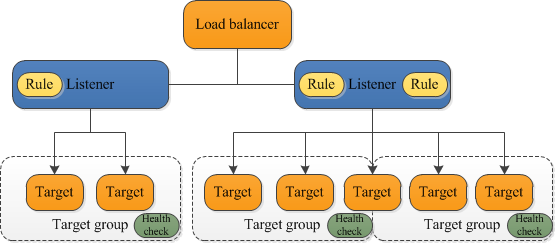

# ELB

- 의문
- 개요

## 의문

## 개요

- 왜 로드밸런서를 사용해야 하는가?
  - 애플리케이션의 접근의 하나의 포인트를 노출하기 위함
  - 부하를 여러개의 downstream 인스턴스로 분산시키기 위함
  - 인스턴스의 healthcheck를 하기 위함
  - downstream 인스턴스들의 실패를 심리스하게 다루기 위함
  - 높은 availability를 제공하기 위함
  - 웹 애플리케이션 통신에 TLS를 제공하기 위함
  - 쿠키의 stickiness를 위함
- ELB 쓰는 이유
  - managed LB이다
    - AWS가 동작하는 것을 보증
    - AWS가 업그레이드, 유지보수, 높은 availability를 관리
    - AWS가 아주 약간의 설정 knob만 제공
  - 다양한 AWS 서비스들과 연동 가능
    - EC2, EC2 오토 스케일링 그룹, ECS
    - AWS Certificate Manager
    - CloudWatch
    - Route53, AWS WAF, AWS Global Accelerator
- ELB 타입
  - Classic LB(CLB)
    - HTTP, HTTPS, TCP, SSL
  - Application LB(ALB)
    - HTTP, HTTPS, WebSocket
  - Network LB(NLB)
    - TCP, TLS, UDP
  - GateWay LB(GWLB)
    - IP
- LB Security Groups
  - HTTP TCP 80 0.0.0.0/0 Allow HTTP
  - HTTPS TCP 443 0.0.0.0/0 Allow HTTPS

## ELB

- 개요
  - incoming 트래픽을 다양한 타겟(EC2 인스턴스, 컨테이너, IP주소, 람다 함수)으로 분배
  - 등록된 타겟들의 헬스체크도 진행해서 오직 건강한 타겟으로만 트래픽 보냄
- 특징
  - internet facing 로드밸런서의 경우, IPv4 주소가 부여되고, 내부 로드 밸런서의 경우 서브넷 IPv4주소 부여

### ELB 컴포넌트 아키텍처

ELB 컴포넌트 아키텍처

- 리스너
  - 개요
    - 클라이언트의 커넥션 리퀘스트를 프로토콜 / 포트를 기반으로 체크(설정값과 대조)
    - 인바운드 커넥션이 어떻게(어디로) 라우팅되어야 하는지 정의
    - 각 로드 밸런서는 적어도 하나의 리스너를 가져야 함
  - 룰
    - 로드 밸런서가 등록된 타겟으로 리퀘스트를 어떻게 라우팅해야하는지 정의
    - 우선순위 존재
    - default룰이 존재하고, 선택적으로 추가 룰을 정의함
- 타겟 그룹
  - 개요
    - ELB가 리퀘스트를 라우팅하는 리소스 그룹
    - 서로 다른 타겟 그룹에 각각 다른 리스너 설정과 룰로 연결시킬 수 있음
    - 하나의 타겟을 다수의 타겟 그룹으로 등록할 수 있음
  - 헬스 체크
    - 로드 밸런서가 주기적으로 타겟 그룹으로 다음을 행하게 할 수 있음
      - 핑 보내기
      - 커넥션 시도하기
      - 테스트 리퀘스트 보내기

## ELB 타입: ALB(Application) vs NLB(Network) vs CLB(Classic)

### ALB

- 개요
  - 애플리케이션 레이어에서의 다양한 변수에 대해서 트래픽 분배
- 특징
  - Application레이어의 HTTP, HTTPS 리스너에만 적용됨
    - HTTP/2와 웹 소켓도 적용 가능
  - 변동 IP
  - contextful
    - 트래픽 내용(HTTP의 헤더, 바디 등)까지도 라우팅하는데 사용할 수 있음
  - availability판단시, HTTP요청이 성공적으로 반환되는것 뿐 아니라, 특정 파라미터에 대해서 내용이 예상한대로 잘 반환되는지도 판단근거로 삼음
  - 타겟 그룹에 대해서 로드 밸런싱을 행함
  - 같은 머신에 대해서 다양한 앱으로 로드밸런싱도 가능
    - 마이크로 서비스나 컨테이너 기반 애플리케이션에 잘 어울림(Docker, Amazon ECS)
  - 호스트네임이 고정됨
    - e.g) `XXX.region.elb.amazon.com`
  - 애플리케이션 서버는 클라이언트의 IP를 직접 보지 못함
    - `X-Forwarded-For`
      - 클라이언트의 IP주소
    - `X-Forwarded-Port`
      - 클라이언트의 포트
    - `X-Forwarded-Proto`
      - 클라이언트의 프로토콜
- 라우팅 방식
  - Listener내부의 Rule을 사용하여 설정
    - URL path
      - `example.com/users`, `example.com/posts`
    - URL hostname
      - `one.example.com`, `other.example.com`
    - Query String, Headers
      - `example.com/users?id=123&order=false`
- 타겟 그룹
  - EC2 인스턴스들(오토스케일링 그룹) - HTTP
  - ECS 태스크 - HTTP
  - 람다 함수 - HTTP 리퀘스트가 JSON 이벤트로 번역됨
  - IP 주소들 - private ips

### NLB

- 개요
  - IP주소와 포트 기준으로 트래픽을 분배
- 특징
  - context-less
    - 트래픽 내용이 아닌, 오직 ip와 포트만으로 라우팅
  - availability판단시, 서버와의 ICMP핑 혹은 TCP핸드셰이크가 되는것까지만 판단
    - 따라서, 완전한 availability는 모름

### CLB

- 개요
  - Network / Application Layer
  - 레거시
