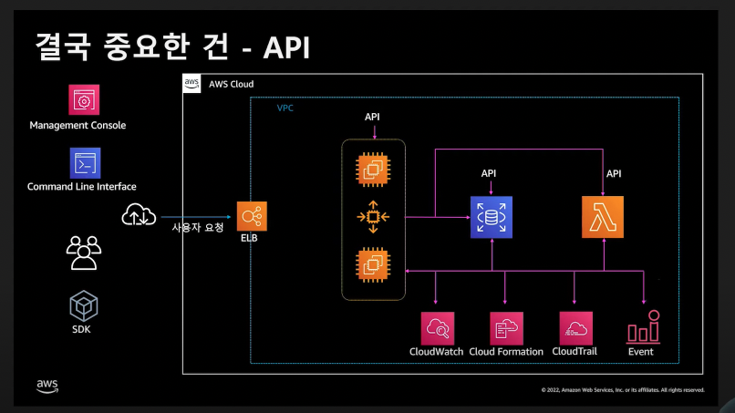
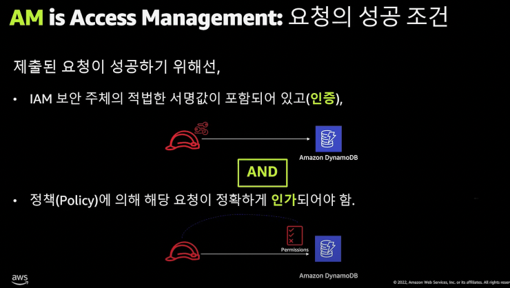
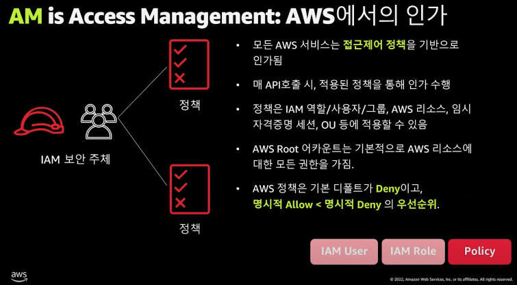
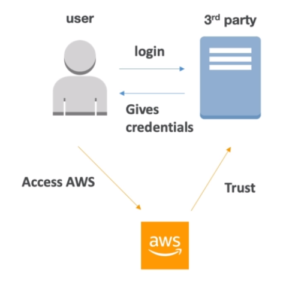
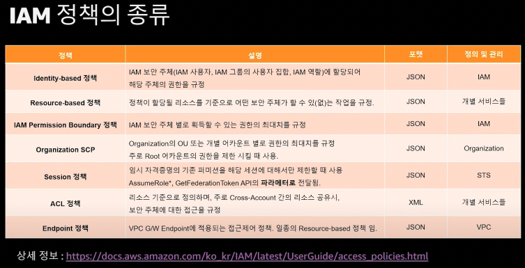
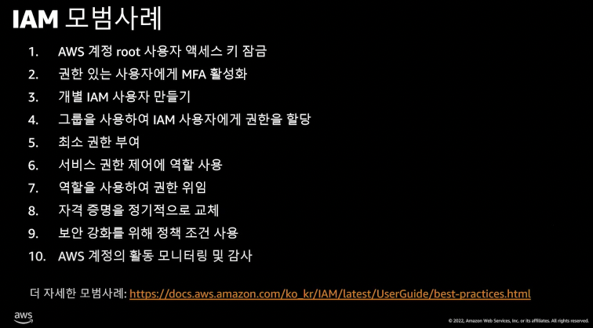
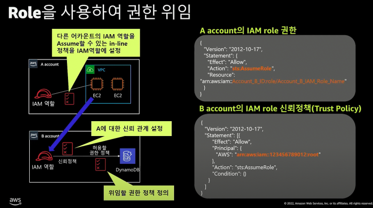
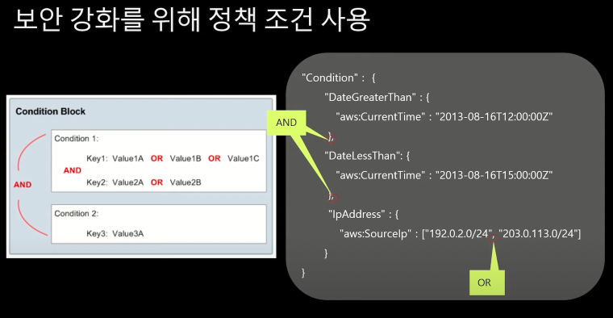

# IAM(Identity and Access Management)

- 의문
- 기반 지식
- 개요
  - 계정 생성 방식
  - 중요한 것은 API
  - IAM 구성 요소(I + AM)
- Identity
- Policy
  - Policy Structure
  - Policy 평가 로직
  - Policy의 종류
- Best practice
- Advanced

## 의문

## 기반 지식

IAM aws ninja > 좋은 강의 자료

- IAM ARN(Amazon Resource Name)
  - 개요
    - 아마존의 리소스의 표시 이름
  - 형식
    - `arn:partition:service:region:account:resource`
      - partition
        - 리소스가 위치하는 파티션 e.g) `aws-cn`
      - service
        - AWS 제품 e.g) `iam`
      - region
        - 리소스 리전 e.g) iam의 경우 글로벌이라서 공백
      - account
        - 하이픈이 없는 AWS 계정 ID
      - resource
        - 특정 리소스를 이름으로 식별
    - e.g)
      - `arn:aws:iam::123456789012:user/JohnDoe`
      - `arn:aws:iam::123456789012:role/aws-service-role/access-analyzer.amazonaws.com/AWSServiceRolqeForAccessAnalyzer`

## 개요

- 개요
  - AWS 리소스에 대한 액세스를 안전하게 제어할 수 있는 웹 서비스
    - I(Identity) + AM(Access Management)
    - 인증 / 권한 부여 된 대상 제어

### 계정 생성 방식

- Root account
  - 모든 서비스에 대한 접근
  - 과금 정보에 대한 접근
  - 콘솔 및 API 사용
  - 기술 지원 계약 변경
- IAM 사용자, role, *federated 사용자*
  - 지정된 일부 서비스에 대한 접근
  - 콘솔 및 API 사용
  - 기술지원 요청
  - 비밀번호 정책
    - 최소 패스워드 길이 설정
    - 특정 문자 타입을 반드시 포함 설정
    - IAM 유저가 자신의 패스워드를 알아서 설정
    - 패스워드를 일정주기마다 변경 설정
    - 패스워드 re-use를 허용하지 않게 설정
  - MFA(Multi Factor Authentication)
- 임시 보안 자격 증명
  - 지정된 일부 서비스에 대한 접근
  - 콘솔 및 API 사용
  - 임시적으로 발급(expire됨)

### 중요한 것은 API



- c.f) AWS 서비스 사용방법(어떤 방식이든 API로 통한다)
  - 콘솔 이용
  - Script 기반 작업(SDK, CLI)
  - 프로비저닝 엔진 사용(IaaC)
    - e.g) AWS Cloud Formation / Terraform
  - AWS CDK 사용
    - 자신이 사용하는 프로그래밍 언어로 인프라 관리
- AWS에서의 API 인증
  - 개요
    - 클라이언트
      - Access ID(요청 주체) + 시그니처(비밀키로 생성한 HMAC 검증) + (세션 토큰 - 임시 Credential을 쓰는 경우)
      - 위의 데이터를 HTTP리퀘스트로 AWS에 보냄
      - AWS SDK는 위의 값들을 잘 정리해서 넣어줌
    - AWS
      - AWS는 서명값, 타임스탬프 확인 + 요청 주체가 적절한 권한을 갖고 있는지 판단해서 허용 여부 결정

### IAM 구성 요소(I + AM)

AM의 성공 조건(인증, 인가)



Identity(인증)

- IAM user
  - 대상
    - AWS 내에서 생성하는 사용자 / 애플리케이션
- IAM group
  - IAM User의 집합
    - 다수의 사용자에 대한 권한을 쉽게 관리
- IAM role
  - 특정 권한을 가진 IAM 임시 자격 증명
  - 대상
    - 특정 사용자 / 애플리케이션 / AWS 서비스에 접근 권한 위임 가능
  - assume
    - 만료가 되는 token을 발급받아 특정 액션을 수행하도록 하는 것
  - 활용
    - 안전하게 일정시간 이후에는 타임아웃되도록 설정
    - AWS 외부에 존재하는 IAM User가 아닌 외부 보안주체에게 임시 권한 부여
  - e.g) EC2 서비스에 IAM role을 할당 해서 EC2는 할당한 IAM role의 권한을 가지게 함

Access Management(인가)

IAM에서의 AM



- IAM policy
  - AWS의 리소스에 접근하는 해당 권한을 정의하는 개체
  - AWS의 Identity에 적용 할 수 있음
  - 루트 어카운트는 모든 권한을 가짐
  - 명시적 Deny > 명시적 Allow > default Deny 우선순위

## Identity

### IAM role

- 개요
  - 특정 권한을 지닌 IAM 자격 증명
- role 적용 대상
  - IAM 사용자
    - 역할과 동일한 AWS 계정
    - 역할과 다른 AWS 계정
  - AWS에서 제공하는 웹 서비스(e.g EC2)
  - OpenID Connect와 같은 외부자격 증명 공급자에 의해 인증된 외부 사용자
    - e.g) Google, Facebook, Amazon Cognito
  - SAML2.0
    - SSO(Single Sign-On)
- 특징
  - 정책을 갖고 있음
  - 누구든지 역할을 맡을 수 있음
  - 임시 보안 자격 증명이 제공됨
    - AWS키 대신 사용

#### Trusted Relation

신뢰 정책의 예시

```
{
  "Version": "2012-10-17",
  "Statement": [
    {
      "Effect": "Allow",
      "Principal": {
        "AWS": "arn:aws:iam::111122223333:root" # sts:AssumeRole 권한이 있는 111122223333 AWS 계정의 모든 보안 주체가 이 역할을 맡을 수 있음
        "AWS": "arn:aws:iam::111122223333:user/LiJuan" # sts:AssumeRole 권한이 있는 IAM 사용자 LiJuan만 이 역할을 맡을 수 있음
      },
      "Action": "sts:AssumeRole",
      "Condition": {}
    }
  ]
}
```

- 개요
  - IAM role을 맡을 수 있는 보안 주체 및 조건을 나타냄
- 필드 설명
  - `Action`
    - `sts.AssumeRole`
    - `sts:AssumeRoleWithSAML`
    - `sts:AssumeRoleWithWebIdentity`
  - `Resource`
    - 존재하지 않는데, 신뢰 정책 맥락에서의 리소스가 IAM role이기 때문

#### Federation



- 개요
  - AWS 유저가 아니면서 일시적으로 권한을 받아서 AWS에 접속하는 서비스
    - AWS로부터 신임을 받는 3rd party에 로그인을 하고, 그 서비스가 credential을 증명해주고 해당 account를 가지고 AWS에 접속
- 서드 파티 종류
  - LDAP
  - SAML
  - SSO
  - Open ID
  - Cognito

## Policy

### Policy structure

```js
{
  "Statement": [
    {
      "Effect": "Allow", // "Allow" or "Deny"일 수 있음
      "Principal": "principal", // (resource based policy에서만) 접근을 허용 혹은 차단하고자 하는 대상(AWS 어카운트, IAM 사용자, IAM 역할) e.g) "arn:aws:iam::123456789012:user/username"
      "Action": [
        "ec2:AuthorizeSecurityGroupIngress",
        "ec2:AuthorizeSecurityGroupEgress"
      ], // principal이 어떤 행위를 할 수 있는지 권한을 부여하거나 거부할 특정 API 작업
      "Resource": "arn", // 작업의 영향을 받는 리소스. ARN(Amazon Resource Name)을 사용하거나 명령문이 모든 리소스에 적용됨을 표시하는 와일드카드(*)를 사용 e.g) "arn:aws:sqs:us-west-2:123456789012:queue1"
      "Condition": { // 선택 사항으로서 정책이 적용되는 시점을 제어하는데 사용할 수 있음. 다양한 조건을 넣어 권한을 부여할 수 있음
        "condition": {
          "key": "value",
          "StringEqualsIfExists": {
            "aws:RequestTag/project": ["Pickles"]
          }
        }
      }
    }
  ]
}
```

### Policy 평가 로직

- 개요
  - IAM 설정시에, 다양한 policy가 적용될 경우 AWS가 해당 요청을 받으면 요청을 허용할지 거부할지 여부를 결정하는 로직
- 특징
  - Deny가 Allow보다 우선
  - Deny, Allow 둘다 없으면 암묵적 거부

### Policy의 종류



- identity 기반
- 리소스 기반
- 동일 어카운트 vs 크로스 어카운트
  - 동일 어카운트
    - identity기반 정책과 리소스 기반 정책의 합집합 형태로 검사가 이루어 짐
    - e.g) 한쪽에만 정책이 정의되어 있으면 허용
  - 크로스 어카운트
    - identity기반 정책과 리소스 기반 정책의 교집합 형태로 검사가 이루어 짐
    - e.g) 한쪽에만 정책이 정의되어 있으면 거부

## Best practice

IAM Best practice



- 루트 잠그기
  - 루트는 첫 계정을 생성할 때, 첫 IAM 사용자를 만들때만 사용
  - 많은 권한을 갖고 있는 계정은 MFA쓰자
- 1사용자 1IAM 유저 부여
  - 최소 권한 부여
    - IAM Access Advisor
      - 정책에 포함된 각 서비스를 실제 보안주체가 언제 마지막으로 접근했는지 추적
      - 거의 접근이 되지 않는 정책을 파악
  - 비밀번호는 강한 조건으로 설정
- 그룹으로 유저를 묶어주기
- role을 사용하여 권한 위임
  - AWS의 서비스의 경우
- 사용자 자격 증명을 정기적으로 교체
  - key age가 오래 된 친구들을 조치해줌
- 보안 강화를 위해서 정책 조건 사용
- 감시 하기
  - IAM Credential Reports & IAM Access Advisor

IAM role assume



보안 강화를 위해서 정책 조건 사용



## Advanced

- AC(Access Control)
  - RBAC
    - 롤 기반 접근 제어
  - ABAC
    - 태그 기반 접근 제어
      - ARN기반이 아니라, 태그기반 접근 제어
- Organizations
