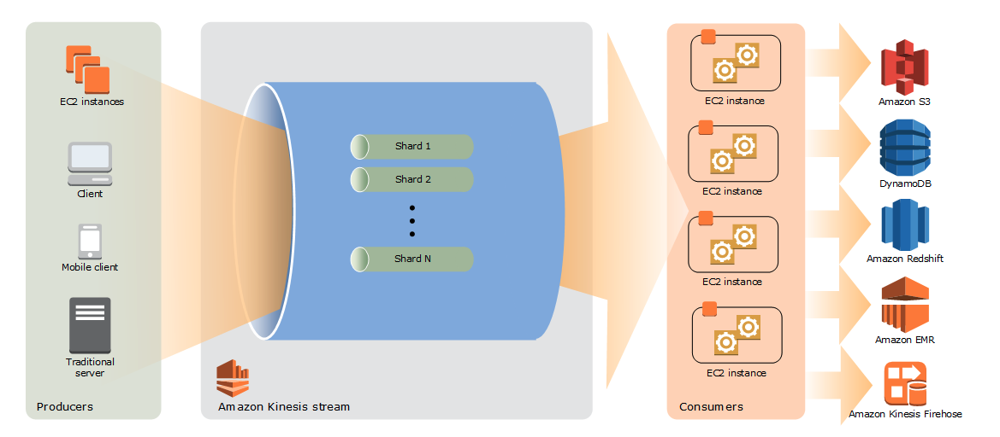

# AWS Kinesis

- 의문
- 스트리밍 데이터란?
- 개요

## 의문

## 스트리밍 데이터란?

- 개요
  - 시간의 흐름에 따라서 연속적으로 생성되는 데이터이며, 레코드를 작은 크기로 동시에 전송
- 특징
  - 데이터 범위
    - 롤링 타임 윈도우 내 데이터 또는 가장 최신 데이터(실시간) 레코드의 데이터를 쿼리하거나 처리함
  - 데이터 크기
    - 일부 레코드로 구성된 마이크로 배치 또는 개별 레코드
  - 성능
    - 몇 초 또는 몇 밀리초의 지연 시간 필요
  - 분석
    - 간단한 응답 기능, 수집 및 롤링 지표
- 예시
  - 애플리케이션 로그 파일, 전자 상거래 구매, 게임 내 플레이어 활동, 소셜 네트워크의 정보, 주식 거래소, 지리공간 서비스, 데이터 센터의 메트릭
- c.f) 배치 처리
  - Amazon EMR, MapReduce기반 시스템
  - 특징
    - 데이터 범위
      - 데이터 셋의 모든 또는 대부분 데이터를 쿼리하거나 처리함
    - 데이터 크기
      - 대규모 데이터 배치
    - 성능
      - 지연 시간이 몇 분에서 몇 시간
    - 분석
      - 복잡한 분석

## 개요

kinesis 데이터 스트림 아키텍처

- 개요
  - 스트리밍 데이터를 위한 플랫폼으로, 스트리밍 데이터를 손쉽게 로드 및 분석 가능하게 함
    - 브로커 및 storage로서의 역할
- 서비스
  - Amazon Kinesis Data Streams
    - 스트리밍 데이터를 처리 또는 분석하는 커스텀 애플리케이션 구축 가능
  - Amazon Kinesis Data Firehose
    - 스트리밍 데이터를 AWS로 로드가능
      - S3, Redshift 등
  - Amazon Managed Streaming for Apache Kafka
    - 완전 관리형 카프카 서비스

## Amazon Kinesis Data Streams

- 개요
  - 스트리밍 데이터를 받아서 집계하는 애플리케이션을 만들 수 있음
- 특징
  - 수집 및 처리에 대한 응답이 실시간으로 이루어지기 때문에, 간단하게 처리되는 것이 일반적
  - 데이터를 실시간으로 집계한 후 집계 데이터를 데이터 웨어하우스나 map-reduce 클러스터에 로드 가능
  - kinesis data streams는, 스트림에 들어가는 시간과 검색할 수 있게 되는 시간 사이의 지연(put-to-get지연)은 1초미만
  - 관리형 서비스이므로, 데이터 인테이크 파이프라인을 만들고 실행하는 작업 부담 줄어듬
  - 스트림 확장 및 축소가 탄력적으로 가능
  - 여러 kinesis data streams 애플리케이션은 같은 스트림에서 데이터를 읽고 처리 가능
- 사용 예시
  - IT 인프라 로그, 애플리케이션 로그, 소셜 미디어, 시장 데이터 피드, 웹 클릭 스트림 데이터, ...
- 일반적인 시나리오
  - 가속화된 로그 및 데이터 피드 인테이크 및 처리
  - 실시간 측정치 및 보고
  - 실시간 데이터 분석
  - 복잡한 스트림 처리

### 용어

- kinesis 데이터 스트림
  - shard의 집합
    - shard마다 데이터 레코드 시퀀스 번호가 존재(kinesis data stream에 의해서 할당됨)
  - 총 용량은 샤드의 용량의 합계
  - mode
    - on-demand
      - 처리량에 따라서 샤드를 자동으로 관리
    - provisioned
      - 샤드의 개수를 지정함
  - retention period
    - 데이터 레코드를 스트림에 추가한 후 데이터 레코드에 액세스 할 수 있는 시간의 길이
    - 기본
      - 24시간 ~ 365일(24시간 초과시 추가요금)
- 샤드
  - 스트림에서 고유하게 식별되는 데이터 레코드 시퀀스
    - 파티션 키를 이용하여, 데이터를 샤드별로 그룹화 함
      - 최대 256자인 유니코드 문자열 - 128비트 정수값에 매핑하고 샤드의 해시 키 범위를 사용하여 연결된 데이터 레코드를 샤드에 매핑하기 위해서 MD5 해시 함수가 사용됨
      - 애플리케이션이 데이터를 스트림에 넣을 때 파티션 키 지정해야 함
  - 스트림은 하나 이상의 샤드로 구성되며, 각 샤드는 고정된 용량 단위를 제공
    - 읽기
      - 5트랜잭션/s
      - 2MB/s
    - 쓰기
      - 1000개레코드/s
      - 1MB/s
- 데이터 레코드
  - kinesis 데이터 스트림에 저장되는 데이터의 단위
  - 구성
    - 파티션 키
      - *하나의 샤드에서 데이터를 그룹화 하는건지? 아니면 샤드에 대응하는건지?*
    - 시퀀스 번호
      - 샤드 내의 파티션 키마다 고유함
    - 데이터 blob(불변)
      - 최대 1MB
- Amazon Kinesis Data Streams 애플리케이션
  - 스트림의 소비자
    - 스트림 하나에 여러 애플리케이션이 있을 수 있으며, 각 애플리케이션이 동시에 독립적으로 스트림의 데이터를 소비할 수 있음
  - 유형
    - shared fan-out consumers
      - 샤드 읽기 처리량이 샤드당 2MB/s로 고정됨
        - 소비자가 여러개인 경우 공유됨
      - 메시지 전파 지연이 한 소비자가 스트림에서 읽고 있을 경우 평균 약 200ms, 소비자가 5개이면 평균이 1000ms로 증가
        - *정확히 어떤 의미인지?*
      - HTTP `GetRecords`를 통해 모델을 가져옴
    - enhanced fan-out consumers
      - 샤드 읽기 처리량은, 각 소비자가 다른 소비와 독립적으로 2MB/s
      - 메시지 전파 지연은 소비자별로 70ms
      - 데이터 검색 비용과, 소비자 샤드간 비용이 존재
      - HTTP/2를 통해 레코드를 사용자에게 `SubscribeToShard`푸시함

## Amazon Kinesis Data Firehose
