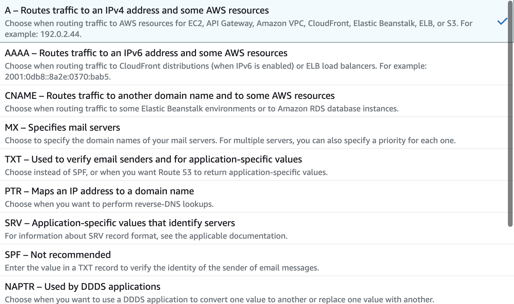

# Route53

- 의문
- 개요
  - 레코드
- 개념
  - 도메인
  - 아키텍처
  - 트래픽 설정

## 의문

## 개요

Route53 트래픽 라우팅 방법

- 개요
  - 가용성과 확장성이 뛰어난 DNS 웹 서비스
- 기능
  - 도메인 등록
  - DNS 라우팅
    - 인터넷 트래픽을 도메인의 리소스로 라우팅
      - e.g) `example.com`혹은 `acme.example.com`을 입력한 경우, 웹 애플리케이션과 연결되게 도와줌
  - 리소스 상태 확인
    - 리소스가 정상 작동중인지 확인
- 아키텍처
  - control plane
    - 리소스 생성, 업데이트 및 삭제와 같은 관리 작업을 수행하는 영역
      - 일관성 중요
  - data plane
    - 서비스의 직접적인 구현 및 기능을 제공하는 영역
      - 가용성 중요
      - 전세계로 분산되어있음
- **일반적인 이용 방법**
  - Domain name을 등록함
    - public host zone을 자동으로 생성
  - record set을 생성해서 호스팅 영역에서 도메인의 트래픽을 라우팅
    - 이름
      - 도메인 또는 하위 도메인 이름과 일치
    - 유형
      - 트래픽을 라우팅할 리소스 유형 결정
    - 값
      - 타입에 대한 값으로, `[A]`의 경우 `192.0.2.136`같은 IPv4 형식의 IP주소 지정
      - `[MX]`의 경우, 이메일 서버의 이름 지정

### 레코드

레코드 유형 설명

- 유형
  - A
    - IPv4로 라우팅
  - AAAA
    - IPv6로 라우팅
  - CNAME
    - 현재 레코드의 이름에 대한 DNS 쿼리를 다른 도메인 또는 하위 도메인으로 매핑
      - Zone Apex라고 하는 DNS 네임스페이스의 최상위 노드에 대한 CNAME 레코드를 생성 불가
  - NS
    - 호스팅 영역에 대한 이름 서버를 식별
      - 호스팅 영역에 대해서 자동 생성
      - 신뢰할 수 있는 서버 네개를 나열
  - SOA(자동 생성)
    - 도메인에 대한 기본 DNS 정보 식별
      - 호스팅 영역에 대해서 자동 생성
    - e.g)
      - `ns-250.awsdns-31.com. awsdns-hostmaster.amazon.com. 1 7200 900 1209600 86400`
    - 요소
      - SOA 레코드를 생성한 Route53 name server
      - 관리자 이메일 주소
      - 호스팅 영역에서 레코드를 업데이트 할떄마다 선택적으로 증가시키는 번호
      - 부 DNS 서버에서 주 DNS 서버의 SOA 레코드를 쿼리하여 변경 내용을 확인하기 전에 기다리는 새로고침 시간(초)
      - 부 서버에서 실패한 영역 전송을 재시도하기 전에 기다리는 재시도 간격(초). 일반적으로 재시도 시간은 새로 고침 시간보다 짧습니다. 이 예시에서 이 값은 900(15분)입니다.
      - 부 서버에서 영역 전송을 완료하기 위해 시도할 수 있는 시간(초). 영역이 성공적으로 전송되기 전에 이 시간이 경과하면 부 서버에서 데이터가 오래되어 신뢰할 수 없다고 간주하여 쿼리에 응답하는 것을 중지합니다. 이 예시에서 이 값은 1209600(2주)입니다.
      - 최소 TTL(Time To Live). 이 값은 resolver 에서 다음 응답을 Route 53에서 캐싱해야 하는 시간을 정의하는 데 도움이 됩니다.
  - Alias
    - S3 버킷, CloudFront, 동일 Route 53 호스팅 영역의 다른 레코드로 리다이렉션 가능

## 개념

### 도메인

- Domain Name
  - 도메인 이름
- Domain Registrar
  - 특정 최상위 TLD 등록을 처리하는 회사
    - domain name record의 관리를 맡음
- Domain Registry
  - 특정 최상위 도메인을 가진 도메인을 관리하고 판매하는 권리를 소유한 회사
    - authoritative database를 관리하며, 특정 TLD에 저장된 모든 레코드를 관리함
      - 조회는 DNS서버가 함
  - e.g)
    - `VeriSign`은 `.com` TLD을 가진 도메인을 판매할 권리를 가진 등록 기관
- Domain Reseller
  - 도메인 이름을 Registrar로부터 구입해서 판매하는 회사
    - 등록 / 판매의 분리
- Top-Level Domain (TLD)
  - `.com`, `.org`와 같이 도메인 이름의 마지막 부분
  - 유형
    - 일반적인 최상위 도메인
    - 지리적 최상위 도메인

### 아키텍처

- Domain Name System (DNS)
  - 도메인 이름을 IP 주소로 변환해주는 전 세계의 서버 네트워크 시스템
- name servers
  - DN을 IP주소로 변환하는 DNS내부의 서버
  - 종류
    - DNS resolver
    - DNS authoritative name server
    - DNS NS
- DNS resolver
  - 일반적으로 ISP가 관리하며, 사용자 요청과 DNS NS사이에서 중개 역할을 하는 DNS 서버
    - recursive name server라고도 불림(DNS쿼리의 IP주소를 받을때까지 authoritative name server에 계속해서 요청을 전송하기 때문)
- authoritative name server
  - DNS의 한 부분에 관한 확정적 정보가 있고, DNS 요청에 대해 해당되는 정보를 반환하여 응답하는 이름 서버
  - e.g)
    - `.com`최상의 도메인의 authoritative server는 `.com`의 모든 도메인 서버의 이름을 알고 있음
    - Route53 name server는 Route 53을 DNS 서비스로 사용하는 모든 도메인의 authoritative name server
      - NS는 도메인의 호스팅 영역에서 사용자가 생성한 레코드를 기반으로, 사용자가 원하는 도메인 및 하위 도메인 트래픽 라우팅 방법을 알고 있음
      - Route53 NS는 `www.example.com`에 대한 요청을 수신하면, 해당 레코드를 찾아 레코드에 지정된 IP주소 반환
- private DNS
  - 도메인과 그 하위 도메인의 트래픽을 하나 이상의 VPC내의 EC2 인스턴스로 라우팅 해주는 DNS의 로컬 버전
- *reusable delegation set*
  - 2개 이상의 호스팅 영역에 사용할 수 있는 4개의 authoritative name server의 세트
- subdomain
  - 등록된 도메인 이름 앞에 하나 이상의 레이블이 붙은 도메인 이름
  - e.g) 도메인 이름 `example.com`을 등록하면, `www.example.com`은 하위 도메인이 됨
- time to live (TTL)
  - 레코드의 현재 값을 얻기 위해서 Route 53에 또 다른 요청을 제출하기 전에 DNS resolver가 해당 레코드의 값을 캐싱할 시간(초)
    - DNS resolver가 TTL만료 전에 동일한 도메인에 대한 또 다른 요청을 수신하는 경우, resolver는 캐싱된 값을 반환
    - TTL이 길면, Route53요금이 줄어듬(쿼리 수 기반 요금제)

### 트래픽 설정

- hosted zone
  - 도메인(`example.com`)과 그 전체 하위 도메인(`www.example.com`, `retail.example.com`, `seattle.accounting.example.com`)의 트래픽을 라우팅하는 방법에 대한 정보를 포함하고 있는 레코드의 컨테이너
    - 해당 도메인과 이름이 같음
  - e.g)
    - `example.com`의 호스팅 영역에는 `www.example.com` -> `192.0.2.243` 라우팅 레코드, `example.com`이메일 -> `mail1.example.com`과 `mail2.example.com`이라는 두개의 이메일 서버로 라우팅 하는 것에 대한 정보가 포함될 수 있음
- record (DNS record)
  - 도메인 또는 하위 도메인의 트래픽을 라우팅할 방법을 정의하는 데 사용되는 호스팅 영역 내 객체
  - e.g) `example.com, www.example.com -> 129.0.2.234`
  - c.f) alias record
    - 트래픽을 AWS 리소스(Cloud Front, Amazon S3버킷)에 라우팅하여 생성할 수 있는 레코드 유형
- routing policy
  - Route53이 DNS 쿼리에 응답하는 방식을 결정하는 레코드에 대한 설정
  - 종류
    - Simple routing policy
      - 도메인에 대해서 특정 기능을 수행하는 하나의 리소스로 인터넷 트래픽을 라우팅
    - Failover
      - active - fail 장애 조치를 구성
    - Geolocation
      - 사용자의 위치 기반으로 인터넷 트래픽을 리소스로 라우팅
    - Geoproximity
      - 리소스의 위치를 기반으로 트래픽을 라우팅함
    - Latency
      - 리소스와의 최상의 지연 시간을 제공하는 트래픽 라우팅
    - IP
      - 사용자의 위치에 기반하여 트래픽 라우팅
    - *Multivalue answer*
    - Weighted
      - 사용자가 지정하는 비율에 따라 여러 리소스로 트래픽을 라우팅 하는 경우
