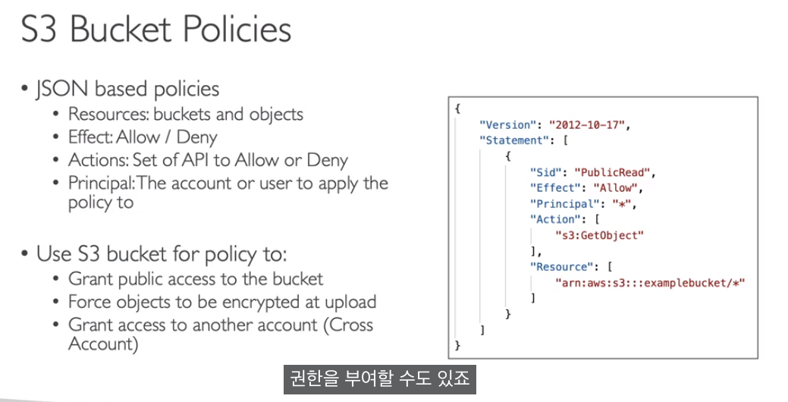
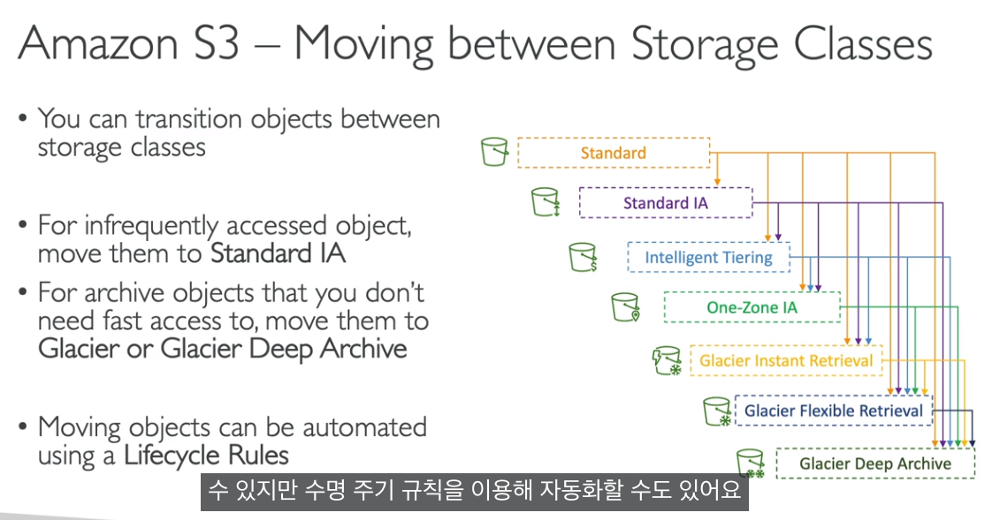
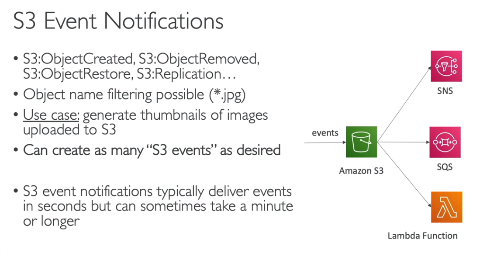
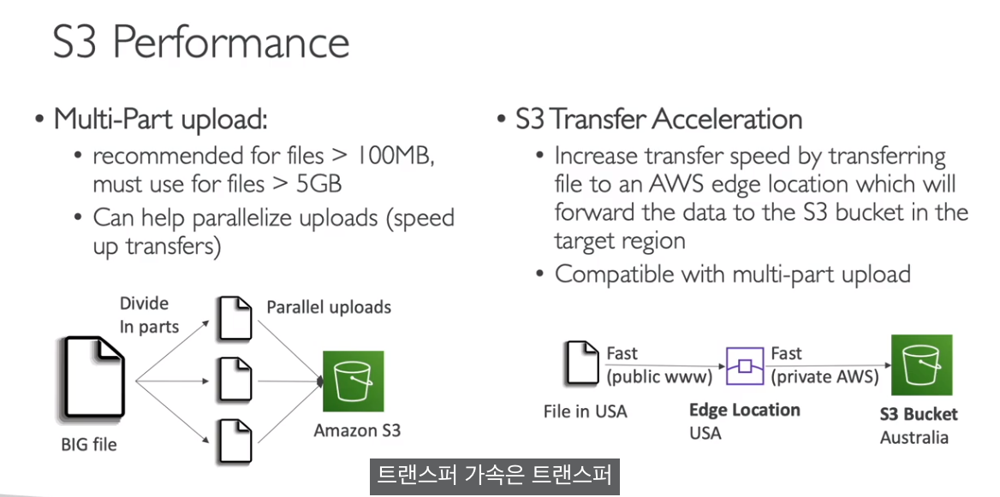
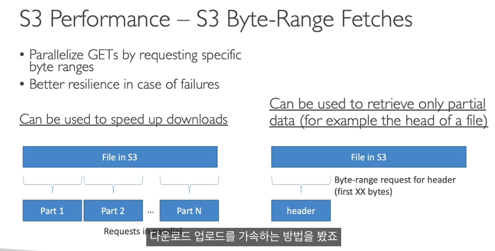

# S3

- 의문
- 개요
  - Object(files)
- Security
- Replication
- Storage classes
- S3 lifecycle rules

## 의문

## 개요

- 개요
  - object(file)을 bucket에 저장할 수 있도록 하는 서비스
- 특징
  - bucket은 globally unique(모든 계정과 모든 region에 대해서)한 이름으로 만들어야 함
  - **bucket은 region level로 정의됨**
  - bucket은 naming convention이 있음
    - 언더스코어 안됨!
  - directory라는 개념은 존재하지 않음(그냥 key일 뿐)

### Object(files)

- 개요
  - key를 갖고 있음
- key
  - bucket이름을 제외한 파일의 FULL path(아래에서는 강조된 곳이 key)
    - e.g)
      - s3://my-bucket/`my_file.txt`
      - s3://my-bucket/`my_folver1/another_folder/my_file.txt`
  - 구성
    - prefix + object name
    - e.g)
      - s3://my-bucket/`my_folver1/another_folder/my_file.txt`여기에서
        - prefix
          - `my_folver1/another_folder`
        - object name
          - `my_file.txt`
- 특징
  - object value는 body의 내용임(파일)
    - 개당 최대 크기는 5TB
    - 5GB보다 큰 파일을 업로드하는 경우, multi-part upload해야함
  - 메타데이터
    - text key / value 페어들
  - Tags
  - version ID
    - 버저닝이 가능한 경우

## Security

Bucket policy

- User-Based
  - IAM policies를 이용한 접근 제어
- Resource-Based
  - Bucket policies
    - JSON기반(누가, 누구에게, 무얼하는걸, 허락할거냐)
      - Principal
      - Resources
      - Actions
      - Effect
  - Object ACL(Access Control List)
  - Bucket ACL
- 룰
  - IAM 주체는 S3 오브젝트에 다음과 같을 때 접근 가능함
    - (`유저의 IAM permission이 허락` or `resource policy가 허락`) and `명시적인 DENY가 없는 경우`
- 암호화
  - 오브젝트를 암호화

## Replication

- 종류
  - CRR(Cross-Region Replication)
  - SRR(Same-Region Replication)
- 특징
  - versioning을 반드시 허용해야 함
  - bucket은 다른 AWS 어카운트에 존재할 수 있음
  - 복제 과정은 asynchronous
  - 적절한 IAM permission을 S3에 부여해야 함
  - enable이후의 새 object만 replication 가능
    - S3 batch Replication을 사용하면, 기존 파일도 replication가능
  - delete시
    - source에서 target으로 delete marker를 replicate할 수 있음(선택)
    - version id를 통한 delete는 replicate되지 않음
  - chaining불가
    - buckt 1 -> bucket 2 -> bucket 3 불가 (즉, bucket1의 오브젝트는 bucket3으로 replicate되지 않음)

## Storage classes

- c.f) Durability and Availability
  - Durability
    - 모든 스토리지 클래스에 대해서 99.999999999%(11 9's)
    - e.g)
      - 10,000,000 오브젝트를 s3에 저장하면, 평균적으로 1만년에 1개의 오브젝트가 사라짐
  - Availability
    - 서비스를 얼마동안 사용가능한지 측정
      - 스토리지 클래스마다 다름
    - e.g)
      - S3 standard는 99.99% availability = 1년에 53분은 사용 불가
- 종류
  - S3 standard
    - 99.99% availability
    - 자주 접근되는 데이터에 사용
    - 낮은 레이턴시, 높은 스루풋
    - 2 concurrent 설비 실패에도 견딜 수 있음
    - 유스 케이스
      - 빅데이터 분석, 모바일혹은 게임 애플리케이션, CDN
  - S3 Infrequent Access
    - 보다 덜 자주 참조되나, 빠른 접근 속도가 필요할 경우 사용
    - s3 standard보다 값이 쌈
    - s3 Standard-Infrequent Access
      - 99.9% availability
      - 유스 케이스
        - disaster recovery, backups
    - s3 One Zone-Infrequent Access
      - AZ가 파괴되면 데이터가 삭제됨
      - 99.5% availability
      - 튜스 케이스
        - secondary backup copies
  - Glacier Storage Classes
    - 아카이빙, 백업을 위한 low cost object storage
    - 가격 = storage + object retrieval cost
    - s3 Glacier Instant Retrieval
      - milisecond retrieval, 4분기에 한번정도 접근할때 좋음
      - minimum storage duration of 90 days
    - s3 glacier flexible retrieval
      - expedited(1 to 5 minutes), standard(3 to 5 hours), bulk(5 to 12 hours)
        - 괄호는 s3에 저장된 데이터를 뽑아오는데에 걸리는 시간임(그래서 빙하)
      - minimum storage duration of 90 days
    - s3 glacier deep archive
      - standard(12hours), bulk(48hours)
      - minimum storage duration of 180 days
      - 가격은 제일 쌈
  - s3 intelligent-tiering
    - 자동으로 오브젝트를 티어별로 옮김
    - retrieval charge는 없음

## S3 lifecycle rules

S3 라이프 사이클

- 개요
  - storage classes 사이에서 오브젝트를 자동으로 이동시키는 기능
- action
  - transition
    - e.g) 60일 이후에 Standard IA 클래스로 변경, 180일 이후에는 Glacier로 클래스 변경
  - expiration
    - e.g) 365일뒤 삭제
- S3 Analytics
  - transition을 어떤식으로 해야할지 정할때 도움을 주는 기능
  - 리포트는 매일 업데이트 되며, 24-48 시간이후에 데이터 분석 결과를 볼 수 있음

## S3 event notifications

S3 event notification

- 개요
  - 다양한 s3 이벤트에 대해서 노티를 받을 수 있음
- 종류
  - `S3:ObjectCreated`, `S3:ObjectRemoved`, `S3:ObjectRestore`, `S3:Replication`, ...
- 특징
  - 오브젝트의 이름으로 필터링 가능(`*.jpg`)
  - 무한한 s3 event 생성 가능
  - 대개 이벤트는 수초내에 전달되나, 가끔씩은 몇분이나 더 오래 걸리는 경우도 존재
- 예시
  - s3으로 업로드 이미지 파일의 된 썸네일을 생성
- IAM permission
  - 노티가 도달하는 대상에서 IAM permission을 설정
    - SNS
      - SNS Resource Access Policy
    - SQS
      - SQS Resource Access Policy
    - Lambda
      - Lambda Resource Policy
    - EventBridge
      - s3의 모든 이벤트를 받고, 18개의 AWS 서비스들에게 룰 기반으로 이벤트 전달 가능
        - IAM policy보다도 더 복잡한 룰을 적용 가능
          - e.g) 메타데이터, 오브젝트 사이즈, 이름 등
        - 이벤트를 아카이빙 가능, 리플레이 가능, 더 reliable하게 전달 가능

## S3 Performance

- upload
  - Multi-part upload
    - 개요
      - 파일을 쪼개서 병렬로 업로드하기
    - 특징
      - 100MB 이상의 파일 업로드에는 recommended
      - 5GB 이상의 파일 업로드에는 필수
  - S3 transfer acceleration
    - 개요
      - AWS edge location으로 파일을 전송하고, 해당 파일을 private AWS 네트워크망을 이용해서 타겟 리전의 bucket으로 전송
    - 특징
      - multi-part upload 가능

- download
  - byte-range fetch
    - 개요
      - 파일의 특정 바이트만 병렬적으로 다운로드 가능하게 하는 기능
      - 오직 파일의 일부분(헤더 등)만 다운로드하는것도 가능
